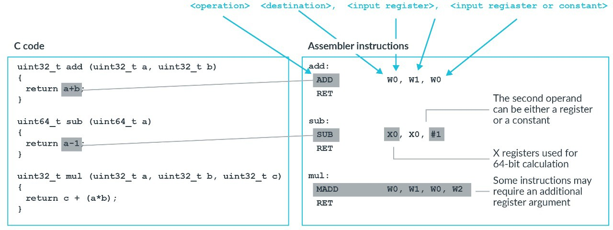
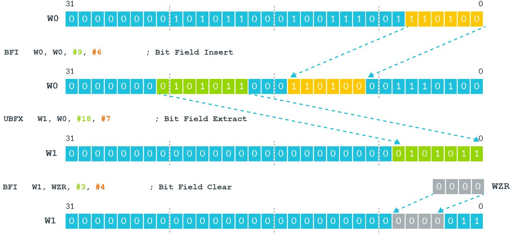
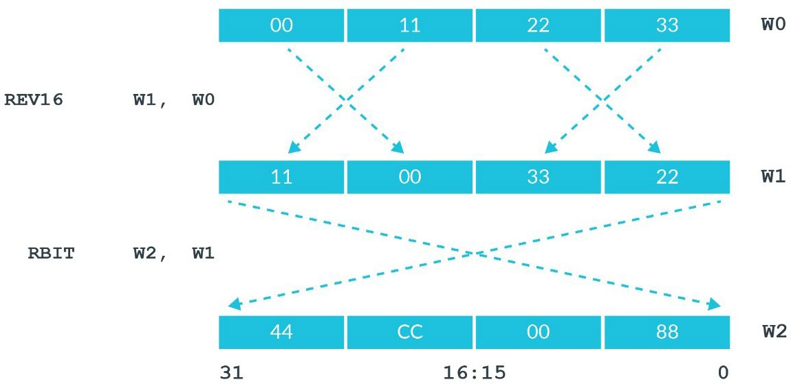
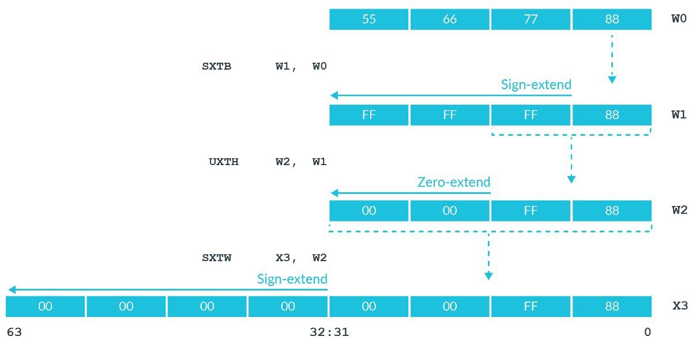
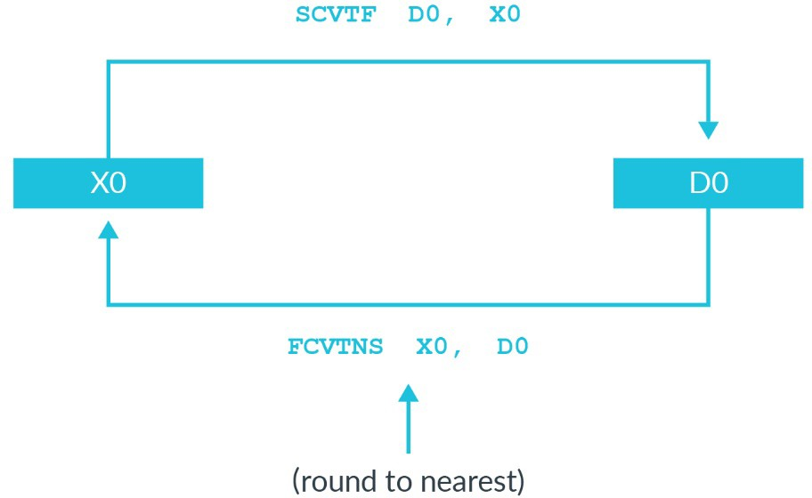

# 1. Data processing

## 1.1 Arithmetic and logic operations

逻辑运算与整数运算的基本格式是：



这部分指令的包含：
- `Operation`：定义了指令的作用。例如，`ADD`做加法运算，`AND`做逻辑与运算；可以在`Operation`后添加一个`S`来设置标志。例如，`ADD`变为`ADDS`通知处理器根据指令的结果更新ALU的标志位。
- `Destination`：指令的目标必须是寄存器，并指定操作的结果放置在哪里。大多数指令都只有一个目标寄存器。有一些指令有两个目标寄存器。当目标是一个`W`寄存器时，相应的`X`寄存器的`upper 
32 bits`被设置为`0`。
- `Operand 1`：必须是寄存器。指令的第一个输入参数。
- `Operand 2`：可以是寄存器或常量。指令的第二个输入参数。当`Operand 2`是寄存器时，它可能包括可选的移位。当`Operand 2`是常量时，它会被编码在指令本身中。这意味着可用的常量的范围是有限的。

你应该意识到一些特殊情况，如`MOV`和`MVN`指令。`MOV`指令可将一个常量或另一个寄存器的内容移动到指定为目标的寄存器中。`MOV`和`MVN`只需要一个输入操作数，它可以是寄存器，也可以是常量，如图所示：
```asm
MOV     X0, #1
```
设置：`X0 = 1`
```
MVE     W0, W1
```
设置：`W0 = ~W`

## 1.2 Floating point

浮点操作遵循与整数数据处理指令相同的格式，并使用浮点寄存器。
与整数数据处理指令一样，操作的大小决定于所使用的寄存器的大小。
浮点数操作指令总是以`F`开头。

例如。计算半精度浮点数的除法`H0 = H1 / H2`：
```asm
FDEV    H0, H1, H2
```
单精度浮点数的加法`S0 = S1 + S2`：
```asm
FADD    S0, S1, S2
```
双精度浮点数的减法`D0 = D1 - D2`：
```asm
FSUB    D0, D1, D2
```
半精度浮点数(`16bit`)是在Armv8.2-A中添加的，它是一个可选的特性。
通过`ID_AA64PFR0_EL1`寄存器确定该特性的支持情况。

访问浮点寄存器可能会`Trapped`。这意味着任何使用浮点寄存器的尝试都会产生异常。

### 1.2.1 Is floating point support optional?

`No`。Armv8-A强制要求必须支持浮点数。因为`rich operating system`都需要它。

如果你的应用程序仅仅运行在一个完全专用的软件堆栈上，那么从技术上讲硬件可以省略浮点数的支持。
很多工具链，包括`GCC`与`Arm Compiler 6`它们将负责软模拟来支持浮点数。

## 1.3 Bit manipulation

有一组寄存器位的操作指令。下图显示了一些例子：



`BFI`指令会在一个寄存器插入位域。
在前面的图中，`BFI`从源寄存器(`W0`)中`6bit`的位域，并将其插入到目标寄存器中的第`9`位的起始处。
`UBFX`指令会在一个寄存器提取一个位域。在上面的图中，
`UBFX`从源寄存器中的第`18`位处获取一个长度为`7`的位域，并将替换到到目标寄存器中。
前面图中的最后一个示例获取`WZR`的`bottom 4bits`，并将它们插入`W1`的位置3处。 使用`WZR`意味着是有效的`a bit clear operation`。

其他指令由`byte reverse`或`bit order`，如图所示：



`REV16`和`RBIT`在处理不同字节序的数据时特别有用。

## 1.4 Extension and saturation

有时，还需要将数据从一种大小转换为另一种大小。
`SXTx(sign extend)`和`UXTx(unsign extend)`指令可用于此转换。
在此转换中，`x`确定了被扩展的数据的大小，如图所示：



第一条`SXTB`指令中，`B`表示`Byte`。它将`W0`的`bottom (8bits)byte`符号扩展到`32`位。
第二条`UXTH`指令中，`H`表示`halfword`。它将`W1`的`bottom (16bits)halfword`零扩展到`32`位。
前两个示例将`W`寄存器作为目标，这意味着扩展到`32`位。第三个例子有一个`X`寄存器，意思是符号扩展到`64`位。

### 1.4.1 Sub-register-sized integer data processing

有些指令用于饱和算术运算。这意味着，如果结果大于或小于目标所能容纳的范围，则将结果设置为目标整数范围的最大或最小值。

数据处理指令可以有效地处理32位数据和64位数据。
在实践中，在处理`sub-register`计算时，经常会看到饱和指令。
`sub-register`计算是指`8bits`或`16bits`的计算。
下面示例展示了在C代码中，`sub-register`计算产生的汇编代码：

Code1:
```c
uint32_t add32(uint32_t a, uint32_t b)
{
    return a + b;
}
```
Assembler1:
```asm
add32:
    ADD W0, W1, W0
    RET
```
Code2:
```c
uint16_t uadd16(uint16_t a, uint16_t b)
{
    return a + b;
}
```
Assembler2:
```asm
uadd16:
    AND W8, W1, #0xFFFF
    ADD W0, W8, W0, UXTH
    RET
```
Code3:
```c
uint16_t sadd16(int16_t a, int16_t b)
{
    return a + b;
}
```
Assembler3:
```asm
sadd16:
    SXTH W8, W1
    ADD W0, W8, W0, SXTH
    RET
```

在`Code1/Assembler1`中，`32-bit`的加法映射到`W`寄存器上，因此很容易地处理。
对于`Code2/Assembler2`与`Code3/Assembler3`中，需要添加一条额外的指令。
`Code3/Assembler3`获取16位的输入，将其扩展到32位，然后执行加法。
将`16-bit`的输入扩展到`32-bit`的流程是：
```asm
SXTH W8, W1
```
然后，该指令执行加法，并将结果饱和为符号扩展的`16`位：
```asm
ADD W0, W8, W0, SXTH
```

## 1.5 Format conversion

我们已经看到，`MOV`和`MVN`指令会将该值从一个寄存器上复制到另一个寄存器上。
同样，`FMOV`可以用于在浮点寄存器和通用寄存器之间复制。
然而，使用`FMOV`寄存器之间按`bit`复制。有些指令可以转换为近似表示法，如下图所示：



在这个例子中，假设`X0`的值是正整数`2`：
```
X0 = 0x0000_0000_0000_0002
```
然后，执行：
```asm
FMOV  D0, X0
SCVTF D1, X0
```
这两个指令都将`X0`"复制"到一个`D`寄存器。然而，计算结果却完全不同：
```asm
D0 = 0x0000_0000_0000_0002 = 9.88131e-324
D1 = 0x4000_0000_0000_0002 = 2.0
```
`FMOV`指令复制是基于`literal bit pattern`逐`bit`复制，当被解释为浮点数时，这个一个非常不同的值。
`SCVTF`指令则是将`X0`的值转为浮点数最接近的有效值。

同样地，`FCTxx`也可用于将浮点值转换为其最近的整数表示。在此实例中，`xx`的不同值可以控制所使用的舍入模式。

## 1.6 Vector data

`A64`指令集提供`vector data processing`的支持。可用的两种向量数据处理是：
- `Advanced SIMD`，也被称为`Neon`。
- `Scalable Vector Extension`，缩写为`SVE`。

> `Advanced SIMD`的名称来源于ARMv6。
> 在ARMv6提供SIMD指令操作32-bit通用寄存器；在ARMv7提供可以操作`128-bit`向量的指令称`Advanced SIMD`.
A64样式的指令不存在于A64中，但命名规范依然存在。