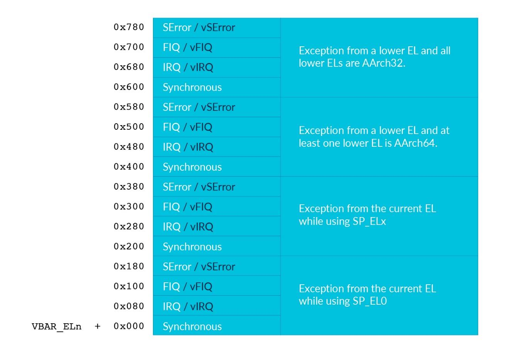

# 1. The vector tables

在Armv8-A中，`vector table`是一块`normal memory`区域，该区域包含`instructions`。
`PE`在系统寄存器中保存`vector table`的基地址。并且每个异常类型都有相对这个基地址的偏移量。

`privileged Exception level`每个都有自己的`vector table`的`Vector Base Address Register`，`VBAR_ELx`，其中`x`是1，2或3。

`PE`在`reset`之后，`VBAR`寄存器的值是`undefined`，因此必须在`enable`中断之前配置好它们。

`vector table`格式如下图所示：

每个`exception type`都可以根据异常所来自的异常级别的状态，将`branch`设置为四个位置中的一个。