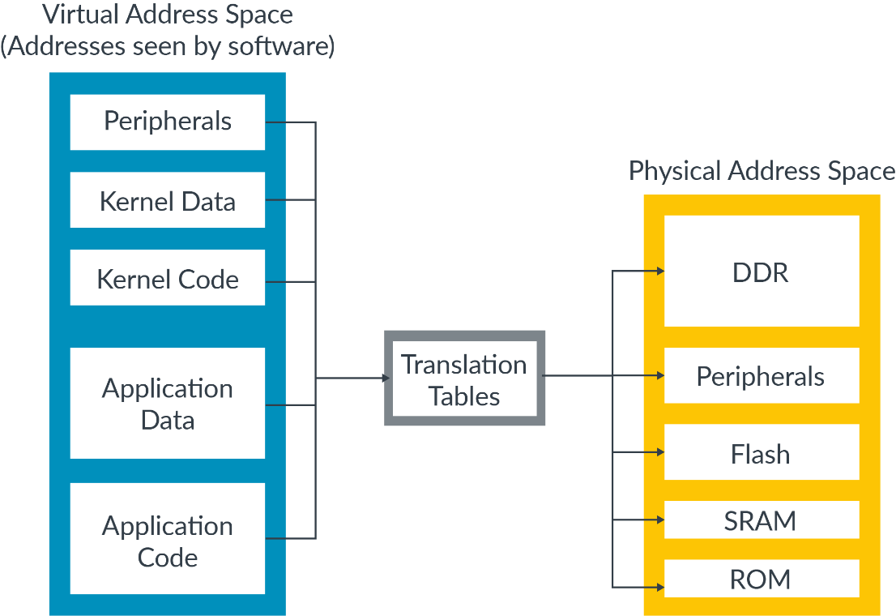
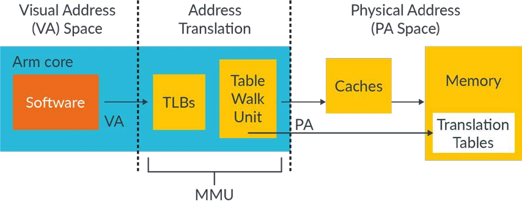
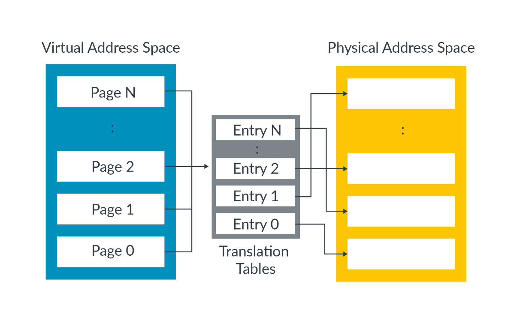
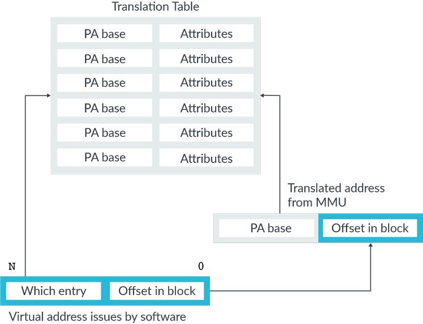
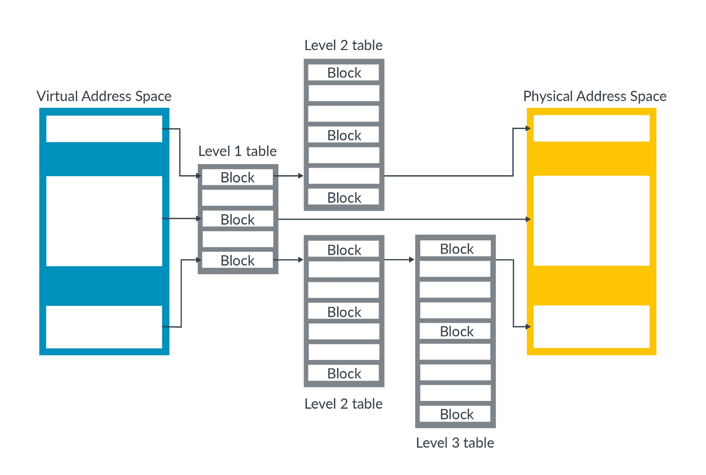

# 1. What is memory management?

内存管理描述了如何控制系统中对内存的访问。
每当操作系统或应用程序访问内存时，硬件都会提供内存管理服务。
内存管理是将内存区域以动态分配的方式提供给应用程序的一种方法。

## 1.1 Why is memory management needed?

`A Profile`处理器被设计用来运行一个`rich OS`，例如`Linux`，并支持虚拟内存系统(`virtual memory system`)。
在该处理器上执行的软件只看到虚拟地址，处理器将其转换为物理地址。
这些物理地址被呈现给内存系统，并指向内存中的实际物理位置。

# 2. Virtual and physical addresses

使用虚拟地址的好处是，它允许`Operating System (OS)`控制展现给引用软件的内存视图。操作系统可以控制什么内存是可见的，什么虚拟地址是可见的，允许对该内存访问需要什么权限。这允许操作系统`sandbox applications`（隐藏一个应用程序与另一应用程序的资源）并从底层硬件提供抽象。

使用虚拟地址的另一个好处是，操作系统可以将多个分散的内存物理区域作为一个单一的、连续的虚拟地址空间呈现给应用程序。

虚拟地址也有利于软件开发人员，他们在编写应用程序时不会知道系统的确切内存地址。 使用虚拟地址，软件开发人员不需要关心自己的物理内存。应用程序明确知道由操作系统和硬件一起负责地址转换。

在实践中，每个应用程序都可以使用自己的一组虚拟地址，这些地址将映射到物理系统中的不同位置。当操作系统在不同的应用程序之间切换时，它将重新编程映射。这意味着操作系统会把当前应用程序的虚拟地址将映射到内存中的正确物理位置。

虚拟地址通过映射转换为物理地址。
虚拟地址和物理地址之间的映射存储在转换表（有时称为页表）中，如此图所示：

`Translation tables`位于内存中，通常是由`OS`或`Hypervisor`软件管理。
``Translation tables``不是静态的，并且这些表可以根据软件的需要进行更改。这将更改虚拟地址和物理地址之间的映射。

# 3. The Memory Management Unit(MMU)

`Memory Management Unit (MMU)`提供`Address translation`。

MMU包含：
- `table walk uint`，它包含从内存中读取转换表的逻辑。
- `Translation Lookaside Buffers (TLBs)`，缓存最近使用的地址转换。

由软件发出的所有内存地址都是虚拟的。
这些内存地址将被传递`MMU`，`MMU`将检查`TLB`是否存在最近使用的缓存。
如果`MMU`没有找到最近缓存，则`table walk uint`从内存中读取适当的`table entry`或`entries`，如下所示：

在进行内存访问之前，必须将虚拟地址转换为物理地址（因为我们必须知道我们正在访问的物理内存位置）。
这种转换需求也适用于缓存数据，因为在`Armv6`和更高版本的处理器上，
数据缓存使用的是物理地址（`physically addresses tagged`）来存储数据。
因此，必须在缓存查找之前完成地址翻译。

## 3.1 Table entry

`translation tables`的工作方法是将虚拟地址空间划分为大小相等的`block`，并在每个块的表中提供一个`entry`。

表中的`entry 0`为映射到`block 0`，`entry 1`为映射到`block 1`，以此类推。 每个`entry`包含对应的物理内存块的地址和访问物理地址时要使用的属性。

## 3.2 Table lookup

当发生转换时，就会发生表的查找。 当发生翻译时，软件发出的虚拟地址被分成两部分，如图所示：

此图显示了一个单级查找。

在图中标记为`Which entry`的`upper-order bit`，使用它们索引翻译表从而得到`block entry`。这个`entry block`包含该虚拟地址的物理地址。

在图中标记为`Offset in block`的`lower-order bit`，该数据块内的一个偏移量，它在转化中不会被修改。

## 3.3 Multi-level translation

在单级查找中，虚拟地址空间被分割成大小相等的块。在实践中，使用了多级`hierarchy`结构。

`Level 1 table`将虚拟地址空间划分为较大的数据块。该表中的每个`entry`都可以指向相等大小的物理内存块，也可以指向另一个表，该表将该块细分为较小的块。我们把这种类型的表称为多级页表(`multilevel table`)。
在这里，我们可以看到三级页表的示例：

在Armv8-A中，最支持`4`级页表。这种多级页表方法允许描述更大的块或更小的块。
大，小块的特点是：
- 与小块相比，大块需要更少读取较多级别来翻译。此外，大块在TLBS中缓存更有效。
- 小块使软件对内存分配进行精细控制。然而，小块在TLBS中缓存的效率较低。

为了管理这种权衡，操作系统必须平衡使用大块映射的效率与使用小块映射以获得的灵活性。

> 注意：处理器在开始查找表时不知道转换的大小。 处理器通过执行`table walk`操作来计算正在转换的块的大小。