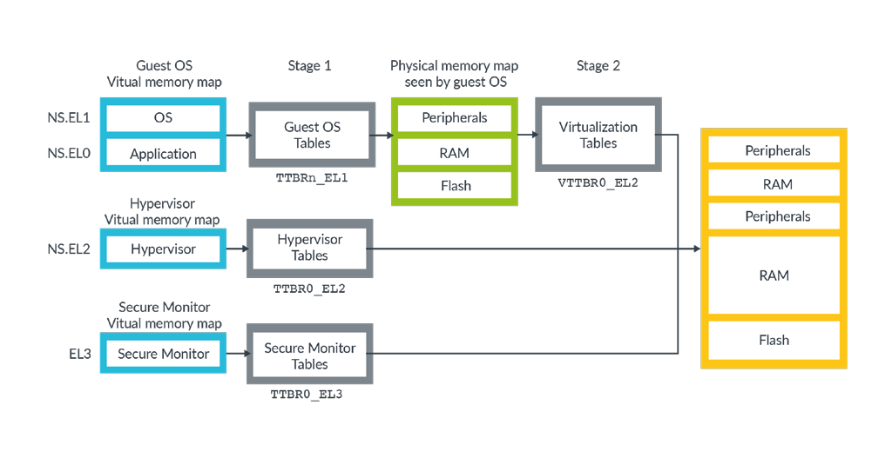
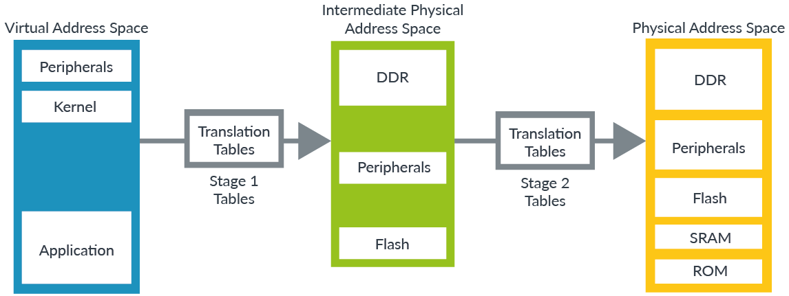
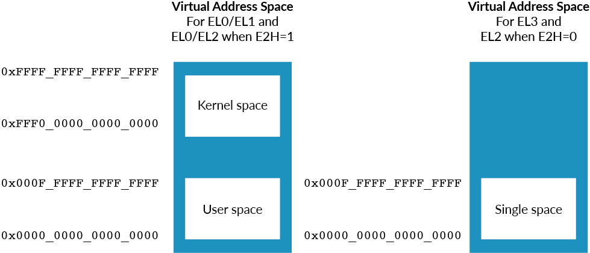
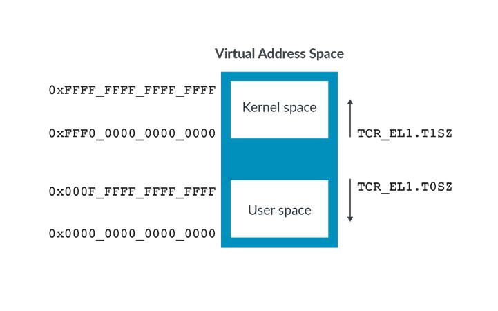
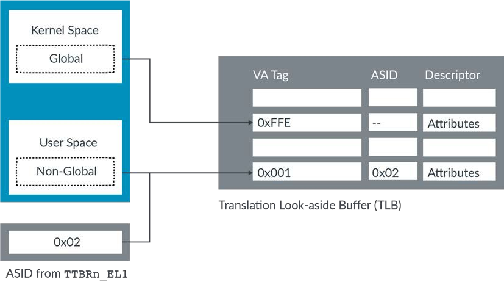

# 1. Address spaces in Armv8-A

Armv8-A中有多个独立的虚拟地址空间。如图所示：



图中显示了三个虚拟地址空间：
- `NS.EL0 and NS.EL1 (Non-secure EL0/EL1)`
- `NS.EL2 (Non-secure EL2)`
- `EL3`

每个虚拟地址空间都是独立的，并且有自己的页表。我们通常把这些设置和表称为`translation regimes`。
另外还有用于`Secure EL0`、`Secure EL1`和`Secure EL2`的虚拟地址空间，但它们没有显示在图中。

> 在Armv8.4-A中添加了对`Secure EL2`的支持。

因为存在多个虚拟地址空间，所以指出所在的地址空间是很重要的。
例如，`NS.EL2:0x8000`是指`Non-secure EL2`虚拟地址空间中的`0x8000`地址。

该图还显示了，来自`Non-secure EL0`和`Non-secure EL1`的虚拟地址将经过两组`tables`。
这些表还支持虚拟化，并允许`hypervisor`虚拟`VM`所看到的物理内存的视图。

在虚拟化中，由操作系统控制的`Stage 1`的页表。
`Stage 1`的页表会将`virtual addresses`转换为`intermediate physical addresses (IPA)`。
在`Stage 1`中，操作系统认为`IPA`就是`physical address`。
然而，`hypervisor`控制`Stage 2`的页表。`Stage 2`会将`IPA`转换为`physical addresses`。
此图显示了两阶段翻译本的工作原理：



虽然页表的格式有一些细微的差异，但`Stage 1`和`Stage 2`的翻译过程通常是相同的。

> 注意：在ARM，我们在许多示例中使用地址`0x8000`。 0x8000也是Arm与armlink的默认连接地址。 该地址来自早期的微型计算机`BBC Micro Model B`，它在地址0x8000放置`ROM`。 `BBC Micro Model B`是由一家名为`Acorn`的公司建造的，该公司开发了`Acorn RISC Machine(ARM)`，后来成为ARM。

## 1.1 Address sizes

Armv8-A是`64`位架构，但这并不意味着所有地址都是`64`位。

### 1.1.1 Size of virtual addresses

虚拟地址以64位的格式存储。
因此，加载指令(`LDR`)和存储指令(`STR`)中的地址总是在`X`寄存器中指定。
然而，并不是`X`寄存器中的所有地址都有效。

下图显示了`AArch64`中虚拟地址空间的布局：



`EL0/EL1`虚拟地址空间有两个区域：内核空间和应用空间。
这两个区域显示在闪图的左侧，其中内核空间在顶部，用户空间的的底部。
内核空间和用户空间有单独的页表，这意味着它们的映射可以保持独立。

所有其他异常级别的地址空间底部都有一个区域。
这个区域显示在上图的右边。

> 注意：如果你设置了`HCR_EL2.E2H==1`，它启用了`Host OS `在`EL2`中运行的配置，而`Host OS`的应用程序在`EL0`中运行。在此方案中，`EL2`也具有顶部区域和低部区域。

每个地址空间区域的大小可达`2**52 byte`。
然而，每个区域都可以独立单向调整。
`TCR_ELx`寄存器中的`TNSZ`字段用来控制虚拟地址空间的大小。

例如，下图显示，`TCR_EL1`将控制`EL0/EL1`虚拟地址空间的大小：



虚拟地址的大小被编码为：
```
virtual address size in bytes = 2 ** (64 - TCR_ELx.TnSZ)
```
虚拟地址大小(`Address Bits`表示法)：
```
Number of address bits = 64 – TnSZ
```
因此，如果`TCR_EL1.SZ1==32`，`EL0/EL1`虚拟地址空间中内核区域的大小为`2**32 byte`
即(`0xFFFF_FFFF_0000_0000`到`0xFFFF_FFFF_FFFF_FFFF`)。
访问超出配置范围的任何地址，都将产生异常（`translation fault`）。

这样做的好处是，只需要描述我们想要使用的地址空间即可，从而做到节省了时间和空间的目的。
例如，假设`OS kernel`需要`1GB`的地址空间（`30-bit address size`）作为其内核空间。
如果`OS`将`T1SZ`设置为`34`，则只会创建描述`1GB`的`translation table entries`，即`64 - 34 = 30`。

> 注意：所有Armv8-A实现都支持`48-bit`虚拟地址。支持`52-bit`虚拟地址是可选的，并由`ID_AA64MMFR2_EL1`寄存器报告处理器实现情况。

### 1.1.2 Size of physical addresses

物理地址的大小是`IMPLEMENTATION DEFINED`，最大为`52-bit`。
`ID_AA64MMFR0_EL1`寄存器报告处理器实现的大小。
对于`Arm Cortex-A`系列处理器，通常是`40-bit`或`44-bit`。

> 注意：Armv8.0-A版中，物理地址的最大为`48-bit`。在Armv8.2-A被扩展到`52-bit`。

### 1.1.3 Size of intermediate physical addresses

如果在`translation table entry`中指定的输出地址大于处理器实现的最大值，
则内存管理单元(`MMU`)将会产生异常（`address size fault`）。

`IPA`空间的大小与虚拟地址空间的配置方式相同。
`VTCR_EL2.T0SZ`控制`IPA`空间的大小。
可以配置的最大值与处理器支持的物理地址最大值相同。
这意味着你无法配置比支持的物理地址空间更大的`IPA`空间。

## 1.2 Address Space Identifiers - Tagging translations with the owning process

许多现代操作系统上的所有应用程序似乎都来自同一个地址区域，这就是我们所描述的用户空间。
在实践中，不同的应用程序需要不同的映射。这意味着`VA 0x8000`的地址转换取决于当前正在运行的应用程序。

理想情况下，我们希望不同应用程序的`translations`共存于`Translation Lookaside Buffers (TLBs)`中，以防止`context switch`时需要`TLB invalidates`。但是处理器如何知道要使用哪个版本的`VA 0x8000`翻译呢？
在`Armv8-A`中，答案是`Address Space Identifiers (ASIDs)`。

对于`EL0/EL1`虚拟地址空间，`translations`可以使用`translation table entry`的属性字段`nG bit` 来标记`Global(G)`或`Non-Global(nG)`。
例如，内核映射是全局翻译，应用程序映射是非全局翻译。

非全局映射在`TLBs`中用`ASID`标记。
在进行`TLB`查找时，系统会将该`TLB entry`中的`ASID`与当前选定的`ASID`进行比较。
如果它们不匹配，则不使用`TLB entry`。
下图显示了内核空间中没有`ASID`标记的全局映射，以及用户空间中带有`ASID`标记的非全局映射：



上图显示，多个应用程序的`TLB entry`允许在缓存中共存，`ASID`可以确定使用哪个`TLB entry`。

`ASID`存储在两个`TTBRn_EL1`寄存器中的一个。
通常`TTBR0_EL1`用于用户空间。寄存器更新可以更改它所指向的`ASID`和`translation table`。

> 注意：当`HCR_EL2.E2h==1`时，`ASID`标记也可在`EL2`中使用。

## 1.3 Virtual Machine Identifiers - Tagging translations with the owning VM

`EL0/EL1`翻译也可以用`Virtual Machine Identifier(VMID)`进行标记。
`VMID`允许来自不同`VM`的翻译在缓存中共存。
这与`ASID`为不同应用程序进行翻译的工作方式类似。
在实践中，这意味着有些翻译将同时被标记为`VMID`和`ASID`，并且两者都必须匹配才能使用`TLB entry`。

> 注意：当`security state`支持虚拟化时，`EL0/EL1`翻译总是用`VMID`标记，即使没有启用`Stage 2`翻译。 这意味着，如果您正在编写初始化代码，并且没有使用`Hypervisor`，那么设置`Stage 1`的MMU之前，必须设置一个已知的`VMID`值。

## 1.4 Common not Private

如果一个系统包含多个处理器，那么在一个处理器上使用的`ASID`和`VMID`在其他处理器上是否具有相同的含义？

对于Armv8.0-A，答案是它们不必表示相同的含义。软件不需要在多个处理器中以相同的方式使用给定的`ASID`。
例如，`ASID 5`可以在一个处理器上被`calculator`使用，也可以在另一个处理器上被`web browser`使用。 这意味着一个处理器创建的`TLB  entry`不能被另一个处理器使用。

在实践中，软件不太可能在跨处理器之间以不同的方式使用`ASID`。
软件通常会在给定系统中的所有处理器上以相同的方式使用`ASID`和`VMID`。

因此，`Arm8.2-A`在`Translation Table Base Register (TTBR)`中引入了`Common not Private (CnP)`位。
当设置了`CNP`位时，软件承诺会在所有处理器上以相同的方式使用`ASID`和`VMID`，
这可以让一个处理器创建的`TLB entry`被另一个处理器使用。

> 注意：我们一直在讨论处理器，但是，从技术上讲，我们应该使用术语，`Processing Element (PE)`。`PE`是指实现Arm体系结构的通用术语。这里很重要，因为在处理器之间共享`TLB`与微架构有关。但是在多线程处理器中，每个硬件线程都是一个`PE`，因此更希望共享`TLB entry`。