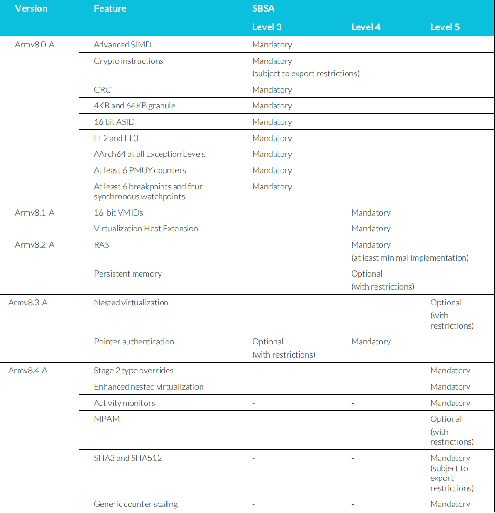

# 1. What does Armv8.x-A mean?

ARM的体系结构有不同的版本。这些不同的版本通常显示为`ArmvX`，其中的`X`是`major`版本号。

例如，`Armv8-A`版是`Arm A-profile`体系结构的第`8`版(`major version`)。
然而，也有一些`minor`版本被添加到一个`major`版本中。
这些`minor`被称为`.x extension`。

例如，`Arm8.1-A`是指`a-profile`体系结构的第`8`版，扩展为`.1 extension`。

# 2. Why do we need the .x extensions?

Arm架构的`major`版本的开发可能需要花费多年的时间。
例如，`Arm7-A`发布于2007年，`Arm8-A`是在`6`年后的`2013`年发布。
由于体系结构需要在`major`版本中添加新特性，因此`major`中添加`minor`版本或`.x extension`。

自`Armv8-A`发布以来，现在每年Arm都会发布`.x extension`。
从`Armv8.0-A`开始，基础规范，2015年增加`Armv8.1-A`扩展，2016年增加`Armv8.2-A`扩展，以此类推。 
每个`.x extension`建立在最后一个基础上，因此`Armv8.2-A`包含`Armv8.1-A`的所有特性，并添加新特性。

每个`.extension`都相对于`minor`版本。`Arm Architecture Reference Manual (Arm ARM)`基本规范约为`6000`页。相比之下`Armv8.3-A`的规格只有`48`页。

# 3. Processor implementation of Armv8.x-A

每个`.x extension`包括一些特性，一些是强制性的(`mandatory`)，一些是可选的(`optional`)。
如果处理器实现了该`extension`以及所有以前的所有强制特性，则它实现了该扩展。

例如，要被描述为实现Armv8.2-A，处理器必须实现以下所有强制特性：
- `armv8.0-A`：基本规范和原始版本。
- `armv8.1-A`：以前的扩展。
- `armv8.2-A`：新的扩展。

> 注意：一个特性最初可能是可选的，但后来成为强制性的。 例如，`Dot Product instructions`在`Armv8.0-A`到`Armv8.3-A`的中都是可选的，但在`Armv8.4-A`中成为强制性的。

# 4. Feature implementation between Armv8.x versions

Armv8.x-A处理器可以实现下一个`.x extension`的任何特性。 

例如，一个被描述为实现`Armv8.1-A`的处理器：
- 必须实现`Armv8.0-A`和`Armv8.1-A`的所有强制性特性。
- 允许实现`Armv8.2-A`中的一些特性。
- 不允许实现`Arm8.3-A`、`Armv8.4-A`的特性。

# 5. Armv8.x extensions and features

在这里，我们总结了在每个`Arm8.x-A extension`。
我们没有提供一个完整的列表，仅包含来最重要的特性。
请注意，有些特性的使用仅限于`AArch64`，有些特性可以支持`AArch64`与`AArch32`。

## 5.1 Armv8.1-A

- Atomic memory access instructions (AArch64)
- Limited Order regions (AArch64)
- Increased Virtual Machine Identifier (VMID) size, and Virtualization Host Extensions (AArch64)
- Privileged Access Never (PAN) (AArch32 and AArch64)

## 5.2 Armv8.2-A

- Support for 52-bit addresses (AArch64)
- The ability for PEs to share Translation Lookaside Buffer (TLB) entries (AArch32 and AArch64)
- FP16 data processing instructions (AArch32 and AArch64)
- Statistical profiling (AArch64)
- Reliability Availability Serviceabilty (RAS) support becomes mandatory (AArch32 and AArch64)

## 5.3 Armv8.3-A

- Pointer authentication (AArch64)
- Nested virtualization (AArch64)
- Advanced Single Instruction Multiple Data (SIMD) complex number support (AArch32 and AArch64)
- Improved JavaScript data type conversion support (AArch32 and AArch64)
- A change to the memory consistency model (AArch64)
- ID mechanism support for larger system-visible caches (AArch32 and AArch64)

## 5.4 Armv8.4-A

- Secure virtualization (AArch64)
- Nested virtualization enhancements (AArch64)
- Small translation table support (AArch64)
- Relaxed alignment restrictions (AArch32 and AArch64)
- Memory Partitioning and Monitoring (MPAM) (AArch32 and AArch64)
- Additional crypto support (AArch32 and AArch64)
- Generic counter scaling (AArch32 and AArch64)
- Instructions to accelerate SHA512 and SHA3 (AArch64 only)

# 6. Which .x extension does my processor implement?

ARM体系结构包括一组报告处理器支持的特性的`feature registers`。
对于`.x extension`添加的每个新特性，甚至是可选特性，这些特性寄存器中的字段报告是否支持。

例如，`ID_AA64MMFR2_EL1.AT`会告诉你是否支持`Arm8.4-A`中的`relaxed alignment`要求。

您将找不到一个报告此处理器为`Armv8.1-A`的字段。
软件会读取强制性的`Arm8.1-A`特性，如果它们全部存在，则说明处理器符合`Armv8.1-A`。

## 6.1 Arm Cortex-A processors

此表总结了哪些处理器支持哪些`.x extension`。

Architecture | Processors
---|---
Armv8.0-A | Cortex-A53,A57,A72
Armv8.2-A | Cortex-A55,A75,A76

# 7. Armv8.x-A and the SBSA

`Server Base System Architecture(SBSA)`为服务器提供硬件需求。
SBSA确保`operating systems`、`hypervisors`和`firmware`之间可以正确操作。
对于服务器，一定程度的标准化是重要的，`SBSA`包括了必须实现对体系结构的`extension`的规则。

下图总结了与`Arm8.x-A`扩展相关的`SBSA`要求：

