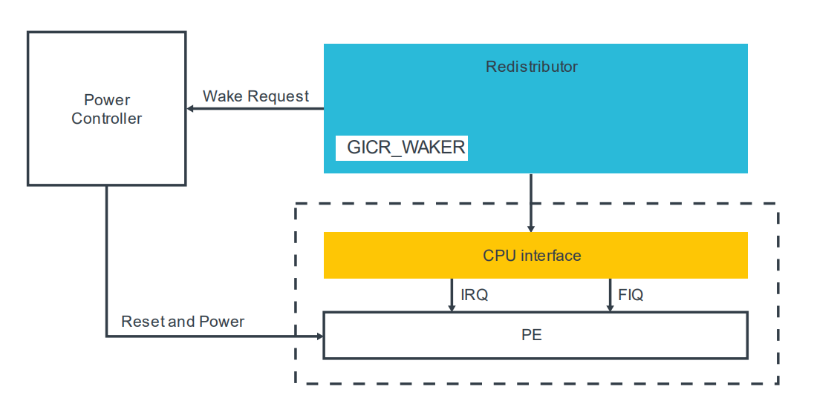
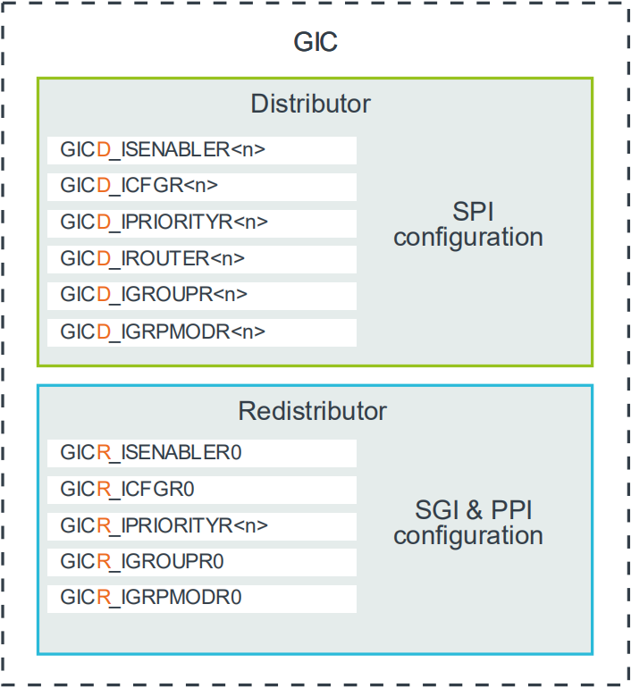

# 1. Configuring the Arm CoreLink GIC

本指南的本节描述了如何在裸金属环境中`enable`和`configure`符合GICV3的中断控制器。
有关详细的寄存器描述，请参阅`Arm® Generic Interrupt Controller Architecture Specification version 3.0 and 4`。

`Locality-specific Peripheral Interrupts (LPIs)`的配置与`Shared 
Peripheral Interrupts (SPIs)`、`Private Peripheral Interrupt (PPIs)`和` Software Generated Interrupts (SGIs)`的配置显著不同，且超出本指南的范围。
要了解更多信息，请参阅`Arm CoreLink Generic Interrupt Controller v3 and v4: Locality-specific Peripheral Interrupts`。

大多数使用GICv3中断控制器的系统是`multi-core`系统，也可能是`multi-processor`系统。
有些设置是全局的，这意味着影响所有连接的`PE`。
其他设置是特定于单个`PE`的。

让我们先来看看全局设置，然后是每个`PE`的设置。

## 1.1 Global settings

`Distributor control register (GICD_CTLR)`必须配置为`enable interrupt group`，并按如下方式设置路由模式：
- `Enable Affinity routing(ARE bits)`：`GICD_CTLR`寄存器中的`ARE bit`控制GIC是在`GIC v3 mode`还是`legacy mode`模式下工作。`legacy mode`提供了与`GICv2`的向后兼容性。 本指南假设`ARE bit`设置为`1`，因此正在使用`GICv3 mode`。
- `Enables`：`GICD_CTLR`寄存器包含`Group 0`、`Secure Group 1`和`Non-secure Group 1`的单独`enable bit`。
    - `EnableGrp1S`使能`Secure Group 1 interrupt`的`distribution`。
    - `EnableGrp1NS`使能`Non-secure Group 1 interrupt`的`distribution`。
    - `EnableGrp0`使能`Group 0 interrupts`的`distribution`。

> 注意：`Arm CoreLink GIC-600`不支持`legacy`操作，并且`ARE bit`将永久设置为`1`。

## 1.2 Settings for each PE

本节涵盖特定的`single core`或`PE`的设置。

### 1.2.1 Redistributor configuration

每个`core`都有自己的`Redistributor`，如下图所示：

`Redistributor`包含一个名为`GICR_WAKER`的寄存器，用于记录连接的`PE`是`online`还是`offline`。中断只会被转发到`GIC`认为已`online`的`PE`。在`reset`时，所有`PE`都被视为`offline`。

若要将已连接的`PE`标记为`online`状态，软件必须：
- `GICR_WAKER.ProcessorSleep`清零
- 轮询读取`GICR_WAKER.ChildrenAsleep`直到读到`0`。

软件在配置`CPU interface`之前执行这些步骤是很重要的，否则行为是`UNPREDICTABLE`。

当`PE`是`offline(GICR_WAKER.ProcessorSleep==1)`时，以`PE`为目标的中断将导致`wake request signal`被确认。通常，此信号将进入系统的电源控制器。然后电源控制器打开PE。唤醒时，该PE上的软件将清零`ProcessorSleep bit`，从而允许唤醒`PE`的转发中断。

### 1.2.2 CPU interface configuration

`CPU interface`负责将`interrupt exception`传递到与其连接的`PE`。
要使能`CPU interface`，软件必须配置以下内容：
- `Enable System register access`：软件必须在`ICC_SRE_ELn`寄存器中设置`SRE bit`来`enable`对`CPU interface`寄存器的访问。
- `Set Priority Mask and Binary Point registers`：`CPU interface`包含`Priority Mask(ICC_PMR_EL1)`寄存器与`Binary Point(ICC_BPRn_EL1)`寄存器。优先级掩码设置中断必须具有的最小优先级，以便转发到`PE`。二进制点寄存器用于`priority grouping`和`preemption`。
- `Set EOI mode`：`CPU interface`中`ICC_CTLR_EL1`与`ICC_CTLR_EL3`中的`EOImode bit`控制如何处理中断的完成情况。
- `Enable signaling of each interrupt group`：必须使能每个中断组的信号，然后`CPU interface`才能将该组的中断转发给`PE`。要使能信号，软件必须写入`Group 1 interrupts`的`ICC_IGRPEN1_EL1`寄存器与`Group 0 interrupts`的`ICC_IGRPEN0_EL1`寄存器。

### 1.2.3 PE configuration

需要PE的一些配置来允许它接收和处理中断。对此的详细说明不在本指南的范围之内。 在本指南中，我们将描述Arm8-A兼容的`PE`下`AArch64`执行状态所需的基本步骤。

- `Routing controls`：中断的路由控制在`PE`的`SCR_EL3`和`HCR_EL2`中。路由控制位决定发生中断的异常级别。这些寄存器中的路由位在`reset`时，值是一个`UNKNOWN`，因此它们必须由软件初始化。
- `Interrupt masks`：在`PSTATE`中，`PE`也有异常掩码位。当设置了这些位时，中断就会被屏蔽。这些位会在`reset`时进行设置。
- `Vector table`：`PE`的向量表的位置由`VBAR_ELn`寄存器设置。与`SCR_EL3`和`HCR_EL2`一样，`VBAR_ELn`寄存器在`reset`时，值是一个`UNKNOWN`。软件必须将`VBAR_ELn`寄存器设置为指向内存中适当的向量表。

### 1.2.4 SPI, PPI and SGI configuration

到目前为止，我们已经研究了配置中断控制器本身。现在我们将讨论单个中断源的配置。

使用哪些寄存器来配置中断取决于中断的类型：
- SPI中断类型：使用`GICD_*`寄存器配置`Distributor`。
- PPI与SGI中断类型：使用`GICR_*`寄存器配置独立的`Redistributors`。

这些不同的配置机制如下图所示：

对于每个`INTID`，软件必须配置以下内容：
- `Priority`：GICD\_IPRIORITYn, GICR\_IPRIORITYn
    - 每个`INTID`都有一个关联的优先级，表示为`8-bit unsigned value`。`0x00`是最高优先级，`0xFF`是最低优先级。不需要一个中断控制器来实现所有8个优先级位。如果GIC支持两个安全状态，则必须实现至少5位。如果GIC只支持单个安全状态，则必须实现至少4位。
- `Group`：GICD\_IGROUPn, GICD\_IGRPMODn, GICR\_IGROUPn, GICR\_IGRPMODn
    - 可以将中断配置为属于三个中断组中的其中之一（`Group 0`，`Secure Group 1`，`Non-secure Group 1`）。
- `Edge-triggered or level-sensitive`：GICD\_ICFGRn, GICR\_ICFGRn
    - 对于PPI和SPI，软件必须指定中断是`edge-triggered`的还是`level-sensitive`的。SGI总是被视为边缘触发的，因此对于这些中断，`GICR_ICFGR0`寄存器的表现行为是`Read-As-One`，忽略写(`RAO/WI`)。
- `Enable`：GICD\_ISENABLERn, GICD\_ICENABLER, GICR\_ISENABLERn, GICR\_ICENABLERn
    - 每个`INTID`都有一个`enable bit`。`Set-enable`寄存器与`Clear-enable`寄存器的存在，去除了`read-modify-write`例程的需求。

大多数配置寄存器的`reset`值都是`IMPLEMENTATION DEFINED`。 这意味着中断控制器的设计实现决定值是什么，并且值可能在系统之间有所不同。

### 1.2.5 Arm CoreLink GICv3.1 and the extended INTID ranges

`Arm CoreLink GICv3.1`增加`SPI`与`PPI`的`INITD`支持。
配置这些中断的寄存器与原始中断范围相同，只是它们有一个后缀`E`。例如：
- `GICR_ISENABLERn`：Enable bits for the original PPI range
- `GICR_ISENABLERnE`：Enable bits for the additional PPIs that are introduced in GICv3.1

### 1.2.6 Setting the target PE for SPIs

对于SPI类型的中断，必须配置中断的目标(`target`)。
这是由`GICD_IROUTERn`寄存器或GICv3.1扩展`GICD_IROUTERnE`寄存器控制的。
每个`SPI`都有一个`GICD_IROUTERn`寄存器，`Interrupt_Routing_Mode bit`控制路由策略。选项为：
- `GICD_IROUTERn.Interrupt_Routing_Mode == 0`
    - 将SPI递达(`deliver`)给专门的PE（以`affinity co-ordinates`为坐标A.B.C.D）。
- `GICD_IROUTERn.Interrupt_Routing_Mode == 1`
    - SPI可以传递给任何参`distribution of the interrupt group`的连接PE。`distribution`将选择目标PE，而不是软件。因此，每次发出中断信号时，目标都可以改变。这种类型的路由称为`1-of-N`。

一个`PE`可以选择不接受`1-of-N`中断。 这是由`GICR_CTLR`中的`DPG1S, DPG1NS, DPG0`位控制的。