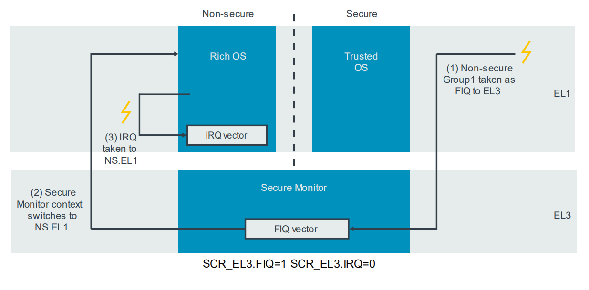
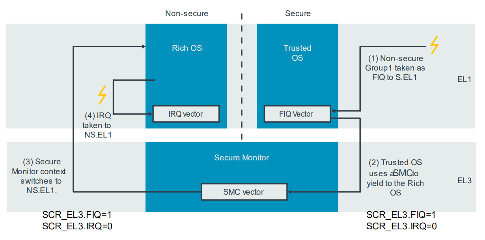
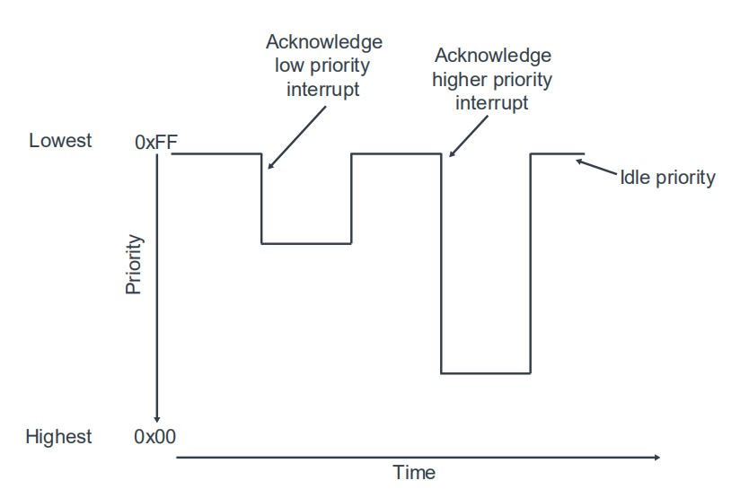
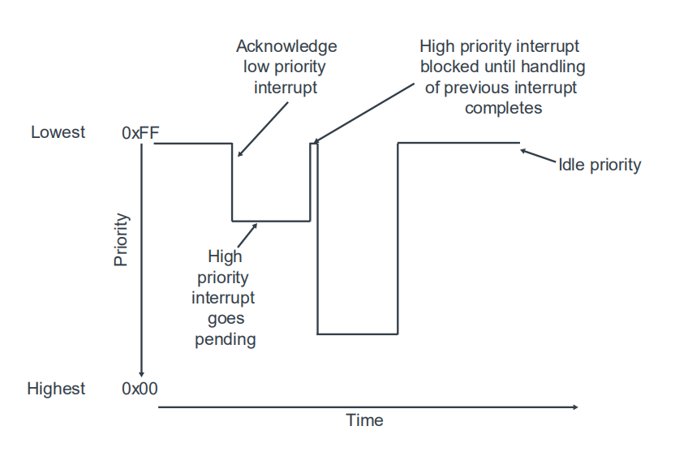
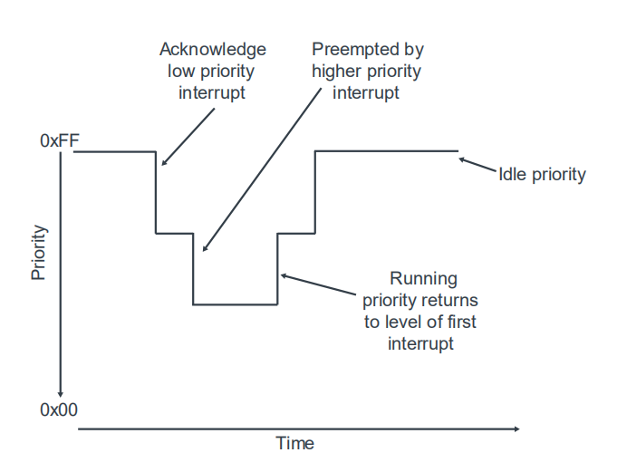
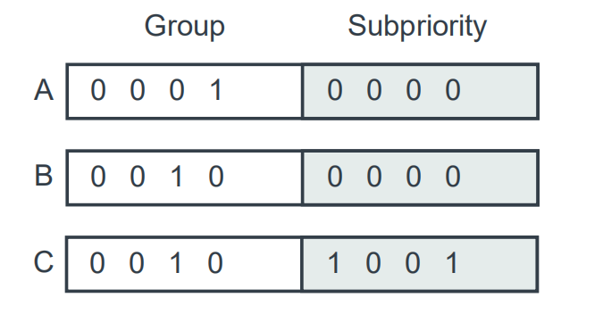

# 1. Handling interrupts

本节描述当中断发生时会发生什么：中断是如何路由到PE的，中断是如何相互排序的，以及在中断结束时会发生什么。

## 1.1 Routing a pending interrupt to a PE

中断状态机描述当中断源信号活跃时，中断如何从`inactive`状态转换到`pending`状态。
当中断`pending`时，中断控制器根据以下测试决定是否将中断发送到连接的PE中的一个。

- a. 检查与中断关联的组是否启用。

`Security model`描述了如何将每个`INTID`分配给一个组：`Group 0`、`Secure Group 1`或`Non-secure Group 1`。
对于每个组，每个`Distributor`与`CPU interface`都有一个组`enable bit`。

中断控制器检查与该中断的`INTID`相关联的组是否设置组启用位。

中断是禁用组的成员，不能向PE发出信号。这些中断保持在挂起状态，直到启用组。

- b. 检查该中断是否启用。

独立禁用的中断可以挂起，但不会转发到PE。

- c. 检查路由控制，以明确哪些PE可以接受中断。  
哪个PE可以接收中断取决于发送的中断类型：
    - 对于`Shared Peripheral Interrupts (SPIs)`，路由时通过`GICD_IROUTERn`寄存器控制。SPI可以针对一个特定的PE，或任何一个连接的PE。
    - 对于`Locality-specific Peripheral Interrupts (LPIs)`，路由信息来自`ITS`。
    - `Private Peripheral Interrupts (PPIs)`特定于一个PE，只能由该PE处理。
    - 对于`Software Generated Interrupts (SGIs)`，产生时PE定义了目标PE的列表。
- d. 检查中断优先级和优先级掩码，以明确哪些PE更合适处理中断。
    - 每个`PE`在其`CPU interface`中都有一个优先级掩码寄存器，即`ICC_PMR_EL1`。此寄存器设置转发到该PE的中断所需的最小优先级。只有优先级高于掩码的中断才会向PE发出信号。
- e. 检查正在运行的优先级，以明确哪些PE可用于处理中断。

`Running priority and preemption`章节涵盖正在运行的优先级，以及这是如何影响抢占。
如果`PE`尚未处理中断，则运行的优先级为`idle priority`：`0xFF`。只有优先级高于当前运行优先级的中断才能优先于当前中断。

如果中断通过所有这些测试（`a ~ e`），它将作为IRQ或FIQ异常转发到适当的PE。

## 1.2 Taking an interrupt

当进入异常处理程序时，软件不知道哪个中断发生了。异常处理程序必须读取`Interrupt Acknowledge Registers (IARs)`，才能获取中断的`INTID`。

有两个`Interrupt Acknowledge Registers (IARs)`寄存器：

Register | Use
---|---
ICC_IAR0_EL1 | 用于应答`Group 0 interrupts`。通常在`FIQ`处理程序中读取。
ICC_IAR1_EL1 | 用于应答`Group 1 interrupts`。通常在`IRQ`处理程序中读取。

读取`IAR`将返回获取中断的`INTID`，并推进中断的状态机。
通常，`IAR`在进入中断处理程序时被读取。然而，软件可以随时自由地读取寄存器。

有时，IAR无法返回有效的INTID。
例如，软件读取`ICC_IAR0_EL1`，应答`Group 0 interrupts`，
但是`pending`的中断属于`Group 1`。
在这种情况下，读取将返回一个保留的INTID，如下表所示：

ID | Meaning | Example scenario
---|---|---
1020 | 只能通过`ICC_IAR0_EL1`的读取返回。 最高级的挂起中断是`Secure Group 1`。 仅在EL3中考虑。| 当PE处于`Non-secure`状态执行时，表示`Trusted OS`发出中断。这被视为一个转换到`EL3`的`FIQ`，以便`Secure Monitor`可以上下文切换到`Trusted OS`。
1021 | 只能通过`ICC_IAR0_EL1`的读取返回。 最高级的挂起中断是`Non-secure Group 1`。 仅在EL3中考虑。| 当PE以`Secure`状态执行时，表示`Rich OS`发出的中断。这将被视为一个转换到`EL3`的`FIQ`，以便`Secure Monitor`可以上下文切换到`Rich OS`。
1023 | 仅用于`legacy operation`。 | 遗留操作超出本指南范围。
1024 | 伪中断。挂起状态中没有启用的`INTID`，或者挂起的所有`INTID`都没有足够的优先级。| 当轮询`IARs`时，此值表示没有可用的中断可供应答。

> 读取返回这些保留值IAR不会应答中断。

### 1.2.1 Example of interrupt handling

下图显示了具有调制解调器中断的示例。
此中断在处于`Non-secure`状态的`Rich OS`处理。

处理中断所涉及的步骤如下：
1. 当`PE`在`Secure EL1`上执行`Trusted OS`时，调制解调器中断将会挂起。当调制解调器中断被配置为`Non-secure Group 1`时，它将作为`FIQ`发出信号(`SCR_EL3.FIQ==1`)，异常被带到EL3。
2. 在EL3处执行的`Secure Monitor`软件读取了`IAR`，它返回`1021`。此值表示该中断应以`Non-secure`进行处理。然后，`Secure Monitor`将执行必要的上下文切换操作。
3. 现在`PE`处于`Non-secure`状态，中断被重新发送信号为`IRQ`，并被带到`Non-secure EL1`并由`RichOS`处理。

在本示例中，`Non-secure Group 1 `中断导致立即退出`Secure OS`。
这可能并不总是需要的或想要的。下图显示了本例的替代模型，其中最初将中断用于`Secure EL1`：

处理中断涉及的步骤现在如下：
1. 当`PE`在`Secure EL1`执行`Trusted OS`时，调制解调器中断将挂起。 由于调制解调器中断被配置为`Non-secure Group 1`，所以它将被作为`FIQ`发出信号(`SCR_EL3.FIQ==0`)。异常被带到`Secure EL1`。
2. `Trusted OS`会执行操作以清理其内部状态。就绪后，`Trusted OS`使用`SMC`指令进入`Non-scure state`。
3. SMC异常被带到EL3。 在EL3执行的`Secure Monitor`软件执行必要的上下文切换操作。
4. 现在`PE`处于`Non-secure`状态，中断被信号为`IRQ`，并带到`Non-secure EL1`的`Rich OS`处理。

## 1.3 Running priority and preemption

优先级掩码寄存器设置中断必须转发到PE的最小优先级。
GICv3体系结构还具有`running priority`的概念。
当`PE`应答中断时，其`running priority`与`interrupt priority`相同。
当PE写入`End of Interrupt (EOI)`寄存器时，`running priority`返回到其前值。

下图显示了一个`PE`随时间变化的`running priority`示例：

`current running priority`在CPU Interface：`ICC_RPR_EL1`的运行优先级寄存器中报告。

在考虑优抢占时，运行优先权的概念很重要。
当一个高优先级中断被发送给一个已经处理低优先级中断的`PE`时，就会发生抢占。
抢占为软件带来了一些额外的复杂性，但它可以防止低优先级中断阻止对高优先级中断的处理。

下图显示如果不允许抢占会发生什么：

高优先级中断被阻塞，直到先前发出的低优先级中断被接受为止。
现在考虑同样的情况，但启用了抢占：

当高优先级中断挂起时，它优先于低优先级中断。上图显示了`one level`抢占。
然而，也有可能有`multiple level`的抢占。

Arm CoreLink GICV3架构允许软件通过指定发生抢占所需的优先级差异来控制抢占。
这是通过二进制点寄存器控制的：`ICC_BPRn_EL1`。
二进制点寄存器将优先级分为两个字段，`Group`和`sub-priority`，您可以在这里看到：

对于抢占，仅考虑`group priority`位，`sub-priority`位会被忽略。

例如，考虑下列三个中断：
- INTID A优先级是0x10。
- INTID B优先级是0x20。
- INTID C优先级是0x21。

在这个例子中，我们明确了：
- A可以抢占B或C。
- B不可以抢占C，因为B和C有类似的优先级。

为了达到这一点，可以将`Group`和`sub-priority`的优先级之间的分割(`N=4`)，如你在这里所看到的：

有了这种分割，B和C现在有相同的优先级。 然而，A仍然具有更高的优先级，这意味着它可以抢占B或C。

二进制点寄存器只影响抢占，即在已经处理不同中断时，是否应该发出中断信号。
在挂起的中断之间进行选择时，则不使用二进制点寄存器。

> 注意：抢占要求编写中断处理程序或处理程序以支持嵌套。

## 1.4 End of interrupt

一旦处理了中断，软件必须通知中断控制器中断已被处理，以便状态机可以转换到下一个状态。
ARM CoreLink GICv3体系结构将其视为两项任务：
- `Priority drop`：这意味着将运行优先级降回中断之前的值。
- `Deactivation`：这意味着更新当前正在处理的中断的状态机。 通常，这将是从`Active`状态到`Inactive`状态的转换。

在GICv3体系结构中，`Priority drop`和`Deactivation`可以一起或单独发生。这是由`ICC_CTLR_ELn.EOImode`的设置决定的。
- `EOImode = 0`：`Group 0 interrupt`通过写`ICC_EOIR0_EL1`，或`Group 1 interrupt`通过写`ICC_EOIR1_EL1`进行`priority drop`与`deactivation`。这种模式通常用于简单的裸金属环境。
- `EOImode = 1`：`Group 0 interrupt`通过写入`ICC_EOIR0_EL1`，或`Group 1 interrupt`通过写`ICC_EOIR1_EL1`仅会导致`Priority drop`。`deactivation`需要单独写`ICC_DIR_EL1`。这种模式通常用于虚拟化环境。

大多数软件将使用`EOIMode==0`，而`Hypervisor`软件使用`EOIMode==1`。

## 1.5 Checking the current state of the system

### 1.5.1 Highest priority pending interrupt and running priority

正如他们的名字所示，`Highest Priority Pending Interrupt`寄存器：`ICC_HPPIR0_EL1`和`ICC_HPPIR1_EL1`报告`PE`的最高优先级挂起中断的`INTID`。

`Running priority`由`Running Priority`寄存器：`ICC_RPR_EL1`报告。

### 1.5.2 State of individual INTIDs

`Distributor`提供指示每个`SPI`当前状态的寄存器。
同样，`Redistributor`也提供相应寄存器，以指示其连接的`PE`的`PPI`和`SGI`的状态。

这些寄存器还可以将中断转移到特定的状态。这对我们很有用，例如，用于测试配置是否正确，而不需要外围设备中断信号活跃。

有单独的寄存器来报告`active`状态和`pending`状态。
下表仅列出了`active`状态寄存器，`pending`的状态寄存器具有相同的格式：

Register | Description
---|---
GICD_ISACTIVERn | 设置SPI为`active`状态。 每个`INTID`一位。 读取相应`bit`返回INTID的当前状态：0为`not active`，1为`active`。 写1到相应位，会使相应的`INTID`状态转到`active`。 写0到相应位，没有任何效果。
GICD_ICACTIVERn | 清除SPI的`active`状态。 每个`INTID`一位。 读取相应`bit`返回INTID的当前状态：0为`not active`，1为`active`。 写1到相应位，会使相应的`INTID`状态转到`deactivates`。 写0到相应位，没有任何效果。
GICR_ISACTIVERn | 设置SGI或PPI为`active`状态。 每个`INTID`一位。此寄存器包含INTID `0 ~ 31`，这是每个PE的私有的。 读取相应`bit`返回INTID的当前状态：0为`not active`，1为`active`。 写1到相应位，会使相应的`INTID`状态转到`activate`。 写0到相应位，没有任何效果。
GICR_ICACTIVERn | 清除SGI或PPI的`active`状态。 每个`INTID`一位。此寄存器包含INTID `0 ~ 31`，这是每个PE私有的。 读取相应`bit`返回INTID的当前状态：0为`not active`，1为`active`。 写1到相应位，会使相应的`INTID`状态转到`deactivate`状态。 写0都相应位，没有任何效果。

> 注意：除非`GICD_NASCRn`或`GICR_NASCRn`允许访问，否则以`Non-secure state`执行的软件无法看到`Group 0`或`Secure Group 1`中断的状态。