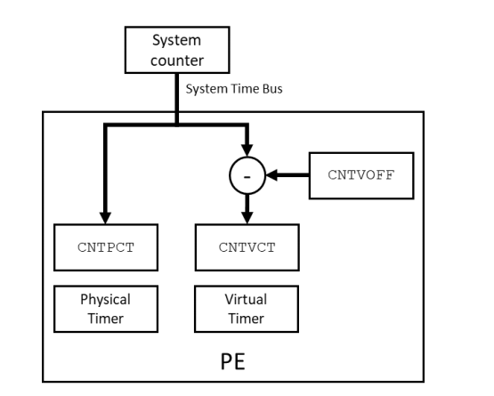

# 1. The processor timers

`PE`提供的计时器数量取决于实现了哪些扩展，如下表所示：

Timer name | When is the timer present?
---|---
EL1 physical timer | Always
EL1 virtual timer | Always
Non-secure EL2 physical timer | Implements EL2
Non-secure EL2 virtual timer | Implements ARMv8.1-VHE
EL3 physical timer | Implements EL3
Secure EL2 physical timer | Implements ARMv8.4-SecEL2
Secure EL2 virtual timer | Implements ARMv8.4-SecEL2

## 1.1 Count and frequency

`CNTPCT_EL0`系统寄存器报告当前`system count value`。

读取`CNTPCT_EL0`寄存器是投机性`(speculatively)`的访问。
这意味着，它可能会在程序流程方面产生乱序读取。
这在某些情况下可能很重要，例如比较时间戳。
当计数器读取的顺序很重要时，可以使用`ISB`指令，如下所示：
```asm
loop:       // Polling for some communication to indicate a requirement to read 
            // the timer
    LDR     X1, [X2]
    CBZ     X1, loop
    ISB     // Without this, the CNTPCT could be read before the memory location 
            // in [X2] has had the value 0 written to it
    
    MRS     X1, CNTPCT_EL0
```

`CNTFRQ_EL0`寄存器报告系统计数器的频率`(frequency)`。
但是，此寄存器不填充到硬件。
寄存器可在最高实现的异常级别下写入，所有异常级别都可读。
`Firmware`通常在`EL3`处运行，它会作为早期系统初始化的一部分填充此寄存器。
`Higher-Level`的软件，比如操作系统，可以使用寄存器来获取频率。

## 1.2 Timer registers

每个`timer`都有下列三个系统寄存器：

Register | Purpose
---|---
`<timer>_CTL_EL<x>` | 控制寄存器
`<timer>_CVAL_EL<x>` | 比较器的值
`<timer>_TVAL_EL<x>` | 计数器的值

在寄存器名中，`<timer>`标识表示要访问哪个计时器。下表显示了可能的值：

Timer | Register prefix | EL<x>
---|---|---
EL1 physical timer | CNTP | EL0
EL1 virtual timer | CNTV | EL0
Non-secure EL2 physical timer | CNTHP | EL2
Non-secure EL2 virtual timer | CNTHV | EL2
EL3 physical timer | CNTPS | EL1
Secure EL2 physical timer | CNTHPS | EL2
Secure EL2 virtual timer | CNTHVS | EL2

例如，`CNTP_CVAL_EL0`是`EL1 physical timer`的比较器寄存器。

### 1.2.1 Accessing the timers

对于一些计时器，可以配置哪些异常级别可以访问：
- `EL1 Physical and Virtual Timers`：`EL0`对这些计时器的访问权限，由`CNTKCTL_EL1`控制。
- `EL2 Physical and Virtual Timers`：当`HCR_EL2.TGE==1 & HCR_EL2.E2H==1`时，`EL0`对这些计时器的访问，由`CNTKCTL_EL2`控制。
- `EL3 physical timer`：`Secure.EL1`和`Secure.EL2`对此计时器的访问权限，由`SCR_EL3.ST`控制。

## 1.3 Configuring a timer

配置计时器有两种方法：要么使用`comparator(CVAL)`寄存器，要么使用`timer(TVAL)`寄存器。

`comparator register(CVAL)`是`64-bit`寄存器。
软件写`CVAL`，当数值达到写入的值或超过写入的值时，定时器会触发，如下所示：
```
    Timer Condition Met: CVAL <= System Count
```
`timer(TVAL)`是`32-bit`寄存器。
软件写`TVAL`，`PE`内部会读取`current system counter`与写入的值相加，然后填充到`CVAL`：
```
    CVAL = TVAL + current System Counter
    Timer Condition Met: CVAL <= System Count
```

你可以在软件中看到`CVAL`的填充。例如，先读取`current system count`，然后将`1000`写入`TVAL`，再读取`CVAL`，你将看到`CVAL`大约是`1000 + system count`。

读取`TVAL`将显示它递减到`0`，而`system count`是递增的。
`TVAL`报告的是一个有符号的值，并且会在计时器触发后继续递减，
这使得软件可以确定计时器发生了多久。

`TVAL`和`CVAL`为软件提供了两种不同的使用计时器的方式。
如果软件希望，在当前时钟周期的`X`个`tick`过后，产生计`timer`事件，软件可以写入`X`到`TVAL`。
或者，如果软件希望，在`System Counter`达到`Y`时发生`timer`事件，软件可以将`Y`写入`CVAL`。

## 1.4 Interrupts

计时器可以通过配置为产生中断。
来自`PE timer`的中断只能传递到该`PE`。 
这意味着，一个`PE`的`timer`不能用于产生不同`PE`的中断。

产生中断，是通过`CTL`控制寄存器的这些字段：
- ENABLE：`Enable`计时器。
- IMASK：中断掩码。`Enable`或`Disable`中断的产生。
- ISTATUS：当`ENABLE==1`时，报告`timer`是否`fire(CVAL <= System Count)`。

想要产生中断，软件必须将`ENABLE`设置为`1`，并将`IMASK`清除为`0`。
当`timer fire(CVAL <= System Count)`时，会向中断控制器`asserted`中断信号。
在Armv8-A系统中，中断控制器通常是`Generic Interrupt Controller (GIC)`。

用于每个`timer`的`interrupt ID(INTID)`是由`Server Base System Architecture (SBSA)`定义，如下所示：

Timer | SBSA recommended INTID
---|---
EL1 Physical Timer | 30
EL1 Virtual Timer | 27
Non-secure EL2 Physical Timer | 26
Non-secure EL2 Virtual Timer | 28
EL3 Physical Timer | 29
Secure EL2 Physical Timer | 20
Secure EL2 Virtual Timer | 19

> 注意：这些INTID在Private Peripheral Interrupt (PPI)范围内。

定时器产生的中断以电平敏感(`level-sensitive`)的方式运行。
这意味着，一旦达到计时器点火条件，计时器将继续发出中断信号，直到发生下列情况之一：
- `IMASK`被设置为`1`，它屏蔽了该中断。
- `ENABLE`被清除为`0`，这将禁用计时器。
- 写`TVAL`或`CVAL`，使`fire`条件不再满足。

当你为计时器编写中断处理程序时，软件必须在GIC中的`deactivating`之前，清除该中断是很重要的。
否则，GIC将再次发出同样的中断。

## 1.5 Timer virtualization

之前，我们介绍了处理器中使用的不同计时器。
这些定时器可以分为两组：虚拟定时器(`virtual timers`)和物理定时器(`physical timers`)。

物理定时器，如`EL3`物理计时器`CNTPS`，与`System Counter`提供的计数值进行比较。
此值被称为物理计数(`physical count`)，并由`CNTPCT_EL0`报告。

虚拟定时器，如`EL1`虚拟定时器`CNTV`，与虚拟计数(`virtual count`)进行比较。虚拟计数计算为：
```
    Virtual Count = Physical Count - <offset>
```
`offset value`在寄存器`CNTVOFF_EL2`中指定，它只能在`EL2`或`EL3`处访问。此配置详见下图：



> 如果未实现EL2，则将偏移量固定为0。这意味着虚拟计数值和物理计数值始终相同。

`virtual count`允许`hypervisor`向`VirtualMachine(VM)`显示`virtual time`。
例如，`hypervisor`可以使用`offset`来隐藏`VM`未被调度时流逝的时间。
这意味着，`Virtual Count`可以表示`VM`所经历的时间，而不是`wall clock time`。

## 1.6 Event stream

`Generic Timer`也可以用于产生事件流(`event stream`)，作为等待事件(`Wait for Event`)机制的一部分。
`WFE`指令将核心置于低功率状态，并通过事件唤醒核心。

关于`WFE`机制的详细信息超出了本指南的范围。

产生事件有几种方法，包括：
- 在不同的`PE`上执行`SEV(Send Event)`指令
- 清除`PE`的`Golbal Exclusive Monitor`
- 使用来自`PE`的`Generic Timer`的`Event stream`

`Generic Timer`可以配置为按特定间隔生成事件流。此配置的用途是产生一个`timeout`。
WFE通常在等待资源可用时，当等待时间不长时使用。
来自计时器的事件流，意味着`PE`将停留在低功率状态的最大时间是有限制的。

可以从物理计数`CNTPCT_EL0`产生事件流，或从虚拟计数`CNTPVT_EL0`产生事件流：
- `CNTKCTL_EL1`：控制从`CNTVCT_EL0`产生事件流
- `CNTKCTL_EL2`：控制从`CNTPCT_EL0`产生事件流

对于每个寄存器，这些控制寄存器为：
- `EVNTEN`：`enable`或`disable`事件产生
- `EVNTI`：控制事件的周期
- `EVNTDIR`：控制何时产生事件

控制寄存器`EVNTI`指定在`0 ~ 15`范围内的`bit`位置。
当所选位置的`bit`发生变化时，将产生一个事件。
例如，如果`EVNTI`设置为`3`，那么当计数的`bit[3]`发生变化时，就会产生一个事件。

控制寄存器`EVNTDIR`控制当所选位`1-to-0`或`0-to-1`转换时，是否生成事件。

## 1.7 Summary table

本表汇总了本章讨论的不同`timers`的信息：

Timer | Register | Typically used by | Trappable? | Using counter | INTID
---|---|---|---|---|---
EL1 Physical Timer | CNTP_<>_EL0** | EL0 and EL1 | To EL2 | CNTPCT_EL0 | 30
EL2 Non-secure Physical Timer | CNTHP_<>_EL2 | NS.EL2 | - | CNTPCT_EL0 | 26
EL2 Secure Physical Timer| CNTHPS_<>_EL2 | S.EL2 | - | CNTPCT_EL0 | 20
EL3 Physical Timer | CNTPS_<>_EL1 | S.EL1 and EL3 | To EL3 | CNTPCT_EL0 | 29
EL1 Virtual Timer | CNTV_<>_EL0** | EL0 and EL1 | - | CNTVCT_EL0 | 27
EL2 Non-secure Virtual Timer | CNTHV_<>_EL2 | NS.EL2 | - | CNTPCT_EL0* | 28
EL2 Secure Virtual Timer | CNTHVS_<>_EL2 | S.EL2 | - | CNTPCT_EL0* | 19

*对于这些计时器，虚拟偏移(`CNTVOFFSET_EL2`)总是表现为0。 因此，虽然这些计时器与虚拟计数值进行比较，但实际上它们使用的是物理计数器值。

**当`HCR_EL2.E2H==1`时，`Subjects`会重定向。
