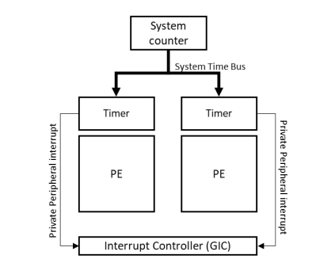
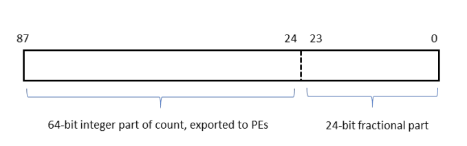
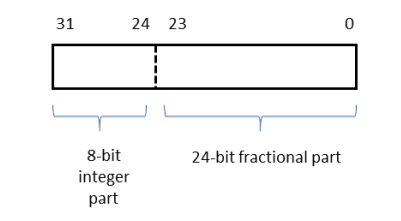
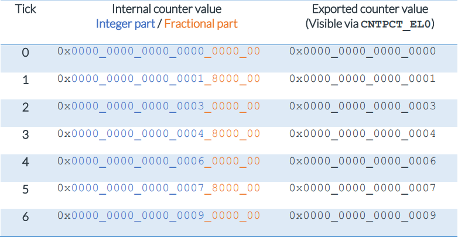

# 1. System Counter

在`What is the Generic Timer`中，我们介绍了系统计数器。
系统计数器会产生系统计数值，用来分配给系统中所有核心。如下图所示：

所以`SoC`的实现者负责系统计数器的设计。
通常，当系统启动时，系统对系统计数器做一些初始化。
Arm为系统计数器提供了寄存器接口，但是你应该参照Soc实现的详细信息。

`physical system count value`会广播到所有的`core`。这意味着所有`core`都共享相同的时间视图。
请考虑以下示例：
- `Device A`读取`current system count`并添加到消息中作为`timestamp`，然后将消息发送到`Device B`。
- `Device B`接收到消息时，它将`timestamp`与`current system count`进行比较。

在本示例中，`Device B`看到的`system count value`永远不能早于消息中的时间戳。

系统计数器`System Counter`是实时度量。
这意味着，它不会受到电源管理技术的影响，如`Dynamic Voltage and Frequency Scaling (DVFS)`或将核心置于`lower power state`。
这个计数必须在其固定频率上自增。
在实践中，这要求系统计数器处于`always-on`的电源域。

为了节能，系统计数器可以改变它更新计数的频率。
例如，系统计数器可以在时钟的每10个`tick`，更新一次该计数。
当连接的`PE`都处于低功耗状态时，这可能是有用的。
系统技术仍然需要反映时间的流逝，但是可以通过更少的广播更新计数器的次数，以节省电力。

## 1.1 Counter scaling

在Armv8.4-A中引入了`scale the system count`。 计数不会在时钟的每一个`tick`上增加一个，而是可以增加`X`，其中`X`是在系统初始化期间由软件配置的。

为了支持缩放，系统计数器将计数器值扩展到`88 bit`，如下图所示：

`count`表示为`88 bit`定点数，整数部分为`64bit`，小数部分为`24bit`。
该`count`的整数部分是`CNTPCT_EL0`在已连接的`PE`上报告的内容。
小部分由系统计数器在内部使用。

`increment`来自`CNTSCR`的32位寄存器，其格式如下所示：

`increment`值是被分为`8bit`的整数部分和`24bit`的分数部分。

当启用缩放时，在每个时钟滴答上累加`CNTSCR`寄存器的值。
例如，如果`CNTSCR`寄存器设置为`0x0180_0000`，则意味着每个`tick`上的计数将增加`1.5`（整数部分`0x01`，分数部分`0x80_0000`）。具体情况如下表所示：

只有在`disbale System Counter`时才能配置缩放。
如果在`enable System Counter`时，`disbale/enable`缩放或调整缩放`factor`，可能导致返回未知计数值。

## 1.2 Basic Programming

本节中的，假设`System Counter`是Arm推荐实现的寄存器接口。

系统计数器提供两个寄存器`(frames)`：`CNTControlBase`和`CNTReadBase`。

寄存器帧`CNTControlBase`用于配置系统计数器，并且仅在支持`TrustZone`的`Secure OS`访问。

此帧中的寄存器如下表所示：

Register | Description
---|---
CNTCR | 控制寄存器，包括：  - `enable`计数器  - `enable`计数器缩放  - 更新频率选择  - `Halt-on-debug`控制。当调试器请求时，停止计数器的递增。
CNTSCR | 使用缩放时的增量值(Armv8.4-A或更高版本)。
CNTID | ID寄存器，报告哪些`feature`被实现。
CNTSR | 状态寄存器。报告计时器是运行还是停止。
CNTCV | 报告当前计数值。仅返回计数的整数部分。
CNTFID<n> | 报告可用的更新频率。

要启用系统计数器，软件必须选择更新频率(`frequency`)并`enable`计数器。

`CNTReadBase`是`CNTControlBase`的副本，它只包括`CNTCV`寄存器。
这意味着，`CNTReadBase`只报告当前的系统计数值。
然而，与`CNTControlBase`不同，`CNTReadBase`是`Non-secure`可访问的。
这意味着，`Non-secure`软件可以读取当前计数，但不能以其他方式配置系统计数器。