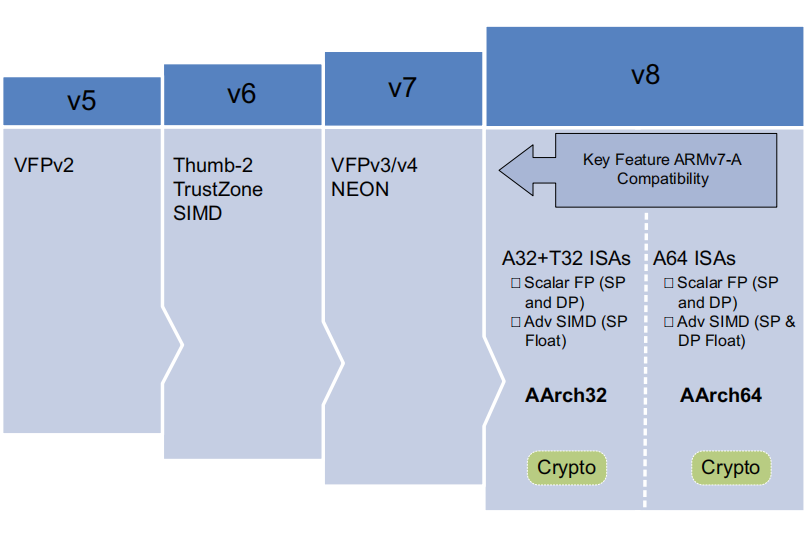
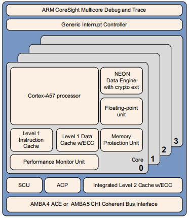

<!-- TOC -->

- [1. 概述](#1-概述)
- [2. ARMv8-A体系结构](#2-armv8-a体系结构)
- [3. ARMv8-A处理器特性](#3-armv8-a处理器特性)
    - [3.1 ARMv8-A体系结构构的SOC](#31-armv8-a体系结构构的soc)
        - [3.1.1 Cortex-A53 processor](#311-cortex-a53-processor)
        - [3.1.2 Cortex-A57 processor](#312-cortex-a57-processor)

<!-- /TOC -->

# 1. 概述

ARM体系结构可以追溯到1985年，但它不是一尘不变的。 
相反，自早期ARM核心以来，它已经大规模发展，在发展过程中增加了新功能和新特性：

- ARMv4
    - 这些早期处理器只使用ARM 32位指令集。
- ARMv4T
    - ARMv4T架构将Thumb 16位指令集添加到ARM 32位指令集。 这是第一个获得广泛许可的架构。
- ARMv5TE
    - ARMv5TE体系结构增加了DSP、饱和算法以及改进ARM和Thumb的互通性。
- ARMv6
    - ARMv6做了几个改进，包括支持不对齐的内存访问、对内存体系结构的重大更改和多处理器支持。此外，还包括对32位寄存器中的字节或半字操作的SIMD操作的一些支持。ARMv6体系结构还提供了一些可选扩展，特别是Thumb-2和TrustZone。Thumb-2将Thumb扩展为16位和32位指令集的混合长度。
- ARMv7-A
    - ARMv7-A体系结构使Thumb-2扩展成为强制性的，并添加了高级SIMD扩展 (NEON)。 在ARMv7之前，所有核基本上都符合相同的体系结构或特征集。为了帮助解决越来越多的不同应用，ARM引入了一套体系结构配置文件：
        - ARMv7-A提供支持Linux等平台操作系统所需的所有功能。
        - ARMv7-R提供可预测的实时性、高性能。
        - ARMv7-M是针对嵌入式微控制器。

# 2. ARMv8-A体系结构

ARMv8-A体系结构是针对应用程序配置文件的最新一代ARM体系结构。 命名为ARMv8用于描述整个体系结构，它包括32位执行环境和64位执行环境。 它引入了64位宽寄存器支持64位程序，同时保持与现有ARMv7软件的向后兼容性。

ARMv8-A体系结构带来了许多变化，使得能够设计出更高性能的处理器：

- 巨大的物理地址
    - 这使得处理器能够访问超过4GB的物理内存。
- 64位虚拟地址
    - 这使得虚拟内存能够超过4GB的限制。 这对于使用内存映射文件I/O或稀疏寻址的现代桌面和服务器软件非常重要。
- 自动事件信号
    - 这使得高效、高性能的spinlock成为可能。
- 大量的的寄存器文件
    - 31个64位通用寄存器提高性能，减少堆栈使用。
- 较大的PC相对地址范围
    - +/-4GB寻址范围，用于共享库和位置无关的可执行文件中的有效数据寻址。
- 增加16KB和64KB的翻译力度
    - 这减少了翻译Lookaside缓冲器(TLB)的未命中率和页表查找的深度。
- 新异常模型
    - 这降低了操作系统和Hypervisor软件的复杂性。
- 高效的缓存管理
    - 用户空间缓存操作，提高动态代码生成效率。使用`Data Cache Zero`指令快速清除数据缓存。
- 硬件加速密码学
    - 能够让软件加密性能速度提升3 ~ 10倍。 这对于较小数据的解密和加密，无法有效地卸载到硬件加速器，例如https应用场景。
- Load-Acquire, Store-Release指令
    - 专为C++11，C11，Java内存模型设计。它们通过消除显式内存屏障指令来提高线程安全代码的性能。
- NEON双精度浮点高级SIMD
    - 这使得SIMD向量化能够应用于更广泛的算法，例如科学计算、高性能计算（HPC）和超级计算机。

# 3. ARMv8-A处理器特性

下标展示了支持ARMv8-A体系结构的两款ARM处理器的特性对比：

 \ | Cortex-A53 | Cortex-A57
---|---|---
发布时间 | 2014年7月 | 2015年1月
典型时钟频率 | 2GHz/28nm工艺 | 1.5 ~ 2.5GHz/20nm工艺
执行序 | 顺序 | 乱序，超标量
核心数 | 1 ~ 4 | 1 ~ 4
整数吞吐量的峰值 | 2.3MIPS/Mhz | 4.1 ~ 4.6 MIPS/MHz
半精度浮点数 | 是 | 是
硬件除法 | 是 | 是
混合乘积累加运算 | 是 | 是 
流水线阶段 | 8 | 15+
返回栈入口 | 4 | 8
通用中断控制器 | 外部 | 外部
AMBA接口 | 64bit I/F AMBA 4 | 128bit I/F ARMA4
L1 指令缓存容量 | 8KB ~ 64KB | 48KB
L1 指令缓存结构 | 2路组关联 | 3路组关联
L1 数据缓存容量 | 8KB ~ 64KB | 32KB
L1 数据缓存结构 | 4路组关联 | 2路组关联
L2 缓存实现 | 可选 | 整合
L2 缓存容量 | 128KB ~ 2MB | 512KB ~ 2MB
L2 缓存结构 | 16路组关联 | 16路组关联
Main TLB条目 | 512 | 1024
uTLB条目 | 10 | 48I-side + 32D-side

## 3.1 ARMv8-A体系结构构的SOC

本节描述实现ARMv8-A体系结构的每个处理器，都给出一般情况的描述，不关注每个处理器的具体实现。

### 3.1.1 Cortex-A53 processor

Cortex-A53处理器是一个中档、低功耗的处理器，在一个集群中有一到四个核，每个核都有独立的L1缓存子系统、一个可选的集成GICv3/4接口和一个可选的L2缓存控制器。 

Cortex-A53处理器是一种注重功耗的处理器，它能支持32位和64位代码。 它比非常成功的Cortex-A7处理器提供了更高的性能。 它能够作为独立的应用程序处理器进行部署，或者与Cortex-A57处理器组成大小核。 以达到最佳性能、可伸缩性和电源功耗的目的。

Cortex-A53处理器具有以下特点：

- 顺序发射，8级流水线 
- 使用分层时钟门控、功率域用来降低功耗 
- 提供双指令解码与双指令执行资源
- 功耗优化的L2缓存设计提供了较低的延迟和平衡性能与效率

### 3.1.2 Cortex-A57 processor

Cortex-A57处理器针对移动和企业计算应用程序，包括计算密集型的64位应用程序，如高端计算机、平板电脑和服务器产品。 它可以与Cortex-A53处理器组成大小核的形式。Cortex-A57处理器具有与其他处理器的缓存一致性互操作性，包括用于GPU计算的ARM Mali™图形处理单元系列(GPU)，并为高性能企业应用程序提供可选的可靠性和可伸缩性。 它提供了比ARMv7 Cortex-A15处理器更高的性能。加密扩展的加入使加密算法的相关指令性能比上一代处理器提高了10倍。

Cortex-A57处理器完全实现了ARMv8-A架构。它支持多核，在一个集群4个核和与1个核之间处理。多个SMP簇使用AMBA5 CHI或ARMBA 4 ACE技术互联。

Cortex-A57处理器具有以下特点：
- 乱序发射，15级流水线
- 电源优化的分支预测、标签减少和缓存查找
- 功耗优化指令3路解码，双路执行资源增加峰值指令吞吐量
- 性能优化的L2缓存设计使集群中的多个核心能够同时访问L2