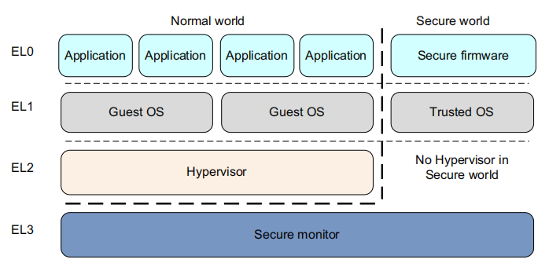
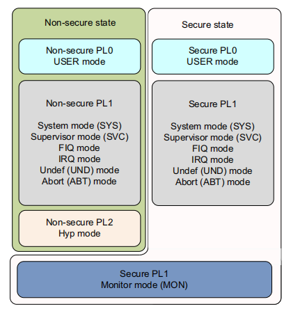
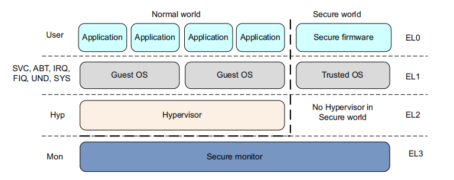
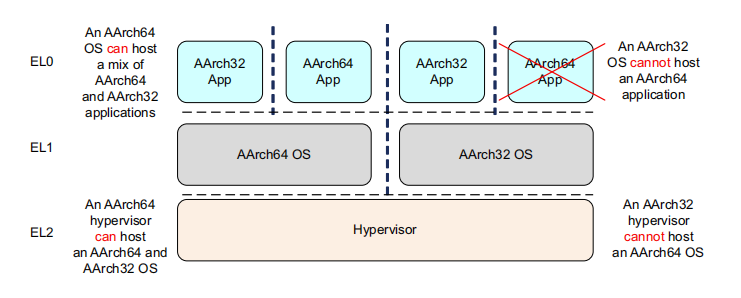

<!-- TOC -->

- [1. 异常级别](#1-异常级别)
- [2. 执行状态](#2-执行状态)
- [3. 切换异常级别](#3-切换异常级别)
- [4. 切换执行状态](#4-切换执行状态)

<!-- /TOC -->
# 1. 异常级别

在ARMv8中，程序执行在四个异常级`(EL0 ~ EL3)`里的其中之一。在AArch64中，异常级类似于ARMv7中定义的特权级的方式用来确定特权级。

异常级决定特权级，因此在ELn上的执行对应于特权PLn。

> n值越大异常级越高。

异常级别提供了适用于ARMv8体系结构所有`操作状态`的`软件执行特权`的逻辑分离:
- LE0：Normal user applications
- LE1：GuestOS Kernel
- LE2：Hypervisor
- EL3: Low-level firmware, including the `Secure Monitor`.

ARMv8提供2种安全状态即安全与非安全。非安全状态也被称为`Normal World`，安全状态也被称为`Secure World`。

这使得`操作系统`能够在同一硬件上与`可信操作系统`并行运行，并提供对某些软件攻击和硬件攻击的保护。ARM `TrustZone`技术可以让`Normal World`与`Secure World`相互隔离，与ARMv7-A体系结构一样，`Secure monitor`是`Normal World`切换到`Secure World`的必经之路`gate`。

ARMv8-A也为虚拟化提供支持，仅仅在`Normal World`中提供支持。 
这意味着`Hypervisor`或`Virtual Machine Manager(VMM)`代码可以在系统上运行，并托管多个`Guest OS`。 
每个`Guest OS`基本上都运行在虚拟机上。它可以与hypervisor或其他的Guest OS分时复用硬件资源。

`Normal World`具有以下特权组件:
- Guest OS kernel：Linux或windows都运行在`Non-secure EL1`。
- Hypervisor：运行在`Non-secure EL2`。

`Secure World`具有以下特权组件：
- Secure firmware：在应用处理器上，它必须是启动时第一个运行的。它提供来多种服务，包括`平台初始化`、部署`Trusted OS`与`secure monitor`调用的转发。
- Trusted OS：提供给`Normal world`一个安全的运行环境去运行可信的应用程序。

# 2. 执行状态

ARMv8体系结构定义了两个执行状态：
- AArch64：`64-bit wide general-purpose registers`
- AArch32：`32-bit wide general-purpose registers`

虽然ARMv8 AArch32保留了ARMv7的特权级定义，**但在AAch64中，特权级由异常级决定**。因此，Eln对应于PLn。

- 当处于AArch64执行状态时：
    - 处理器执行`A64`指令集
- 当处于AArch32执行状态时：
    - 处理器执行`A32`（在体系结构的早期版本中称为ARM）
    - 处理器执行`T32`（Thumb）指令集

# 3. 切换异常级别

在ARMv7体系结构中，处理器模式可以在特权软件控制下更改，或者当任务发生异常时自动更改。让异常发生时，核心保存当前执行状态和返回地址后，进入所需模式，可能会禁用硬件中断。

AArch32 处理器执行状态：

异常级别之间的切换遵循这些规则：
- 只能切换到更高的异常级别，例如从EL0到EL1，表示增加了软件执行权限。
- 异常不能切换到低于当前的异常级别的异常级别。
- 在EL0级没有异常处理，异常必须在更高的异常级别去处理。
- 异常导致程序流程的更改。异常处理程序的执行从一个定义的异常向量开始，该向量的异常级别高于EL0。异常包括：
    - 中断（例如IRQ与FIQ）
    - 内存系统终止
    - 未定义指令
    - 系统调用
    - `Secure Monitor`或`Hypervisor`陷入。
- 结束异常处理并返回到以前的异常级别是通过执行`ERET`指令来完成的。
- 从异常返回可以保持在相同的异常级别或进入较低的异常级别。 它不能移动到更高的异常级别。
- 安全状态不随着异常级别的变化而变化，除非从EL3切换到非安全状态。
 
# 4. 切换执行状态

有时您必须更改系统的执行状态。 例如，如果您正64位操作系统上希望在EL0上运行32位应用程序。为此，系统必须更改为AArch32。当应用程序完成或执行返回到OS时，系统在切换回AArch64。 

> 注意： 一个AArch32操作系统不能承载64位应用程序。

若要在相同异常级别的执行状态之间更改，必须切换到更高的异常级别，然后返回到原始异常级别。 例如，您可能有32位和64位应用程序在64位操作系统下运行。 在这种情况下，32位应用程序可以执行`Supervisor Call (SVC)`指令，导致切换到EL1和AArch64。 然后操作系统可以在AArch64中切换`执行状态`并返回到EL0。 实际上，这意味着您不能有一个混合的32位和64位应用程序，因为它们之间没有直接的调用方式。

> 只能通过切换异常级别来切换执行状态，在EL3的代码不能将异常切还到更高的异常级别，因此不能更改执行状态，除非通过重置。

