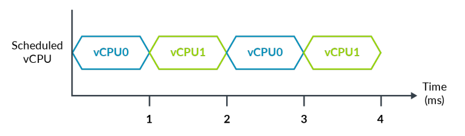
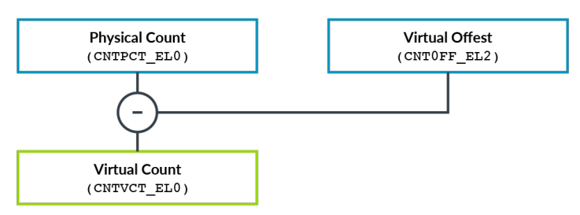

# Virtualizing the Generic Timers

ARM体系结构包含`Generic Timer`，每个`processor`中都有一组标准的`timers`。
`Generic Timer`是由一组`comparators`组成，这些`comparators`与`common system count`进行比较。
`comparators`的值等于或者小于`system count`时，`comparators`会产生中断。
下图显示，我们可以看到系统中`Generic Timer`（橙色部分）`comparators`组件与`counter module`。

下图显示一个例子，`hypervisor`调度两个`vCPU`：

> 在这个例子中，我们忽略`vCPU`之间的`context switch`产生的`overhead`。

经过`4ms`的物理时间或者`wall-clock time`，每个`vCPU`已经运行`2ms`。

你是否希望`2ms`的`virtual time`之后（vCPU所经历的时间）中断，还是`2ms`的`wall-clock time`之后中断？
Arm架构提供了同时使用这两种功能的能力，具体取决于所使用的虚拟化功能。让我们看看它是如何做到的。

软件运行在`vCPU`上可以访问两个`timers`：
- `EL1 Physical Timer`
- `EL1 Virtual Timer`

`EL1 Physical Timer`与`system counter module`产生的计数作比较。该`timer`提供`wall-clock time`。
`EL1 Virtual Timer`与`virtual count`做比较。这个`virtual count`是`physical count`减去一个`Virtual Offset`得到的。

`hypervisor`在寄存器中指定当前调度的vCPU的偏移量。这使得它隐藏掉未被调度与运行的`vCPU`流逝的时间。

为了说明这个概念，我们可以扩展前面的例子，如下图所示：

在`6ms`的时间内，每个`vCPU`可以运行`3ms`。`hypervisor`可以使用`virtual offset`寄存器来提供一个`virtual count`，该`virtual count`仅显示`vCPU`的运行时间。
或者`hypervisor`可以保持`virtual offset`为`0`，这意味着`virtual time`与`physical time`相同。

> 示例中`System Count`的`frequency`为`1ms`。实际上，这个频率是不太可能的。推荐`System Count`设置为使用`1MHz`到`50Mhz`之间的频率。
