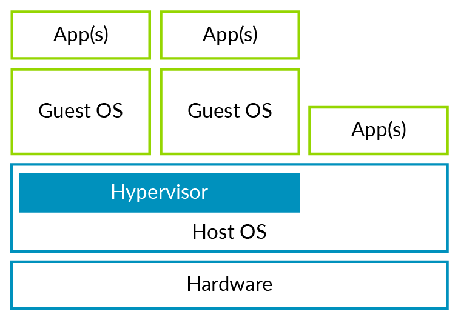
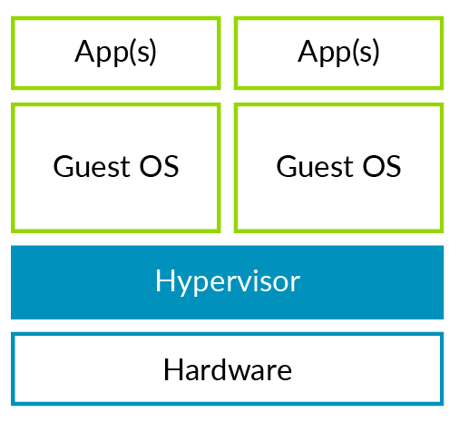
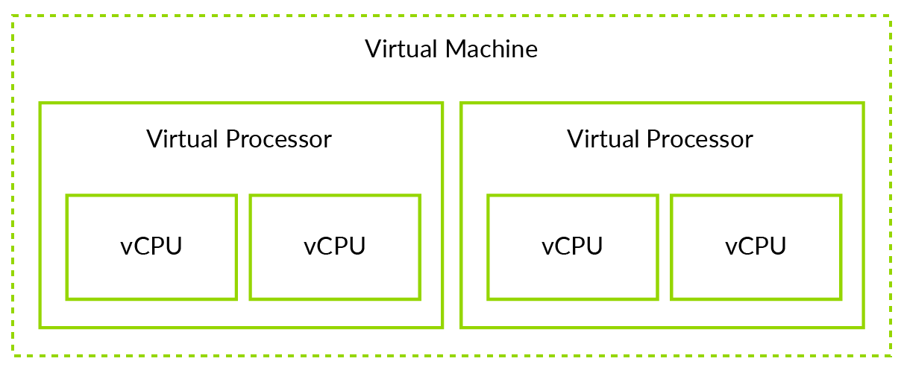
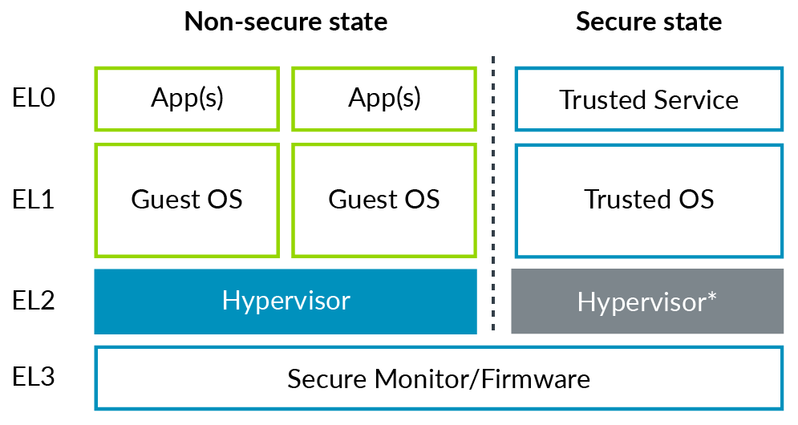

# 1. Introduction to virtualization

## 1.1 Why is virtualization important?

虚拟化是一种广泛使用的技术，几乎所有的现代云计算和企业基础设施都使用该技术。

虚拟化在服务器系统中很普及，支持虚拟化是大多数服务器级的需求。这是因为虚拟化为数据中心提供了非常理想的特性，包括:
- `Isolation`：虚拟化提供了运行在单个物理系统上的虚拟机之间的隔离，这种隔离允许相互不信任的计算环境之间共享物理系统。
- `High Availability`：虚拟化允许在物理机器之间无缝和透明地迁移工作负载，这种技术通常用于将工作负载从可能需要维护和更换的故障硬件平台迁移出去。
- `Workload balancing`：为了优化数据中心的硬件和功耗预算，尽可能多地使用各个硬件资源是很重要的。同样，这可以通过迁移虚拟机或在物理机器上共同托管合适的工作负载来实现。这为数据中心提供商提供了最佳的电力预算，为租户提供了最佳的性能。
- `Sandboxing`：虚拟机可以用于为可能干扰其运行的其他机器的应用程序提供沙箱。在虚拟机中运行这些应用程序，可以防止应用程序的bug或恶意部分干扰物理机上的其他应用程序或数据。

## 1.2 Standalone and hosted hypervisors

`Hypervisor`大致可以分为两类：
- `standalone`又称`Type 1`
- `hosted`又称`Type 2`

首先我们先来看`Type 2 hypervisor`，在`Type 2 hypervisor`结构中，`Host OS`完全控制硬件平台及其所有资源，包括`CPU`与`physical memory`。
如下图所示：

例如像`Virtual Box`或`VMware Workstation`这些软件都是这种类型的`hypervisor`。

平台已安装了一个操作系统，我们称该操作系统为`Host OS`，`hypervisor`在`Host OS`上运行，利用现有的功能来管理硬件资源。
`Host OS`上运行的虚拟机中的操作系统，我们称为`Guest OS`。

接下来我们来看`Type 1 hypervisor`，如下图所示：

你可以看到这种`hypervisor`设计中没有`Host OS`。hypervisor直接在硬件上运行，并完全控制硬件平台以及所有资源，包括`CPU`与`physical memory`。与`Type 2 hypervisor`一样，`Type 1 hypervisor`也可以运行一个或多个虚拟机。每个虚拟机都可以运行完整的`Guest OS`。

Arm平台上最主流的两个开源`hypervisor`是：`Xen(standalone,Type1)`与`KVM(hosted, Type2)`。

## 1.3 Full virtualization and para-virtualization

`VM`的经典定义是一个独立的、隔离的计算环境，它与真是的物理机器无法区分。
尽管在基于arm的系统上完全模拟真实的机器是可能的，但这通常不是高效的。因此，这种模拟并不常见。
例如，模拟真实的以太网设备很慢，因为`Guest OS`每次对模拟寄存器的访问都必须由hypervisor来处理。
这种处理比访问物理设备上的寄存器要昂贵得多。

通常用于提高性能的一种首选方案是**enlighten**`Guest OS`。让`Guest OS`知道它正在VM中运行。 `hypervisor`与`GuestOS`设计具有良好性能的虚拟设备用于模拟。

严格地说，全系统虚拟化模拟一个真是的物理机器。Xen项目推广了半虚拟化，其中`Guest OS`被修改为在虚拟硬件平台上运行，
而不是在物理机器上运行。也是用这种方式提供性能。

现在，在大多数具有硬件支持的虚拟化架构上，`Guest OS`基本上不需要修改就可以运行的。`Guest OS`认为它运行在真实的硬件上，
除了用于`block storage`和`network`等I/O外设，这些都是用半虚拟化设备和设备驱动。这种半虚拟化I/O设备的例子是`VirtIO`与`Xen PV Bus`。

## 1.4 Virtual machines and virtual CPUs

理解`Virtual Machine(VM)`与`Virtual CPU(vCPU)`的区别非常重要。
一个`VM`可以包含一个或多个`vCPU`，如下图所示：

例如，`hypervisor`分配一个内存页面给VM，因此VM中的所有vcpu都可以访问这个内存页面。

注意：严格地说，我们应该称`Virtual Processing Elemnt(vPE)`而不是`vCPU`。PE是Arm体系结构的通用术语。
本系列文章使用vCPU而不是vPE，是因为vCPU是大多数人都熟悉的术语。当然，在体系结构规范中，使用了术语`vPE`。

> 在本系列文章中，我们使用术语`hypervisor`表示一个软件，它负责创建、管理、调度多个`Virtual Machine`。

# 2. Virtualization in AArch64

`hypervisor`运行在EL2或更高的异常级别后才可以控制虚拟化的各种功能：
- `Stage 2 translation` 
- `EL1/0 instruction` and `register access trapping`
- `Virtual exception generation`

`Non-Secure`与`Secure`的`Exception Levels (ELs)`，如下图所示：

在图中，`Secure El2`用灰色表示是因为在`Secure`下对EL2的支持并不总是可用的。
这将在`Secure virtualization`章节中讨论。

在架构中还有一些特性支持：
- `Secure virtualization`
- `Hosted, or Type 2, hypervisors`
- `Nested virtualization`
