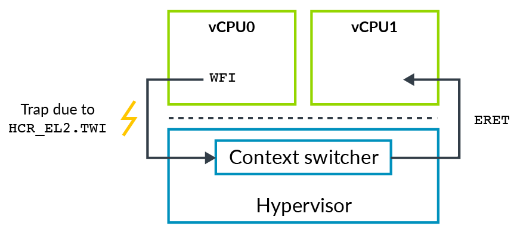
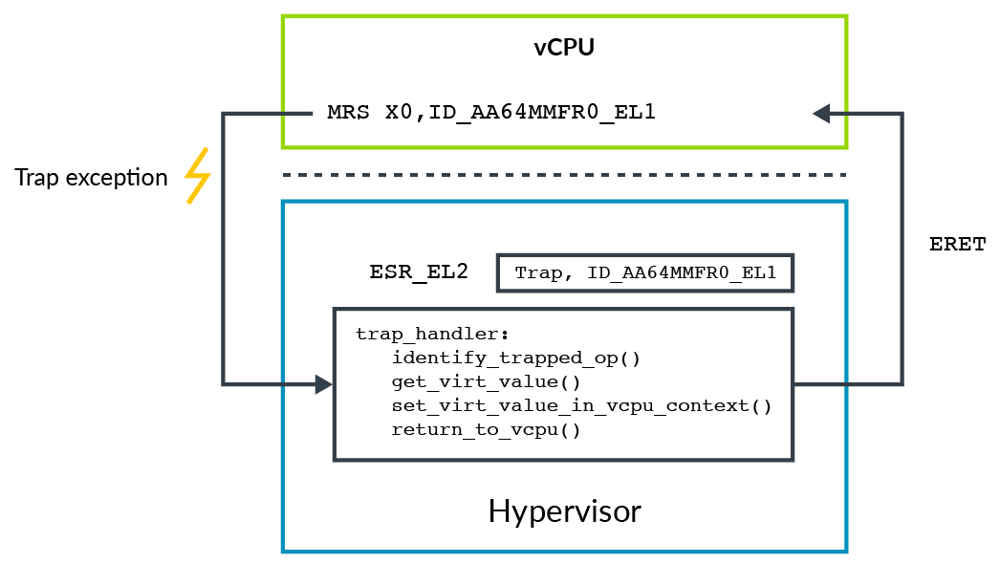

# 1. Trapping and emulation of instructions

有时，`hypervisor`需要模拟`Virtual Machine(VM)`的操作。
例如，`VM`软件可能试图配置像`power management`或`cache coherency`等与处理器相关的功能。
通常，你不想让`VM`直接访问这些控制功能，因为它们可能破坏`isolation`或者影响系统中其他的`VM`。

ARM体系结构提供`trap`的控制，用于捕获`VM`中的操作并`emulate`它们。
当设置好`trap`后，执行特定的动作会导致`exception`切换到较高的`exception level`。
`hypervisor`可以使用这些`trap`去`emulate`虚拟机中的操作。

例如，执行`Wait For Interrupt(WFI)`这条指令后CPU会进入低功耗状态。
通过`TWI`位判断，如果`HCR_EL2.TWI==1`，则在`EL0`或`EL1`将导致异常并陷入`EL2`。

> `Traps`不仅仅用于虚拟化技术中，还有`EL3`和`EL1`控制的`Traps`，但本系列文章仅讨论与虚拟化相关的`traps`。

在我们的`WFI`例子中，`OS`通常会执行`WFI`作为`idle loop`的一部分。
在`VM`中`Guest OS`使用这个指令时，`hypervisor`可以`trap`这个操作并`schedule`到不同的`vCPU`，如图所示：

## 1.1 Presenting virtual values of registers

另外一个例子，说明如何使用`trap`呈现`virtual values of register`。
例如，`ID_AA64MMFR0_EL1`用来报告这个处理器与`memory system`有关的`features`。
一个操作系统，在引导部分可能读取该寄存器明确`Kernel`要`enable`哪些`features`。
`Hypervisor`可能希望向`Guest OS`呈现一个不同的值，称为`virtual value`。

为此，`hypervisor`通过`enable trap`，当读取这个寄存器时，会导致陷入。
在`trap execption`上，`hypervisor`明确知道触发了那个`trap`，然后`emulate`该操作。
在这个例子中，`hypervisor`使用`ID_AA64MMFR0_EL1`的`virtual value`来填充目标寄存器，如图所示：

`Traps`也可以用作`lazy context switch`的一部分。例如，操作系统通常会在启动过程中，通过配置`TTBR<n>_EL1, TCR_EL1 and MAIR_EL1`寄存器来初始化`Memory Management Unit (MMU)`，然后将不会在对其进行重新设置。
`hypervisor`可以优化`context switch routine`，仅恢复`context switch`其他相关寄存器，但不保存它们。

但是，在一些特殊情况下操作系统可能会在引导后重新设置这些寄存器。
为了避免这种情况引发的相关问题，`hypervisor`可以设置`HCR_EL2.TVM`的`trap`。
该设置导致任何写入与`MMU`相关的寄存器都会陷入到`EL2`，从而使`hypervisor`能够检测到是否需要更新其保存的那些寄存器的副本。

> ARM体系结构使用术语`trapping`与`routing`，概括地说，当执行特定的操作（例如读取寄存器）时，`trapping`会导致异常，`routing`是指在产生异常后将其带到的异常级别。

## 1.2 MIDR and MPIDR

使用`Trap`机制虚拟化需要大量的计算资源，该操作生成`EL2 trap exception`，`hypervisor`明确所需要的操作并对其进行`emulate`，然后返回到`Guest`。`Feature registers`，像`ID_AA64MMFR0_EL1`这样的寄存器，操作系统不会频繁访问它。
这意味着`trap`这些寄存器的访问，`Hypervisor`去模拟这个读操作，这种计算成本是可以接受的。

对于更频繁访问的寄存器，或在性能关键的代码中，你希望避免这种`compute load`。
这些寄存器及其值的例子包括：
- `MIDR_EL1`：处理器的类型，例如：`Cortex-A53`。
- `MPIDR_EL1`：亲和性，例如：`core 1 of processor 2`。

`hypervisor`可能希望`Guest OS`这些寄存器看到的是`virtual values`，而不必捕获每个单独的访问。
对于这些寄存器，ARM习题结构提供了`Trapping`的代替方案：
- `VPIDR_EL2`： 这是`EL1`读取`MIDR_EL1`的返回值。
- `VMPIDR_EL2`：这是`EL1`读取`MPIDR_EL1`的返回值。

`hypervisor`可以在进入`VM`之前设置这些寄存器。
如果`VM`中的软件读`MIDR_EL1`或`MPIDR_EL1`寄存器，硬件会自动返回`virtual value`，而不需要`Trap`。

> `VMPIDR_EL2`与`VPIDR_EL2`没有定义`reset values`。在第一次进入EL1之前，必须通过启动代码初始化它们。在`bare matal environments`特别重要。
