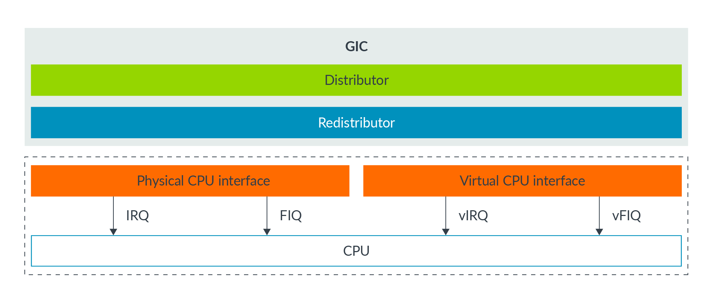
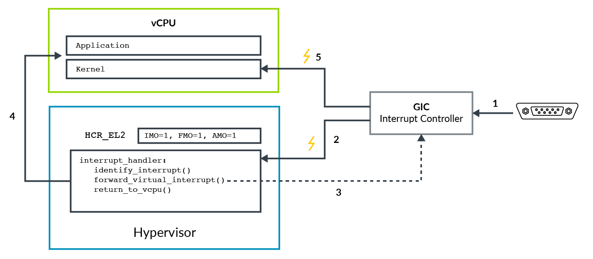

# 1. Virtualizing exceptions

在系统中`hardware`使用中断向软件发送`singal events`。例如，当`GPU`完成`frame`的渲染后，会发出一个中断信号。

使用虚拟化的系统变得更为复杂。有些中断需要`hypervisor`自身处理。有些中断可能来自分配给`Virtual Machine(VM)`的设备，并且需要由`VM`中的软件处理。此外，负责中断处理的`VM`在接收到中断信号时并一定在运行。

这意味着需要一个机制来支持`hypervisor`在EL2中处理中断；还需要一个机制来将其他中断`forward`到特定的`VM`中，或特定`VM`的`vCPU`中。

为了支持上述机制，arm系结构包括对虚拟中断的支持：`vIRQ`，`vFIQ`，和`vSErrors`。
这些`virtual interrupts`与它们的物理中断`IRQS`，`FIQS`，和`SErros`行为类似，但只能在`EL0`和`EL1`中执行时发出。在`EL2`或`EL3`中执行时无法接收`virtual interrupts`。

## 1.1 Enabling virtual interrupts

发送`virtual interrupts`到`EL0`或`EL1`，`hypervisor`必须在`HCR_EL2`寄存器中设置对应的`routing bit`。
例如，要开启`vIRQ`信号的发送，`hypervisor`必须设置`HCR_EL2.IMO`，将`physical IRQ exceptions`路由到`EL2`，并`enable`向`EL1`发送`virtual interrupts`信号。

`virtual interrupts`是按照`interrupt type`控制的。理论上，`VM`可以配置同时接收`physical FIRQs`与`virutal IRQs`。在实践中不会这样。`VM`通常只被配置为接收`virtual interrupts`。

## 1.2 Generating virtual interrupts

产生`virtual interrupts`有两种机制：
- core内部，使用`HCR_EL2`控制。
- 使用`GICv2`，或更高的`interrupt controller`。

我们从第一种机制开始学习。`HCR_EL2`中有三个控制位，控制`virtual interrupt`的产生：
- `VI`：`Virtual IRQ Interrupt`
- `VF`：`Virtual FIQ Interrupt`
- `VSE`：`Virtual SError interrupt`

设`1`这些位的效果，相当于中断控制器将中断信号声明交给`vCPU`。就像常规中断一样，生成的虚拟中断也会受到`PSTATE`屏蔽。

这种机制使用简单，但缺点是它仅提供生成`interrupt itself`本身。而`hypervisor`需要模拟在`VM`中`interrupt controller`的操作。
简单讲，软件中的`trapping`和`emulating`操作涉及开销，对于频繁的操作（如中断），最好避免这种开销。

第二种选择是使用Arm的`Generic Interrupt Controller (GIC)`生成虚拟中断。
Arm GICv2，通过`physical CPU interface`与`virtual CPU interface`中断控制器`GIC`可以发送`physical interrupts`与`virtual interrupts`两种中断信号，如下图所示：

这两个`interface`基本相同，不同的是`physical CPU interface`发送`physical interrupts`信号，而`virtual CPU interface`则发送`virtual interrupts`信号。
`hypervisor`可以映射`virtual CPU interface`到一个`VM`，允许VM中的软件直接与GIC通信。
这种方法的优势是`hypervisor`只需要设置`virtual interface`，而不需要模拟它。
这种方法减少了执行过程中`trap`到`EL2`的次数，从而减少了虚拟化中断的开销。

> 虽然Arm `GICv2`可以与Armv8-A设计一起使用，但更常见的是看到使用了`GICv3`或`GICv4`。

## 1.3 Example of forwarding an interrupt to a vCPU

到目前为止，我们已经讨论了如何`enable virtual interrupts`与`generated virtual interrupts`。
接下来我们看一个将`virtual interrupt`转发到`vCPU`的例子。
在这个例子中，我们考虑已经分给`VM`的`physical peripheral`，如下图所示：

图中说明这些步骤：
1. 让`physical peripheral`将`interrupt signal`发送给`GIC`。
2. `GIC`产生一个`physical interrupt exception`，无论是`IRQ`或`FIQ`，它们都通过`HCR_EL2.IMO/FMO`的配置路由到`EL2`。
`hypervisor`通过标识确定它将`physical peripheral`分配给`VM`。它检查中断应该转发给哪个`vCPU`。
3. `hypervisor`配置GIC，将`physical interrupt`作为`virtual interrupt`转发给`vCPU`。然后`GIC`将断言`vIRQ`或`vFIQ`信号，但处理器在`EL2`中执行时忽略此信号。
4. `hypervisor`将控制权还给`vCPU`。
5. 处理器在`vCPU(EL0 or EL1)`时，可以取得来自`GIC`的`virtual interrupt`。这个`virtual interrupt`接受`PSTATE exception`掩码的约束。

这个例子展示了将`physical interrupt` forwarded `virtual interrupt`。对于`virtual peripheral`，`hypervisor`可以创建`virtual interrupt`，而无需将其`link`到`physical interrupt`。

## 1.4 Interrupt masking and virtual interrupts

在`Exception Model`，介绍了`PSTATE`的中断掩码位，`PSTATE.I`用于`IRQs`；`PSTATE.F`用于`FIRQs`；`PSTATE.A`用于`SErrors`。在虚拟化环境中操作时，这些掩码的工作方式略有不同。

例如，对于`IRQs`，我们已经看到设置`HCR_EL2.IMO`可以完成两件事：
- 路由`physical IRQs`到`EL2`
- `Enable`来自`EL0 and EL1`发出的`vIRQs`信号

此设置还更改了应用`PSTATE.I`掩码的方式。在`EL0`和`EL1`中，如果`HCR_E2.IMO == 1`，`PSTATE.I`操作在`vIRQ`而不是`pIRQ`。