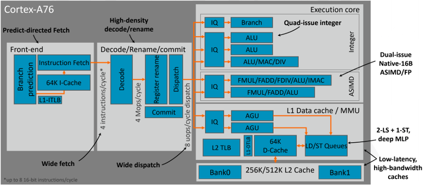

# 1. Arm SOC(Cortex-A76) µarch overview

To overly simplify it, this is a `superscalar` `out-of-order` core with a `4-wide decode` front-end with `8 execution ports` in the backend with a total implementation `pipeline depth of 13 stages` with the `execution latencies of a 11 stage` core.

# 2. Front-end

## 2.1 Brach Prediction

- Front-end built to hide latency at high bandwidth Decopled predict/fetch:
    - Deep insturction prefetch, hide taken-branch latency Multi-level branch-target caches
    - Minimize exposed latency, reduce power
    - 16/64-entry nano-/micro- Branch target buffer
    - 6K-entry main Branch target buffer

## 2.2 Instruction Fetch

- Slipped-fetch microarchitecture
    - Reduced mispredict penality in latency-critical cases
- 4 instructions/cycle fetch bandwidth
- 64KB, 4-way L1 I$ at direct-mapped power
- 48-entry, fully-associative IL1 TLB with page clustering

## 2.3 Decode/Rename/Commit

- 4 instruction/cycle, power-optimized decode
    - instruction transformation for low power
- Low-power integer/ASIMD/flag rename
    - Uop expansion to 8-wide dispatch

- Dispatch to out-of-order core and commit unit
    - 128 entry area-/power-optimized instruction window
    - Hybrid commit unit optimized for area/power
    - Optimized for low-latency OS/Hypervisor activity

# 3. Back-end

## 3.1 Execution core

- Uops dispatched to 120-entry issue queue capacity
    - 8 independent issus queues power-optimized for attached execution pipelines
- Copy-free register-management microarchitecture
- Issue-bypass for mispredict penalty reduction integer pipelines:
    - 2x simple ALU
    - 1x branch
    - 1x multi-cycle integer + simple ALU
- Dual 128-bit ASIMD/FP execution pipelines
    - Twice the bandwidth of prior Arm CPUs
- State-of-the-art latency-optimized vector execution datapaths:
    - 2-cycle FADD
    - 3-cycle FMUL
    - 4-cycle FMAC
    - Radix-64 FDIV

Backend Execution Throughput and Latency:

Case | Throughput | Latency
---|---| --
Integer Arithmetic (Add, sub) | 3 | 1
Integer Multiply 32b | 1 | 2
Integer Multiply 64b | 1 | 2
Integer Multiply Accumulate | 1 | 2
Integer Division 32b | 0.2 | <12
Integer Division 64b | 0.2 | <12
Move  (Mov) | 3 | 1
Shift ops (Lsl) |  3 | 1
Load instructions | 2 | 4
Store instructions | 2 | 1 
FP Arithmetic | 2 | 2
FP Multiply | 2 | 3
FP Multiply Accumulate | 2 | 4
FP Division (S-form) | 0.66 | 7
FP Load | 2 | 5
FP Store | 2 | 5
ASIMD Arithmetic | 2 | 2
ASIMD Multiply | 1 | 4
ASIMD Multiply Accumulate | 1 | 4
ASIMD FP Arithmetic | 2 | 2
ASIMD FP Multiply | 2 | 3
ASIMD FP Chained MAC (VMLA) | 2 | 5
ASIMD FP Fused MAC (VFMA) | 2 | 4

## 3.2 L1 data cache / MMU

Decouptled address generation and cache-lookup pipelines for optimal bandwidth.

- L1 D-Cache and L1-DTBL
    - 64KB, 4-way L1-data-cache, 4-cycle LD-use latency
    - 48-entry, fully associative L1 TLB with page clustering

- Dual 128-bit Load ports + 1 Store port
- Optimized for extreme `Memory-level parallelism` capability
    - 68 in-flight Loads, 72 in-flight Stores, 20 outstanding non-prefetch misses
- Sophisticated 4th generation prefetcher
    - Design philosophy —— prefect cache-hit operation
- 1280-entry, 5-way L2 TLB with page clustering
    - Highly out-of-order, superscalar MMU/table-walker
    - Flexible leaf/descriptor caching adapts to any size workload
    
## 3.3 Cache hierarchy

- Full cache hierarchy is co-optimized for latency and bandwidth
    - No-compromise, get the best of both worlds 64K I-Cache, 64K D-Cache with 4-cycle Load-use, 256KB-512KB private L2 with 9-cyle Load-use
    - Adapts to system latency/bandwidth characteristics
- Up to 46 outstanding misses
- 2M-4M DynamIQ L3 with 26-31 cycle Load-use
    - 94 outstanding misses with flexible prefetch placement