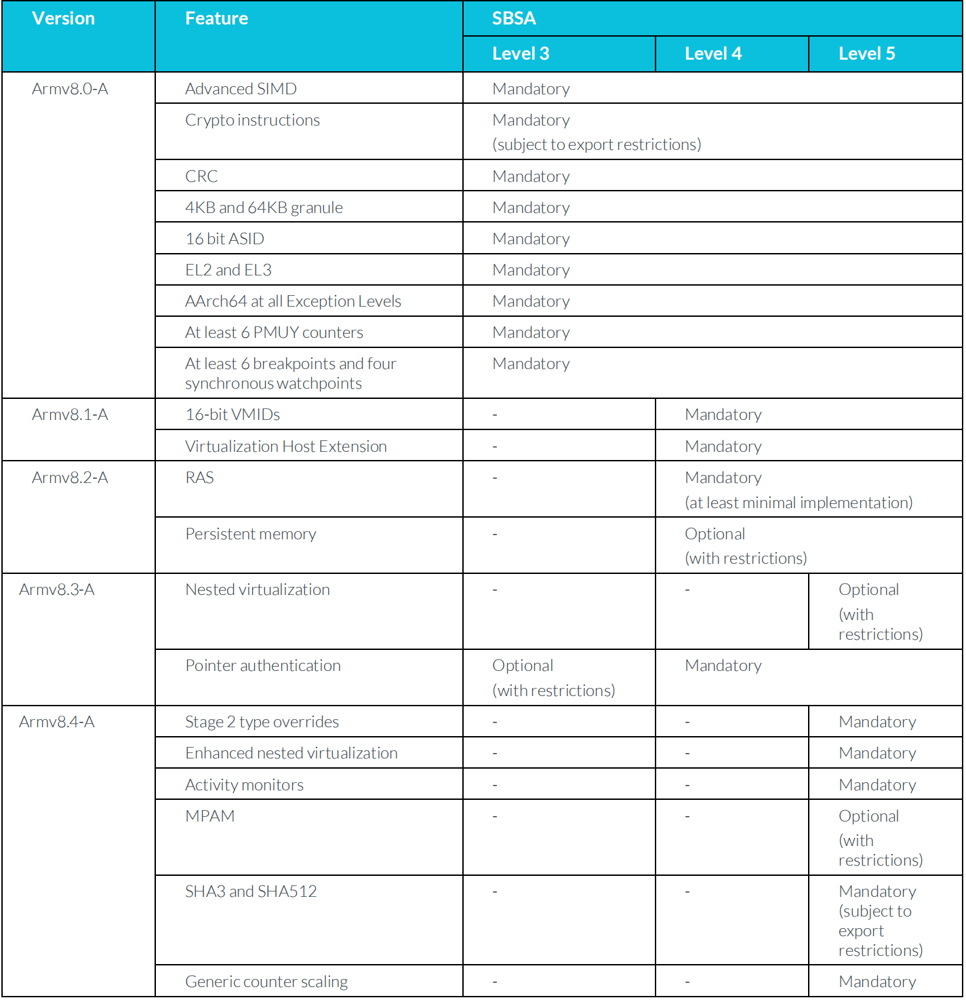

# Armv8.x extensions and features

## Armv8.1-A

- Atomic memory access instructions (AArch64)
- Limited Order regions (AArch64)
- Increased Virtual Machine Identifier (VMID) size, and Virtualization Host Extensions (AArch64)
- Privileged Access Never (PAN) (AArch32 and AArch64)

## Armv8.2-A

- Support for 52-bit addresses (AArch64)
- The ability for PEs to share Translation Lookaside Buffer (TLB) entries (AArch32 and AArch64)
- FP16 data processing instructions (AArch32 and AArch64)
- Statistical profiling (AArch64)
- Reliability Availability Serviceabilty (RAS) support becomes mandatory (AArch32 and AArch64)

## Armv8.3-A

- Pointer authentication (AArch64)
- Nested virtualization (AArch64)
- Advanced Single Instruction Multiple Data (SIMD) complex number support (AArch32 and AArch64)
- Improved JavaScript data type conversion support (AArch32 and AArch64)
- A change to the memory consistency model (AArch64)
- ID mechanism support for larger system-visible caches (AArch32 and AArch64)

## Armv8.4-A

- Secure virtualization (AArch64)
- Nested virtualization enhancements (AArch64)
- Small translation table support (AArch64)
- Relaxed alignment restrictions (AArch32 and AArch64)
- Memory Partitioning and Monitoring (MPAM) (AArch32 and AArch64)
- Additional crypto support (AArch32 and AArch64)
- Generic counter scaling (AArch32 and AArch64)
- Instructions to accelerate SHA512 and SHA3 (AArch64 only)

# Armv8.x-A and the SBSA

The `Server Base System Architecture (SBSA)`, provides `hardware requirements for servers`. 

The SBSA ensures that `operating systems`, `hypervisors` and `firmware` operate correctly. 

For servers, where a degree of `standardization is important`, the SBSA includes rules on which 
extensions to the `architecture must be implemented`.

The following table summarizes the SBSA requirements that relate to the Armv8.x-A extensions:

#  Server Base Boot Requirements (SBBR) specification

This `Server Base Boot Requirements (SBBR)` specification is intended for `SBSA-compliant 64-bit Armv8 servers`.
It defines the `base firmware requirements` for out-of-box support of any `Arm SBSA-compatible` Operating System or
`hypervisor`. The requirements in this specification are intended to be `minimal yet complete` for booting a multi-core
Armv8 server platform`, while leaving plenty of room for OEM or ODM innovations and design details.

Cross References:
- ACPI § 5.6.5 - Reference to the ACPI specification section 5.6.6
- UEFI § 6.1 - Reference to the UEFI specification section 6.1
- SMBIOS specification, version 3.2.0 or later
- PSCI 1.1 Published April 2017.

## UEFI

- UEFI System Environment and Configuration
- UEFI Boot Services
- UEFI Runtime Services
- UEFI Reset and Shutdown
- Secure and Trusted Boot
- Mandatory ACPI Tables
    - Root System Description Pointer (RSDP)
    - Extended System Description Table (XSDT)
    - Fixed ACPI Description Table (FADT)
    - Differentiated System Description Table (DSDT)
    - Secondary System Description Table (SSDT)
    - Multiple APIC Description Table (MADT)
    - Generic Timer Descriptor Table (GTDT)
    - Debug Port Table 2 (DBG2)
    - Serial Port Console Redirection (SPCR)
    - PCI Memory-mapped Configuration Space (MCFG)
    - Processor Properties Topology Table (PPTT)
- Global Methods and Objects

## SMBIOS 

- SMBIOS Base Requirements
- SMBIOS requirements on UEFI
- SMBIOS Structures
    - Type00: BIOS Information (REQUIRED)
    - Type01: System Information (REQUIRED)
    - Type02: Baseboard (or Module) Information (RECOMMENDED)
    - Type03: System Enclosure or Chassis (REQUIRED)
    - Type04: Processor Information (REQUIRED)
    - Type07: Cache Information (REQUIRED)
    - Type08: Port Connector Information (RECOMMENDED for platforms with physical
ports)
    - Type09: System Slots (REQUIRED for platforms with expansion slots)
    - Type11: OEM Strings (RECOMMENDED)
    - Type13: BIOS Language Information (RECOMMENDED)
    - Type15: System Event Log (RECOMMENDED) 
    - Type16: Physical Memory Array (REQUIRED)
    - Type17: Memory Device (REQUIRED)
    - Type19: Memory Array Mapped Address (REQUIRED)
    - Type32: System Boot Information (REQUIRED)
    - Type38: IPMI Device Information (REQUIRED for platforms with IPMIv1.0 BMC
Host Interface)
    - Type41: Onboard Devices Extended Information (RECOMMENDED)
    - Type42: Redfish Host Interface (REQUIRED for platforms supporting Redfish Host
Interface)