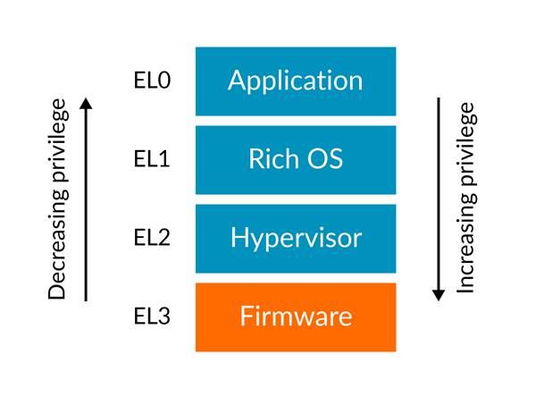

# 1. Privilege and Exception levels

在我们解释`Armv8-A exception model`的细节之前，让我们从`privilege`的概念开始介绍。
现代软件都希望分成不同的模块，每个模块对`system`和`processor resources`都用不同的`level`。
例如`operating system`中， `kernel`与`user applications`分离，`kernel`可以`high level`的访问系统资源，而`user applications`则有着诸多限制。

Armv8-A通过不同`privilege level`来实现这种拆分。
`current level of privilege`只能在`processor takes`或`returns from an execption`时才能改变。
因此，这些`privilege levels`被称为ARMv8-A体系结构的`Exception Level`。
每个`Exception level`都有一个数字编号，数字编号越大则权限越高。

如下图所示，`Exception level`称为`EL<x>`，`x`是`0 ~ 3`之间的数字。
例如，最低级别的特权是`EL0`。

通用的`Exception Level`的使用模型是`application`运行在`EL0`，`operating system`运行在`EL1`，`hypervisor`运行在`EL2`，`EL3`保留给`low-level firmware`与`security code`。

> 这不是体系结构强制要求的软件使用模型。

## 1.1 Types of privilege

与`privilege`相关的主题有两大类。第一类是`memory system`中的权限，第二类是从访问处理器资源的观念上讨论权限。
两者都受到当前`current exception level`的影响。

### 1.2 Memory privilege

Armv8-A实现了`virtual memory system`，其中`Memory Management Unit (MMU)`允许软件对`memory region`分配`attributes`。这些`attributes`包括`read/write`权限，可以使用两个自由度对其进行配置。
这配置允许对`privileged`和`unprivileged`访问分别使用`access permissions`。

处理器在`EL0`执行时，发起内存访问会根据`Unprivileged`进行权限检查。如果在`EL1`，`EL2`与`EL3`访问内存，将会检查`privileged`的访问权限。

因为`memory configuration`是软件通过`MMU's translation tables`编程做到的，因此你应该考虑`translation tables`的`privilege`。对`MMU`的配置需要写`System registers`，这些`System registers`的访问也是由`current Exception Level`来控制的。

### 1.3 Processor register access

Armv8-A处理器的`Configuration settings`是通过`System registers`。
利用系统寄存器的设置组合定义当前处理器的上下文。
对系统寄存器的访问权限由`current Exception level`来控制的。

系统寄存器的名称表示可以访问该寄存器的最低`Exception level`。
例如，`TTBR0_EL1`是`Translation Table Base Register 0`。
`EL0`如果尝试访问该寄存器将会产生异常。

该架构有很多寄存器，它们的名称与功能很类似，但`Execption level`后缀不同。
这些寄存器都是独立的寄存器，它们在指令集中都有自己的编码，而且在硬件中都有独立的实现。

例如，下列寄存器都是用于配置`MMU`的不同`translation regimes`。它们相似的名称反映它们有着相似的功能，但它们是完全独立的寄存器，具有自己的访问语义：
- `SCTLR_EL1`：Top level system control for EL0 and EL1
- `SCTLR_EL2`：Top level system control for EL2
- `SCTLR_EL3`：Top level system control for EL3

> `EL1`与`EL0`共享相同的`MMU`配置，控制MMU的`privileged code`运行在`EL1`上。因此，没有`SCTLR_EL0`，所有控制都从`EL1`访问该寄存器。其他的控制寄存器，通常遵循此模型。

较高的`Exception level`可以访问控制较低级寄存器的特权。
例如，如果需要`EL2`有权限访问`SCTLR_EL`。

在传统的操作系统中，`privileged Exception levels`通常控制只会控制自己的配置。
然而，有时较高的异常级别需要访问较低的异常级别的寄存器。
例如，实现虚拟化特性，上下文切换（读取和写入寄存器，作为保存和恢复操作的一部分），以及电源管理。