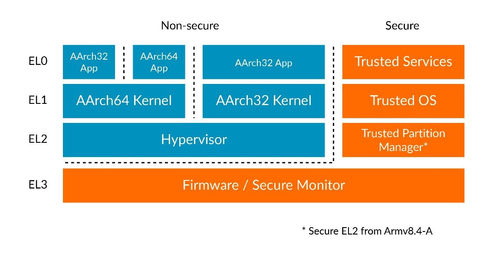

# 1. Execution and Security states

Armv8-A处理器的`current state`是由`Excption Level`和其他两个重要状态决定的。
`current Execution state`定义了通用寄存器的字长与可用的指令集。

`Execution state`还会影响`memory model`的方方面面以及如何管理异常。

`current Security state`是控制那些`Execption level`当前有效，当前可以访问那些内存区域，以及这些访问如何在系统内存总线上表示。

此图显示了`Execption Level`与`Security state`，使用了不同的`Execution state`：

## 1.1 Execution states

Armv8-A有两个可用的`Execution states`：
- `AArch32`：`32-bit Execution state`，兼容Armv7-A，支持`T32`与`A32`指令集，通用寄存器宽度是`32bit`。
- `AArch64`：`64-bit Execution state`，支持`A64`指令集，通用寄存器宽度是`64bit`。

## 1.2 Security state

Armv8-A架构允许实现两个`Security states`。可以让`trusted software`与`normal software`进行分区隔离。

这两个`Security states`是：
- `Secure state`：在这个状态下，`Processing Element(PE)`可以访问`Secure`与`Non-secure`的物理地址空间。`PE`可以访问`Secure`与`Non-secure`的系统寄存器。软件运行在该状态仅响应`Secure interrupt`。
- `Non-secure state`：在这个状态下，`PE`只能访问`Non-secure`的物理地址空间。`PE`只能访问`Non-secure`的系统寄存器。软件运行在该状态仅响应`Non-secure interrupt`。

## 1.3 Changing Execution state

`PE`只能在`reset`时或`Exception Level change`时更改`Execution state`。

`PE`重置时的执行状态是`IMPLEMENTATION DEFINED`。有些实现是在`reset`时`fix`执行状态。
例如，Cortex-A32重置后一直是AArch32状态。在Armv8-A的大多数实现中，复位后的执行状态由在复位时采样的信号控制。 这允许复位执行状态控制在片上系统级别。

当`PE`在异常级别更改时，也可以更改执行状态。可以在AArch32和AArch64之间的转换，但只允许遵守某些规则。
- 当从较低的异常级别移动到更高的级别时，执行状态可以保持不变或更改为AArch64。
- 当从较高的异常级别移动到较低的级别时，执行状态可以保持不变或更改为AArch32。

将这两个规则放在一起意味着` 64-bit layer`承载`32-bit layer`，而不是相反。
例如，一个`64-bit OS kernel`可以运行`64-bit`和`32-bit`的应用程序，而`32-bit OS kernel`只能运行`32-bit`的应用程序。如图所示：

在本例中，我们使用了`OS`和`Applications`，但是同样的规则适用于所有的`Execption Level`。
例如，在`EL2`中的`32-bit hypervisor`只能托管运行在`EL1`的`32-bit virtual machine`。

## 1.4 Changing Security state

`EL3`总是被认为在`Secure state`下执行。
使用`SCR_EL3`，`EL3`代码可以更改到所有较低异常级别的`Security state`。
如果软件使用`SCR_EL3`更改到较低的异常级别的安全状态，则`PE`在更改到更低的异常级别之前不会更改安全状态。

## 1.5 Implemented Exception levels and Execution states

Armv8-A结构允许选择是否实现所有的异常级别，以及每个异常级别上的执行状态。
`EL0`与`EL1`是必须实现的。`EL2`与`EL3`是可选实现的。

`EL3`是唯一可以改变`Security state`的级别。如果选择不实现`EL3`，则`PE`将无法访问其他安全状态。
类似地，`EL2`也包含了许多虚拟化功能。如果选择不实现`LE2`将无法访问这些功能。还可以选择每个异常级别中那些`Execution states`是有效的。