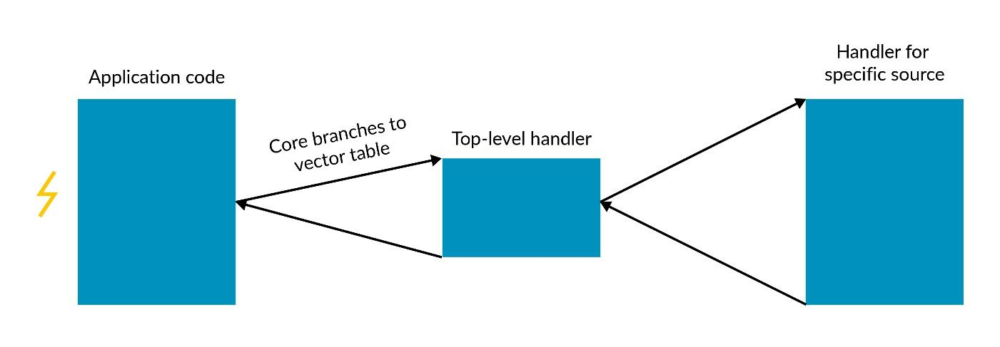
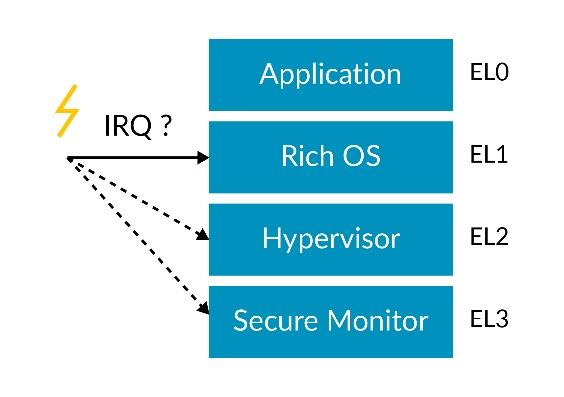

# 1. Handling exceptions

当异常发生时，当前程序执行流会被打断。`Processing Element(PE)`将会更新`current state`并且跳转到`vector table`位置。
通常，跳转过去的位置是`generic code`将当前程序的状态`push`到堆栈上，然后在跳转到其他代码进行后续处理。

## 1.1 Exception terminology

当异常被识别时，处理器处于的状态称为异常的状态。
Armv8-A架构有异常返回指令。执行该指令时`PE`所在的状态是异常返回的状态。

每个异常类型都针对异常级别。 异步异常可以路由到不同的异常级别。

## 1.2 Taking an exception

当有异常发生时，必须保存`current state`用于其异常返回。
`PE`将自动保存`exception return address`与当前`PSTATE`。

`general-purpose register`必须由软件保存。`PE`将当前`PSTATE`更新到体系架构中定义的异常类型，并将其跳转到`vector table`中的`exception handler`。

异常发生时，`PE`会将`PSTATE`存储在系统寄存器`SPSR_ELx`中，其中`x`是异常发生时，`Exception level`。
`PE`会将异常返回地址存储在系统寄存器`ELR_ELx`，其中`x`是异常发生时，`Exception Level`。

## 1.3 Routing asynchronous exceptions

这三种物理中断类型（`SError, IRQ and FIQ`）可以独立地路由到`privileged Exception levels EL1, EL2 or LE3`其中之一。下图以`IRQs`为例：

使用`SCR_EL3`与`HCR_EL2`对路由进行配置。
使用`SCR_EL3`的路由配置将覆盖`HCR_EL2`的路由配置。
这些配置控制允许将不同的中断类型路由到不同的软件中。

路由到比正在执行的级别低的“异常”级别的异常被隐式屏蔽。
该异常将被挂起直到`PE`更改为等于或低于路由到的异常级别。

## 1.4 Determining which Execution state an exception is taken to

`Exception Level`的`Execution state`是由较高的异常级别决定的。
假设所有异常级别都已实现，下表显示如何确定执行状态：

Exception level taken to | Exception level determined by
---|---
`Non-secure EL1` | `HCR_EL2.RW`
`Secure EL1` | 如果`Secure EL2`是`enabled`，`SCR_EL3`或`HCR_EL2`
`EL2` | `SCR_EL3.RW`
`EL3` | `EL3`重置状态

## 1.5 Returning from an exception

软件可以在AArch64执行状态使用ERET指令从异常返回。
这将导致返回的异常级别是根据`SPSR_ELx`的值确定的，其中`x`要返回的级别。
`SPSR_ELx`包含要返回目标级别和目标执行状态。

注意，`SPSR_ELx`中指定的`Execution state`必须与`SCR_EL3.RW`或`HCR_EL2.RW`的配置相匹配。否则将产生非法的异常返回。

在执行`ERET`指令时，状态会从`SPSR_ELx`中恢复，并且`program counter`将被更新到`ELR_ELx`。
这操作是原子不可分割地执行，这样`PE`就不会处于未定义的状态。

## 1.6 Exception stacks

在AArch64中执行时，体系结构允许选择两个堆栈指针寄存器；`SP_EL0`或`SP_ELx`，其中`x`是当前的异常级别。 
例如，在EL1上可以选择`SP_EL0`或`SP_EL1`。

在常规执行期间，认为所有代码都使用`SP_EL0`。
当发生异常时，`SP_ELx`是最初挑选的。
这允许为最初异常处理维护提供单独的堆栈。
这对由于`stack overflow`引发的异常处理时候，维护有效堆栈非常有用。