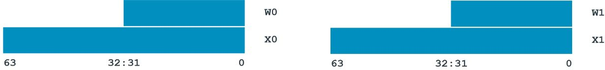
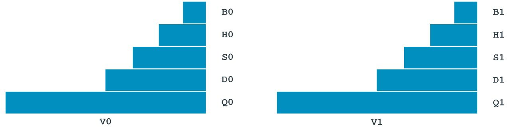

# 1. Registers in AArch64

## 1.1 General-purpose registers

大多数`A64`指令都是在`register`上操作。
该架构提供来`31`个通用寄存器。
每个寄存器可以用作`64-bit X register(X0..X30)`使用，也可以用作`32-bit W register(W0..W30)`使用。
用两种不同的方式来看待同一个寄存器。
例如，该寄存器显示`W0`是`X0`的低32为，而`W1`是`X1`的低32位：



对于数据处理指令，使用`X`或`W`的选择决定了操作的大小。
使用`X`寄存器会有`64-bit`的计算结果，使用`W`寄存器会有`32-bit`的计算结果。

`32-bit`整数加法：
```asm
ADD W0, W1, W2
```
`64-bit`整数加法：
```asm
ADD x0, X1, X2
```

提供一组`32`个独立的寄存器，用于浮点运算与向量运行。这些寄存器是`128-bit`，与通用寄存器一样，可以用多种方式访问。`Bx`是`8 bit`，`Hx`是`16 bit`，`Sx`是`32 bit`，`Dx`是`64-bit`，`Qx`是`128-bit`。即`Byte`，`half Word`，`Single Word`以及`Double Word`。



使用什么样的寄存器的名字决定来计算的长度。

`32-bit`浮点数加法：
```asm
FADD S0, S1, S2
```
`64-bit`浮点数加法：
```asm
FADD D0, D1, D2
```

这些寄存器也可以使用`V`来表示，当以`V`形式使用寄存器时，寄存器被视为向量寄存器。这意味着，它被视为含有多个独立的值，而不是只有单个值。


浮点向量加法：
```asm
FADD V0.2D, V1.2D, V2.2D
```
整数向量加法：
```asm
ADD v0.2D, v1.2D, v2.2D
```

## 1.2 Other registers

`A64`有一些其他的寄存器，我们应该知道：
- `zero`寄存器，`ZXR（64bit）`与`WZR（32bit）`，忽略写，读取永远返回零。
- `X30`被用作`Link`寄存器，可以被称为`LR`。
- `stack pointer(SP)`寄存器用来`load and store`堆栈的基地址。armv8-A有多个`stack pointer`，每个堆栈指针都与特定的`Exception Level`与其相关联，指令中使用`SP`时，表示当前堆栈指针。
- `Program Counter(PC)`在`A64`中不是通用寄存器，不能与数据处理指令一起使用。但PC可以读取：
```asm
ADR Xd, .
```

`ADR`指令计算`label`到当前的位置，`.`表示`here`的意思，因此，该指令会计算出自己的位置。这相当读取`PC`寄存器。有写`branch`指令与`load/store`操作会隐式地使用`PC`寄存器的值。

> 注：在A32和T32指令集中，PC和SP是通用寄存器。A64指令集中的情况并非如此。

## 1.3 System registers

除了通用寄存器以外，Arm架构还定义来系统寄存器。
系统寄存器用于`configure processor`和`contorl system`，如：`MMU`与`exception handling`。

系统寄存器不能像数据处理一样通过`load/store`指令直接使用。而是，将一个系统寄存器的内存读取到一个`X`寄存器再进行数据处理，最后将`X`寄存器的内容写回到系统寄存器。
有两个专门的指令用于访问系统寄存器：
```asm
MRS Xd, <system register>
```
读取系统寄存器到`Xd`。
```asm
MSR <system register>, Xn
```
将`Xn`写入到系统寄存器。

访问特定的系统寄存器，例如`SCTLR_EL1`：
```asm
MRS X0, SCTLR_EL1
```
读取`SCTRL_EL1`寄存器到`X0`。

以`_ELx`结尾的系统寄存器。`_ELx`是指访问该寄存器的最小权限。例如：
```
SCTLR_EL1
```
依赖`EL1`或更高权限。
```
SCTLR_EL2
```
依赖`EL2`或更高权限。
```
SCTLR_EL3
```
依赖`EL3`权限。

视图访问权限不够的寄存器会产生异常。

> 有时候你会看到`_EL12`或`_EL01`结尾的寄存器，这些寄存器都是虚拟化的一部分。