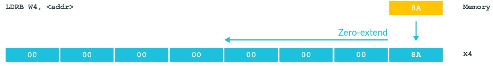
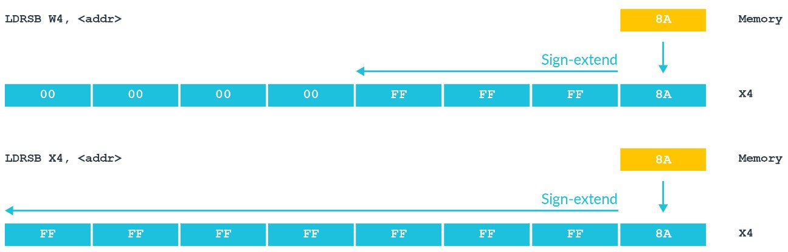

# 1. Loads and stores

基础的`load`和`store`操作是使用`LDR(load)`与`STR(store)`指令。
这些指令可以将一个值在内存与通用寄存器之间传输。
这些指令的语法是：
```asm
LDR<Sign><Size>     <Destination>, [<address>]
STR<Size>           <Destination>, [<address>]
```

## 1.1 Size

`load/store`的大小由寄存器类型`X`或`W`以及`<Size>`字段决定。
`X`是`32-bit`，`W`是`64-bit`。例如，从`<address>`加载`32bit`到`W0`：
```asm
LDR     W0, [<address>]
```
从`<address>`加载`64bit`到`X0`：
```asm
LDR     X0, [<address>]
```
这个`<Size>`字段允许加载`sub-register`大小的数据量，例如，将`<address>`存储到`W0`的`bottom byte(B)`：
```asm
STRB    W0, [<address>]
```
将`<address>`存储到`W0`的`bottom halfword(H)`：
```asm
STRH    W0, [<address>]
```
将`<address>`存储到`W0`的`bottom word(W)`：
```asm
STRW    W0, [<address>]
```

## 1.2 Zero and sign extension

默认情况下，当加载`sub-register`大小的数据量时，寄存器的其余部分扩展为零，如图所示：



> 注意：请记住，每当写入`W`寄存器时，`X`寄存器的`top half`将变为零。

在指令中添加`S`则会导致该值变为符号扩展。扩展的程度取决于目标是`W`或`X`寄存器，如图所示：




任务：如果`0x8000`地址保存`0x1F`值，那么`LDRSB X4, <0x8000>`的`X4`的值是多少？

`LDSRB`表示加载`Byte`到`64-bit`的`X4`寄存器，并使用符号扩展代替默认的零扩展。则，`0x1F = 0b00011111`，最高位为`0`即正号，符号扩展则填充`0`。最终结果是：`0x0000_0000_0000_001F`。

## 1.3 Addressing

`load/store`指令的地址出现在方括号内：
```
LDR     W0, [X1]
```

Arm支持`4`种寻址模式：`Base register modes`，`Offset addressing modes`，`Pre-index addressing modes`以及`Post-index addressing modes`。

`Base register modes`：最简单的寻址形式是单个寄存器。基址寄存器`X`，它包含了被访问的数据的虚拟地址，如下图所示：


`Offset addressing modes`：基于基址寄存器增加一个可选的偏移量，如下图所示：


在上面的图中，`X1`包含基地址，`#12`是该地址的偏移偏移量（单位是字节数）。
这意味着访问地址是`X1 + 12`。偏移量可以是常量，也可以是另一个寄存器。

例如，这种类型的寻址常用于访问结构体。编译器使用 基址寄存器指向该结构体的起始位置，并使用偏移量来访问不同的结构体成员。

`Pre-index addressing modes`：在指令的语法中，`pre-indexing`是添加一个`!`放在方括号后，如下图所示：


`Pre-index`寻址模式对数组的遍历是非常有用的。

`Post-index addressing modes`：使用`Pre-index`寻址，如下图所示：


`Post-index`寻址对弹栈是有非常有用的。指令从`stack pointer`指向的位置`load`值，然后将`stack pointer`移动到堆栈中下一个位置。

## 1.4 Load pair and store pair

到目前为止，我们已经讨论了单个寄存器的加载和存储问题。
A64指令集还有load(`LDP`)和store(`STP`)指令。这些对指令将两个寄存器与内存之间进行传送。
第一个指令将`[X0]`load到`W3`中，并将`[X04]`load到`W7`中：
```asm
LDP     W3, W7, [X0]
```
第二条指令将`D0`store到`[X4]`中，并将`D1`存储到`[X4 + 8]`中：
```asm
STP     D0, D1, [X4]
```
`load/store pair`指令常用于`pushing and poping stack`。 
第一个指令将`X0`和`X1`push到堆栈上：
```asm
STP     X0, X1, [SP, #-16]!
```
第二个指令将`X0`和`X1`从堆栈上pops出：
```
LDP     X0, X1, [SP], #16
```

> 请记住，AArch64中，stack-pointer必须是128位对齐。

## 1.5 Using floating point registers

`load/store`也可以用于浮点寄存器，我们将在这里看到。
第一条指令从`[X0]`load`64-bit`到`D1`：
```asm
LDR     D1, [X0]
```
第二条指令store`Q0(128-bit)`到`[X0 + X1]`：
```asm
STR     Q0, [X0, X1]
```
最后，该指令从`X5`load`256-bit`到`Q1, Q3`中，然后将`X5 += 256`：
```asm
LDP     Q1, Q3, [X5], #256
```
有一些限制：
- 大小仅由寄存器类型决定
- 没有可选的符号扩展的`load`指令
- 地址必须存在于`X`寄存器

在某些特殊情况下，可以找到使用浮点寄存器的加载和存储。
使用在`memcpy()`这样的场景是常见的。
因为更宽的寄存器意味着需要更少的迭代。
不要仅仅因为代码中没有使用浮点值，就假设你不需要使用浮点寄存器。
