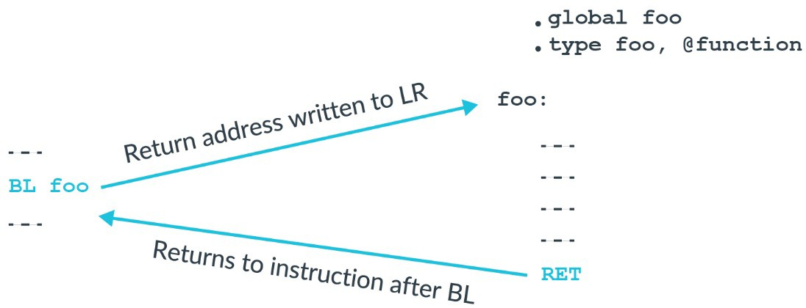
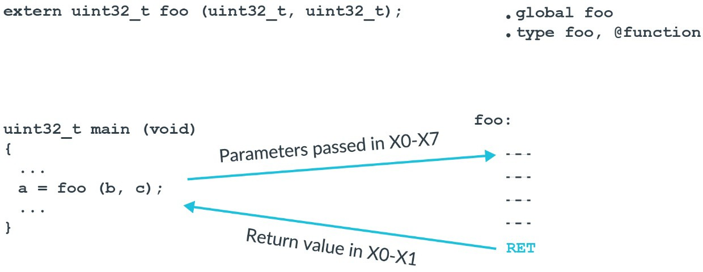
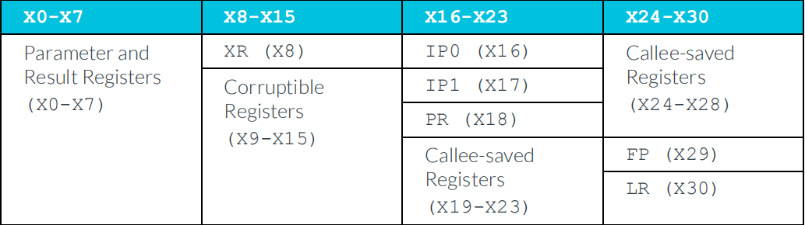
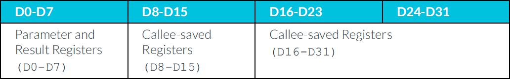
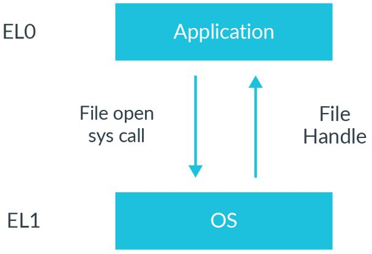

# 1. Function calls

当调用一个`function`或`sub-routine`，我们需要一种方法来在完成时返回到调用者那里。
在`B`或`BR`指令添加`L`，会使它们变成一个带有`link`的`branch`指令。
这意味着，返回地址写入到`LR(X30)`作为`branch`指令的一部分。

> 注意：`LR`与`X30`是可互换的，GNU GAS或armclang支持这两种使用方式。

Arm架构有专门用于函数返回的指令，`RET`。它将对`LR(X30)`中的地址进行一个间接的`branch`。将`BL`与`RET`结合在一起使用，可以得到：

上图显示是一个使用GAS汇编语言编写的`foo()`函数。`.global`导出符号，`.type`是指导出符号的类型是函数。

为什么我们需要一个特殊的指令用于函数返回？
在功能上，`BR`和`LR`与`RET`功能类似。使用`RET`会明确告知处理器，这是一个函数返回。
大多数现代的处理器，所有的Cortex-A系列处理器都支持分支预测(`branch prediction`)。
使用`RET`指令的函数返回允许处理器更准确地进行预测分支。

# 2. Procedure Call Standard

ARM体系结构对通用寄存器的使用没有什么限制。简而言之，整数寄存器和浮点寄存器都是通用寄存器。
但是，如果您希望你的代码与其他人编写的代码交互，或者与编译器生成的代码交互，那么您需要商定寄存器使用规则。对于ARM体系结构，这些规则称为`Procedure Call Standard(PCS)`。

PCS规范：
- 哪些寄存器用于传递参数
- 哪些寄存器用于将返回值交给调用者（`caller`）。
- 被调用函数（`callee`）可以破坏哪些寄存器内容。
- 被调用函数（`callee`）不可以破坏哪些寄存器内容。

我们考虑一下`foo()`函数，它被`main()`函数调用：

`PCS`规范讲：第一个参数通过`X0`寄存器传递，第二个参数通过`X1`寄存器传递，一直到`X7`，更多的参数通过堆栈传递。`foo()`函数有两个参数`b`和`c`。因此，参数`b`通过`W0`传递，参数`c`通过`W1`传递。为什么使用`Wx`而不是`Xx`，因为参数是`32-bit`，因此我们仅需要使用`Wx`即可。

> 注意：在C++中，X0用于传递指向被调用函数的隐式`this`指针。

接下来，PCS定义哪些寄存器可以被破坏，哪些寄存器不能被破坏。
如果一个寄存器可以被破坏，那么被调用的函数可以覆盖而不需要恢复，
PCS规范如下图所示：

例如，函数`foo()`可以使用寄存器`X0`到`X15`，而不需要保存它们的值。
但是，如果函数`foo()`想使用寄存器`X19`到`X28`，它必须先将它们保存到堆栈中，然后在函数返回之前从堆栈中恢复它们。

有些寄存器在`PCS`中具有特殊的意义：
- `XR`：这是一个间接结果寄存器。如果`foo()`返回一个结构体，那么该结构体的内存需要由调用者`main()`分配。`XR`是指向调用者为需要返回结构体分配的内存的指针。
- `IP0/IP1`：这些寄存器是`intra-procedure-call`可破坏的寄存器。链接器使用这些寄存器在调用者(`caller`)和被调用者(`callee`)之间插入`veneers`。`Veneers`是很小一块代码。常用于`branch range extension`。因为`A64`的`branch`指令跳转范围有限。如果目标超出该限制范围，则连接器需要生成一个`Veneers`用来扩展`branch range`。
- `FP`：栈帧指针
- `LR`：`X30`是针对函数调用的链接寄存器(`LR`)。

> 我们以前引入了`ALU flag`，用于`conditional branch`与`conditional select`。PCS规范：`ALU flag`不需要经由函数调用保存。

对于浮点寄存器，也有类似的规则：

# 3. System calls

有时，软件需要一个请求进入高权限系统服务的机制。例如，应用程序请求OS打开文件，就需要这种机制。

在`A64`中，有专门的指令支持系统调用（这些指令会产生异常）。

- `SVC(Supervisor Call)`
    - 产生EL1的异常，用于`Application`调用`OS`。
- `HVC(Hypervisor Call)`
    - 产生EL2的异常，用于`OS`调用`hypervisor`，在`EL0`中不可用。
- `SMC(Secure monitor call)`
    - 产生EL3的异常，用于`OS`或`Hypervisor`调用`EL3 firmware`，在`EL0`中不可用。