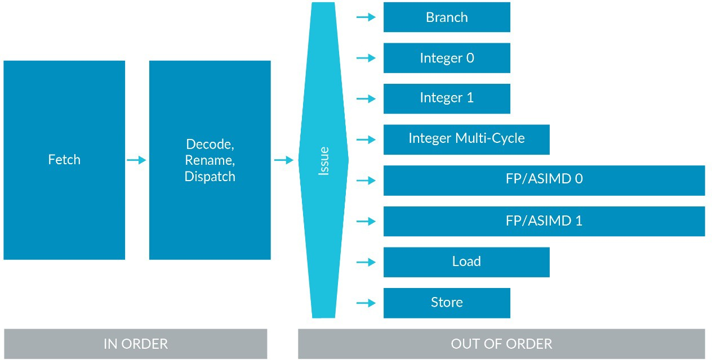

# 1. Overview

`Instruction Set Architecture(ISA)`是计算机抽象模型的一部分。它定义了软件如何控制处理器。

ARM ISA允许你编写符合`ARM specifications`的`software`和`firmware`。
这意味着，如果你的`software`或`firmware`符合规范，任何基于ARM的处理器都将以同样的方式执行它。

本系列文章将介绍`A64`指令集，用于`64-bit Armv8-A`架构，也被称为`AArch64`。

我们不会介绍指令集中的每一条指令。所有指令的说明详见`Arm 
Architecture Reference Manual（Arm ARM）`。
我们将会介绍指令的格式、指令的类型以及如何以汇编的形式与编译器生成的代码交互。

# 2. Why you should care about the ISA

作为开发人员，可能不需要直接使用编写汇编程序。然而，汇编程序在一些领域仍然很重要，例如：`first stage boot software`或` low-level kernel activities`。

即使你只使用高级语言编写程序，了解指令集以及编译器是如何使用这些指令，可以帮助你编写出更效率的代码。
它还可以帮助你理解编译器的输出，这在调试时是非常有用的。

# 3. Instruction sets in the Armv8-A

Armv8-A支持三个指令集：`A32`、`T32`和`A64`。

在`AArch64 Execution state`下执行时，会使用`A64`指令集。
它是一个固定长度(`32-bit`)的指令集。
名称中的`64`是指`instructions`使用的`Execution state`。
而不是指内存中指令的大小。

`A32`和`T32`指令集也分别称为`ARM`指令集和`Thumb`指令集。这些指令集都在`AArch32`执行状态下执行时使用。

# 4. Instruction set resources

每个版本的`Arm architecture`都有自己的`Arm Architecture Reference Manual (Arm 
ARM)`，每个`Arm ARM`都提每条指令的供详细的描述，包括：
- `Endcoding`：指令在内存中的表现形式
- `Arguments`：指令的输入
- `Pseudocode`：使用`Arm pseudocode language`来描述指令在做什么
- `Restrictions`：当不能使用该指令，会触发的异常的情况

# 5. Simple sequential execution

Arm体系结构下描述`Simple Sequential Execution(SSE)`模型。即处理器根据指令在内存中出现的位置，逐一对指令`fetch`、`decode`以及`executed`。

在实践中，现代处理器有`pipeline`，可以同时执行多个指令，并且可能会不按顺序执行。

体系结构是功能描述。
这意味着，它不关心处理器如何工作的。
但是每个处理器必须与`Simple Sequential Execution(SSE)`保持一致，即使内部重新排序指令。