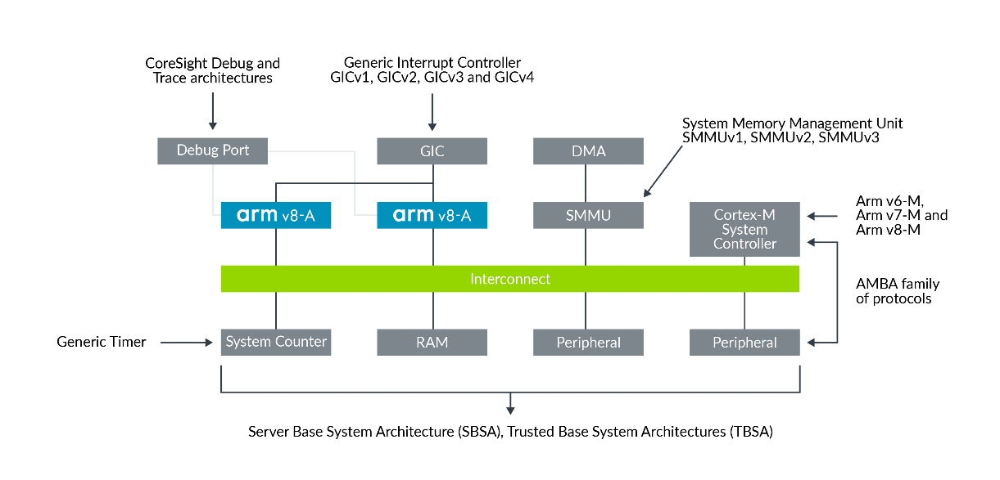
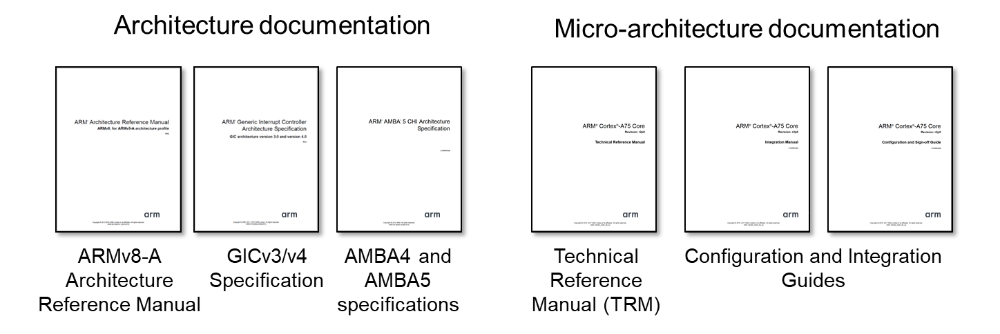
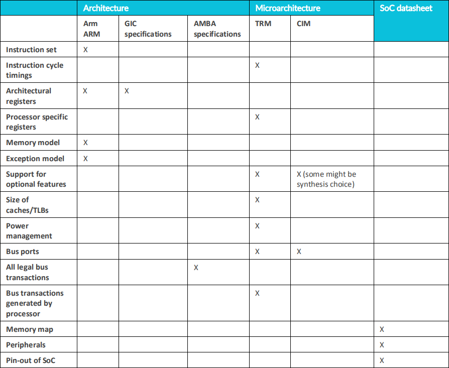

# 1. Introducing the Arm architecture

## 1.1 Overview

Arm架构为`processor`或`core`(我们称之为`Processing Element (PE)`)的设计提供了基础。

Arm架构应用范围很广，它以`System-on-Chip (SoC)`的方式集成到很多设备当中，例如`smartphones`，`microcomputers`，`embedded devices`以及`servers`。

该体系结构为软件开发人员公开了 `common instruction set`与`workflow`，也称为`Programmer's 
model`。这有助于确保架构的不同实现之间的互操作性，以便软件可以在不同的ARM设备上运行。

## 1.2 About the Arm architecture

Arm架构有三个配置文件：`A, R and M`。
- A-profile(Applications): 针对高性能，用于运行复杂的操作系统，如Linux或Windows。
- R-profile(Read-time)：针对实时需求的系统，常见于联网设备，及嵌入式控制系统。
- M-profile(Microcontroller): 针对低功耗/高效率，常用于IOT设备。

## 1.3 What do we mean by architecture?

当我们使用`architecture`术语时，我们指的是`functional specification`。
在Arm架构中，我们指的是`processor`的`functional specification`。
`architecture specification`是指处理器的行为方式，例如处理器具有的指令以及这些指令的功能。

您可以将`architecture`视为`hardware`和`software`之间的契约。
`architecture`描述了软件可以依赖硬件提供什么功能。
有些`features`是可选的，我们将在稍后的`micro-architecture`部分讨论。

`architecture specifies`包括:
- `Instruction set`
    - 每条指令的功能
    - 指令如何在内存中表示（指令编码）
- `Register set`
    - 寄存器的个数
    - 寄存器的大小
    - 寄存器的功能
    - 寄存器的初始状态
- `Exception model`
    - 不同的特权级别
    - 异常的类型
    - 异常发生或返回的机制
- `Memory model`
    - 内存访问是如何排序
    - 缓存的行为如何，以及软件何时需要必要的`explicit maintenance`。
- `Debug, trace, and profiling`
    - 如何设置和触发断点
    - 跟踪工具可以捕获哪些信息。

## 1.4 Architecture and micro-architecture

`Architecture`不会告诉你`processor`是如何`built`和`works`的。
`processor`的`built`与`design`称为`micro-architecture`。
`micro-architecture`会告诉你`processor`的`works`方式。

micro-architecture包括：
- Pipeline length and layout
- Number and sizes of caches
- Cycle counts for individual instructions
- Which optional features are implemented

例如，`Cortex-A53`和`Cortex-A72`都是Armv8-A体系结构的实现。这意味着它们具有相同的体系结构，但它们具有非常不同的微架构，如表所示：

Processor | Cortex-A53 | Cortex-A72
---|---|---
Target | Optimized for power efficiency | Optimized for performance
Pipeline | 8 stages(in-order) | 15+ stages(Out-of-order)
Caches | L1 i-cache: 8KB~64KB  L1 d-cache: 8KB~64KB L2 cache: optional, up to 2MB | L1 i-cache: 48KB fixed L1 d-cache: 48KB fixed  L2 cache: mandatory, up to 2MB

符合ARM架构的软件可以在Cortex-A53或Cortex-A72上运行，无需修改，因为它们都实现了相同的体系结构。

## 1.5 Other Arm architectures

`Arm architecture`是最著名的`ARM specification`，但它不是唯一的。Arm还有多类似的`specification`文档，用来组成现代的`System-on-Chip(Soc)`，此图提供了一些例子：

- Generic Interrupt Controller(GIC)
- System Memory Management Unit(SMMU/IOMMU)
- Generic Timer
- Server Base System Architecture(SBSA) and Trusted Base System Architecture(TBSA)
- Advanced Microcontroller Bus Architecture(AMBA)

## 1.7 Understanding Arm documentation

### 1.7.1 Which document describes what?

- `Arm Architecture Reference Manual(Arm ARM)`描述体系结构规范。
- `Arm Cortex processor`都有`Technical Reference Manual(TRM)`描述了该处理器特有的特性。 一般来说，`TRM`不会重复`Arm ARM`中提供的任何信息。
- `ARm cortex processor`都有`Configuration or Integration Manual (CIM)`描述了如何将处理器集成到系统中。 一般来说，这些信息只与`SoC`设计人员相关。

### 1.7.2 So, what does this mean for me?

如果您正在寻找关于特定处理器的信息，您可能需要参考几个不同的文档。
在这里，我们可以看到您可能需要使用Cortex-A75处理器的不同文档。

`Cortex-A75`实现`ARMv8.2-A`、`GICv4 CPU interface`与`AMBA bus interface`，因此需要参考每单独的文档。此外，您还需要详细参考`micro-architecture`文档。

如果使用现有的`SoC`，还将使用`SoC`制造商提供的文档。该文档是通常称为`datasheet`。
`datasheet`提供了特定于该`SoC`的信息。

### 1.7.3 What information will I find in each document?

