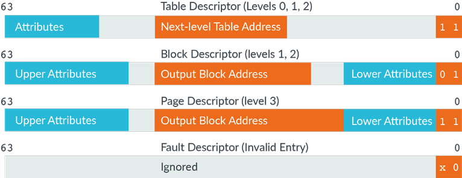
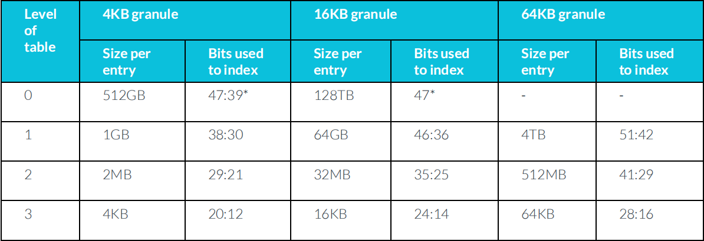
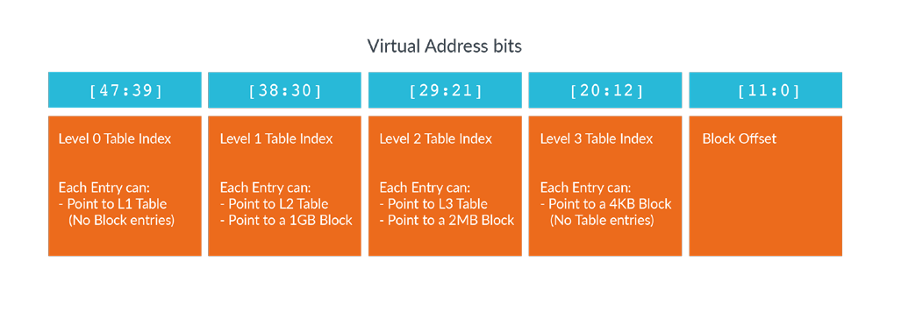

# 1. Controlling address translation

## 1.1 Translation table format

在这里，我们可以看到`translation table entries`允许的不同格式：



> 注意：为了清晰起见，此图不展示位字段的宽度。

每个`entry`是`64-bit`，`bottom two bits`可以确定`entry`的类型。

请注意，有些`table entries`仅在特定的`Level`有效。
页表的最大`Level`为`4`，这就是为什么`Level 3`（或`Level 4`）没有`Table descriptor`。
类似地，`Level 0`中也没有`Block descriptors`或`Page descriptors`。
因为，`Level 0 entry`覆盖了很大区域的虚拟地址空间。

> `Level 0~2`的`Table descriptor`编码与`Level 3`的`Page descriptor`编码相同。这种编码允许`recursive tables`，可以指向自己。这很有用，因为它便于计算特定的`page table entry`的`virtual address`。

# 2. Translation granule

`translation granule`是可以描述的最小的内存块。描述大块时，只能是`translation granule`的倍数。

Arm8-A支持三种不同的`translation granule`：`4KB`、`16KB`和`64KB`。

处理器支持的`translation granule`是`IMPLEMENTATION DEFINED`，并由`ID_AA64MMFR0_EL1`报告。
所有`Arm Cortex-A`系列处理器都支持`4KB`和`64KB`。

所选的`granule`是可以在最后一级表中描述的最小块。也可以描述较大的块。
此表显示了基于所选`granule`的表的每个级别的不同块大小：



`*`在使用`52-bit`地址格式会有些限制。
当我们选择`4KB`或`16KB`的`granule`时，最大虚拟地址区域大小为`48-bit`。
同样，输出物理地址限制在`48-bit`。 只有当使用`64KB granule`时，才能完整使用的`52-bit`。

> 注意：`TCR_EL1`有两个独立的`fields`，用来控制`kernel space`和`user space`的`virtual address`的`granule`。 
这些字段称为内核空间的`TG1`，用户空间的`TG0`。 
对于程序员来说，一个潜在的问题是这两个字段有不同的编码。

## 2.1 4KB granule(48-bit)

Size per entry | table Level | compound mode
---|---|---
4KB | 4 | 9 + 9 + 9 + 9 [+12]
2MB | 3 | 9 + 9 + 9 [+12]
1GB | 2 | 9 + 9 [+30]

> 9 == int(math.log((4*1024/8),2))

## 2.2 16KB granule(48-bit)

Size per entry | table Level | compound mode
---|---|---
16KB | 4 | 1 + 11 + 11 + 11 [+14]
32MB | 3 | 1 + 11 + 11 [+25]
64GB | 2 | 1 + 11 [+36]

> 11 == int(math.log((16*1024/8),2))

## 2.3 64KB granule(52-bit)

Size per entry | table Level | compound mode
---|---|---
64KB | 3 | 10 + 13 + 13 [+16]
512MB | 2 | 10 + 13 [+29]
4TB | 1 | 10 [+42]

> 13 == int(math.log((64*1024/8),2))

## 2.1 The starting level of address translation

`granule`与`virtual address space`的大小一起控制着地址转换的起始级别。
让我们以`4KB`的`granule`为例。此图显示了用于对`4KB granule`不同表级别索引的位：



想象一下，对于配置，你以设置虚拟地址空间的大小，`TCR_ELx.T0SZ`改为`32`。
然后将虚拟地址空间的大小，以地址位计算为：
```
64 - T0SZ = 32-bit address speace(address bits 31:0)
```
如果我们再次查看以前的`4KB granule`，使用`[47:39]bits`索引`Level 0 Table`。
然而对于一个`32`位的地址空间，没有这些位。
因此，你的配置的翻译的开始级别为`Level 1`。

接下来，想象一个，你将`T0SZ`改为`34`：
```
64 - T0SZ = 30-bit address space (address bits 29:0)
```
这次，您没有任何其他可用于对第0级表或第1级表进行索引的位，因此，配置的翻译开始的级别为第2级。

正如前面的图所示，当虚拟地址空间的大小减小时，您需要更少的表级别来描述它.
这些示例是基于使用4KB颗粒的情况。同样的原理也适用于使用16KB和64KB的颗粒时，但地址位数发生了变化。

## 2.2 Registers that control address translation

`Address translation`由系统寄存器的组合控制：
- `SCTLR_ELx`
    - `M` —— Enable Memory Management Unit (MMU).
    - `C` —— Enable for data and unified caches.
    - `EE` —— Endianness of translation table walks.
- `TTBR0_ELx` and `TTBR1_ELx`
    - `BADDR` —— Physical address (PA) (or intermediate physical address, IPA, for EL0/EL1) of start of translation table.
    - `ASID` —— The Address Space Identifier for Non-Global translations.
- `TCR_ELx`
    - `PS/IPS` —— Size of PA or IPA space, the maximum output addresssize.
    - `TnSZ` —— Size of address space covered by table.
    - `TGn` —— Granule size.
    - `SH/IRGN/ORGN` —— Cacheability and shareability to be used by MMU tablewalks.
    - `TBIn` —— Disabling of table walks to a specific table.
- `MAIR_ELx`
    - `Attr` —— Controls the Type and cacheability in Stage 1 tables.

## 2.3 MMU disabled

在翻译阶段当`MMU`被`Disable`，所有地址都是平面映射(`flat-mapped`)。 平面映射意味着输入和输出地址是相同的。