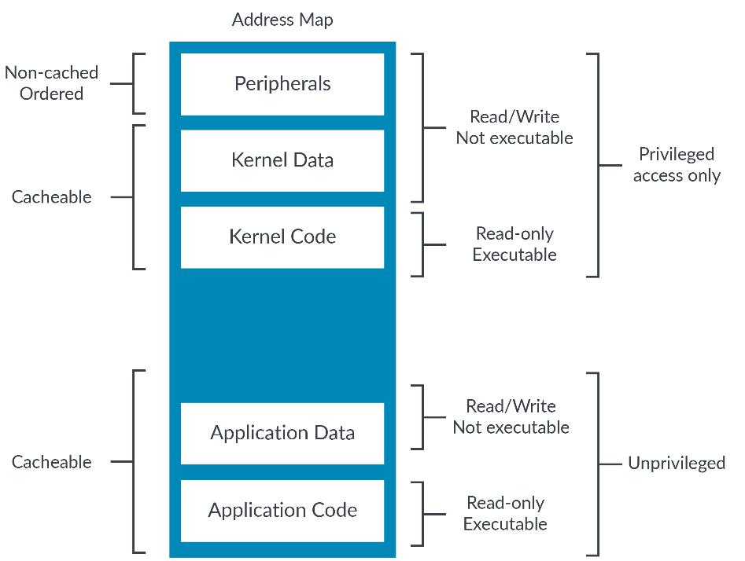
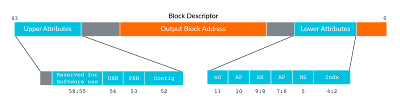
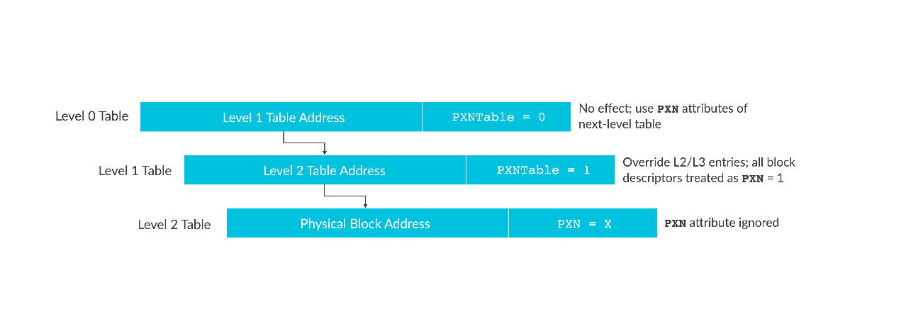

# 1. What is a memory model, and why is it needed?

内存模型是内存的组织方式以及行为的定义。
它提供了一个架构和一组规则，你可以根据这些规则来配置系统是如何访问和使用地址或地址区域(`region`)。
内存模型提供`attributes`，可应用于地址与内存访问排序相关的规则上。

考虑一个带有地址空间的简单系统，就像在这个图中可以看到的：

地址空间`(address space)`中内存区域`(memory regions)`的排列称为地址映射`(address map)`。
在这里，地址映射包含：
- 内存与外设
- 代码与数据
- `OS`的资源和`application`的资源

处理器和外围设备交互的方式与处理器和内存交互的方式不同的。
因为，我们通常希望缓存内存，但不希望缓存外围设备。

`cache`是指将数据从内存中得到的副本存储到一个被称为缓存(`RAM`)中的行为。
`cache`更接近`core`，因此`core`访问速度更快。
类似地，我们还希望处理器阻止用户访问内核资源。

下图显示了地址映射，如何利用不同的`memroy regions`与`memory type`以及`memory attribute`解决上述的问题：

您需要能够向处理器描述这些不同的属性，以便使处理器能够适当地访问每个区域。

# 2. Describing memory in Armv8-A

虚拟地址空间和物理地址空间之间的映射是在一组转换表中定义的，有时也被称为`page table`。
对于虚拟地址的每个块或页面(`page`)，翻译表提供对应于访问该页面的物理地址和相应的属性。

每个翻译表项(`page entry`)称为块(`block descriptor`)或页描述符(`page descriptor`)。
在大多数情况下，属性来自这个描述符。

此图显示了一个示例块描述符，以及其中的属性字段：

重要属性有：
- `SH` - The shareable attribute
- `AP` - The access permission
- `UXN` and `PXN` – Execution permissions

## 2.1 Hierarchical attributes

一些内存属性可以在较高翻译表中的描述符指定。这些都是具有层次结构的属性。
这将适用于访问权限、执行权限和物理地址空间。

如果设置了这些位，那么它们将覆盖较低级别的的条目，并且如果这些位被清除，则将不被修改地使用较低级别的条目。下面显示了一个使用`PXN table`（执行权限）的例子：

从Armv8.1-A起，您可以禁用相关描述符中的层次结构属性设置访问权限和执行权限。
通过相关的`TCR_ELx`寄存器进行控制。禁用后，软件可以任意使用之前层次结构控制的`bit`干其他事。

## 2.2 MMU disabled

总之，一个地址的属性来自于转换表。转换表位于内存中，并用于存储虚拟地址和物理地址之间的映射。
这些表还包含物理内存位置的属性。

内存管理单元(`MMU`)可以访问这些页表。

如果禁用了`MMU`，则会发生什么情况？这是一个重要的问题。

当禁用了`Stage 1`中的`MMU`时：
- 所有数据访问都是`Device_nGnRnE`。
- 所有指令获取都被视为`cacheable`。
- 所有的地址都具有读写访问权限，并且都是可执行的。

对于虚拟化所`covered`的异常级别，当禁用`Stage 2`时，将未经修改地使用`Stage 1`中的属性。

# 3. Memory access ordering

`Simple Sequential Execution (SSE)`是一个针对指令排序(`instructions ordering`)的概念模型。
内存访问排序(`Memory access ordering`)和指令排序(`instructions ordering`)是两个不同但相关的概念。重要的是你要理解它们之间的区别。

SSE描述处理器执行指令的顺序。总之，现代处理器有漫长而复杂的`pipeline`演进。
这些`pipeline`通常能够重新排序指令或并行执行多个指令，从而提高指令的并行度而获得更高的性能。
SSE意味着处理器的行为必须像处理器一次执行一个指令那样，按照程序代码中给出指令的顺序执行。
这意味着任何通过硬件的`re-ordering`或指令的`multi-issuing`操作对软件必须是透明的。

内存排序(`Memory access ordering`)是关于内存系统中出现内存访问的顺序。
诸如，写`buffer`和`cache`之类的机制，即使指令按顺序执行，可能也不会按照指令的顺序进行内存访问。
即使处理器遵循SSE模型，内存访问排序也是一个非常重要的事情。