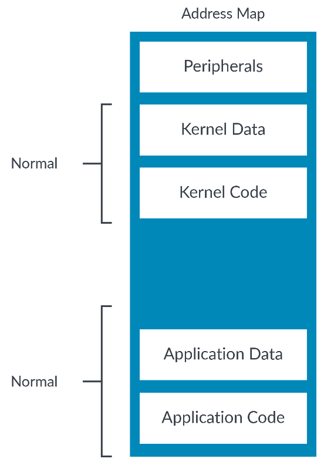
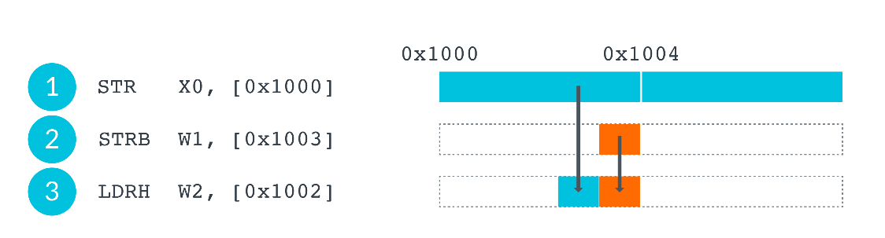
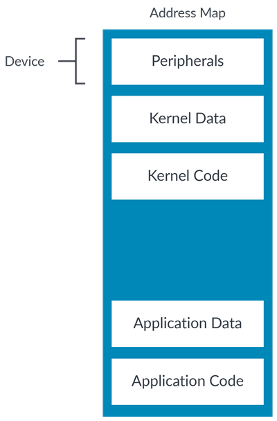
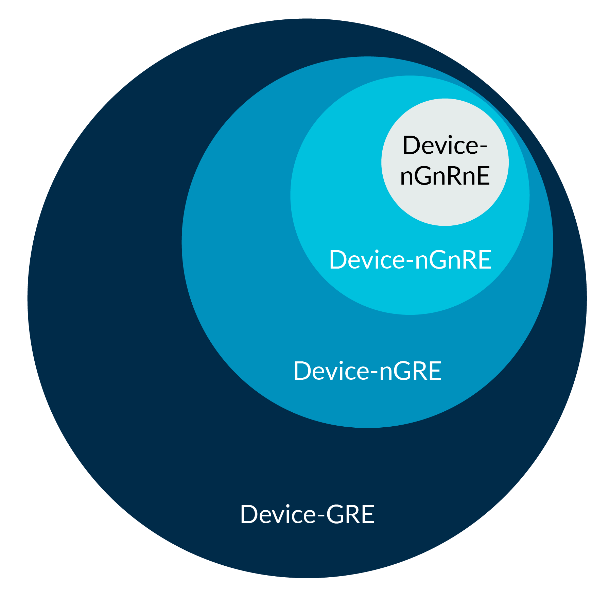
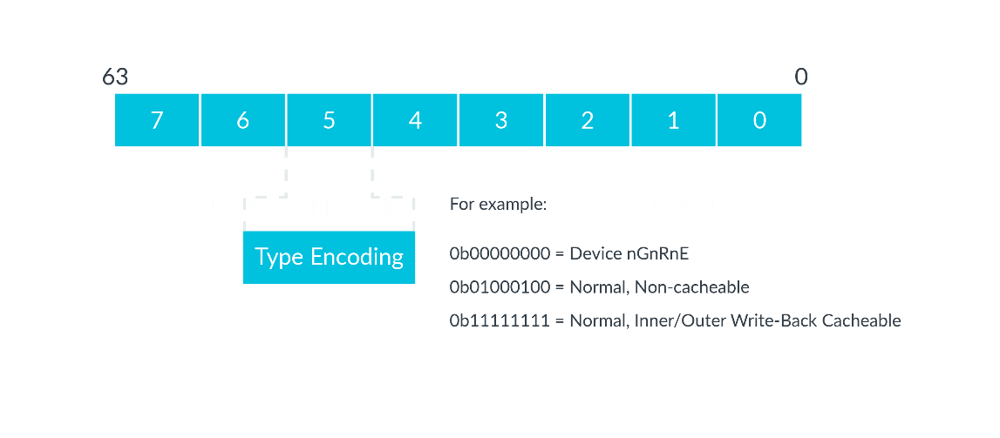

# 1. Memory types

系统中所有未标记为故障的地址都分配有一种内存类型。
内存类型是关于处理器应该如何与地址区域交互的高级描述。

Arm8-A中有两种内存类型：正常内存(`Normal memory`)和设备内存(`Device memory`)。

> 注意：Armv6和Armv7包括第三种内存类型：强序存储(`Strongly Ordered`)。在Armv8中，这映射到`Device_nGnRnE`。

## 1.1 Normal memory

`Normal`内存类型用于任何类似内存的操作，包括`RAM`、`Flash`或`ROM`。
代码只能放在`Normal Memory`中 。

`Normal`通常是系统中最常见的内存类型，如下图所示：



### 1.1.1 Access ordering

传统上，计算机处理器按照在程序指定的顺序来执行指令。

大多数现代处理器似乎都遵循`Simple Sequential Execution (SSE)`模型。
我们将在这里介绍其中的一些细节。

访问标记为`normal`的位置没有直接的副作用。
这意味着读取位置只是返回我们获取数据，但不会导致数据更改或直接触发其他过程。
因此，对于被标记为`normal`的位置，处理器可以：
- 合并访问(`Merge accesses`)：代码可以多次访问一个位置，也可以访问多个连续的位置。为了提高效率，我们允许处理器检测并将这些访问合并到一个单一的访问中。
- 推测方式执行访问(`Perform accesses speculatively`)：处理器可以在软件请求数据之前，基于先前访问的模式，使用模式识别来预取(`prefetch`)数据。该技术是通过预测行为来加速访问。
- 重新排序访问(`Re-order accesses`)：在内存系统中看到的访问顺序可能与软件发出的访问顺序不匹配。例如，处理器可能会对两个读取进行重新排序，可以提高总线使用权。对同一位置的访问无法重新排序，但可能会合并。

这意味着`normal`的内存类型通常会提供最好的性能。

### 1.1.2 Limits on re-ordering

总之，被标记为`Normal`的内存位置，处理器可以进行重新排序（`re-order`）。
让我们考虑下面的示例代码，它包含三个内存访问、两个`store`和一个`load`：



如果处理器要对这些访问进行重新排序，这可能会导致内存中的值错误，这是不被允许的。

像这种**字节访问，必须保持访问顺序**。处理器需要检测到(`hazard`)并确保为获得预期的结果，并对访问提供正确的排序。

处理器可以将两个存储单元合并在一起，将这个合并的存储单元呈现给内存系统。
处理器它还可以检测到`load`操作来自`store`指令写入的字节，从而可以返回新值，而无需从内存中重新读取新值。

在其他情况下，会强制执行排序，例如，地址依赖性(`Address dependencies`)。
地址依赖性是指当`load`或`store`使用先前`load`的结果作为地址的情况。

在这个代码示例中，第二条指令取决于第一条指令的结果：
```asm
LDR     X0, [X1]
STR     X2, [X0] // The result of the previous load is the address in this store.
```
在看一个例子，其中第二条指令依赖于第一条指令的结果：
```asm
LDR     X0, [X1]
STR     X2, [X5, X0] // The result of the previous load is used to calculate the address.
```

如果**两个内存访问之间存在地址依赖关系，处理器必须保持顺序**。

**控制依赖**（`control dependencies`）是指当需要使用先前`load`的值来作出决策时，**处理器必须保持顺序**。

此代码示例展示了，一个比较和分支操作：
```asm
LDR     X0, [X1]
CBZ     <somewhere_else>
STRX    X2, [X5], [Symbol] // There is a control dependency on X0, this does not guarantee 
ordering.
```

在某些情况下，需要在对`Normal memory`的访问或对`Normal memory`和`Device memory`的访问之间强制排序。
这可以通过使用屏障指令(`barrier instructions`)来实现。

## 1.2 Device memory

`Device memory`内存类型用于描述外围设备。
外围设备的寄存器通常被称为`Memory-Mapped I/O(MMIO)`。



回顾一下，`Normal`内存类型意味着该访问没有副作用。
对于`Device`类型的内存，正好相反。
`Device`内存类型可能会有副作用。

例如，对设备的`FIFO`的读取通常会导致它前进到下一个数据块。
这意味着对`FIFO`的访问次数很重要，因此处理器必须遵守程序指定的内容。

> **设备区域(`Device regions`)属性永远是(`non-cacheable`)的**。

强烈建议将设备区域(`Device regions`)始终标记为`non-executable`。
否则，处理器可能会推测性地从其中获取指令，这可能会导致在读取敏感设备的`FIFO`造成问题。
**同样，不允许对标记为`Device`类型的区域进行投机性数据访问。**

> 为了防止处理器的推测性访问，必须将区域标记为`Device | non-executable`。

`Device memory`有四种子类型，具有不同的限制：
- `Device_GRE`
- `Device_nGRE`
- `Device_nGnRE`
- `Device_nGnRnE`

其中`Device_nGnRnE`类型限制性最强。

`Device`后面的字母`(G/R/E)`表示属性的组合：
- `Gathering (G, nG)`：指访问是可以合并(`G`)或不能合并(`nG`)。合并是指将对同一位置的多个访问合并为一个访问，或者将多个较小的访问合并为一个更大的访问。
- `Re-ordering (R, nR)`：指对同一外设的访问可以重新排序(`R`)或不排序(`nR`)。当允许重新排序时，与`Normal Memory`类型的限制是相同的。
- `Early Write Acknowledgement (E, nE)`：明确何时认为写入已完成。如果是`Early Write Acknowledgement(E)`，则对其他观察者可见的访问，可在其到达目的地之前将其显示为完成。
例如，一旦写入到达`interconnect`的`write buffer`，则写入为已完成。
`Early Write Acknowledgement (nE)`，则写操作必须已到达目的地才算完成。

下面举两个例子：
- `Device_GRE`：这是一个允许`gathering`、`re-ordering`和`early write acknowledgement`。
- `Device_nGnRnE`：这是一个不允许`gathering`、`re-ordering`和`early write acknowledgement`。

我们已经看到了重新排序(`re-ordering`)是如何工作的了，但我们没有引入`gathering`或`early write acknowledgement`。`gathering`允许对相似位置的内存访问合并到单个总线事务中，从而优化访问。而`early write acknowledgement`指示内存系统，在总线上的任何时间点发送写入确认。

> 注意：`(Normal Memory | Non-cacheable)`与`Device_GRE`可能看起来是相同的，但它们不是。`(Normal Memory | Non-cacheable)`仍然允许进行投机性的数据访问，而`Device_GRE`则不允许。


内存类型描述了允许行为的集合。我们仅看`Device Memory`：



您可以看到，`Device_nGnRnE`是限制性最严格的子类型，允许的最少的行为。
`Device_GRE`是限制最少的，因此，允许的最多的行为。

重要的是，`Device_GRE`也使用使用`Device_nGnRnE`所允许的所有行为。
例如，`Device_GRE`内存无需使用`Gathering`，而是只允许使用`Gathering`。
因此，处理器会将`Device_GRE`视为`Device_nGnRnE`。

这个例子是极端的，不太可能发生在`Arm Cortex-A`处理器。
然而，处理器通常不会区分所有类型或子类型，例如，可能处理器会以相同的方式处理`Device_GRE`和`Device_nGRE`。

# 2. Describing the memory type

内存类型不是直接编码到页表项(`translation table entry`)中。
相反，页表项的索引字段`(index fidle)`会从`MAIR_ELx(Memory Attribute Indirection Register)`寄存器中选择`entry`。



所选的字段(`fidle`)将会确定内存类型(`memroy type`)和可缓存性(`cacheability`)信息。

为什么要使用指向寄存器的索引，而不是直接将内存类型编码到转换表条目中？

因为页表项中的`bit`位数是有限的。
它需要`8bit`来编码存储器类型，但是只需要`3bit`就能索引`MAIR_ELx`。
这使体系结构可以有效地使用表条目中的更少位。