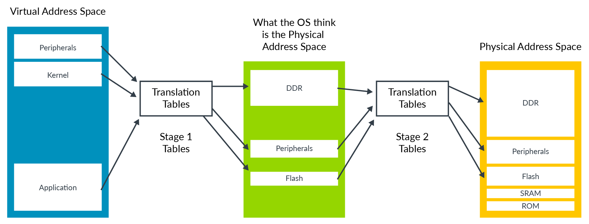
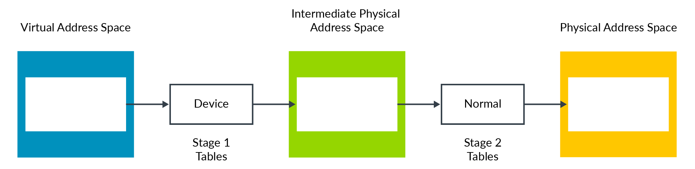
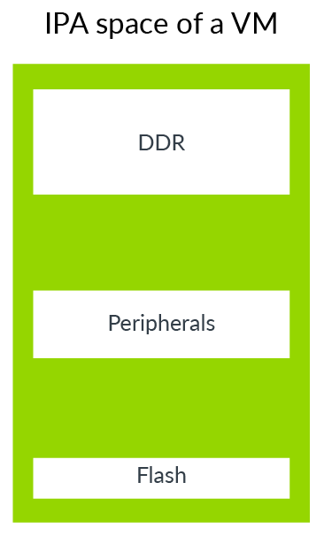
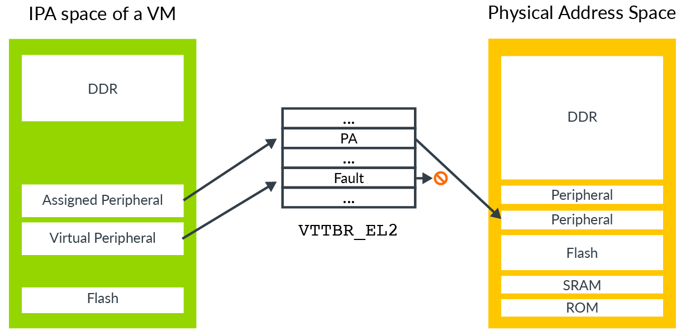
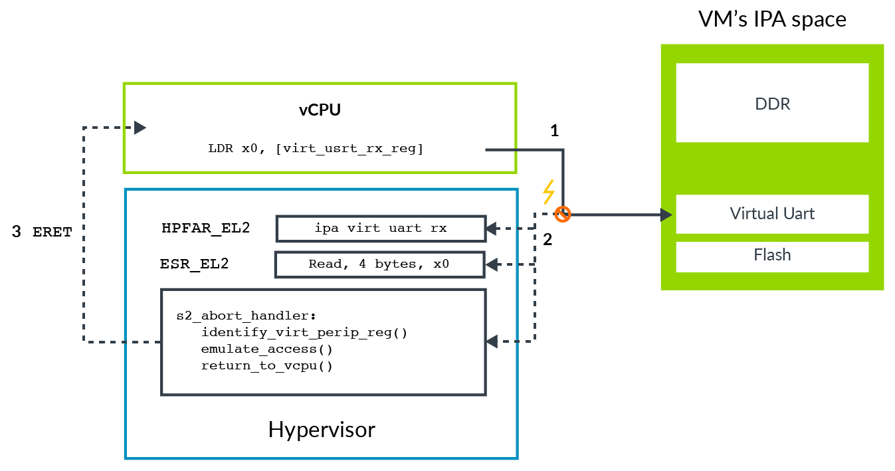
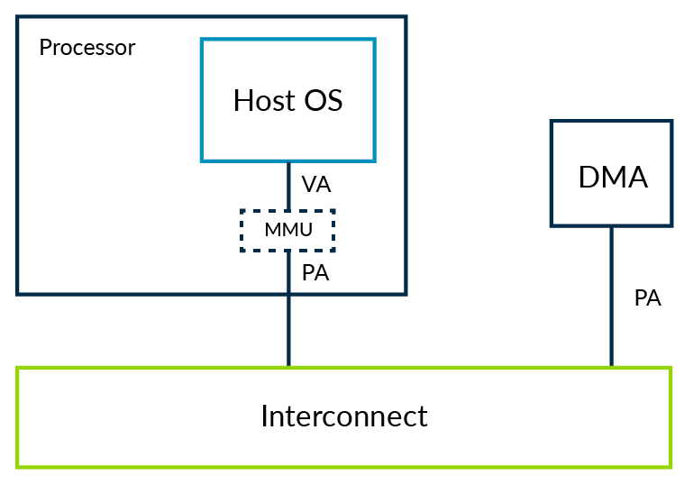
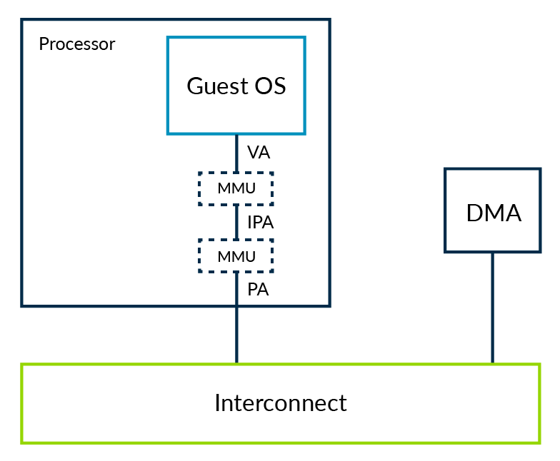
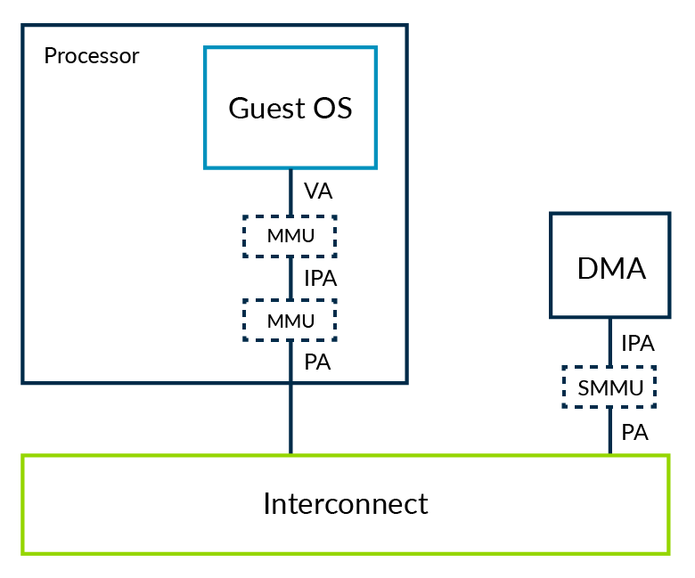

# 1. Stage 2 translation

## 1.1 What is stage 2 translation?

`Stage 2 translation`允许`hypervisor`控制`Virtual Machine`的内存视图。
具体来说，它允许`hypervisor`控制`Virtual Machine`访问哪些`memory-mapped`系统资源，以及这些资源出现在`Virtual Machine`地址空间中的位置。

这种控制内存访问的能力对于`isolation`和`sandboxing`非常重要。
`Stage 2 translation`可以用来确保`VM`只能看到分配给它的资源，而不能看到分配给其他`VM`或`hypervisor`的资源。

对于内存地址翻译，`Stage 2 translation`是第二阶段的翻译。为了支持这一点，需要一组新的`translation tables`称为`Stage 2 tables`，如图所示：

`OS`通过控制`translation tables`，这些`translation tables`将`virtual address space`映射到它认为的`physical address space`。
然而，这个过程需要经历两阶段的地址翻译后才能得到真实的物理地址空间。第二阶段的地址翻译由`hypervisor`控制。

`OS`控制的地址翻译称为`stage 1 translation`；`hypervisor`控制的地址翻译称为`stage 2 translation`。
`OS`认为`physical memory address space`其实是`Intermediate Physical Address (IPA) space`。

> 有关地址翻译如何工作的介绍，请参阅我们的内存管理指南。

`stage 2`使用的`translation tables`格式与`stage 1`非常相似，然而在`stage 2`有些`attributes`的处理方式是不同的，如`Normal`或`Device`属性是直接编码到`table entry`，而不是通过`MAIR_ELx register`设置。

## 1.2 VMIDs

每个`VM`被分配一个`virtual machine identifier (VMID)`。
VMID用于标记`translation lookaside buffer (TLB) entries`以便识别每个`TLB entry`属于哪个`VM`。
这样就可以让多个不同`VM`同时出现在`TLB`中。

`VMID`存储在`VTTBR_EL2`中，可以是`8bit`或`16bit`。
`VMID`由`VTCR_EL2.VS`位控制。

> 对于`EL2`和`EL3`的地址翻译没有标记`VMID`，因为他们不接受`stage 2 translation`。

## 1.3 VMID interaction with ASIDs

`TLB entries`也可以使用`Address Space Identifier (ASID)`作为标记。
`application`由`OS`分配一个`ASID`，该应用程序中的所有`TLB entry`都用该ASID标记。
这意味着，不同`application`的`TLB entry`能够共存于`TLB`中，而不会产生一个`application`使用其他`application`的`TLB entry`的可能性。

每个`VM`都有自己的`ASID namespace`。例如，两个`VM`可能都使用`ASID = 5`，但它们用于不同的事情。
`ASID`和`VMID`的结合是很重要的。

## 1.4 Attribute combining and overriding

`stage 1`与`stage 2`都有映射属性，如`type`、`access permission`；`Memory Management Unit (MMU)`结合`stage 1`与`stage 2`的属性，给出一个最终有效值。
`MMU`通过选择限制性更强的`stage`来实现这一点，你可以在这里看到：

在这个例子中，`Device`类型比`Normal`类型更具有限制性，因此得到的类型是`Device`。
我们将这两个`stage`进行交换（让`stage 1`为`Normal`，`stage 2`为`Device`）最终得到的类型依然是`Device`。

这种`Attribute combining`在绝大多数场景都有效，但是有时`hypervisor`需要覆盖其属性。
例如，在VM的早期引导期间。对于这种情况，有些控制位会被覆盖：
- `HCR_EL2.CD`：所有`stage 1`的`attribute`设置成`Non-cacheable`。
- `HCR_EL2.DC`：强制`stage 1`的`attribute`设置成`Normal, Write-Back Cacheable`。

## 1.5 Emulating Memory-mapped Input/Output (MMIO)

就像`physical machine`上的`physical address space`，`VM`的`IPA space`包含用于访问`memory`和`peripherals`的`region`，如下图所示：

`VM`可以使用`peripheral region`访问`real physical peripheral`，通常被称为`directly assigned peripherals`与`virtual peripherals`。

`virtual peripherals`是由`hypervisor`软件负责完全模拟，如下图所示：

一个`assigned peripheral`是一个真实的物理设备，它已经分配给`VM`，并映射到它的`IPA space`。
表示`VM`可以直接与`peripheral`设备交互。

`virtual peripherals`是`hypervisor`软件负责模拟，相当于`stage 2 table entry`会被标记为`fault`。
VM中的软件认为它可以直接访问外围设备，但是每个访问都会出发一个`stage 2 fault`，由`hypervisor`的异常处理程序中模拟外围设备访问。

为了模拟外围设备，`hypervisor`不仅需要知道访问了哪个外围设备，还需要知道访问了该外围设备中的哪个寄存器，访问是读还是写，访问的大小以及用于传输数据的寄存器。

ARM异常模型引入`FAR_ELx`寄存器。 在处理`stage 1 fault`时，寄存器报告触发异常的虚拟地址。
这个虚拟地址对`hypervisor`没有任何帮助，因为`hypervisor`通常不知道`Guest OS`是如何配置其虚拟地址空间的。对于`stage 2 fault`，有一个额外的`HPFAR_EL2`寄存器，它提供了发生异常的IPA地址。因为`IPA space`是由`hypervisor`控制的，它可以使用这些信息来确定它需要模拟的的寄存器。

`Exception Model`描述了`ESR_ELx`寄存器如何报告关于异常的信息。用于`single general-purpose register`的`load`或`store`操作会触发`stage 2 fault`，提供了额外的综合信息。这些综合信息包括：访问的大小，源寄存器或目的寄存器；让`hypervisor`明确对`virtual peripheral`访问的行为。

这个图说明了捕获然后模拟访问的过程：

整个过程在这些步骤中描述：
1. `VM`中的软件试图访问`virtual peripheral`。在本例中，这是一个`virtual URAT`的`receive FIFO`。
2. 此访问会阻塞在`stage 2 translation`，导致`abort`路由到`EL2`。
    1. `abort`时会记录异常信息到`ESR_EL2`，包括访问的字节数，目标寄存器以及是读或写。
    2. `abort`时会记录`aborting access`的`IPA`到`HPFAR_EL2`。
3. `hypervisor`使用`ESR_EL2`和`HPFAR_EL2`的信息来识别虚拟外设寄存器的访问。这些信息允许`hypervisor`模拟操作。然后它通过`ERET`返回到`vCPU`继续执行。
    1. `vCPU`执行的位置是在`LDR`指令之后。

## 1.6 System Memory Management Units (SMMUs)

到目前为止，我们已经考虑了来自处理器的不同类型的访问情况。
在系统还有其他的控制器，例如`DMA controller`，可能被分配给`VM`使用。
我们需要一些方法来确保这些控制器可以正常的进行`stage 2 translation`。

首先看看不使用虚拟化的DMA控制器的系统，如下图所示：

DMA控制器通过驱动代码控制，通常在内核空间运行。内核空间驱动程序可以确保OS级内存保护不被破坏。
这意味着驱动程序不能使用DMA来访问它不应该看到的内存。

让我们考虑相同的系统，但操作系统在`VM`中运行，如下图所示：

在这个系统中，`hypervisor`使用`stage 2`来提供`VM`之间的隔离。
`hypervisor`通过`stage 2 table`限制软件可以看到的内存。

如果允许`VM`中的驱动直接与`DMA controller`交互会产生两个问题：
1. `Isolation`：`DMA controller`不受`stage 2 table`约束，可以用来破坏`VM`的`sandbox`。
2. `Address space`：使用`two stages of translation`，`kernel`认为`PA`是`IPA`。`DMA controller`仍然看到的是`PA`，因此`Kernel`与`DMA controller`会有不同的内存视图。为了克服这个问题，`hypervisor`可以捕获`VM`与`DMA controller`之间的每一个交互，提供必要的`translation`。当内存碎片化时，这个过程是低效和有问题的。

另一种方案的`trapping and emulating`是扩展`stage 2`机制（regime），用来`cover`驱动（DMA controller）的访问。当这种情况发生时，这些`DMA controller`也需要一个MMU。它被称为`System Memory Management Unit(SMMU)`，也称`IOMMU`：

`Hypervisor`将负责SMMU的编程，在这个示例中，`DMA controller`与`VM`看到的内存视图相同。

这个过程解决了我们发现的两个问题。`SMMU`可以加强`VM`之间的隔离，确保外部控制器不能破坏`sandbox`。
`SMMU`还对`VM`中的软件和分配给`VM`的外部控制器(DMA controller)等，提供了一致的内存视图。

> 虚拟化不是SMMU使用的唯一场景，其他使用场景不在本系列文章的讨论范围。

