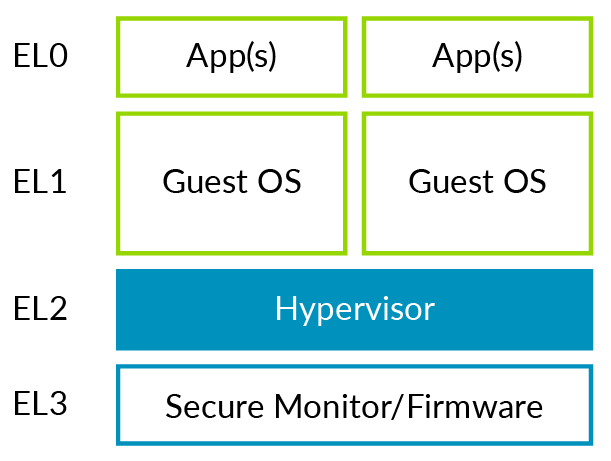
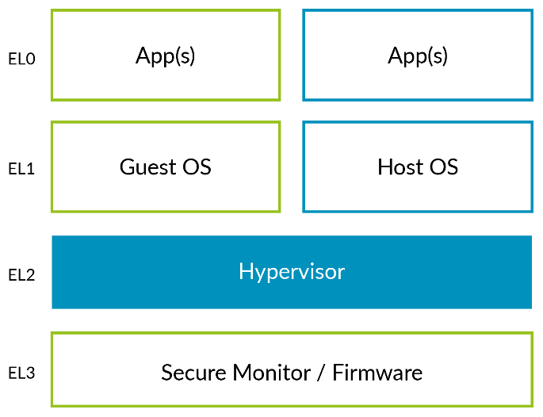
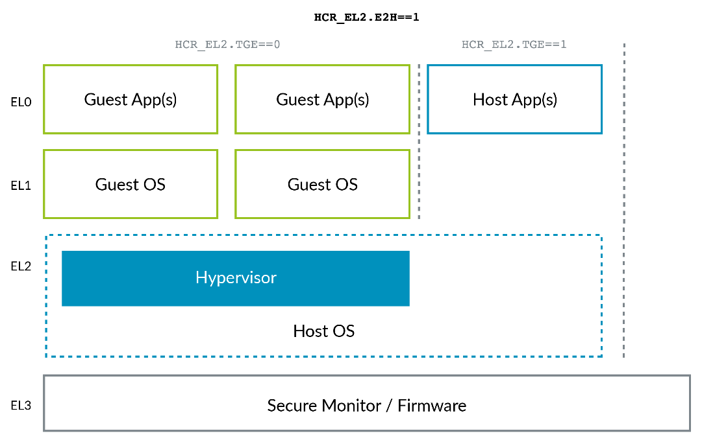
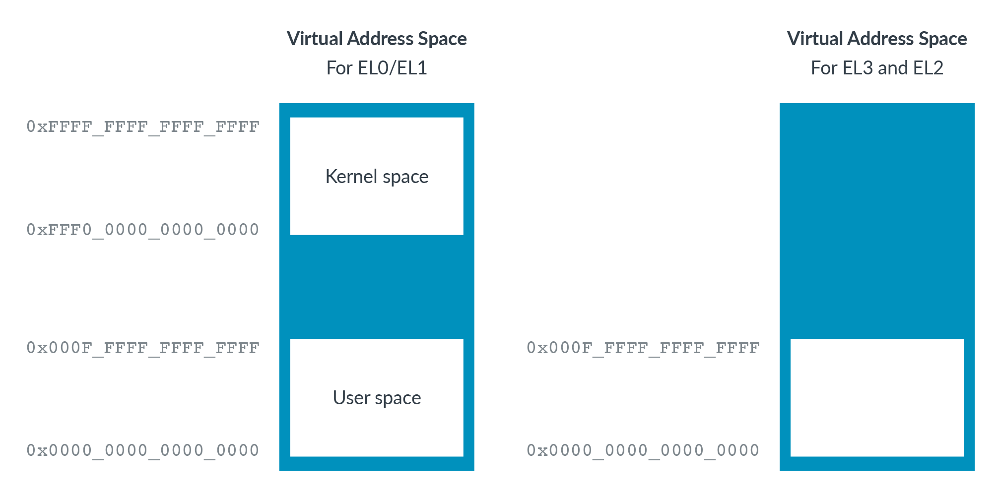

# 6. Virtualization Host Extensions

下图展示了简化版的`Software stack`与`Exception Level`：

你可以看到`standalone hypervisor(Type 1)`如何映射到`Arm Exectption Level`。
`hypervisor`运行在`EL2`，`Virtual Machine(VMS)`运行在`EL0/1`。

在`hosted hypervisor(Type 2)`的情况会有很多问题，如下图所示：

传统上，`Kernel`运行在`EL1`，但是`virtualization controls`却在`EL2`。
这意味着大多数`Host OS`位于`EL1`，`EL2`中运行着一些`stub code`以访问`virtualization controls`。
这种安排效率低下，因为它可以设计额外的`context switch`。

`Kernel`将需要处理`LE1`和`LE2`运行之间的一些差异，单这些差异仅涉及很少的`subsystems`，例如`early boot`。

> `DynamIQ`处理器(Cortex-A55, Cortex-A75 and Cortex-A76)支持`Virtualization 
Host Extensions (VHEs).`

## 6.1 Running the Host OS at EL2

在`HCR_EL2`中提供两个`bits`用于控制`VHE`：
- `E2H`：控制是否`enable VHE`
- `TGE`：当`VHE enabled`，控制`EL0`是`Guest or Host`

下表总结了这些典型的设置：

Executing in | E2H | TGE
---|---|---
Guest Kernel(EL1) | 1 | 0
Guest Application(EL0) | 1 | 0
Host Kernel(EL2) | 1 | 1*
Host Application(El0) | 1 | 1

> *对于从`Virtual Machine`退出到`hypervisor`的异常，`TGE`最初为`0`。运行Host Kernel主要功能之前，软件应该设置该位。

您可以在下面的图中看到这些典型的设置：

## 6.2 Virtual address space

下图显示了在引入`VHE`之前`EL0/EL1`的虚拟地址空间是什么样子：

如`Memory Management`中所述，`EL0`与`EL1`有两个`region`。
按照惯例，上方`region`称为`kernel space`，下方`region`称为`user space`。
然而，`EL2`在下方只有一个`region`。这种不同是因为，传统上，`hypervisor`不会运行用户程序。
这意味着，`hypervisor`不需要分割`kernel space`和`user space`。

> 将上方`region`分配给`kernel space`，将下方`region`分配给`user space`这是一种约定，
它不是Arm架构所强制要求的。

`EL0/1`虚拟地址空间还支持`Address Space Identifiers(ASID)`，但是`EL2`不支持。这是因为`hypervisor`不会运行用户程序。

为了让`Host OS`在`EL2`高效的执行，我们需要在`EL2`添加一个`region`并让其支持`ASID`。
通过设置`HCR_EL2.E2H`可以解决这些问题，如下图所示：

在`EL0`中，`HCR_EL2.TGE`控制使用哪个虚拟地址空间：`EL1 space`还是`EL2 space`。
使用哪个`space`取决于`Application`是在 `Host OS(TGE==1)`下运行，还是在`Guest OS(TGE==0)`下运行。

## 6.3 Re-directing register accesses

我们已经知道`enable VHE`会改变`EL2`虚拟地址空间的`layout`，然而`MMU`的配置仍然存在问题。
这是因为`Kernel`将会尝试访问`_EL1`寄存器，像`TTBR0_EL1`，而不是访问`_EL2`寄存器`(TTBR0_EL2)`。

想要在`EL2`上运行相同的二进制文件，我们需要从`EL1 registers`的访问`redirect`到等价的`EL2 registers`上。通过对`E2H`设置可以做到，`redirection`如图所示：

然而，这种重定向给我们带来一个新的问题。
`hypervisor`仍然需要访问真正的`_EL1 register`，以便它可以实现`task switch`。
为了解决这个问题，引入了一组带有`_EL12`或`_EL02`后缀的新寄存器`alias`。
当在`EL2`且`E2H==1`时，这里提供访问`EL1 register`进行`task switch`，如下图所示：

## 6.4 Exceptions

通常，`HCR_EL2.IMO/FMO/AMO`位，是控制`physical exceptions`是路由到`EL1`或`EL2`。
当在`EL0`且`TGE==1`时，所有`physical exceptions`都会被路由到`EL2`，除非它们被`SCR_EL3`路由到`EL3`。

无论`HCR_EL2`路由位的实际值是什么，情况就是这样。
这是因为`application`是最为`Host OS`子集，而不是`Guest OS`的子集。
因此，任何异常都应路由到EL2中运行的`Host OS`。
