- 概述
- 1 全局描述符表
- 2 段描述符
- 3 安装段描述符并加载GDTR
- 4 A20问题
- 5 保护模式下内存访问
- 6 清空流水线并串行化处理器
- 7 保护模式下的栈
    - 7.1 关于栈段描述符中的界限值
    - 7.2 检验32位下的栈操作

# 概述

本章学习目标：
1. 了解x86处理器的保护模式需要先定义全局描述符表GDT，认识段描述符的各个组成部分以及它们的含义和作用。
2. 认识32位处理器的全局描述符表寄存器GDTR、段寄存器（由选择器和描述符高速缓存器组成）、控制寄存器CR0和段选择子。
3. 了解进入32位保护模式的方法和步骤。

mbr.asm
```asm
         ; 文件名：mbr.asm
         ; 文件说明：硬盘主引导扇区代码 

         ; 设置堆栈段和栈指针 
         mov ax,cs      
         mov ss,ax
         mov sp,0x7c00
      
         ; 计算GDT所在的逻辑段地址 
         mov ax,[cs:gdt_base+0x7c00]        ; 低16位 
         mov dx,[cs:gdt_base+0x7c00+0x02]   ; 高16位 
         mov bx,16        
         div bx            
         mov ds,ax                          ; 令DS指向该段以进行操作
         mov bx,dx                          ; 段内起始偏移地址 
      
         ; 创建0#描述符，它是空描述符，这是处理器的要求
         mov dword [bx+0x00],0x00
         mov dword [bx+0x04],0x00  

         ; 创建#1描述符，保护模式下的代码段描述符
         mov dword [bx+0x08],0x7c0001ff     
         mov dword [bx+0x0c],0x00409800     

         ; 创建#2描述符，保护模式下的数据段描述符（文本模式下的显示缓冲区） 
         mov dword [bx+0x10],0x8000ffff     
         mov dword [bx+0x14],0x0040920b     

         ; 创建#3描述符，保护模式下的堆栈段描述符
         mov dword [bx+0x18],0x00007a00
         mov dword [bx+0x1c],0x00409600

         ; 初始化描述符表寄存器GDTR
         mov word [cs: gdt_size+0x7c00],31  ;描述符表的界限（总字节数减一）   
                                             
         lgdt [cs: gdt_size+0x7c00]
      
         in al,0x92                         ; 南桥芯片内的端口 
         or al,0000_0010B
         out 0x92,al                        ; 打开A20

         cli                                ; 保护模式下中断机制尚未建立，应 
                                            ; 禁止中断 
         mov eax,cr0
         or eax,1
         mov cr0,eax                        ; 设置PE位
      
         ;以下进入保护模式... ...
         jmp dword 0x0008:flush             ; 16位的描述符选择子：32位偏移
                                            ; 清流水线并串行化处理器 
         [bits 32] 

    flush:
         mov cx,00000000000_10_000B         ; 加载数据段选择子(0x10)
         mov ds,cx

         ; 以下在屏幕上显示"Protect mode OK." 
         mov byte [0x00],'P'  
         mov byte [0x02],'r'
         mov byte [0x04],'o'
         mov byte [0x06],'t'
         mov byte [0x08],'e'
         mov byte [0x0a],'c'
         mov byte [0x0c],'t'
         mov byte [0x0e],' '
         mov byte [0x10],'m'
         mov byte [0x12],'o'
         mov byte [0x14],'d'
         mov byte [0x16],'e'
         mov byte [0x18],' '
         mov byte [0x1a],'O'
         mov byte [0x1c],'K'

         ; 以下用简单的示例来帮助阐述32位保护模式下的堆栈操作 
         mov cx,00000000000_11_000B         ; 加载堆栈段选择子
         mov ss,cx
         mov esp,0x7c00

         mov ebp,esp                        ; 保存堆栈指针 
         push byte '.'                      ; 压入立即数（字节）
         
         sub ebp,4
         cmp ebp,esp                        ; 判断压入立即数时，ESP是否减4 
         jnz ghalt                          
         pop eax
         mov [0x1e],al                      ; 显示句点 
      
  ghalt:     
         hlt                                ; 已经禁止中断，将不会被唤醒 

;-------------------------------------------------------------------------------
     
         gdt_size         dw 0
         gdt_base         dd 0x00007e00     ; GDT的物理地址 
                             
         times 510-($-$$) db 0
                          db 0x55,0xaa
```

编译：
> $> nasm -f bin mbr.asm -o mbr.bin

运行效果：

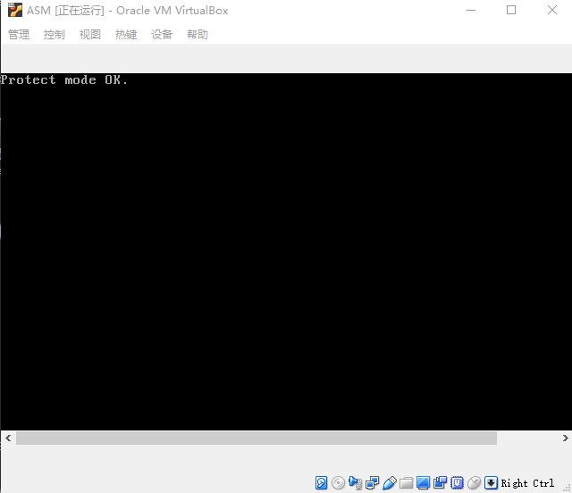

# 1. 全局描述符表

在保护模式下，对内存的访问仍然使用段地址和偏移地址，但是，在每个段能够访问前，必须先进行登记。
登记信息包括段的起始地址、段的界限、以及各种访问属性。
当你访问的偏移地址超出段的界限时，处理器就会阻止这种访问，并产生一个叫做内部异常的中断。

一个段相关的信息需要8个字节来描述，所以称为段描述符（Segment Descriptor），每个段都需要一个描述符。
为了存放这些描述符，需要在内存中开辟出一段空间。
这段空间里，所有的描述符都是挨在一起，集中存放的，这就构成一个描述符表。

最主要的描述符表示全局描述符表（Global Descriptor Table，GDT），所谓全局，意味着该表示为整个软硬件系统服务的。
在进入保护模式前，必须要定义全局描述符表。

为了追踪全局描述符表，处理器内部有一个48位的寄存器，称为全局描述符表寄存器（GDTR）。
该寄存器分为两部分，分别是32位的线性地址和16位的边界。32位的处理器具有32根地址线，可以访问的地址范围是
0x00000000 ~ 0xFFFFFFFF，共2的32次方字节的内存，即4GB内存。
所以，GDTR的32位线性基地址部分保存的是全局描述符表在内存中的起始线性地址，16位边界部分保存的是全局描述符表的边界（界限），其在数值上等于表的大小（总字节数）减一。

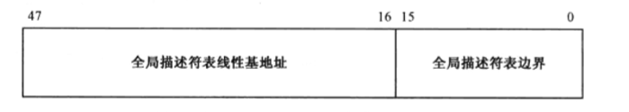

因为GDT的界限时16位的，所以该表最大的字节数是6的16次方，也就是65536字节（64KB）。因为一个描述符占8字节，故最多可以定义8192个描述符。

> 全局描述符表可以位于内存的任何地方。但是，由于在进入保护模式之后，处理器立即要按新的内存访问模式工作。所以，必须在进入保护模式之前定义GDT。但是，由于在实模式下只能访问1MB的内存，故GDT通常都定义在1MB以下的内存范围内。当然，允许在进入保护模式之后换个位置重新定义GDT。

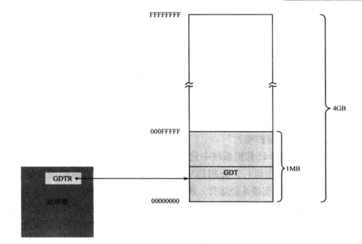

# 2. 段描述符

程序的开始部分要初始化段寄存器。代码5~7行用于初始化栈，使栈段SS的逻辑段地址和代码段CS相同，并使栈指针寄存器SP指向0x7c。这是个分界线，从这里，代码向上扩展，而栈向下扩展。

下面开始定义MBR所使用的数据段DS、代码段CS和栈段SS。在保护模式下，内存的访问机制完全不同，即必须通过描述符来进行。所以，这些段必须重新在GDT中定义。

先是确定GDT的起始线性地址。代码94行，声明了标号gdt_base并初始化了一个双字0x00007e00，我们决定从这个地方开始创建全局描述符表（GDT）。这是有意义的，在实模式下，主引导程序加载位置是0x0000:0x7c00，也就是物理地址0x07c00。因为现在的地址是32位的，所以它现在对应着物理地址0x00007c00。MBR程序供512（0x200）字节，所以，我们决定把GDT设在MBR程序之后，也就是物理地址0x00007e00处。因为GDT最大可以为64KB，所以，理论上，它的尺寸可以扩展到物理地址0x00017dff处。

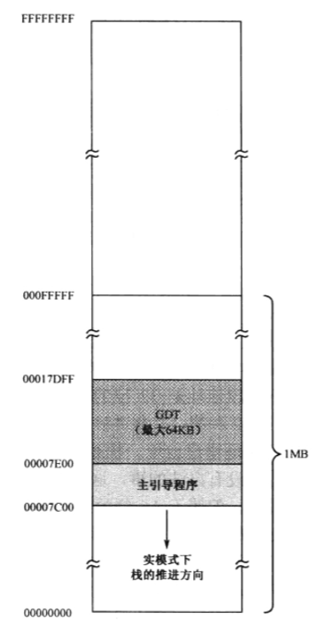

> 保护模式下，在访问内存前必须GDT中定义一个描述符。

一旦确定了GDT在内存中的起始位置，下一步的工作就是确定要访问的段，并在GDT中为这些段创建各自的描述符。

每个描述符在GDT中占8个字节，也就是2个双字，或者说是64位。下图中，下面的是低32位，上面是高32位。

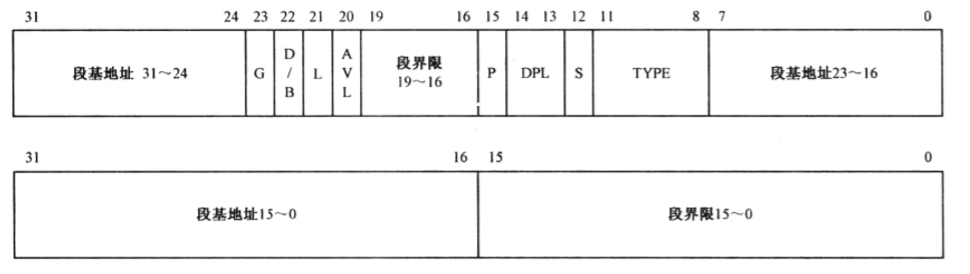

描述符中指定了32位的段起始地址，以及20位（1M）的段边界。

实模式：段地址并非是真实的物理地址，在计算物理地址时，还要左移4位（乘以16）。
32位保护模式：段地址时32位的线性地址，如果未开启分页功能，该线性地址就是物理地址。

描述符中断基地址和段界限不是连续的，把它们分成几段似乎不科学。这是从80286处理上带来的后遗症。80286也是16位处理器，也有保护模式，但属于16位的保护模式。而且，其地址是24位的，允许访问最多16MB内存。尽管80286的16位保护模式没成气候，但是，32位处理器为了保持同80286的兼容，只能在旧的描述符格式上进行扩充，这是不得已的做法。

20位的段界限用来限制段的扩展范围。因为访问内存的方法是用段基地址加上偏移量，所以，对于向上扩展的段，如代码段和数据段来说，偏移量从0开始递增，段界限决定了偏移量的最大值；对于向下扩展的段，如栈段来说，段界限决定了偏移量的最小值。

G位是粒度（Granularity）为，用于解释段界限的含义：
- 当G位是"0"，段界限以字节为单位。（扩展范围是1B ~ 1MB）
- 当G位是"1"，段界限以4KB为单位。（扩展范围是 4Kb ~ 4GB）

S位用于指定描述符的类型（Descriptor Type）：
- 当S位是"0"：表示是一个系统段。
- 当S为是"1"：表示是一个代码段或数据段（栈段也是特殊的数据段）。

DPL表示描述符的特权级（Descriptor Privilege Level，DPL），这两位用于指定段的特权级，共有4种特权级别，
分别是0、1、2、3，其中0是最高特权级别，3是最低特权级别。

P是段存在位（Segment Present），P位用于指示描述符所对应的段是否存在。P位是由处理器负责检查的。每当通过描述符访问内存段时，如果P位是0，处理器就会产生一个异常中断。

D/B位是"默认的操作数大小(Default Operation Size)"或者"默认的栈指针大小(Default Stack Pointer SIze)"，又或者"上部边界(Upper Bound)"标志。
设立该标志位，主要为了能够在32位处理器上兼容运行16位保护模式程序。

- 对于代码段，此位称为D位，用于指定指针中默认的偏移地址和操作数尺寸。D=0表示16位，D=1表示32位。
- 对于栈段，此位称为B位，用于在进行隐式的栈操作室，是使用SP寄存器还是ESP寄存器。<br/> B=0用SP寄存器，B=1用ESP寄存器。<br/> B=0，那么栈段的上部边界（SP寄存器的最大值）为0xFFFF。B=1，那么栈段的上部边界（ESP寄存器的最大值）为0xFFFFFFFF。

L位是64位代码段标志（64-bit Code Segment），保留此位给64位处理器使用。

AVL位（Available），通常由操作系统来用，处理器并不是用它。

TYPE字段供4位，用于指示描述符的子类型，或者说是类别。对于数据段来说，这4位分别是X、E、W、A位；对于代码段来说，这4位分别是X、C、R、A位。

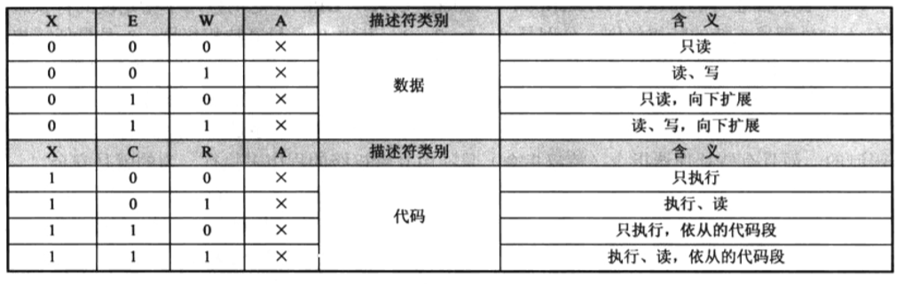

X表示是否可以执行（eXecutable）：
- 数据段总是不可执行的，X=0。
- 代码段总是可以执行的，X=1。

数据段：
- E（Extend）表示段的扩展方向。E=0是向上扩展（数据段），E=1是向下扩展的（栈段）。
- W（Write）表示段的读写属性。W=0段是不允许写入的，否则会引发处理器异常中断；W=1段可以写入。

代码段：
- C（Conforming）表示段是否为特权级依从：
    - C=0，非依从的代码段，这样的代码段可以从它特权级相同的代码段调用，或者通过门调用。
    - C=1，表示允许从低特权级程序到该段执行。
- R（Read）表示段师傅允许读。
    - R=0，表示不能读出，如果试图读一个R=0的代码段，会引发处理器异常中断。
    - R=1，表示可以读出，即可以把这个段的内容当成ROM一样使用。

数据段和代码段：
- A（Accessd）用于指示它所指向的段最近是否被访问过。在描述符创建的时候，应该清零。之后，每当该段被访问时，处理器自动将该位置“1”。

# 3. 安装段描述符并加载GDTR

现在开始安装各个描述符，我们选择还处于实模式下，因此，在GDT中安装描述符，必须将GDT的线性地址（物理地址）
转换成逻辑地址和偏移地址。

GDT的线性地址是我们直接给出的，放在程序中的标号gdt\_base处。代码10行，将GDT线性基地址的低16位传送到寄存器AX中。这里使用了段超越前缀"cs:"，表明是访问代码段中的数据；又因为MBR的实际加载位置是逻辑地址0x0000:0x7c00，故标号gdt\_base处的偏移地址是gdt\_base+0x7c00。

代码11行将GDT线性基地址的高16位传送到寄存器DX。

代码13 ~ 15行将线性基地址转成逻辑地址，方法是将DX:AX除以16，得到的商是逻辑段地址，余数是偏移地址。接着，将AX中的逻辑段地址传送到数据段寄存器DS中，将偏移地址传送到寄存器BX中。

处理器规定，GDT的第一个描述符必须是空描述符，很多时候，处理器和内存单元的初始值会为0，再加上程序设计有问题，就会在无意中用全0的索引来选择描述符。因此，处理器要求将第一个描述符定义成空描述符。

为此，代码18~19行将两个全0的双字分别写入偏移地址为BX和BX+4的地方。

进入保护模式之后必然要从一个代码段开始执行。现在就来定义代码段描述符。

代码22~23行，接着安装代码段描述符，该描述符的低32位是0x7c0001ff，高32位是0x00409800。
该段的基本情况为：
```
    线性基地址为：0x00007C00
    段界限为：0x001FF
    粒度（G=0）：单位是字节，该段的长度为512字节
    属于系统段（S=1）
    32位的段（D=1）
    该段目前位于内存中（P=1）
    段的特权级为0（DPL=00）
    这是一个只能执行的代码段（TYPE=1000）
```
很明显，该描述符所指向的段，就是现在正在执行的MBR所在的区域。

代码28~29行，用于安装数据段描述符。
该段的基本情况为：
```
    线性基地址为0x000B8000
    段界限为：0x0FFFF
    粒度（G=0）。即，该段的长度为64KB
    属于系统段（S=1）
    32位的段（D=1）
    该段目前位于内存中（P=1）
    段的特权级为0（DPL=00）
    这是一个可读写、向上扩展的数据段（TYPE=0010）
```
线性地址0x000b8000就是显存的起始地址，我们要用这个段来显示字符。

代码30-31行，用于安装栈段描述符。
该段的基本情况为：
```
    线性基地址为0x00000000
    段界限为：0x07A00
    粒度（G=0）。即，该段的长度为30KB
    属于系统段（S=1）
    32位的段（D=1）
    该段目前位于内存中（P=1）
    段的特权级为0（DPL=00）
    这是一个可读写、向下扩展的特殊数据段即栈段（TYPE=0010）
```
段界限的值0x07a00加上1（0x07a01），就是ESP寄存器所允许的最小值。当执行push、call这样的隐式栈操作时，处理器会检查ESP寄存器的值，一旦发现小于等于这里指定的数值，会引发异常中断。

好了，现在所有的描述符都已经安装完毕，接下来的工作时加载描述符表的线性基地址和界限到GDTR寄存器，
这要使用lgdt指令，该指令的格式为：
```asm
    lgdt m48    ; lgdt m16&m32
```
这就是说，该指令的操作数是一个48位（6字节）的内存区域。在16位模式下，该地址是16位的；在32位模式下，该地址是32位的。该指令在实模式和保护模式下都可以执行。

在这6字节的内存区域中，要求前（低）16位是GDT的界限值，后（高）32为是GDT的基地址。在初始化状态下（计算器启动后），GDTR的基地址被初始化为0x00000000；界限值为0xFFFF。

> 该指令不影响任何标志位。

代码34行，将GDT表的界限值31写入标号gdt_size所在的内存单元。这里共有4个描述符（包括空描述符），每个描述符占8个字节，一共是32字节。GDT表的界限值是表的总字节数减去一，所以是31。

代码36行，把从标号gdt_size开始的6字节加载到GDTR寄存器：
```asm
    lgdt [cs: gdt_size+0x7c00]
```
因为gdt\_size和gdt\_base是连续声明的，紧挨在一起，所以，从gdt\_size处读取6个字节，就是包括了gdt\_base。注意，到目前为止，我们依然工作在实模式下，指令中的偏移地址都要加上0x7c00。

# 4. A20问题

在即将进入保护模式之前，这里还设计一个历史遗留问题，那就是处理器第21根地址线，编号A20。

在8086处理器上运行程序不存在A20问题，因为它只有20根地址线即（A0 ~ A19）。

实模式下程序只能寻址1MB内存，因为它依赖16位的段地址左移4位，加上16位的偏移地址来访问内存。
当逻辑段地址到最大值0xFFFF时，再加一，就会因进位而绕回到0x0000，因为段寄存器只能保留16位的结果。
至于段内偏移，也是如此。

到了80286时代，处理器有24根地址线，地址回绕高翔不灵了，因此比0x0FFFFF大的数是0x1000000，
80286处理器可以维持24位的地址数据，进位不会被丢弃。为了能在80286处理器上运行8086程序而不会因地址线
而产生问题，它们决定在主板上动一动手脚。

起始问题的解决办法很简单，只需要强制地21根地址线恒为0就可以了。这样，0x0FFFFF加1的进位强制为0，结果是0x000000；再加1，是0x000001，永远和实模式一样。

于是，IBM公司使用一个与门来控制A20，并把这个与门的控制阀放在键盘控制器内，端口是0x60。


80486处理器开始，处理器本身就有了A20M#引脚，意思是A20屏蔽（A20 Mask)，它是低电平有效的。
在ICH控制器（南桥）中端口0x92的位1用于控制A20，叫做A20门控制（Alternate A20 Gate），它通过与门链接到处理器的A20M#引脚，方便快捷，因此成为Fast A20。

端口0x92是可读写的，代码38~40行，先从该端口读出原数据，接着，讲第2位（位1）置"1"，然后再写入该端口，这样就打开了A20。

# 5. 保护模式下内存访问

我们已经到达实模式和保护模式的分界线了。同时，你会发现，控制两种模式切换的开关是一个叫CR0的寄存器。

CR0是处理器内部的控制寄存器（Control Register，CR）。之所以有个0后缀，是因为还有CR1、CR2、CR3和CR4控制寄存器，甚至还有CR8。

CR0是32位的寄存器，包含了一系列用于控制处理器操作模式和运行状态的标志位。
它的第1位（位0）是保护模式使能位（Protection Enable，PE），是开启保护模式大门的钥匙。
如果把该位置1，则处理器进入保护模式，按保护模式的规则开始运行。

保护模式下的中断机制和实模式不同，因此，原有的中断向量表不再适用，而且，在保护模式下，BIOS中断都不能在用，因为它们是实模式下的代码。在重新设置保护模式下的中断环境之前，必须关中断，这就是代码42行的用意。

代码44行，将CR0寄存器的原有内容传送到寄存器EAX，准备修改它；

代码45行，将它的第1位（位0）置1，其他各位保持原来的状态不变；

代码46行，将修改之后的内容重新写回CR0，这导致处理器的运行变成保护模式。

在32位处理器的段寄存器，共有6个：CS、DS、ES、SS、FS和GS。

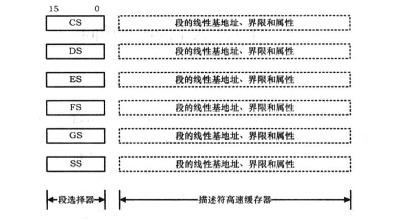

在实模式下，访问内存用的是逻辑地址，即段地址左移4位，加上偏移地址。

例如：
```asm
    mov cx,0x2000
    mov ds,cx
    mov [0xc0],al
    mov cx,0xb800
    mov ds,cx
    mov [0x02],ah
```
以上，首先将段寄存器DS的内容置位0x2000，这是逻辑段地址。接着，向段内偏移地址为0x00c0的地方写入1字节（在寄存器AL中），写入时，处理器将DS的内容左移4位，加上偏移地址，实际写入的物理地址是0x200c0。

在32位处理器上，每当引用一个段时，处理器自动将段地址左移4位，并传送到描述符高速缓存器。
此后，就一直使用描述符高速缓存器的内容作为段地址。所谓引用一个段，就是执行将段地址传送到段寄存器的指令。

例如：
```asm
    jmp 0xf000:0x5000
```
以上是引用代码段的一个例子，因为代码段的修改通常是用jmp和call指令进行的。
如果是引用数据段，则一般采用以下方式：
```asm
    mov ax,0x2000
    mov ds,ax
```
只要不改变寄存器DS的内容，以后每次内存访问都直接使用DS描述符高速缓存器中的内容。
实模式：CS、DS、ES、FS、GS和SS叫做段寄存器。
保护模式：CS、DS、ES、FS、GS和SS叫做段选择器。

**在保护模式下，尽管访问内存时也需要指定一个段，但是传送到段选择器的内容不是逻辑段地址，
而是段描述符在描述符表中的索引号。**

在保护模式下访问一个段时，传送到段选择器的是段选择子。它有三部分组成：
1. 描述符的索引号，用来描述符表中选择一个段描述符。
2. TI是描述符表指示器（Table Indicator），TI=0，表示在描述符GDT中；TI=1，表示描述符在LDT中。
3. RPL是请求特权级，描述给出当前选择子的哪个程序的特权级别。

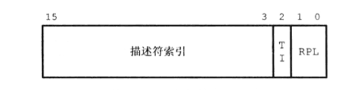

代码54~55行，将选择子0x0010（二进制0000\_0000\_00010\_0\_00）传送到段选择器DS中。
从选择子的二进制形式可以看出，指定的描述符索引号是2，指定的描述符表示GDT，请求特权级RPL是00。

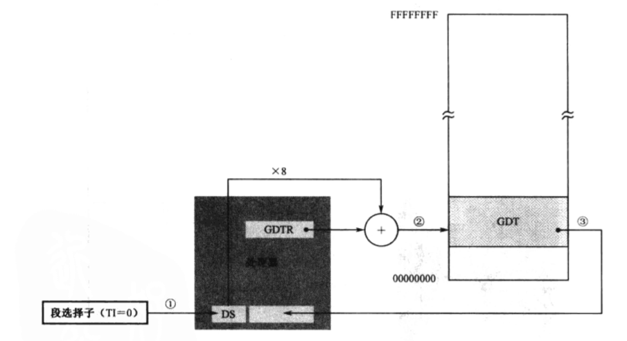

此后，每当有访问内存指令时，就不再访问GDT中的描述符，直接用当前段寄存器的描述符高速缓冲器提供的线性地址。

因此，第58行，因为指令中没有段超越前缀，故默认使用数据段寄存器DS。如下图所示，执行这条指令时，处理器用DS
描述符高速缓存中的线性基地址加上指令中给出的偏移量0x00，形成32位物理地址0x0000b8000，并将字符'P'的ASCII码写入该处。

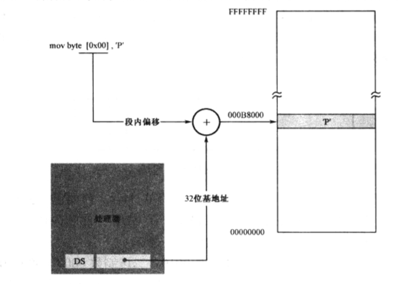

不单单是访问数据段，即使在处理器取指令执行时，也采用了相同的方法。如下图所示，在32位保护模式下，处理器使用的指令指针寄存器是EIP。假设已经从描述符表中选择了一个段描述符，CS描述符高速缓存器已经状态了正确的32位
线性基地址，那么，当处理器取指令时，会自动用描述符高速缓存器中的32位线性基地址加上指令指针寄存器EIP中的32位偏移量，形成32位物理地址，从内存中取得指令并加以执行。同时，EIP的内容自动增加以指向下一条指令。

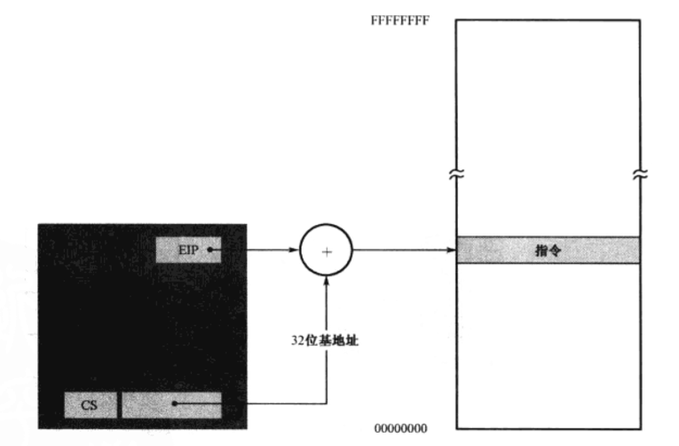

# 6. 清空流水线并串行化处理器

刚刚设置了控制寄存器CR0的PE位，处理器刚刚切换到保护模式下，有两个待解决的问题：

第一，即使在实模式下，段寄存器的描述符高速缓存器也被用于访问内存，仅20位有效，高12位全零。当处理器进入保护模式后，这些内容依然残留着，这些残留的内容在保护模式下是无效的，迟早会在执行某些指令的时候出问题。因此，比较安全的做法事尽快刷新CS、SS、DS、ED、FS和GS的内容，包括它们的段选择器和描述符高速缓存器。

第二，在进入保护模式前，有很多指令已经进入了流水线。因为处理器工作在实模式下，所以它们都按16位操作数
和16位地址长度进行译码的，即使是哪些用bits 32编译的指令。进入保护模式后，受CS段描述符高速缓存器中
实模式残留内容的影响，对于操作数和默认地址大小的解释不通，指令的执行结果可能会不正确，所以必须清空流水线。同时，哪些通过乱序执行得到的中间结果也是无效的，必须清理掉，让处理器串行化执行，即，重新安排指令的自然顺序执行。

处理器遇到jmp或call指令，一般会清空流水线，并串行化执行；另外一方面，远转移会重新加载段选择器CS，
并刷新描述符高速缓冲器中的内容。

> 一个建议的方法是：设置了控制寄存器CR0的PE位之后，立即用jmp或call转移到当前指令流的下一条指令上。

代码49行，用32位远转移指令来转移到挨着当前指令的下一条指令：

```asm
    jmp dword 0x0008:flush
```

**注意，不管你用的是16位远转移，还是32位远转移，因为现在已经处于保护模式下，处理器都将把第一个操作数0x0008视为段选择子，而不是实模式下的逻辑段地址。**

处理器已经进入保护模式，所以，0x0008不在是逻辑段地址，而是保护模式下的段描述符选择子。
在签名定义GDT的时候，它的第2个（1号）描述符对应着保护模式下的代码段。因此，其选择子为0x0008（索引号为1，TI为是0，RPL为00）。当指令执行时，处理器根据段选择子找到段描述符并加载到段选择器CS中，并刷新CS描述符高速缓存。


从进入保护模式开始，之后的指令都应当按32位操作数方式编译的。
因此，代码51行，使用了伪指令[bit 32]。当处理器执行到这里时，它会按32位模式进行译码。

代码54~72行，用于描述符选择子0x10加载到段选择器DS，并自动加载描述符高速缓存器。
因为该数据段实际上是文本模式下的显示缓冲区，用于在屏幕上显示字符串"Protect mode OK"。

> 注意，在保护模式下，不允许使用mov指令改变段选择器CS的内容。

# 7. 保护模式下的栈

## 7.1 关于栈段描述符中的界限值

代码75~77行用于初始化保护模式下的栈。栈段描述符是GDT中的第4个（3号）描述符，栈的32位线性基地址是0x00000000，段界限为0x7a00，粒度为字节，属于可读写、向下扩展的数据段。

栈是向下扩展的，因此，描述符中的段界限，和向上扩展的段含义不同。
- 向上扩展的段：段内偏移量是从0开始递增，偏移量的最大值是界限值和粒度的乘积；
- 向下扩展的段：栈是从高地址向低地址方向推进的，故段内偏移量的最小值是界限值和粒度的乘积加一。

在32位代码中，是用ESP作为栈指针的。因此，这里段界限，用来和段粒度一起，决定ESP寄存器所能具有的最小值：

```
    ESP > 段界限 x 粒度值
```

对于描述符中G位是0的段来说，粒度值是1字节；G位是1的段来说，粒度值是4KB。

## 7.2 检验32位下的栈操作

代码79行，先保存当前栈指针的内容到EBP寄存器；接着，代码80行，向栈中压入立即数。
该立即数位字符'.'的ASCII码，这个值是在编译阶段计算的。

当执行push指令时，所访问的栈，其描述符的B为是1，故处理器在进行栈操作时，用的是32位栈指针寄存器ESP。
它首先将ESP的内容减去4，再写入数值，数据保存的位置是SS:ESP。

理论上，将EBP的内容减去4之后，应该和ESP的内容相同。为了证实这一点，代码82~84行，将原先保存的EBP内容
减去4，再和现行的ESP比较，看是否相等。如果相等，则立即将刚才压入的字符出栈，并显示在前面的字符串后。

当然，如果经过验证，EBP和ESP不相等，那么，就不会显示句点，直接转移到程序最后，执行停机指令。
应为现在已经禁止了中断，故除了NMI，没有任何原因会导致处理器被激活。