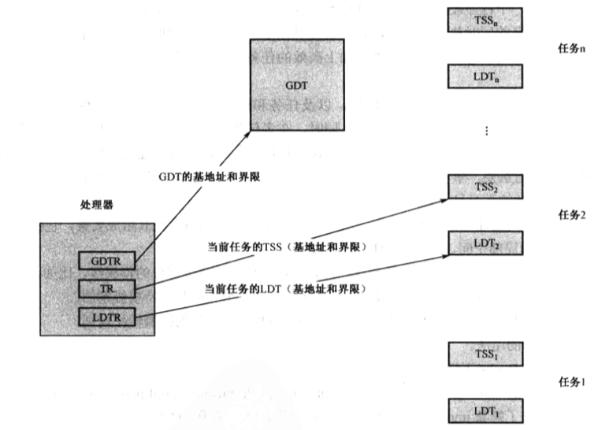
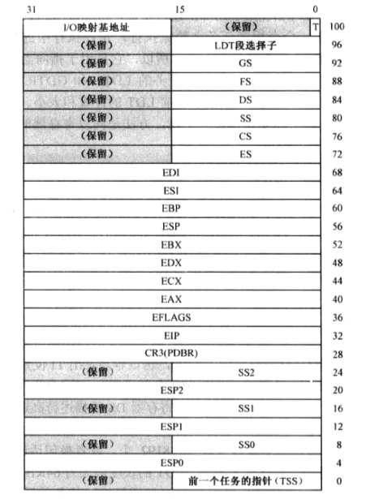
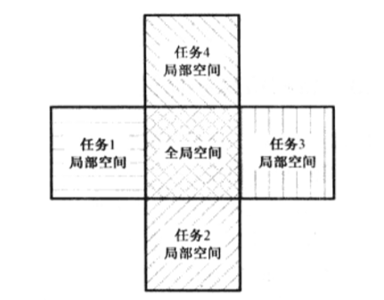
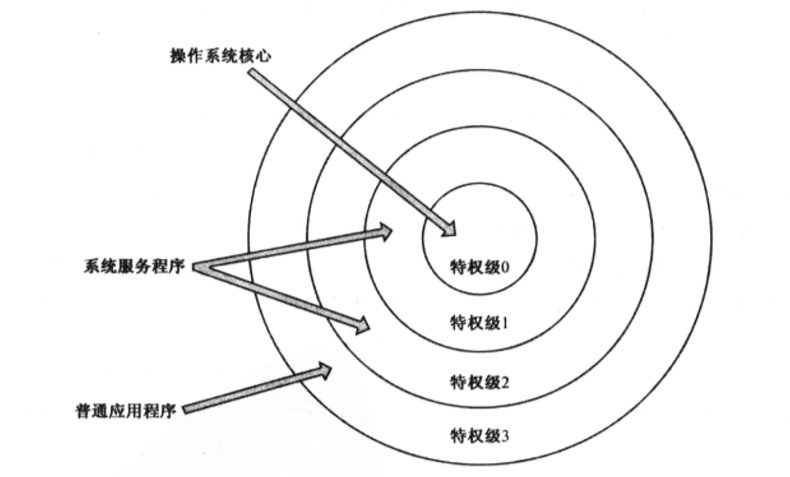
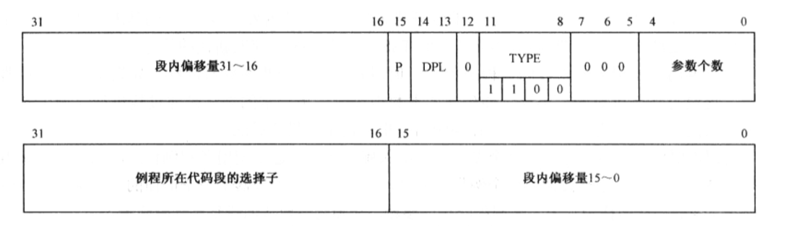
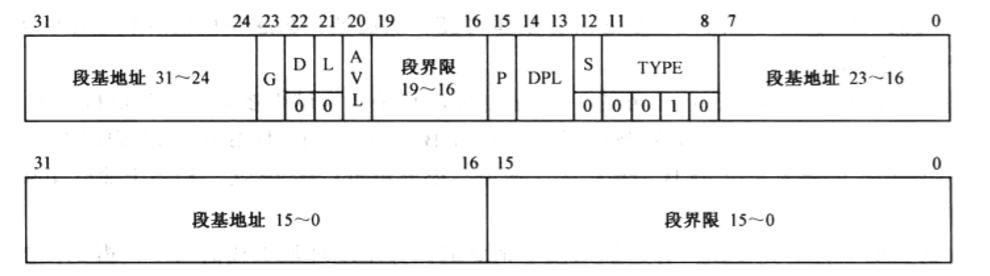
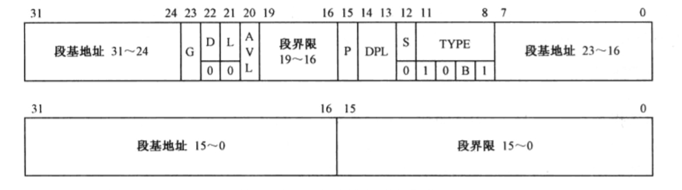
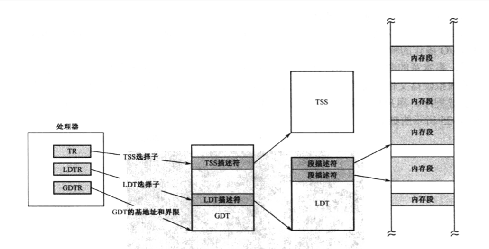

- 1 任务、任务的LDT和TSS
- 2 全局空间和局部空间
- 3 特权级保护概述
- 4 LDT描述符
- 5 TSS描述符

# 1. 任务、任务的LDT和TSS

程序（Program）是记录在文件系统上的指令和数据，总是为了完成某个特定的工作，其正在执行中的一个副本，叫做任务（Task）。

一直以来，我们把所有的段描述符都放在GDT中，而不管它属于内核还是用户程序。
如下图所示，为了有效的在任务之间实施隔离，处理器建议每个任务都应当具有自己的描述符表，称为
局部描述符表LDT(Local Descriptor Table)，并且把专属于自己的那些段放到LDT中。

和GDT一样，LDT也是用来存放描述符的。不同之处在于，LDT只属于某个任务。或者说，每个任务都有自己的LDT，
每个任务私有的段，都应当在LDT中进行描述。另外，LDT的第1个描述符，也就是0槽位，也是有效的、可以使用的。

为了追踪全局描述符表（GDT），访问它内部的描述符，处理器使用了GDTR寄存器，全局描述符表示全局性的，为所有任务服务，是它们所共有的，所以我们需要一个全局描述符表（GDT）就够了。

和GDT不同，局部描述符表（LDT）的数量则不止一个，具体有多少，视任务多少而定。为了追踪和访问这些LDT，处理器使用了局部描述符表寄存器（LDTR）。

在一个多任务的系统中，会有很多任务在流转执行，正在执行中的哪个任务，称为当前任务（Current Task）。因为LDTR寄存器只有一个，所以，它只用于指向当前任务的LDT。每当发生任务切换时，LDTR的内容被更新，以指向新任务的LDT。

和GDTR一样，LDTR包含了32位线性基地址字段和16位段界限字段，以指示当前LDT的位置和大小。

很显然，因为段选择子是16位的，而且只有高13位被用做索引号来访问GDT或LDT，所以，每个LDT所能容纳的描述符个数为2的13次方，即8192个。换句话说，每个LDT只能定义8192个段。又因为每个描述符的长度是8字节，LDT的长度最大为64KB。

在一个多任务的环境中，当任务切换发生时，必须保护旧任务的运行状态，或者说是保护现场，保护的内容包括
通用寄存器、段寄存器、栈指针寄存器ESP、指令指针寄存器EIP、状态寄存器EFLAGS，等等。
否则的话，等下次该任务又恢复执行时，一切都变得茫然。

为了保存任务的状态，并在下次重新执行时恢复它们，每个任务都应当用一个额外的内存区域保存相关信息，这叫做
任务状态段（Task State Segment：TSS）。

如下图所示，任务状态字段TSS具有固定的格式，最小尺寸是104字节，处理器固件能够识别TSS中的每个元素，并在任务切换的时候读取其中的信息。

和LDT一样，处理器用TR寄存器来指向当前任务的TSS。和GDTR、LDTR一样，TR寄存器在处理器中也只有一个。当任务发生的时候，TR寄存器的内容也会跟着指向新任务的TSS。

这个过程是这样的：
1. 首先，处理器当前任务的现场信息保存到由TR寄存器指向的TSS；
2. 然后，再使TR寄存器指向新任务的TSS，并从新任务的TSS中恢复现场。

# 2. 全局空间和局部空间

如下图所示，每个任务实际包含两个部分：全局部分和私有部分。
- 全局部分：是所有任务共有的，含有操作系统的软件和库程序，以及可以调用的系统服务和数据；
- 私有部分：则是每个任务各自数据和代码，与任务所要解决的具体问题有关，彼此并不相同。

任务实际上是在内存中运行的，所以，所谓全局部分和私有部分，其实是地址空间的划分，即全局地址空间和局部地址空间，简称全局空间和局部空间。

地址空间的访问时依靠分段机制来进行的。具体地说，需要现在描述符表中定义各个段的描述符，然后通过描述符来访问它们。因此，全局地址空间是用全局描述符表（GDT）来制定的，而局部地址空间则是由每个任务私有的局部描述符表（LDT）来定义的。

# 3. 特权级保护概述

在分段机制的基础上，处理器引入了特权级，并由固件负责实施特权级保护。

特权级（Privilege Level），也叫特权级别，是存在于描述符以及选择子中的一个数值，当这些描述符或者选择子指向的对象要进行某种操作，或者被别的对象访问时，该数值用来控制它们所能进行的操作，或者限制它们的可访问性。

intel处理器可以识别4个特权级别，分别是 0 ~ 3。

每个描述符都有一个2bit的PDL字段，可以取值为00、01、10、11，分别对应特权级0、1、2和3。
DPL是每个描述符都有的字段，故又称描述符特权级（Descriptor Privilege Level）。
描述符总是指向它所描述的目标对象，代表着该对象，因此，该字段实际上是目标对象的特权级。

在实模式下，段寄存器存放的是段地址；

在保护模式下，段选择器存放的是段选择子，段地址则位于描述符高速缓冲器中。当处理器在一个代码段中取指令和执行指令时，哪个代码段的特权级就叫做当前特权级（Current Privilege Level，CPL）。正在执行的这个代码段，其选择子与段寄选择器CS中，其最低2bit就是当前特权级的数值。

在Linux中：
- 操作系统执行代码时，当前特权级CPL就是0。
- 应用程序开始执行时，当前特权级CPL就是3。

这实际上就是把一个任务分成特权既然不同的两个部分，全局空间是特权级0，而局部空间是特权级3.
当任务在自己的局部空间执行时，可以通过系统调用服务，进入操作系统内核，在全局空间执行时，当前特权级CPL就变成0。

那些只有在当前特权级CPL为0时，才能执行的指令，称为特权指令（Privileged Instruction）。
典型的特权指令包括：
- lgdt
- lldt
- ltr
- 读写控制寄存器的mov指令
- hlt停机指令

特权级之间控制转移的方法使用门。门（Gate）是另一种形式的描述符，称为门描述符，简称门。

段描述符 vs 门描述符：
- 段描述符不同，段描述符用于描述内存段。
- 门描述符则用于描述可执行的代码，比如一段程序、一个例程或者一个任务。

实际上，根据不同的用途，门的类型有好几种：
- 调用门：不同特权之间的过程调用。
- 中断门/陷阱门：中断处理过程。
- 任务门：执行任务切换。

所有描述符都是64位的，调用门描述符也不例外。

调用门（Call-Gate）用于在不同特权级别的程序之间进行控制转移。本质上，它是一个描述符，一个不同于代码段和数据段的描述符，可以安装在GDT或者LDT中。该描述符的格式如下图所述，下面是低32bit，上面是高32bit。

调用门描述符给出了例程所在代码段的选择子，而不是32位线性地址。有了选择子，就能访问描述符表得到代码段的基地址，这样做无非是间接了一点，但却可以在通过调用门进行控制转移时，实施代码段描述符的有效性、段界限和特权级的检查。

- 例程在代码段中的偏移量页在描述符中直接给定的，只是被分成两个16位的部分。很显然，在通过调用门调用例程时，不使用指令中给出的偏移量。

- 描述符中TYPE字段用于表示门的类型，共4比特，值“1100”表示调用门。
- 描述符中的P位是有效位，通常应该是1，当它为0时，调用这样的门会导致处理器产生异常。

如果想通过调用门进行控制转移，可以使用jmp far或者call far指令，并把调用门描述符的选择子作为操作数。

RPL的意思是请求特权级（Requested Privilege Level）。我们知道，要将控制从一个代码段转到另一个代码段，通常使用jmp和call指令，并在指令中提供目的代码段的选择子，以及段内偏移量（入口点）。而为了访问内存中的数据，也必须先将段选择子加载到段选择器DS、EF、FS或GS中。不管是实施控制转移，还是访问数据段，这都可以看成一个请求，请求者提供一个段选择子，请求访问指令的段。从这个意义上来说，RPL也就是请求者的特权级别（Requestor's Privilege level）。

在绝大多数的情况，请求者都是当前程序自己，因此，CPL=RPL。要判断请求者是谁，最简单的方法就是看谁提供了选择子。

# 4. LDT描述符

景观局部描述符表（LDT）和全局描述符表（GDT）都用来存放各种描述符，比如段描述符，但这掩盖不了它们也是内存段的事实。简单说，它们也是段。但是，因为它们用于系统管理，故称为系统的段或系统段。

全局描述符表（GDT）是唯一的，整个系统中只有一个，所以需要用GDTR寄存器保存其线性基地址和段界限即可；
但LDT不同，每个任务一个，所以，为了追踪它们，处理器要求在GDT中安装每个LDT的描述符。当要使用这些LDT时，可以用它们的选择子来访问GDT，将LDT描述符加载到LDTR寄存器。

LDT本身也是一种特殊的段，最大尺寸是64KB。段基地址指示LDT在内存中的起始地址，段界限指示LDT的范围；
- G位：粒度位，0表示字节，1表示4kb。
- D/B位和L位：对LDT描述符来说没有意义，固定位0。
- AVL位和P位：与段描述符相同。
- S位：固定为0，表示系统段描述符或门描述符，相对于存储器的段描述符S=1，因为LDT描述符属于系统段描述符。
- TYPE字段为：0010表明是一个LDT描述符。

# 5. TSS描述符

和局部描述符表（LDT）一样，也必须在GDT中安装TSS的描述符。这样做，一方面是为了对TSS进行段和特权的检查；另一方面，也是执行任务切换的需要。当call far和jmp far指令的操作数是TSS描述符选择子时，处理器执行任务切换操作。

和LDT描述符差不多，除了TYPE位。

TSS描述符宏的B位是“忙”位（Busy）。在任务刚刚创建的时候，它应该为二进制的1001，即B位是0，表示任务不忙。
当任务开始执行时，或者处于挂起状态（临时被中断执行）时，有处理器固件把B位置1。

任务是不可重入的。就是说，在多任务环境中，如果一个任务是当前任务，它可以切换到其他任务，但不能从自己切换到自己。在TSS描述符中设置B位，并由处理器固件进行管理，可以防止这种情况的发生。

