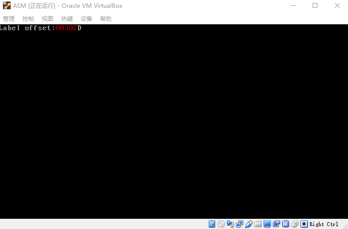
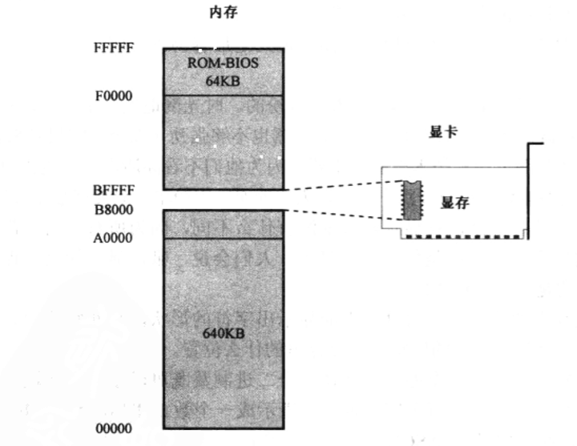
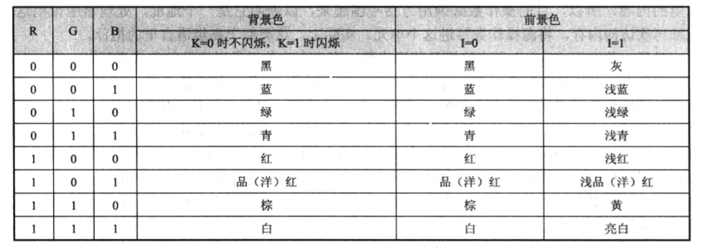
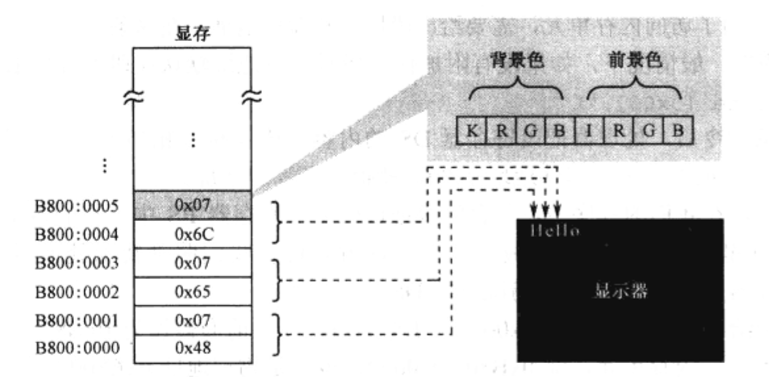

- 概述
- 1 MBR
- 2 注释
- 3 在屏幕行显示文字
    - 3.1 显卡与显存
    - 3.2 初始化段寄存器
    - 3.3 显存的访问和ACSII编码
    - 3.4 显示字符
    - 3.5 MOV指令的格式
    - 3.6 显示标号的汇编地址
        - 3.6.1 标号
        - 3.6.2 如何显示十进制数字
        - 3.6.3 在程序中声明并初始化数据
        - 3.6.4 分解数的各个数位
        - 3.6.5 显示分解出来的各个位数
    - 3.7 是程序进入无限循环状态
    - 3.8 完成主引导区有效标志

# 概述

本章学习知识：
1. NASM汇编语言源程序的一般组成部分，如标号、指令、伪指令和注释等。
2. 进一步学习mov指令和jmp指令的更多用法，以及加法指令add、除法指令div和异或指令xor的用法。
3. 处理的工作是取指令、执行指令，包括数据访问。而这一切，都是通过分段机制来完成的。通过编写程序、分析程序的执行过程，观察程序的执行结果，进一步加深对内存分段访问机制的感性认识和对处理工作过程的理解。

mbr.asm
```asm
; 文件名：mbr.asm
; 文件说明：硬盘主引导扇区代码

mov ax,0xb800                 ; 指向文本模式的显示缓冲区
mov es,ax

; 以下显示字符串"Label offset:"
mov byte [es:0x00],'L'
mov byte [es:0x01],0x07
mov byte [es:0x02],'a'
mov byte [es:0x03],0x07
mov byte [es:0x04],'b'
mov byte [es:0x05],0x07
mov byte [es:0x06],'e'
mov byte [es:0x07],0x07
mov byte [es:0x08],'l'
mov byte [es:0x09],0x07
mov byte [es:0x0a],' '
mov byte [es:0x0b],0x07
mov byte [es:0x0c],"o"
mov byte [es:0x0d],0x07
mov byte [es:0x0e],'f'
mov byte [es:0x0f],0x07
mov byte [es:0x10],'f'
mov byte [es:0x11],0x07
mov byte [es:0x12],'s'
mov byte [es:0x13],0x07
mov byte [es:0x14],'e'
mov byte [es:0x15],0x07
mov byte [es:0x16],'t'
mov byte [es:0x17],0x07
mov byte [es:0x18],':'
mov byte [es:0x19],0x07

mov ax,number                 ; 取得标号number的偏移地址
mov bx,10

; 设置数据段的基地址
mov cx,cs
mov ds,cx

; 求个位上的数字
mov dx,0
div bx
mov [0x7c00+number+0x00],dl   ; 保存个位上的数字

; 求十位上的数字
xor dx,dx
div bx
mov [0x7c00+number+0x01],dl   ; 保存十位上的数字

; 求百位上的数字
xor dx,dx
div bx
mov [0x7c00+number+0x02],dl   ; 保存百位上的数字

; 求千位上的数字
xor dx,dx
div bx
mov [0x7c00+number+0x03],dl   ; 保存千位上的数字

; 求万位上的数字
xor dx,dx
div bx
mov [0x7c00+number+0x04],dl   ; 保存万位上的数字

; 以下用十进制显示标号的偏移地址
mov al,[0x7c00+number+0x04]
add al,0x30
mov [es:0x1a],al
mov byte [es:0x1b],0x04

mov al,[0x7c00+number+0x03]
add al,0x30
mov [es:0x1c],al
mov byte [es:0x1d],0x04

mov al,[0x7c00+number+0x02]
add al,0x30
mov [es:0x1e],al
mov byte [es:0x1f],0x04

mov al,[0x7c00+number+0x01]
add al,0x30
mov [es:0x20],al
mov byte [es:0x21],0x04

mov al,[0x7c00+number+0x00]
add al,0x30
mov [es:0x22],al
mov byte [es:0x23],0x04

mov byte [es:0x24],'D'
mov byte [es:0x25],0x07

infi: jmp near infi                 ; 无限循环

number db 0,0,0,0,0

times 203 db 0
db 0x55,0xaa

```

> 编译：nasm -f bin mbr.asm -o mbr.bin

**运行效果：**



# 1. MBR

处理器加电或者复位之后，如果硬盘是首选的启动设备，那么，ROM-BIOS将试图读取硬盘的 0 面 0 磁道 1 扇区。传统上，这就是主引导扇区（Main Boot Sector，MBR）。

一个有效的主引导扇区，其最后两字节应当是 0x55 和 0xAA 。ROM-BIOS程序首先检测这两个标志，如果主引导扇区有效，则以一个段间转移指令 jmp 0x0000:0x7c00 跳到那里继续执行。

一般来说，主引导扇区是操作系统负责的。正常情况下，一段精心编写的主引导扇区代码将检测用来启动计算器的操作系统，并计算出它所在的硬盘位置。然后，它把操作系统的自举代码加载到内存，也用 jmp 指令跳转到哪里继续执行，直到操作系统完全启动。

# 2. 注释

注释必须以英文字母 ; 开始。

# 3. 在屏幕行显示文字

## 3.1 显卡与显存

**显卡：** 是为显示器提供内容，并控制显示器的显示模式和状态。

**显存：** 显卡有自己的存储器，因为它位于显卡上，故称显示存储器（VRAM），简称显存，要显示的内存都预先写入显存。

**显卡工作模式：** 传统上，仅用于显示字符的工作方式称为文本模式。文本模式和图形模式是显卡的两个基本工作模式，可以用指令访问显卡，设置它的显示模式。在不同的工作模式下，显卡对显存内存的解释是不同的。

**内存地址空间：** 把显存映射到处理器可以直接访问的地址空间。

8086可以访问 1MB 内存。其中，0x00000 ~ 9FFFF 属于常规内存，有内存条提供， 0xF000 ~ 0xFFFFF 由主办的一个芯片提供，即 ROM-BIOS。



这样一来，中间还有一个 320KB 的空洞， 即 0xA0000 ~ 0xEFFFF。传统上，这段地址空间由特定的外围设备来提供，其中就包含显卡。

由于历史的原因，所有在个人计算机上使用的显卡，在加点自检之后会把自己初始化到 80X25 的文本模式。在这种模式下，屏幕上可以显示 25 行，每行 80 个字符，每屏总共 2000 个字符。

## 3.2 初始化段寄存器

和访问主存一样，为了访问显存，页需要使用 **逻辑地址** ，也就是采用“段地址:偏移地址”的形式，这是处理器的要求。

文本模式下显存的起始物理地址时 0xB8000 ，这块内存可以看成是段地址为 0xB800 ，偏移从 0x0000 ~ 0xFFFF的区域，因此我们可以把段地址定为 0xB800 。

访问内存可以使用段寄存器 DS，但是这不是强制性的，也可以使用 ES。因为 DS 还有别的用处，所以这里我们使用ES来指向内存所在的段。

```asm
    mov ax, 0xb800
    mov es, ax
```

## 3.3 显存的访问和ACSII编码

在计算器中，每个用来显示在屏幕上的字符，都有一个二进制代码。这些代码和普通的二进制数字没有什么不同，唯一的区别在于，发送这些数字的硬件和接收这些数字的硬件把它们解释为字符，而不是指令或者用于计算的数字。


**ASCII：** 定义了主机与显示器之间交换信息的编码。

> ASCII是7位代码，只用了一个字节中的低7bit，最高位通常为0。这意味ASCII只包含128个字符的编码。

屏幕上的每个字符对应着显存中的两个连续字节，前一个是字符的 ASCII 编码，后面是字符的显示属性，包括字符的颜色（前景色）和底色（背景色）。

**字符的显示属性：** 总共1字节分为两部分，低 4bit 定义的是前景色，高 4bit 定义的是背景色。
-  **颜色表示：** 色彩主要由R、G、B这 3bit 表示。
- **K是闪烁位：** 为 0 时不闪烁，为 1 时闪烁。
- **I是亮度位：** 为 0 时正常亮度，为 1 时呈高亮。



如下图所示，字符属性 0x07 可以解释为黑底白字，无闪烁，无高亮。



## 3.4 显示字符

为了方便，多数汇编语言编译器允许在指令中直接使用字符的字面值来代替数值形式的ASCII码。

```asm
    mov byte [es:0x00], 'L'
```

等价于

```asm
    mov byte [es:0x00], 0x4c
```

mov 指令是将立即数传送到内存单元，目的操作数是内存单元，源操作数是立即数（ASCII代码）。

为了访问内单元，需要给出段地址和偏移地址。在下列这条指令中，编译地址 0x00，段地址在哪里呢？一般情况下，如果没有附加任何提示，段地址默认在段寄存器 DS 中。

```asm
    mov byte [0x00], 'L'
```

当执行这条指令后，处理器把段寄存器 DS 的内容左移 4 位，加上这里的偏移地址 0x00，就得到了物理地址。

关键字 “byte” 用来修饰目的操作数，指出本次传送是以字节的方式进行的。在 16 位的处理器上，单次操作的数据宽度可以是 8 位，也可以使 16 位。

## 3.5 MOV指令的格式

mov 指令用于数据传送。目的操作数的作用相当于一个“容器”，故必须是通用寄存器或者内存单元；源操作数，页可以是和目的操纵数具有相同数据宽度的通用寄存器和内存单元，还可以是立即数。

## 3.6 显示标号的汇编地址

### 3.6.1 标号

处理器访问内存时，采用的是“段地址:偏移地址”的模式。对于任何一个内存段来说，段地址可以于任何 16 字节对齐的地方，偏移地址则总是从 0x0000 开始递增。

为了支持这种内存访问模式，在源程序的编译阶段，编译器会把源程序整体作为一个独立的段来处理，并从 0 开始计算和追踪每一条指令的地址。因为该地址时在编译期间计算的，故称为**汇编地址**。汇编地址时在源程序编译期间，编译器为每条指令确定的汇编位置（Assembly Position），指示该指令相对于程序或者段起始处的激励，以字节为单位。当变异后的程序装入物理内存后，它又是该指令在内存段内的偏移地址。

标号之后的冒号是可选的：
```asm
    infi jmp near infi
```
等价于
```asm
    infi:
        jmp near infi
```

### 3.6.2 如何显示十进制数字

标号代表并指示它**所在位置处的汇编地址**。现在，我们要编写指令，在屏幕上把这个地址的数值显示出来。为此，源程序需要获取标号所代表的汇编地址：

```asm
    mov ax,number
```

在编译阶段，编译器会将标号 number 转换成立即数。
标号的 number 的汇编地址时 0x012e，因此，这条语句其实等价于：

```asm
    mov ax, 0x012e
```

十六进制数 0x12e 等于十进制数 302，但是，通过前面对字符显示原理的介绍，我们应该清楚，直接把寄存器 AX 中的内存传送到显示缓冲区，是不可能在屏幕上出现 302 的。

解决这个问题的办法是将它的每个数位淡出拆分出来，这需要不停的除以10。

考虑到寄存器 AX 是 16 位的，可以表示的数从 0 ~ 65535，故它可以容纳最大5个数位的十进制数，从个位到万位。

例如：61238
```
    1. 用 61238 除以 10，商为 6123，余8，本次相除的余数 8 就是个位数字；
    2. 把上一次的商 6123 作为被除数，再次除以 10，商为 612，余 3，余数 3 就是十位上的数；
    3. 把上一次的商 612  作为被除数，再次除以 10，商为  61，余 2，余数 2 就是百位上的数；
    4. 把上一次的商 61   作为被除数，再次除以 10，商为   6，余 1，余数 1 就是千位上的数；
    5. 把上一次的商 6    作为被出示，再次除以 10，商为   0，余 6，余数 6 就是万位上的数。
```
很显然，只要把AX的内容不停地除以 10，只需要 5 次，把每次的余数反向组合到一起，就是原来的数字。

因为它们是数字，而非ASCII代码。比如，数字 0x05 和字符 '5' 是不同的，后者实际上是数字 0x35。

观察ASCII表，你会发现，字符 '0' 的ASCII代码是 0x30，字符 '1' 的ASCII代码是 0x31。字符 '9' 的ASCII代码是 0x39。这就是说，把每次相除得到的余数加上 0x30，在屏幕上显示就没问题了。

### 3.6.3 在程序中声明并初始化数据

可以用处理提供的触发指令来分解一个数的各个数位，但是每次除法操作后得到的数位需要临时保存起来以备后用。使用寄存器太不现实，因为它的数量很少，且还要在后续的指令中使用。因此，最好的办法是在内存中专门留出一些空间来保存这些数位。

要放在程序中的数据时用 DB 指令来声明，DB的意思是声明字节（Declare Byte），所以，跟在它后面的操作数都占一个字节的长度。注意，如果要声明超过一个以上的数据，各个操作数之间必须以逗号隔开。

DB、DW、DD和DQ并不是处理器指令，它只是编译器提供的汇编指令，所以称做伪指令（pseudo Instruction）。

### 3.6.4 分解数的各个数位

下列代码，是把代码段寄存器CS的内容传送到通用寄存器CX，然后再从CX传送到数据段寄存器DS。在此之后，数据段和代码段都指向同一个段。之所以这么做，是因为我们刚才声明的数据和指令代码混在一起。

```asm
    mov cx,cs
    mov ds,cx
```

8086处理器提供了除法指令div，它可以做两种类型的除法。

1. 16位的二进制数除以8位的二进制数。在这种情况下，被除数必须在寄存器AX中，必须事先传送到AX寄存器中。除数可以由8位的通用寄存器或者内存单元提供。指令执行后，商在寄存器AL中，余数在寄存器AH中。例如：
```
    div cl
    div byte [0x0023]
```
第一条指令中，寄存器CL用来提供8位的除数。假如AX中的内容是0x0005，CL中的内容是0x02，指令执行后，CL中的内容不变，AL中的商是0x02，AH中的余数是0x01。

后一条指令中，除数位于数据段内偏移地址为0x0023的内存单元里。这条指令执行时，处理器将数据段寄存器DS的内容左移4位，加上偏移地址0x0023以形成物理地址。然后，处理器在次访问内存，从那个物理地址处取得一个字节，作为除数同寄存器AX做一次除法。

2. 32位的二进制数除以16位的二进制数。在这种情况下，因为16位的处理器无法直接提供32位被除数，故要求被除数的高16位在DX中，低16位在AX中。

xor指令：目的操作数通常是通用寄存器和内存单元，源操作数可以是通用寄存器、内存单元和立即数。一般滴，xor指令的两个操作数应当具有相同的数据宽度。

指令 xor dx,dx 中的目的操作数与源操作数相同，那么，不管DX中的内容是什么，两个相同的数字异或，其结果必定为0，故这相当与将DX清零。


### 3.6.5 显示分解出来的各个位数

经历 5 次除法操作，可以将寄存器 AX 中的数分解成独立的位数，下面的任务是将这些数位显示出来，方法是从DS指向的数据段依次取出这些数位，并写入ES指向的附加段（显示缓冲区）。

add指令需要两个操作数，目的操作数可以是8位或者16位的通用寄存器，或者指向8位或16位实际操作数的内存地址；源操作数可以使相同数据宽度的8位或者16位的通用寄存器、指向8位或者16位实际操作数的内存地址，或者立即数，但不允许两个操作数同时为内存单元，相加后，结果保存在目的操作数中。


## 3.7  是程序进入无限循环状态

处理器取指令、执行指令是依赖于段寄存器 CS 和 指令寄存器 IP 的，8086处理器取指令时，把 CS 的内容左移4位，加上IP的内容，形成 20 位的物理地址，取得指令，然后执行，同时把 IP 的内容加上当前指令的长度，以指向下一条指令的偏移地址。

我们在程序执行完毕后，安排了一个无限循环：

```asm
    infi: jmp near infi
```

jmp 是转移指令，用于使处理器脱离当前的执行序列，跳转到指定的地方执行，关键字 near 表示目标位置依然在当前代码段内。

jmp 指令有很多种格式。最典型地，它的操作数可以是直接给出的段地址和偏移地址，这称为绝对地址。

```asm
    jmp 0x5000:0xf0c0
```

## 3.8 完成主引导区有效标志

计算机的设置者们决定，一个有效的主引导扇区，其最后两个字节的数据必须是 0x55 和 0xAA。

定义这两个字节很简单，伪指令 db 和 dw 就可以实现。

dw版本，可以写成：

```asm
    dw 0xaa55
```
因为，在 Intel 处理上，将一个字节写入内存使，是采用低端字节序，低字节 0x55 置入低地址端（在前），高字节 0xaa 在高地址端（在后）。

在前面的内容和结尾 0xAA55 之间，有 203 字节的空洞。因此，需要 203 个 0 值来填补。

为了方便，伪指令 times 可用于重复它后面的指令若干次。例如：
```asm
    times 20 mov ax, bx
```
将在编译时，重复生成mov ax,bx 指令 20 次，即重复指令的操作码（89 D8）20次。

因此：
```asm
    times 203 db 0
```
将在编译时，保留 203 个 为 0 的字节。