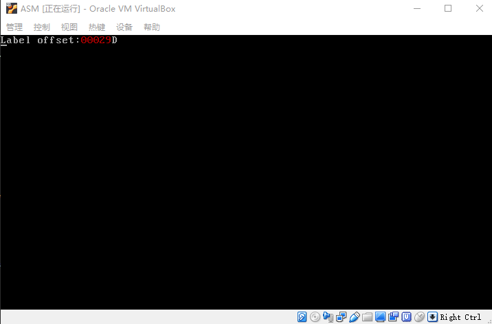
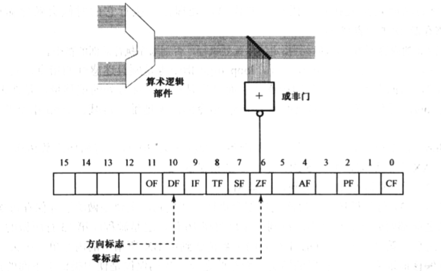

- 概述
- 1 跳过非指令的数据区
- 2 在数据声明中使用字面值
- 3 段地址的初始化
- 4 段之间批量数据传送
- 5 使用循环分解数位
- 6 计算机中的负数
    - 6.1 无符号数和有符号数
    - 6.2 处理器视角中的数据类型
- 7 数位的显示
- 8 其他标志位和条件转移指令
    - 8.1 奇偶标志位PF
    - 8.2 进位标志CF
    - 8.3 溢出标志OF
    - 8.4 现有指令对标志位的影响
    - 8.5 条件转移指令
- 9 NASM编译器的$和$$标记

# 概述

本章学习知识：
1. 一种不同的分段方法，从另一个不同的角度理解处理器的分段内存访问机制。
2. 非顺序的程序流控制方法，即循环和条件转移。
3. 认识几种新指令，包括 movesb、movesw、inc、dec、cld、std、div、neg、cbw、cwd、sub、idiv、jcxz、cmp等。
4. 认识intel8086标志寄存器flags的各个标志位，了解条件转移指令。
5. 认识计算机的负数。

mbr.asm
```asm
; 文件名：mbr.asm
; 文件说明：硬盘主引导扇区代码

jmp near start
         
mytext db 'L',0x07,'a',0x07,'b',0x07,'e',0x07,'l',0x07,' ',0x07,'o',0x07,\
            'f',0x07,'f',0x07,'s',0x07,'e',0x07,'t',0x07,':',0x07
number db 0,0,0,0,0
  
start:
    mov ax,0x07c0                 ; 设置数据段基地址 
    mov ds,ax
         
    mov ax,0xb800                 ; 设置附加段基地址 
    mov es,ax
         
    cld
    mov si,mytext                 
    mov di,0
    mov cx,(number-mytext)/2      ; 实际上等于 13
    rep movsw
     
    ; 得到标号所代表的偏移地址
    mov ax,number
         
    ; 计算各个数位
    mov bx,ax
    mov cx,5                      ; 循环次数 
    mov si,10                     ; 除数 

digit: 
    xor dx,dx
    div si
    mov [bx],dl                   ; 保存数位
    inc bx 
    loop digit
         
    ; 显示各个数位
    mov bx,number 
    mov si,4
    
show:
    mov al,[bx+si]
    add al,0x30
    mov ah,0x04
    mov [es:di],ax
    add di,2
    dec si
    jns show
         
    mov word [es:di],0x0744

    jmp near $

    times 510-($-$$) db 0
    db 0x55,0xaa
```
> 编译：nasm -f bin mbr.asm -o mbr.bin

运行效果：



# 1. 跳过非指令的数据区

一般来说，所有的处理器指令都应当顺序存放，在它们中间不允许夹杂非指令的普通数据，应为它们不能作为指令执行。但是，如果有办法让处理器执行不到这些非指令的内容，则又另当别论。

```asm
    jmp near start
```

这条指令，机器指令的操作码是0xE9，操作数是一个16位的相对偏移量，这叫做相对近转移。

# 2. 在数据声明中使用字面值

定义一个专门存放字符串的数据区，当要显示它们的时候，再用指令取出来，一个一个地传送到显示缓冲区。这样一来，负责在屏幕上显示的指令和要显示的内容无关了。

# 3. 段地址的初始化

```asm
    mov [0x7c00+number+0x00],dl
```

在主引导程序中，访问内存的指令很多，如果都要加上 0x7c00 无疑是很麻烦的，这个我们已经看到了。其实，产生这个问题的根源，就是因为程序在加载时，没有从段内偏移地址 0 的地方开始。

intel处理器的分段策略还是很灵活的，逻辑地址 0x0000:0x7c00 对应的物理地址是0x07c00，该地址又是段 0x07c0 的起始地址。因为，这个物理地址其实还对应着零一个逻辑地址 0x07c0:0000 。

我们把这512字节的区域看成一个独立的段，段的基地址是 0x07c0吗，段长度 512 字节。

# 4. 段之间批量数据传送

把数据从内存中的一个地方批量地传送（复制）到另一个地方，处理器把它们开成是数据串。但是，movsb的传送是以字节为单位的，而movsw的传送石以字为单位的。

movsb和movsw指令的执行时：
    原始数据串的段地址由DS指定，偏移地址由SI指定，简写为DS:SI；
    目的数据串的段地址由ES指定，偏移地址由DI指定，简写为ES:DI；
    传送的次数由 CX 指定。

传送方向：
1. 正向传送：从内存区域的低地址端到高地址端，每传送一个字节(movsb)或一个字(movsw)，SI和DI +1 或 +2。
2. 反向传送：从内存区域的高地址端到低地址端，每传送一个字节(movsb)或一个字(movsw)，SI和DI -1 或 -2。

> 不管是正向传送还是反向传送，也不管每次传送的是字节还是字，没传送一次，CX的内容自动 -1。
    
在8086处理器里，有一个特殊的寄存器，叫做标志寄存器FLAGS。它的第 6 位是 ZF（Zero Flag），即零标志。

当处理器执行一条算数或者逻辑运算指令后，算数逻辑部件送出的结果除了送到指令中指定的位置（目的操作数指定的位置）外，还送到一个或非门。或非门的输出到一个触发器，这就是标志寄存器的ZF位。就是说，如果计算结果为0，这一位被置1，表示计算结果为零时“真”的；否则清除此位（置0）。



除此之外，它也允许通过指令设置一些标志，来改变处理器的运行状态。例如，第10位是方向标志DF（Direction Flag），通过将这一位清零或者置1，就能控制movsb和movsw的传送方向。

指令cld，这是个无操作数的指令，用于清零DF标记位，以指示传送是正方向的即从低地址到高地址。
指令std，这是个无操作数的指令，用于置位DF标记位，以指示传送是反方向的即从高地址到低地址。

单纯的movsb和movsw只能执行一次，如果希望处理器自动地反复执行，需要加上指令前缀rep（repeat），意思是CX不为零则重复。

# 5. 使用循环分解数位

loop指令的功能是重复执行一段相同的代码，处理器在执行它的时候会顺序做两件事：
1. 将寄存器CX的内容减 1 ；
2. 如果寄存器CX的内容不为零，转移到指定的位置处执行，否则顺序执行后面的指令。

在8086处理器上，如果要用寄存器来提供偏移地址，只能使用BX、SI、DI、BP，不能使用其他寄存器。
原因很简单，寄存器BX最初的功能之一就是用来提供数据访问的基地址，所以又叫基地址寄存器（Base Address Register）。之所以不能用 SP、IP、AX、CX、DX，这是一种硬性规定，说不上有什么特别的理由。

在设计8086处理器时，每个寄存器都有自己的特殊用途，比如：
- AX是累加器（Accumulator）；
- DX是数据（Data）寄存器，除了作为通用的寄存器使用外，还专门用于和外设之间进行数据传送；
- SI是源索引寄存器（Source Index）和DI是目标索引寄存器（Destination Index），用于数据传送操作。

> 注意，可以在任何带有内存操作数的指令中使用BX、SI或者DI提供偏移地址。

inc是加一指令，操作数可以是8位或者16位的寄存器，也可以是字节或者字内存单元。

dec是减一指令，操作数可以是8位或者16位的寄存器，也可以是字节或者字内存单元。

例如：

```asm
    inc al
    inc byte [bx]
    inc word [label]
```

第一条指令执行时，处理器将寄存器AL中的内容加一；

第二条指令执行时，将寄存器BX所指向的内存单元的内容加一，也就是说，处理器用段寄存器DS的内容左移4位，加上寄存器的内容，形成20位物理地址。然后，将该地址处的内容（字节）加一。

第三条指令做的和第二条指令相同的事情，但是偏移地址是用标号给出的。关键字“word”表明它操作的是内容中的一个字，段地址在段寄存器DS中，偏移地址等于标号label在编译阶段的汇编地址。

# 6. 计算机中的负数

## 6.1 无符号数和有符号数

正数都很好理解：

```
    128 = 1000 0000b = 0x80
      0 = 0000 0000b = 0x00
```
真正麻烦在于后面的负数，比如 -1，它在编译的时候编译器会怎么做呢？

它很笨，但是也很聪明。因为 -1 其实等于 0-1，它就知道可以做一次减法。当然，这个减法，不是你已经熟悉的十进制减法，这没有用，你得做二进制的减法，也就是用二进制数 0 减去二进制数 1，结果是：

```
    ***1111111111111111
```
注意左边的*号代表省略，这是因为在相减的过程中，不停地向左边借位的结果。

在比如十进制数 -2，可以用 0-2 来得到，在二进制的世界里，该减法是二进制数 0 减去二进制数 10，结果是：
```
    ***1111111111111110
```
同样，相减的过程要向左借位，所以这个数字相当长。但是，最右边那一位是0。


```bash
[root@lab ~]# cat num.asm
db 128,127,3,2,1,0,-1,-2,-3,-127,-128

[root@lab ~]# nasm -f bin num.asm

[root@lab ~]# hexdump -C num
00000000  80 7f 03 02 01 00 ff fe  fd 81 80                 |...........|
```

对应列表：

```
 128   127    3   2    1     0   -1  -2  -3  -127    -128
  80    7F   03  02   01    00   FF  FE  FD    81      80
```  

0x80即是十进制数128，又是十进制-128，到底哪一个是正确的呢？

一个良好的解决方案是，将计算机中的数分成两大类：无符号数和有符号数。

无符号数的意思是我们不关心这些数的符号，因此也就无所谓正负，反正它们就是数而已。

有符号数是分正、负的，而且规定，数的正负是通过它的最高位来辨别。如果最高位是0，它就是正数；如果是1，它就是负数。

如此一来，在8位的字节运算环境中，正数的范围是 0000 0000 ~ 0111 1111，即十进制数的 0 ~ 127；
负数的范围是 1000 0000  ~ 1111 1111，即十进制的 -128 ~ -1。

正的有符号数，与它同值的无符号数相同。但是负数就不同了，在这里，1000 0000 ~ 1111 1111 这些负数，都是用0减去它们相对应的正数得到的。
想知道它们各自对应的正数是谁吗？很简单，因为“负数的负数”是正数，所以只需要用0减去这个负数就行了。例如：
```
    0000 0000 - 1000 0000 = 1000 0000 （十进制数128）
    0000 0000 - 1111 1111 = 0000 0001 （十进制数1）
```
所以，1000 0000 ~ 1111 1111 这个范围内的有符号数，对应着十进制数-128 ~ -1。

在8086处理器中，有一条指令专门做这件事，他就是neg。它的功能很简单，用 0 减去指令中指定的操作数。

一个8位的有符号数，要想用16位的形式来表示，只需将其最高位（辨别符号的那一位），扩展到高8位即可。为了方便，
处理器专门设计了两条指令来做这件事：cbw（Convert Byte to Word）和cwd（Convert Word to Double-world）。


cbw没有操作数，操作码98。它的功能是，将寄存器AL中的有符号数扩展到整个AX。

cwd没有操作数，操作码99。它的功能是，将寄存器AX中的有符号数扩展到DX:AX。

> 尽管有符号数的最高位通常称为符号位，但并不意味着它仅仅用来表示正负号。事实上，通过上面的讲述和实例可以看出，
它既是数的一部分，和其他比特一起共同表示数的大小，同时又用来判断数的正负。

## 6.2 处理器视角中的数据类型

几乎所有的处理器指令能操作无符号数、又能操作有符号数。但是有几条指令除外，比如除法指令和乘法指令。

我们已经接触过除法指令div。严格地说，它应该叫做无符号除法指令（Unsigned Divide），因为这条指令只能工作于无符号数。

例如：
```asm
    mov ax,0x0400
    mov bl,0xf0
    div bl  ; 执行后，AL中的内容为 0x04，即十进制4。
```
从无符号的角度来看，0x0400等于十进制1024，0xf0等于十进制数240。相除后，寄存器AL中的商为0x04，即十进制数4，完全正确。

但是，从有符号的角度来看，0x0400等于十进制数124，0xf0等于十进制数-16。理论上，相除后，寄存器AL结果应当是0xc0。
因其最高位是“1”，故为负数，即十进制数位-64。

为了解决这个问题，处理器专门提供了一个有符号数除法指令idiv（Signed Divide）。idiv的指令格式和div相同。

```asm
    mov ax,0x0400
    mov bl,0xf0
    idiv bl  ; 执行后，AL中内容为 0xc0，即十进制数-64。
```

> 如果是无符号数计算，必须使用div指令；如果你在做有符号计算，就应当使用idev指令。

# 7. 数位的显示

一共有5个数字要显示，它们在当前数据段内的起始偏移地址就是number的汇编地址，且一传送到寄存器bx中。
为了依次得到这5个数字，程序中使用的指令是
```
    mov al,[bx+si]
```
在这里，我们的意图是，寄存器BX的内容是基地址，保持不变，当寄存器SI的内容从4递减到0时，就可以通过BX+SI来连续访问者5个数字。
SI的作用相当于索引，因此它被称为索引寄存器（Index Register），或者叫变址寄存器。

intel8086处理器只允许以下几种基址寄存器和变址寄存器的组合：
```asm
    [bx+si]
    [bx+di]
    [bp+si]
    [bp+di]
```
这些组合可以**用于任何带有内存操作数的指令**中。

指令 jns show 的意思是，如果未设置符号位，则转移到符号"show"所在的位置处执行。

intel处理器的标志寄存器里有符号位SF（Sign FLag），很多算数逻辑运算都会影响到该位，比如这里的dec指令。
如果计算结果的最高位是比特“0”，处理器把SF位置"0"，否则SF位置“1”。

由于SI的初始化值为4，故第一次执行dec si后，si的内容为3，即二进制数0000 0000 0000 0011，符号位是比特“0”，处理器将标志寄存器的SF位清“0”。
当执行 jns show时，符合条件，于是转移到标号“show”所在的位置处执行，等于是开始显示下一个位数。

当显示完最后一个数位后，SI的内容是零。执行dsc si指令后，由于产生了错位，实际上运算结果是0xffff（SI只能容纳16个比特），其最高位是“1”，
故处理器将标志位SF置“1”，表明当前SI中的结果可以理解为一个负数（-1）。于是，执行jns show时，条件不满足，接着执行后面的指令。

> jns 是条件转移指令，处理器在执行它的时候要参考标志寄存器的SF位。

# 8. 其他标志位和条件转移指令

在处理器内进行的很多算数逻辑运算，都会影响到标志寄存器的某些位。

## 8.1 奇偶标志位PF

当运算结果出来后，如果最低8位中，有偶数个位1的bit，则PF=1；否则PF=0。

例如：
```asm
    mov ax,1000100100101110B        ; ax <- 0x892E
    xor ax,3                        ; 结果为0x892D(1000100100101101B)
```

顺序执行以上两条指令后，结果是1000100100101101B，低8位是00101110B，有偶数个1，所以PF=1。

再如：
```asm
    mov ah,00100110B    ; ah <- 0x26
    mov al,10000001B    ; ah <- 0x81
    add ah,al           ; ah <- 0xa7
```
以上，因为最后ah的内容是0xa7(10100111B)，包含奇数个1，故PF=0。

## 8.2 进位标志CF

当处理器进行算术操作时，如果最高位有向前进位或借位的情况发生，则CF=1；否则CF=0。

例如：
```asm
    mov al,10000000B    ; al <- 0x80
    add al,al           ; al <- 0x00
```
这里，寄存器AL自己和自己做加法运算，并因为最高位是1而产生进位。
结果是，进位被丢弃，AL中的最终结果为零。进位的产生，使得CF=1。同时，ZF=1，PF=1。

## 8.3 溢出标志OF

在所有的情况下，处理器都不知道你的意图，不知道你进行的是无符号数运算，还是有符号数运算。为此，它提供了这个标志。这标志的意思是，假定你进行的是有符号数运算，如果结果超出了目标操作数所能容纳的范围，OF=1；否则，OF=0。

例如：

```asm
    mov ah,0xff
    add ah,2
```

执行以上两条指令后，进位标志CF为1，这是肯定的了，因为最高位有进位。

寄存器AH可以容纳的有符号数范围是十进制-128 ~ 127，加入上面的运算是有符号数运算，那么，这实际上在计算-1+2（十进制），
AH中的最终结果是1，没有超出AH所能表示的有符号数的范围，因此OF=0。


## 8.4 现有指令对标志位的影响


指令 | FLAGS状态寄存器
---|---
add | OF、SF、ZF、AF、CF和PF的状态依计算结果而定。
cbw | 不影响任何标志位。
cld | DF=0，CF、OF、ZF、SF、AF和PF未定义。
dec | CF标志不受影响，因为该指令通常在程序中用于循环计数，而且在循环体内通常有依赖CF标志的指令，<br/> 故不希望它打扰CF标志；对OF、SF、ZF、AF和PF的影响以计算结果而定。
div/idev | 对CF、OF、SF、ZF、AF和PF的影响未定义。
inc | CF标志不受印象，对OF、SF、ZF、AF和PF的影响依赖计算结果而定。
mov/movs | 这类指令不影响任何标志位。
neg | 如果操作数为0，则CF=0，否则CF=1；对于OF、SF、ZF、AF和PF的影响依计算结果而定。
std | DF=1，不影响其他标志位。
sub | 对OF、SF、ZF、AF、PF和CF的影响依计算结果而定。
xor | OF=0，CF=0；对SF、ZF和PF依计算结果而定；对AF的影响未定义。

## 8.5 条件转移指令

“jcc”不是一条指令，而是一个指令族，功能是根据某些条件进行转移。

在汇编语言源代码里，条件转移指令的操作数是标号。编译成机器码后，操作数是一个立即数，是相对于目标指令的偏移量。
在16位处理器上，偏移量可以使8位（短转移）或者16位（相对近转移）。

js指令：SF = 1 则转移；jns指令：SF = 0 则转移。

jz指令：ZF = 1 则转移；jnz指令：ZF = 0 则转移。

jo指令：OF = 1 则转移；jno指令：OF = 0 则转移。

jc指令：CF = 1 则转移；jnc指令：CF = 0 则转移。

jp指令：PF = 1 则转移；jnp指令：PF = 0 则转移。

> 转移指令必须出现在影响标志的指令之后。

处理器提供了比较指令cmp，它需要两个操作数，目的操作数可以是8位或者16位通用寄存器，也可以是8位或者16位内存单元；
源操作数可以使与目的操作数宽度一致的通用寄存器，内存单元或立即数。但两个操作数同时为内存单元的情况除外。

例如：
```
    cmp al,0x08
    cmp dx,bx
    cmp [label],cx
```

cmp指令的功能和sub指令相同，唯一不同之处在于，cmp指令仅仅根据计算结果设置相应的标志位，而不保留计算结果。
cmp指令将会影响到CF、OF、SF、ZF、AF和PF标志位。

比较是拿目的操作数和源操作数比，重点关心是目的操作数。

例如：
```asm
    cmp ax,bx
```
我们关心的是AX中的内容是否等于BX中的内容，AX中的内容是否大于BX中的内容，AX中的内容是否小于BX中的内容，等等。
AX是被测量的对象，BX是测量的基准。


比较结果 | 英文描述 | 指令 | 相关标志位的状态
---|---|---|---
等于 | Equal | je | 相减结果为零才成立，故要求ZF=1
不等于 | Not Equal | jne | 相减结果不为零成立，故要求ZF=0
大于 | Greater | jg | 适用于有符号比较，要求：ZF=0（两个数不同，相减结果不为零），并且SF=OF
大于等于 | Greater or Equal | jge | 适合于有符号数的比较，要求：SF=OF
不大于 | Not Greater | jng | 适用于有符号数的比较，要求ZF=1（两个数相同，相减的结果为零），或者SF != OF
不大于等于 | Not Greater or Equal | jnge | 适用于有符号数的比较，要求：SF != OF
小于 | Less | jl | 适用于有符号的比较，等同于“不大于等于”，要求：SF != OF
小于等于 | Less or Equal | jle | 要求有符号数的比较，等同于“不大于”，要求：ZF=1（两个数相同，相减结果为零），而且SF!=OF
不小于 | Not Less | jnl | 适用于有符号数的比较，等同于“大于等于”，要求：SF=OF
不小于等于 | Not Less or Equal | jnle | 适用于有符号的比较，等同于“大于”，要求：ZF=0（两个数不同，相减的结果不为零），并且SF=OF
高于 | Above | ja | 适用于无符号的比较，要求：SF=0（没有进位或借位）并且ZF=0（两个数不相同）
高于等于 | Above or Equal | jae | 适用于无符号比较，要求：CF=0（目的操作数大写，不需要借位）
不高于 | Not Above | jna | 适用于无符号数的比较，等同于“低于等于”（见后），要求：CF=1或者ZF=1
不高于等于 | Not Above or Equal | jnae | 适用于无符号数的比较，等同于“低于”（见后），要求：CF=1
低于 | Below | jb | 适用于无符号数的比较，要求：CF=1
低于等于 | Below or Equal | jbe | 适用于无符号数的比较，要求：CF=1或者ZF=1
不低于 | Not Below | jnb | 适用于无符号的比较，等同于“高于等于”，要求：CF=0
不低于等于 | Not Below or Equal | jnbe | 适用于无符号数的比较，等同于“高于”，要求CF=0而且ZF=0
校验为偶 | Parity Even | jpe | 要求：PF=1
校验为奇 | Parity Odd | jpo | 要求：PF=0

条件转移指令 jcxz（jump if CX is zero）：当CX寄存器的内容太为0时则转移。执行这条指令时，处理器先测试寄存器CX是否为零。

例如:
```
    jcxz show
```
这里，“show” 是程序中的一个标号。执行这条指令时，如果CX寄存器的内容为零，则转移；否则不转移。继续往下执行。


# 9. NASM编译器的$和$$标记

显示了各个数位之后，在显示一个字符‘D’。目的地址是由ES:DI给出的，源操作数是立即数0x0744，其中，
高字节0x07是黑底白字的显示属性，低字节0x44是字符'D'的ASCII码。

NASM编译器提供了一个标记"$"，该标记等同于符号，你可以把它看成是一个隐藏在当前行首的标号。

NASM编译器提供了一个标记“$$”，代表当前汇编节（段）的起始汇编地址。当前程序没有定义节或段，
就默认地自成一个汇编段，而且起始的汇编地址是0（程序开始除）。这样，用当前汇编地址减去程序开头的
汇编地址（0），就是程序的大小。再用510减去程序实体的大小，就是需要填充的字节数。