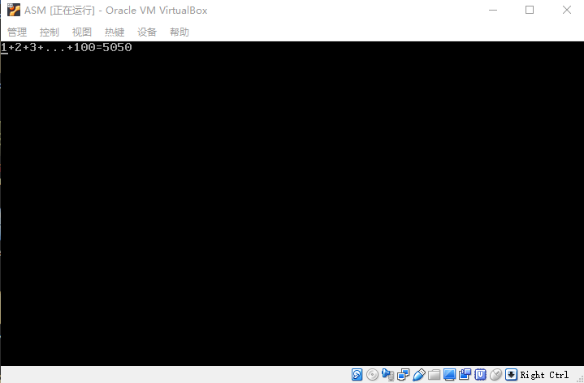

- 概述
- 1 显示字符串
- 2 计算1到100的累加和
- 3 累加和各个数位的分解和显示
    - 3.1 栈和栈段的初始化
    - 3.2 分解各个数位并压栈
    - 3.3 出栈并显示数位
    - 3.4 进一步认识栈
- 4 8086处理器的寻址方式
    - 4.1 寄存器寻址
    - 4.2 立即数寻址
    - 4.3 内存寻址
        - 4.3.1 直接寻址
        - 4.3.2 基地寻址
        - 4.3.3 变址寻址
        - 4.3.4 基址变址寻址

# 概述

本章的目标是：
1. 通过计算1到100的累加和，学习一种重要的数据结构 —— 栈，了解处理器为访问栈提供了怎样的支持。
2. 总结Intel8086处理器的寻址方式。
3. 学习几个新的处理器指令，它们是or、and、push和pop。

mbr.asm
```asm

; 文件名：mbr.asm
; 文件说明：硬盘主引导扇区代码

         
jmp near start
	
message db '1+2+3+...+100='
        
start:
    mov ax,0x7c0           ; 设置数据段的段基地址 
    mov ds,ax

    mov ax,0xb800          ; 设置附加段基址到显示缓冲区
    mov es,ax

    ; 以下显示字符串 
    mov si,message          
    mov di,0
    mov cx,start-message
@g:
    mov al,[si]
    mov [es:di],al
    inc di
    mov byte [es:di],0x07
    inc di
    inc si
    loop @g

    ; 以下计算1到100的和 
    xor ax,ax
    mov cx,1
@f:
    add ax,cx
    inc cx
    cmp cx,100
    jle @f

    ; 以下计算累加和的每个数位 
    xor cx,cx              ; 设置堆栈段的段基地址
    mov ss,cx
    mov sp,cx

    mov bx,10
    xor cx,cx
@d:
    inc cx
    xor dx,dx
    div bx
    or dl,0x30            ; 转ascii码
    push dx
    cmp ax,0
    jne @d

    ; 以下显示各个数位 
@a:
    pop dx
    mov [es:di],dl
    inc di
    mov byte [es:di],0x07
    inc di
    loop @a
       
    jmp near $ 
       
times 510-($-$$) db 0
    db 0x55,0xaa
```

运行效果：



# 1. 显示字符串

声明并初始化了一串字符（字符串），它的最终用途是要显示在屏幕上。我们可以直接用引号把一串字符围起来：

```asm
    message db '1+2+3+...+100='
```

NASM支持这样的做法，同前一章相比，以这种方法声明字符串显得更方便、更直接。

在汇编阶段，编译器将把它们拆开，以形成一个个单独的字节。

# 2. 计算1到100的累加和

要计算1到100的累加和，可以采取这样的办法：
1. 先将寄存器AX清零，再用AX的内容和1相加，结果在AX中；
2. 接着，再用AX的内容和2相加，结果依然在AX中；
3. 以此类推，就这样一直加到100。

# 3. 累加和各个数位的分解和显示

## 3.1 栈和栈段的初始化

分解出来的各个数位并不保存在数据段中，而保存在一个叫做栈的地方。

栈（Stack）是一种特殊的数据存储结构，数据的存取只能从一端进行。这样，最先进去的数据只能最后出来，
最后进去的数据时最先出来，这称为后进先出（Last In First Out，FIFO）。

和代码段、数据段和附加段一样，栈也被定义成一个内存段，叫栈段（Stack Segment），由段寄存器SS指向。

针对栈的操作有两种，分别是将数据推进栈（push）和从栈中弹出数据（pop）。简单地说，就是压栈和出栈。
压栈和出栈只能在一端进行，所以需要用栈指针寄存器SP（Stack Pointer）来指示下一个数据应当放入栈内的什么位置，或者数据从哪里出栈。

## 3.2 分解各个数位并压栈

or逻辑“或”指令：

```
    0 or 0 = 0
    0 or 0 = 1
    1 or 0 = 1
    1 or 1 = 1
```

在处理器内部，or指令的目的操作数可以是8位或者16位的通用寄存器，或者包含8/16位实际操作数的内容单元，
源操作数可以是与目的操作数数据宽度相同的通用寄存器、内存单元或者立即数。比如：

```
    or  al,cl
    or  ax,dx
    or  [label],bx
    or  byte [bx],0x55
```
> or指令不允许目的操作数和源操作数都是内存单元的情况。

or指令对标志寄存器的影响是：OF和CF位被清零，SF、ZF、PF位的状态依计算结果而定，AF为的状态未定义。

and逻辑“与”指令：

```
    0 and 0 = 0
    0 and 1 = 0
    1 and 0 = 0
    1 and 1 = 1
```

处理器设计了and指令。在16位处理器上，and指令的两个操作数都应当是字节或者字。
其中，目的操作数可以是通用寄存器和内存单元；源操作数可以使通用寄存器、内存单元或者立即数。

> 注意：and指令不允许两个操作数同时为内存单元，而且它们在数据宽度上应当一致。

and指令之后，OF和CF位被清零，SF、ZF、PF位的状态依计算结果而定，AF位的状态未定义。

push指令：将操作数的内容压入栈中，在16位的处理器上，push指令的操作数可以使16位的寄存器或者内存单元。

处理器在执行push指令时，首先将栈指针寄存器SP的内容减去操作数的字长（以字节为单位，在16位处理器上是2），
然后，把要压入栈的数据存放到逻辑地址SS:SP所指向的内存位置（和其他段的读写一样，把栈段寄存器SS的内容左移4位，
加上栈指针寄存器SP提供的偏移地址）。

> push指令不影响任何标志位。


## 3.3 出栈并显示数位

pop dx指令的功能是将逻辑地址SS:SP处的一个字弹出到寄存器DX中，然后将SP的内容加上操作数的字长（2）。

和push指令一样，pop指令的操作数可以是16位的寄存器或内存单元。例如：

```
    pop ax
    pop word [label]
```

pop指令执行时，处理器将栈段寄存器SS的内容左移4位，再加上栈指针寄存器SP的内容，形成20位的物理地址访问内存，
取得所需要的数据。然后，将SP的内容加上操作数的字长，以指向下一个栈位置。

> pop 指令不影响任何标志位。

## 3.4 进一步认识栈

现在，感性认识已经有了，剩下的，就是总结一下，做几点说明。

第一，push指令操作数可以是16位寄存器或者16位内存单元，push指令执行后，压入栈中的仅仅是寄存器或内存单元里的**数值**，
与该寄存器或内存单元不再相干。

第二，栈在本质上也只是普通的内存区域，之所以用push和pop指令来访问，是因为你把它看成栈而已。
引入栈和push、pop指令只是为了方便程序开发。临时保存一个数值在栈中。

push ax 指令等价于：
```asm
    sub sp,2
    mov bx,sp
    mov [ss:bx],ax
```

同样，pop ax指令等价于：
```asm
    mov bx,sp
    mov ax,[ss:bx]
    add sp,2
```

第三，要注意保持栈平衡。如果在做某件事的时候要使用栈，那么，栈指针寄存器SP在做这件事之前的值，
应当和这件事做完后的值相同。就是说，push指令和pop指令的数量应当是相同的。

第四，在编写程序前，必须充分估计所需要的栈空间，以防止破坏有用的数据。

第五，尽管不能完全阻止程序中的错误，但是，通过将栈定义到一个独立的64KB段，可以使错误仅局限于栈，
而不破坏其他段的有用数据。

# 4. 8086处理器的寻址方式

CPU指令都需要与数值打交道，既然操作和处理的是数值，那么，必定涉及数值从哪里来，然后送到哪里去，
这称为寻址（Addressing Mode）。简单说，寻址方式是如何找到要操作的数据，以及如何找到存放结果的地方。

## 4.1 寄存器寻址

最简单的寻址方式是寄存器寻址。就是说，指令执行时，操作的数位于寄存器中，可以从寄存器里取得。

例如：

```asm
    mov ax,cx
    add bx,0xf000
    inc dx
```
- 第一条指令：两个操作数都是寄存器，是典型的寄存器寻址。
- 第二条指令：目的操作数是寄存器，因此，该操作数页是寄存器寻址。
- 第三条指令：就更不用说了。

## 4.2 立即数寻址

立即数寻址就是说，指令的操作数是一个立即数。

例如：

```asm
    add bx,0xf000
    mov bx,label
```

- 第一条指令：目的操作数采用了寄存器寻址方式，用于提供被加数；<br/> 源操作数不需要通过其他方式寻址，故称为立即数。这也是一种寻址方式，称为立即寻址。
- 第二条指令：目的操作数页采用的是寄存器寻址方式。尽管源操作数是一个标号，但是，标号是数值的等价形式，<br/>
代表了它所在位置的汇编地址。因此，在编译阶段，它会被转化为一个立即数。因此，该指令的源操作数也采用了立即数寻址方式。

## 4.3 内存寻址

8086处理器访问内存时，采用的段地址左移4位，然后加上偏移地址，来形成20位物理地址的模式，<br/>
段地址由4个段寄存器之一来提供，偏移地址要有指令来提供。

因此，所以的内存寻址，实际上就是寻找偏移地址，这称为有效地址（Effective Address，EA）。</br>
换句话说，就是如何在指令中提供偏移地址，供处理器访问内存时使用。

### 4.3.1 直接寻址

使用该寻址方式的操作数是一个偏移地址，而且给出了该偏移地址的具体数值。

例如：

```asm
    mov ax,[0x5c0f]
    add word [0x0230],0x5000
    xor byte [es:label],0x05
```

> 但凡是表示内存地址的，都必须用中括号括起来。

- 第一条指令：源操作数使用的是直接寻址方式，当这条指令执行时，处理器将数据段寄存器DS的内容左移4位，<br/>
加上这里的0x5c0f，形成20位物理地址。接着，从该福利地址取出一个字，传送到寄存器AX中。
- 第二条指令：目的操作数采用的是直接寻址方式。当这条指令执行时，处理器用同样的方法，访问由段寄存器DS<br/>
指向的数据段，并把指令中的立即数加到该段中偏移地址为0x0230的字单元里。
- 第三条指令：目的操作数使用了标号和段超越前缀，但它依然属于直接寻址方式。原因很简单，标号是数值的<br/>
等价形式，在指令编译阶段，会被转换成数值；而段超越前缀仅仅用来改变默认的数据段。

### 4.3.2 基地寻址

所谓基址寻址，就是在指令的地址部分使用基址寄存器BX或者BP来提供偏移地址。

比如：
```
    mov [bx],dx
    add byte [bx],0x55
```
- 第一条指令：目的操作数采用了基址寻址。在指令执行时，处理器将数据段寄存器DS的内容左移4位，<br/>
加上基址寄存器BX中的内容，形成20位的物理地址，然后，把寄存器DX中的内容传送到该地址处的字单元里。
- 第二条指令：目的操作数也采用的是基址寻址。在指令执行时，将数据段寄存器DS的内容左移4位，加上寄存器BX<br/>
中的内容，形成20位的物理地址。然后，将指令中的立即数0x55加到该地址处的字节单元里。

很多时候，我们会有一大堆的数据要处理，而且它们通常都挨在一起，顺序存放的。

比如：

```asm
    buffer dw 0x20,0x100,0x0f,0x300,0xff00
```

使用基址寻址可以使代码变得简单高效。可以用以下的代码来处理上面的批量加一任务：

```asm
    mov bx,buffer
    mov bc,4

lpinc:
    inc word [bx]
    add bx,2
    loop lpinc
```

基址寻址的寄存器页可以使BP。

比如：

```asm
    mov ax,[bp]
```
这条指令的源操作数采用了基址寻址方式。但是，与前面的指令相比，它稍微有些特殊。原因在于，它采用的是<br/>
基址寄存器BP，在形成20位物理地址时，默认的段寄存器是SS。也就是说，它经常用于访问栈。这条指令执行时，<br/>
处理器将段寄存器SS的内容左移4位，加上寄存器BP的内容，形成20位的物理地址，并将该地址处的一个字传送到寄存器AX中。

我们知道，栈是后进先出的数据结构，访问栈的一般方法是使用push和pop命令。比如我们用以下的指令压入两个数据：
```asm
    mov ax,0x5000
    push ax
    mov ax,0x7000
```
很显然，如果要用pop指令弹出数据，就必须先弹出0x7000，才能弹出0x5000，除非你改变了栈指针SP的内容，否则这个顺序是不可能改变的。

但是，有时候我们希望，而且必须得超越这种限制，去访问栈中的内容，还不能破坏栈的状态，特别是栈指针寄存器SP的内容，使得push和pop操作能正常进行。

一个单行的例子是高级语言的函数调用，所有参数都位于栈中。为了能访问到那些被压在栈底的参数，这是，BP就能派上用场：
```asm
    mov ax,0x5000
    push ax
    mov bp,sp
    mov ax,0x7000
    push ax
    mov dx,[bp] ; dx中的内容为0x5000
```
以上，在压入0x5000之后，立即将栈指针SP保存到BP。后面，尽管栈顶的数据0x7000没有出栈，但依然可以用BP取出压在栈下面的0x5000。
如此一来，正常的push和pop操作照应进行，同时，还能访问到栈中的参数。

基址寻址允许在基址寄存器的基础上使用一个偏移量。有时候，这使得它更加灵活。比如：
```asm
    mov dx,[bp-2]
```
处理器在执行时，将段寄存器SS的内容左移4位，加上BP的内容，再减去偏移量2以形成物理地址。这样一来，在保持基址寄存器BP内容不变的情况下，
就可以访问栈的任何元素。这样，偏移量仅用于在指令执行时形成有效的地址，不会改变寄存器BP的原有内容。

### 4.3.3 变址寻址

变址寻址类似于基址寻址，唯一不同之处在于这种寻址方式使用的变址寄存器（或称索引寄存器）SI和DI。
例如：
```asm
    mov [si],dx
    add ax,[di]
    xor word [si],0x8000
```
和基址寻址一样，当带有这种操作数的指令执行时，除非使用了段超越前缀，处理器会访问由段寄存器DS指向的数据段，
偏移地址由寄存器SI或者DI提供。

同样地，变址寻址方式也允许带一个偏移量：
```asm
    mov [si+0x100],al
    and byte [di+label],0x80
```

### 4.3.4 基址变址寻址

让处理器支持多种寻址方式会增加硬件上的复杂性，但可以增强它的数据处理能力。这么做是值得的。

```asm
    string db 'abcdefghijklmnopqrstuvwxyz'
```
以上声明了标号"string"并初始化了26个字节的数据。现在，你的任务是，将这26字节的数据在原地反向排列。

使用基址变量的操作数可以使用一个基址寄存器（BX或BP），外加一个变址寄存器（SI或DI）。它的基本形式是这样的：
```asm
    mov ax,[bx+si]
    add word [bx+di], 0x3000
```

- 第一条指令：源操作数采用了基址变址寻址。当处理器执行这条指令时，把数据段寄存器DS的内容左移4位，<br/>
加上基址寄存器BX的内容，在加上变址寄存器SI的内容，共同形成20位的物理地址。然后，从该地址处取得一个字，<br/>
传送到寄存器AX中。
- 第二条指令：目的操作数采用了基址变址寻址，源操作数采用的是立即寻址。

采用机制变址寻址方式的排序代码如下：
```asm
    mov bx,string
    mov si,0    ; 正向索引
    mov di,25   ; 反向索引

order:
    mov ah,[bx+si]
    mov al,[bx+di]
    mov [bx+si],al
    mov [bx+di],ah  ; 以上4行用于交换首尾数据
    inc si
    dec di
    cmp si,di
    jl order
```