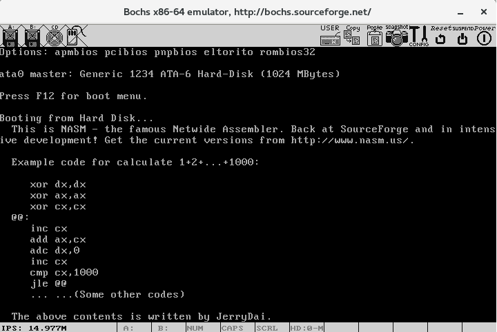
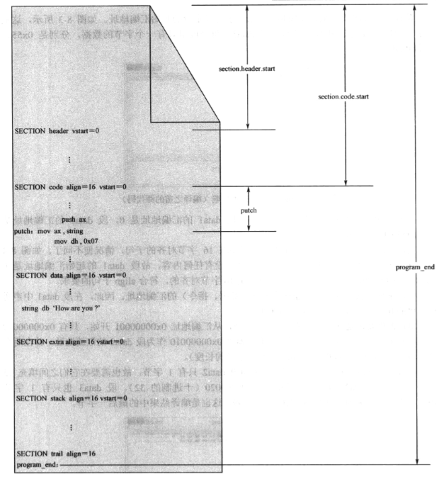

[TOC]

# 概述

本章的目标：
1. 模拟操作系统加载应用程序的过程，演示段的重定位方法，最终使你彻底理解8086处理器的分段内存管理机制。
2. 学习x86处理器过程调用的程序执行机制。
3. 已读硬盘扇区和控制屏幕光标为实例，了解x86处理器访问外围设备的方法。
4. 总结JMP和CALL指令的全部格式。
5. 认识更多的x86处理器指令，如in、out、shl、shr、rol、ror、jmp、call、ret等。

mbr.asm

```asm

    ; 文件名：mbr.asm
    ; 文件说明：硬盘主引导扇区代码（加载程序） 
     
    app_lba_start equ 100           ; 声明常数（用户程序起始逻辑扇区号）
                                    ; 常数的声明不会占用汇编地址
                                    
SECTION mbr align=16 vstart=0x7c00                                     

    ; 设置堆栈段和栈指针 
    mov ax,0      
    mov ss,ax
    mov sp,ax
      
    mov ax,[cs:phy_base]            ; 计算用于加载用户程序的逻辑段地址 
    mov dx,[cs:phy_base+0x02]
    mov bx,16        
    div bx            
    mov ds,ax                       ; 令DS和ES指向该段以进行操作
    mov es,ax                        
    
    ; 以下读取程序的起始部分 
    xor di,di
    mov si,app_lba_start            ; 程序在硬盘上的起始逻辑扇区号 
    xor bx,bx                       ; 加载到DS:0x0000处 
    call read_hard_disk_0
      
    ; 以下判断整个程序有多大
    mov dx,[2]                      ; 曾经把dx写成了ds，花了二十分钟排错 
    mov ax,[0]
    mov bx,512                      ; 512字节每扇区
    div bx
    cmp dx,0
    jnz @1                          ; 未除尽，因此结果比实际扇区数少1 
    dec ax                          ; 已经读了一个扇区，扇区总数减1 
    
@1:
    cmp ax,0                        ; 考虑实际长度小于等于512个字节的情况 
    jz direct
         
    ; 读取剩余的扇区
    push ds                         ; 以下要用到并改变DS寄存器 

    mov cx,ax                       ; 循环次数（剩余扇区数）
@2:
    mov ax,ds
    add ax,0x20                     ; 得到下一个以512字节为边界的段地址
    mov ds,ax  
                              
    xor bx,bx                       ; 每次读时，偏移地址始终为0x0000 
    inc si                          ; 下一个逻辑扇区 
    call read_hard_disk_0
    loop @2                         ; 循环读，直到读完整个功能程序 

    pop ds                          ; 恢复数据段基址到用户程序头部段 
      
    ; 计算入口点代码段基址 
direct:
    mov dx,[0x08]
    mov ax,[0x06]
    call calc_segment_base
    mov [0x06],ax                   ; 回填修正后的入口点代码段基址 
      
    ; 开始处理段重定位表
    mov cx,[0x0a]                   ; 需要重定位的项目数量
    mov bx,0x0c                     ; 重定位表首地址
          
realloc:
    mov dx,[bx+0x02]                ; 32位地址的高16位 
    mov ax,[bx]
    call calc_segment_base
    mov [bx],ax                     ; 回填段的基址
    add bx,4                        ; 下一个重定位项（每项占4个字节） 
    loop realloc 
      
    jmp far [0x04]                  ; 转移到用户程序  
 
;-------------------------------------------------------------------------------
read_hard_disk_0:                        ; 从硬盘读取一个逻辑扇区
                                         ; 输入：DI:SI=起始逻辑扇区号
                                         ;       DS:BX=目标缓冲区地址
    push ax
    push bx
    push cx
    push dx
      
    mov dx,0x1f2
    mov al,1
    out dx,al                       ; 读取的扇区数

    inc dx                          ; 0x1f3
    mov ax,si
    out dx,al                       ; LBA地址7~0

    inc dx                          ; 0x1f4
    mov al,ah
    out dx,al                       ; LBA地址15~8

    inc dx                          ; 0x1f5
    mov ax,di
    out dx,al                       ; LBA地址23~16

    inc dx                          ; 0x1f6
    mov al,0xe0                     ; LBA28模式，主盘
    or al,ah                        ; LBA地址27~24
    out dx,al

    inc dx                          ; 0x1f7
    mov al,0x20                     ; 读命令
    out dx,al

.waits:
    in al,dx
    and al,0x88
    cmp al,0x08
    jnz .waits                      ; 不忙，且硬盘已准备好数据传输 

    mov cx,256                      ; 总共要读取的字数
    mov dx,0x1f0
.readw:
    in ax,dx
    mov [bx],ax
    add bx,2
    loop .readw

    pop dx
    pop cx
    pop bx
    pop ax
      
    ret

;-------------------------------------------------------------------------------
calc_segment_base:                       ; 计算16位段地址
                                         ; 输入：DX:AX=32位物理地址
                                         ; 返回：AX=16位段基地址 
    push dx                          
         
    add ax,[cs:phy_base]
    adc dx,[cs:phy_base+0x02]
    shr ax,4
    ror dx,4
    and dx,0xf000
    or ax,dx
         
    pop dx
         
    ret

;-------------------------------------------------------------------------------
    phy_base dd 0x10000             ; 用户程序被加载的物理起始地址
         
 times 510-($-$$) db 0
                  db 0x55,0xaa
```

user.asm

```
    ; 文件名：user.asm
    ; 文件说明：用户程序 

;===============================================================================
SECTION header vstart=0                     ; 定义用户程序头部段 
    program_length  dd program_end          ; 程序总长度[0x00]
    
    ; 用户程序入口点
    code_entry      dw start                ; 偏移地址[0x04]
                    dd section.code_1.start ; 段地址[0x06] 
    
    realloc_tbl_len dw (header_end-code_1_segment)/4
                                            ; 段重定位表项个数[0x0a]
    
    ; 段重定位表           
    code_1_segment  dd section.code_1.start ; [0x0c]
    code_2_segment  dd section.code_2.start ; [0x10]
    data_1_segment  dd section.data_1.start ; [0x14]
    data_2_segment  dd section.data_2.start ; [0x18]
    stack_segment   dd section.stack.start  ; [0x1c]
    
    header_end:                
    
;===============================================================================
SECTION code_1 align=16 vstart=0         ; 定义代码段1（16字节对齐） 
put_string:                              ; 显示串(0结尾)。
                                         ; 输入：DS:BX=串地址
         mov cl,[bx]
         or cl,cl                        ; cl=0 ?
         jz .exit                        ; 是的，返回主程序 
         call put_char
         inc bx                          ; 下一个字符 
         jmp put_string

   .exit:
         ret

;-------------------------------------------------------------------------------
put_char:                                ; 显示一个字符
                                         ; 输入：cl=字符ascii
         push ax
         push bx
         push cx
         push dx
         push ds
         push es

         ; 以下取当前光标位置
         mov dx,0x3d4
         mov al,0x0e
         out dx,al
		 mov dx,0x3d5
         in al,dx                        ; 高8位 
         mov ah,al

         mov dx,0x3d4
         mov al,0x0f
         out dx,al
         mov dx,0x3d5
         in al,dx                        ; 低8位 
         mov bx,ax                       ; BX=代表光标位置的16位数

         cmp cl,0x0d                     ; 回车符？
         jnz .put_0a                     ; 不是。看看是不是换行等字符 
         mov ax,bx                       ; 此句略显多余，但去掉后还得改书，麻烦 
         mov bl,80                       
         div bl
         mul bl
         mov bx,ax
         jmp .set_cursor

 .put_0a:
         cmp cl,0x0a                     ; 换行符？
         jnz .put_other                  ; 不是，那就正常显示字符 
         add bx,80
         jmp .roll_screen

 .put_other:                             ; 正常显示字符
         mov ax,0xb800
         mov es,ax
         shl bx,1
         mov [es:bx],cl

         ;以下将光标位置推进一个字符
         shr bx,1
         add bx,1

 .roll_screen:
         cmp bx,2000                     ; 光标超出屏幕？滚屏
         jl .set_cursor

         mov ax,0xb800
         mov ds,ax
         mov es,ax
         cld
         mov si,0xa0
         mov di,0x00
         mov cx,1920
         rep movsw
         mov bx,3840                     ; 清除屏幕最底一行
         mov cx,80
 .cls:
         mov word[es:bx],0x0720
         add bx,2
         loop .cls

         mov bx,1920

 .set_cursor:
         mov dx,0x3d4
         mov al,0x0e
         out dx,al
         mov dx,0x3d5
         mov al,bh
         out dx,al
         mov dx,0x3d4
         mov al,0x0f
         out dx,al
         mov dx,0x3d5
         mov al,bl
         out dx,al

         pop es
         pop ds
         pop dx
         pop cx
         pop bx
         pop ax

         ret

;-------------------------------------------------------------------------------
  start:
         ; 初始执行时，DS和ES指向用户程序头部段
         mov ax,[stack_segment]           ; 设置到用户程序自己的堆栈 
         mov ss,ax
         mov sp,stack_end
         
         mov ax,[data_1_segment]          ; 设置到用户程序自己的数据段
         mov ds,ax

         mov bx,msg0
         call put_string                  ; 显示第一段信息 

         push word [es:code_2_segment]
         mov ax,begin
         push ax                          ; 可以直接push begin,80386+
         
         retf                             ; 转移到代码段2执行 
         
  continue:
         mov ax,[es:data_2_segment]       ; 段寄存器DS切换到数据段2 
         mov ds,ax
         
         mov bx,msg1
         call put_string                  ; 显示第二段信息 

         jmp $ 

;===============================================================================
SECTION code_2 align=16 vstart=0          ; 定义代码段2（16字节对齐）

  begin:
         push word [es:code_1_segment]
         mov ax,continue
         push ax                          ; 可以直接push continue,80386+
         
         retf                             ; 转移到代码段1接着执行 
         
;===============================================================================
SECTION data_1 align=16 vstart=0

    msg0 db '  This is NASM - the famous Netwide Assembler. '
         db 'Back at SourceForge and in intensive development! '
         db 'Get the current versions from http://www.nasm.us/.'
         db 0x0d,0x0a,0x0d,0x0a
         db '  Example code for calculate 1+2+...+1000:',0x0d,0x0a,0x0d,0x0a
         db '     xor dx,dx',0x0d,0x0a
         db '     xor ax,ax',0x0d,0x0a
         db '     xor cx,cx',0x0d,0x0a
         db '  @@:',0x0d,0x0a
         db '     inc cx',0x0d,0x0a
         db '     add ax,cx',0x0d,0x0a
         db '     adc dx,0',0x0d,0x0a
         db '     inc cx',0x0d,0x0a
         db '     cmp cx,1000',0x0d,0x0a
         db '     jle @@',0x0d,0x0a
         db '     ... ...(Some other codes)',0x0d,0x0a,0x0d,0x0a
         db 0

;===============================================================================
SECTION data_2 align=16 vstart=0

    msg1 db '  The above contents is written by JerryDai. '
         db 0

;===============================================================================
SECTION stack align=16 vstart=0
           
         resb 256

stack_end:  

;===============================================================================
SECTION trail align=16
program_end:
```

> 编译：nasm -f bin mbr.asm -o mbr.bin & nasm -f bin user.asm -o user.bin

运行效果：



# 1. 用户程序的结构

## 1.1 分段、段的汇编地址和段内汇编地址

处理器的工作模式是将内存分成逻辑上的段，指令的获取和数据的访问一律按“段地址:偏移地址”的方式进行。
相对应地，一个规范的程序，应当包括代码段、数据段、附加段和栈段。这样一来，段的划分和段与段之间的界限
在程序加载到内存之前就准备好了。

NASM编译器使用汇编指令"SECTION"或者"SEGMENT"来定义段。

```
    SECTION 段名称
或者
    SEGMENT 段名称
```



每个段都要求给出名称，这就是段名称，它主要用来引用一个段，可以是任意名称，只要它们彼此之间不会重复和混淆。

intel处理器要求段在内存中的起始物理地址起码是16字节对齐的。这句话的意思是，必须是16的倍数，或者说该物理地址必须能被16整除。

相应的，汇编语言程序中定义的各个段，也就对齐方面的要求。

在段定义中使用"align="字句，用于指定某个SECTION的汇编地址对齐方式。

例如：
- align=16：表示段是16字节对齐的
- align=32：表示段是32字节对齐的

每个段都有一个汇编地址，它是相对于整个程序开发（0）的。为了方便取得该段的汇编地址，
NASM变奇艺提供了以下的表达式，可以用在你的程序中：
```
    section.段名称.start
```

段定义语句还可以包含"vstart="字句。尽管定义了段，但是，引用某个标号时，该标号处的汇编地址依然是从整个程序的开头计算的，而不是从段的开头出计算的。

但是，因为段code中定义中有"vstart=0"字句，所以，标号"putch"的汇编地址要从它所在段的开头计算，而且从0开始计算。

## 1.2 用户程序头部

这就涉及加载器的编写者，以及用户程序的编写者，他们之间是怎么协商的。他们之间必须有一个协议，或者说协定，比如说，在用户程序某个固定位置，包含一些基本的结构信息，把用户程序都必须把自己的情况方在这里，而加载器页固定在这个位置读取。经验表明，把这个约定的地点放在用户程序的开头，对双方，特别是对加载器来说比较方便，这就是程序头部。

头部需要在源程序以一个段的形式出现。

```asm
    SECTION header vstart=0
```
而且，应为它是“头部”，所以，该段当然必须是第一个被定义的段，且总是位于整个源程序的开头。

用户程序头部起码要包含以下信息：
1. 用户程序的尺寸，即以字节为单位的大小。这对加载其来说很重要，加载去需要根据这一信息来决定读取多少个逻辑扇区。
2. 用户程序的入口点，包括段地址和偏移地址。加载器并不清楚用户程序的分段情况，更不知道第一条要执行的指令在用户程序中的位置。因此，必须在头部给出第一条指令的段地址和偏移地址。这就是所谓的应用程序入口点（Entry Point）。
3. 段重定位表。用户程序可能包含不止一个段，比较大的程序可能包含多个代码段和多个数据段。这些段如何使用，是用户程序自己的事，但前提是程序加载到内存后，每个段的地址必须重新确定一下。<br/>用户程序可以定义的段在数量上是不确定的，因此，段重定位表的大小，或者说表项数是不确定的。

## 1.3 加载程序的工作流程

加载器要加载一个用户程序，并使之开始执行，需要决定两件事。
1. 看看内存什么地方是空闲的，即从那个物理内存地址开始加载程序；
2. 用户程序位于硬盘上什么位置，它的起始逻辑扇区号是多少。