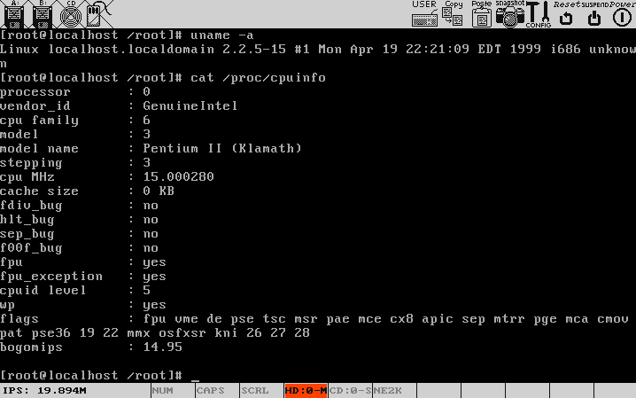

***Bochs调试仿真工具***

[TOC]

# 1. 简介

Bochs（读音同 Box）是用C++开发的以LGPL许可证发放的开放源代码的x86，x86-64模拟器，模拟整个PC。它被设计成可以运行于多种主流平台下，包括x86, PPC, Alpha, Sun和MIPS。

和 Bochs 类似的虚拟机软件还有：VMware，Virtual PC，VirtualBox，但这些都使用了虚拟化技术，部分指令直接交给硬件执行。而Bochs完全是靠软件模拟来实现的（所以Bochs虚拟机的速度慢很多，而且应该称Bochs为模拟器，而非虚拟机）。从启动到重启，包括PC的外设键盘，鼠标，VGA卡，磁盘，网卡等，全部都是由软件来模拟的。也正是由于Bochs完全是靠软件来模拟整个PC环境，因此它非常的适合开发操作系统，这对广大操作系统爱好者来说是一个福音。因为有它，使得调试操作系统非常非常的容易，它自带一个调试器bochsdbg，它可以从PC机刚启动的那一刹那起就开始模拟，注意，这不是从读取磁盘中的引导扇区那开始模拟。

在Bochs中安装操作系统，不会分区宿主机硬盘，而仅仅是在宿主机中建立一个大文件——磁盘镜像文件。

使用Bochs自带的bximage工具可以创建软盘，硬盘的镜像文件。

在Bochs中运行操作系统的最低要求：

- Bochs 软件
- BIOS 镜像
- VGA BIOS 镜像 
- 至少一个可引导的磁盘镜像（软盘，硬盘，光盘）或物理磁盘（软盘，光盘）


# 2. Bochs编译安装

```
$> ./configure --enable-x86-64 --enable-smp --enable-debugger --enable-disasm --enable-x86-debugger --enable-readline --enable-ne2000 --with-sdl --enable-clgd54xx

$> make install
```

# 3. 配置Bochs 

告诉Bochs你想模拟一台拥有何种硬件配置的PC。

这里只介绍如何使用配置文件配置 Bochs。

Bochs为我们提供了一个配置文件的模版，这个模版为bochsrc-sample.txt，可以在Bochs的安装目录中找到。在配置文件中”#”为注释符号，表明#后面的全部是注释的内容（类似于C / C++ 中的行注释“//”）。

——其实只要懂点硬件，看看这个模板文件就懂如何配置了，要学习，官网的资料最好。

```
# CPU频率
cpu: ips=15000000

# 时钟
clock: sync=slowdown

# 内存
megs: 256

# 显卡
romimage: file=$BXSHARE/BIOS-bochs-latest
vgaromimage: file=$BXSHARE/VGABIOS-lgpl-latest-cirrus
vga: extension=cirrus, update_freq=15

# 网卡
ne2k: ioaddr=0x280, irq=9, mac=b0:c4:20:00:00:01, ethmod=vnet, ethdev=/tmp

# PCI
pci: enabled=1, chipset=i440fx, slot1=cirrus, slot2=ne2k

# 磁盘
ata0-master: type=disk, path="redhat6-512mb.img"
ata0-slave: type=cdrom

# 启动项
boot: disk

# 鼠标
mouse: enabled=0

# 键盘
keyboard: keymap=$BXSHARE/keymaps/sdl-pc-us.map

# 日志输出
log: bochsout.txt

# 错误处理策略
panic: action=ask
error: action=report
info: action=report
debug: action=ignore
```

# 3. 启动Bochs
```
$> wget https://sourceforge.net/projects/bochs/files/Disk%20Images/RedHat%20Linux/redhat_6-512mb.zip
$> unzip redhat_6-512mb.zip
$> bochs -q
```

> Root密码：redhat



# 4. 内置调试功能

使用Bochs内置强大的调试功能来学习体系结构是个非常不错的选择。

- 查看CPU寄存器
```
<bochs> regs
CPU0:
rax: 00000000_00000000 rcx: 00000000_c0216000
rdx: 00000000_c0240d84 rbx: 00000000_c0216000
rsp: 00000000_c0217f94 rbp: 00000000_00000000
rsi: 00000000_c0216000 rdi: 00000000_00003cd5
r8 : 00000000_00000000 r9 : 00000000_00000000
r10: 00000000_00000000 r11: 00000000_00000000
r12: 00000000_00000000 r13: 00000000_00000000
r14: 00000000_00000000 r15: 00000000_00000000
rip: 00000000_c0107e1c
eflags 0x00000246: id vip vif ac vm rf nt IOPL=0 of df IF tf sf ZF af PF cf
```

- 查看FPU寄存器信息
```
<bochs> fpu
status  word: 0x0000: b c3 TOS0 c2 c1 c0 es sf pe ue oe ze de ie
control word: 0x037f: inf RC_NEAREST PC_80 PM UM OM ZM DM IM
tag word:     0xffff
operand:      0x0000
fip:          0x0000000000000000
fcs:          0x0000
fdp:          0x0000000000000000
fds:          0x0000
=>FP0 ST0(e):        raw 0x0000:0000000000000000 (0.0000000000) (ZERO)
  FP1 ST1(e):        raw 0x0000:0000000000000000 (0.0000000000) (ZERO)
  FP2 ST2(e):        raw 0x0000:0000000000000000 (0.0000000000) (ZERO)
  FP3 ST3(e):        raw 0x0000:0000000000000000 (0.0000000000) (ZERO)
  FP4 ST4(e):        raw 0x4008:fa00000000000000 (1000.0000000000) (NORMAL)
  FP5 ST5(e):        raw 0x401d:fffffffe00000000 (2147483647.0000000000) (NORMAL)
  FP6 ST6(e):        raw 0x0000:0000000000000000 (0.0000000000) (ZERO)
  FP7 ST7(e):        raw 0x3ffe:8f5c28f5c28f5c00 (0.5600000000) (NORMAL)
```

- 查看段寄存器信息
``` 
<bochs> sreg
es:0x0018, dh=0x00cf9300, dl=0x0000ffff, valid=1
        Data segment, base=0x00000000, limit=0xffffffff, Read/Write, Accessed
cs:0x0010, dh=0x00cf9b00, dl=0x0000ffff, valid=1
        Code segment, base=0x00000000, limit=0xffffffff, Execute/Read, Non-Conforming, Accessed, 32-bit
ss:0x0018, dh=0x00cf9300, dl=0x0000ffff, valid=31
        Data segment, base=0x00000000, limit=0xffffffff, Read/Write, Accessed
ds:0x0018, dh=0x00cf9300, dl=0x0000ffff, valid=31
        Data segment, base=0x00000000, limit=0xffffffff, Read/Write, Accessed
fs:0x0018, dh=0x00cf9300, dl=0x0000ffff, valid=1
        Data segment, base=0x00000000, limit=0xffffffff, Read/Write, Accessed
gs:0x0018, dh=0x00cf9300, dl=0x0000ffff, valid=1
        Data segment, base=0x00000000, limit=0xffffffff, Read/Write, Accessed
ldtr:0x0068, dh=0xc000821f, dl=0xb70c0007, valid=1
tr:0x0060, dh=0xc0008b21, dl=0x61dc00eb, valid=1
gdtr:base=0x00000000c01f8660, limit=0x205f
idtr:base=0x00000000c0228000, limit=0x7ff
```

- 查看控制寄存器信息
``` 
<bochs> creg
CR0=0x8005003b: PG cd nw AC WP NE ET TS em MP PE
CR2=page fault laddr=0x0000000040014000
CR3=0x000000101000
    PCD=page-level cache disable=0
    PWT=page-level write-through=0
CR4=0x00000090: pke smap smep osxsave pcid fsgsbase smx vmx osxmmexcpt umip osfxsr pce PGE mce pae PSE de tsd pvi vme
CR8: 0x0
EFER=0x00000000: ffxsr nxe lma lme sce
```
- 线性地址转物理地址

```
<bochs> page 0x00000000c0228000
 PDE: 0x00000000000001e3    PS G pat D A pcd pwt S W P
linear page 0x00000000c0228000 maps to physical page 0x000000228000
```

- 查看CPU所有信息

```
<bochs> info cpu
CPU0:
rax: 00000000_00000000 rcx: 00000000_c0216000
rdx: 00000000_c0240d84 rbx: 00000000_c0216000
rsp: 00000000_c0217f94 rbp: 00000000_00000000
rsi: 00000000_c0216000 rdi: 00000000_0000b64e
r8 : 00000000_00000000 r9 : 00000000_00000000
r10: 00000000_00000000 r11: 00000000_00000000
r12: 00000000_00000000 r13: 00000000_00000000
r14: 00000000_00000000 r15: 00000000_00000000
rip: 00000000_c0107e1c
eflags 0x00000246: id vip vif ac vm rf nt IOPL=0 of df IF tf sf ZF af PF cf
status  word: 0x0000: b c3 TOS0 c2 c1 c0 es sf pe ue oe ze de ie
control word: 0x037f: inf RC_NEAREST PC_80 PM UM OM ZM DM IM
tag word:     0xffff
operand:      0x0000
fip:          0x0000000000000000
fcs:          0x0000
fdp:          0x0000000000000000
fds:          0x0000
=>FP0 ST0(e):        raw 0x0000:0000000000000000 (0.0000000000) (ZERO)
  FP1 ST1(e):        raw 0x0000:0000000000000000 (0.0000000000) (ZERO)
  FP2 ST2(e):        raw 0x0000:0000000000000000 (0.0000000000) (ZERO)
  FP3 ST3(e):        raw 0x0000:0000000000000000 (0.0000000000) (ZERO)
  FP4 ST4(e):        raw 0x4008:fa00000000000000 (1000.0000000000) (NORMAL)
  FP5 ST5(e):        raw 0x401d:fffffffe00000000 (2147483647.0000000000) (NORMAL)
  FP6 ST6(e):        raw 0x0000:0000000000000000 (0.0000000000) (ZERO)
  FP7 ST7(e):        raw 0x3ffe:8000000000000000 (0.5000000000) (NORMAL)
MM[0]: 00000000_00000000
MM[1]: 00000000_00000000
MM[2]: 00000000_00000000
MM[3]: 00000000_00000000
MM[4]: fa000000_00000000
MM[5]: fffffffe_00000000
MM[6]: 00000000_00000000
MM[7]: 80000000_00000000
MXCSR: 0x01f80: ule fuz RC:Nearest PM UM OM ZM DM IM daz pe ue oe ze de ie
XMM[00]: 00000000_00000000_00000000_00000000
XMM[01]: 00000000_00000000_00000000_00000000
XMM[02]: 00000000_00000000_00000000_00000000
XMM[03]: 00000000_00000000_00000000_00000000
XMM[04]: 00000000_00000000_00000000_00000000
XMM[05]: 00000000_00000000_00000000_00000000
XMM[06]: 00000000_00000000_00000000_00000000
XMM[07]: 00000000_00000000_00000000_00000000
XMM[08]: 00000000_00000000_00000000_00000000
XMM[09]: 00000000_00000000_00000000_00000000
XMM[10]: 00000000_00000000_00000000_00000000
XMM[11]: 00000000_00000000_00000000_00000000
XMM[12]: 00000000_00000000_00000000_00000000
XMM[13]: 00000000_00000000_00000000_00000000
XMM[14]: 00000000_00000000_00000000_00000000
XMM[15]: 00000000_00000000_00000000_00000000
```

- 查看GDT
```
<bochs> info gdt
Global Descriptor Table (base=0x00000000c01f8660, limit=8287):
GDT[0x00]=??? descriptor hi=0x00000000, lo=0x00000000
GDT[0x01]=??? descriptor hi=0x00000000, lo=0x00000000
GDT[0x02]=Code segment, base=0x00000000, limit=0xffffffff, Execute/Read, Non-Conforming, Accessed, 32-bit
GDT[0x03]=Data segment, base=0x00000000, limit=0xffffffff, Read/Write, Accessed
GDT[0x04]=Code segment, base=0x00000000, limit=0xffffffff, Execute/Read, Non-Conforming, Accessed, 32-bit
GDT[0x05]=Data segment, base=0x00000000, limit=0xffffffff, Read/Write, Accessed
GDT[0x06]=??? descriptor hi=0x00000000, lo=0x00000000
GDT[0x07]=??? descriptor hi=0x00000000, lo=0x00000000
GDT[0x08]=Data segment, base=0xc0000400, limit=0x00000bff, Read/Write
GDT[0x09]=Code segment, base=0xc00f0000, limit=0x0000ffff, Execute/Read, Non-Conforming, Accessed, 32-bit
GDT[0x0a]=Code segment, base=0xc00f0000, limit=0x0000ffff, Execute/Read, Non-Conforming, 16-bit
GDT[0x0b]=Data segment, base=0xc00f0000, limit=0x0000ffff, Read/Write
GDT[0x0c]=32-Bit TSS (Busy) at 0xc02161dc, length 0x000eb
GDT[0x0d]=LDT
GDT[0x0e]=32-Bit TSS (Busy) at 0xc00021dc, length 0x000eb
GDT[0x0f]=??? descriptor hi=0x00000000, lo=0x00000000
GDT[0x10]=32-Bit TSS (Busy) at 0xc00901dc, length 0x000eb

```

- 查看LDT

```
<bochs> info ldt
Local Descriptor Table (base=0x00000000c01fb70c, limit=7):
LDT[0x00]=32-Bit Call Gate target=0x0010:0xc0109524, DPL=3

```

- 查看IVT

```
<bochs> info ivt
INT# 00 > 0000:0000 (0x00000000) DIVIDE ERROR
INT# 01 > 0000:0000 (0x00000000) SINGLE STEP
INT# 02 > 0000:0000 (0x00000000) NON-MASKABLE INTERRUPT
INT# 03 > 0000:0000 (0x00000000) BREAKPOINT
INT# 04 > 0000:0000 (0x00000000) INT0 DETECTED OVERFLOW
INT# 05 > 0000:0000 (0x00000000) BOUND RANGE EXCEED
INT# 06 > 0000:0000 (0x00000000) INVALID OPCODE
INT# 07 > 0000:0000 (0x00000000) PROCESSOR EXTENSION NOT AVAILABLE
INT# 08 > 0000:0000 (0x00000000) IRQ0 - SYSTEM TIMER
INT# 09 > 0000:0000 (0x00000000) IRQ1 - KEYBOARD DATA READY
INT# 0a > 0000:0000 (0x00000000) IRQ2 - LPT2
INT# 0b > 0000:0000 (0x00000000) IRQ3 - COM2
INT# 0c > 0000:0000 (0x00000000) IRQ4 - COM1
INT# 0d > 0000:0000 (0x00000000) IRQ5 - FIXED DISK
INT# 0e > 0000:0000 (0x00000000) IRQ6 - DISKETTE CONTROLLER
INT# 0f > 0000:0000 (0x00000000) IRQ7 - PARALLEL PRINTER
INT# 10 > 0000:0000 (0x00000000) VIDEO
INT# 11 > 0000:0000 (0x00000000) GET EQUIPMENT LIST
INT# 12 > 0000:0000 (0x00000000) GET MEMORY SIZE
INT# 13 > 0000:0000 (0x00000000) DISK
INT# 14 > 0000:0000 (0x00000000) SERIAL
INT# 15 > 0000:0000 (0x00000000) SYSTEM
INT# 16 > 0000:0000 (0x00000000) KEYBOARD
INT# 17 > 0000:0000 (0x00000000) PRINTER
INT# 18 > 0000:0000 (0x00000000) CASETTE BASIC
INT# 19 > 0000:0000 (0x00000000) BOOTSTRAP LOADER
INT# 1a > 0000:0000 (0x00000000) TIME
INT# 1b > 0000:0000 (0x00000000) KEYBOARD - CONTROL-BREAK HANDLER
INT# 1c > 0000:0000 (0x00000000) TIME - SYSTEM TIMER TICK
INT# 1d > 0000:0000 (0x00000000) SYSTEM DATA - VIDEO PARAMETER TABLES
INT# 1e > 0000:0000 (0x00000000) SYSTEM DATA - DISKETTE PARAMETERS
INT# 1f > 0000:0000 (0x00000000) SYSTEM DATA - 8x8 GRAPHICS FONT
INT# 20 > 0000:0000 (0x00000000)
INT# 21 > 0000:0000 (0x00000000)
INT# 22 > 0000:0000 (0x00000000)
INT# 23 > 0000:0000 (0x00000000)
INT# 24 > 0000:0000 (0x00000000)
INT# 25 > 0000:0000 (0x00000000)
INT# 26 > 0000:0000 (0x00000000)
INT# 27 > 0000:0000 (0x00000000)
INT# 28 > 0000:0000 (0x00000000)
INT# 29 > 0000:0000 (0x00000000)
INT# 2a > 0000:0000 (0x00000000)
INT# 2b > 0000:0000 (0x00000000)
INT# 2c > 0000:0000 (0x00000000)
INT# 2d > 0000:0000 (0x00000000)
INT# 2e > 0000:0000 (0x00000000)
INT# 2f > 0000:0000 (0x00000000)
INT# 30 > 0000:0000 (0x00000000)
INT# 31 > 0000:0000 (0x00000000)
INT# 32 > 0000:0000 (0x00000000)
INT# 33 > 0000:0000 (0x00000000)
INT# 34 > 0000:0000 (0x00000000)
INT# 35 > 0000:0000 (0x00000000)
INT# 36 > 0000:0000 (0x00000000)
INT# 37 > 0000:0000 (0x00000000)
INT# 38 > 0000:0000 (0x00000000)
INT# 39 > 0000:0000 (0x00000000)
INT# 3a > 0000:0000 (0x00000000)
INT# 3b > 0000:0000 (0x00000000)
INT# 3c > 0000:0000 (0x00000000)
INT# 3d > 0000:0000 (0x00000000)
INT# 3e > 0000:0000 (0x00000000)
INT# 3f > 0000:0000 (0x00000000)
INT# 40 > 0000:0000 (0x00000000)
INT# 41 > 0000:0000 (0x00000000)
INT# 42 > 0000:0000 (0x00000000)
INT# 43 > 0000:0000 (0x00000000)
INT# 44 > 0000:0000 (0x00000000)
INT# 45 > 0000:0000 (0x00000000)
INT# 46 > 0000:0000 (0x00000000)
INT# 47 > 0000:0000 (0x00000000)
INT# 48 > 0000:0000 (0x00000000)
INT# 49 > 0000:0000 (0x00000000)
INT# 4a > 0000:0000 (0x00000000)
INT# 4b > 0000:0000 (0x00000000)
INT# 4c > 0000:0000 (0x00000000)
INT# 4d > 0000:0000 (0x00000000)
INT# 4e > 0000:0000 (0x00000000)
INT# 4f > 0000:0000 (0x00000000)
INT# 50 > 0000:0000 (0x00000000)
INT# 51 > 0000:0000 (0x00000000)
INT# 52 > 0000:0000 (0x00000000)
INT# 53 > 0000:0000 (0x00000000)
INT# 54 > 0000:0000 (0x00000000)
INT# 55 > 0000:0000 (0x00000000)
INT# 56 > 0000:0000 (0x00000000)
INT# 57 > 0000:0000 (0x00000000)
INT# 58 > 0000:0000 (0x00000000)
INT# 59 > 0000:0000 (0x00000000)
INT# 5a > 0000:0000 (0x00000000)
INT# 5b > 0000:0000 (0x00000000)
INT# 5c > 0000:0000 (0x00000000)
INT# 5d > 0000:0000 (0x00000000)
INT# 5e > 0000:0000 (0x00000000)
INT# 5f > 0000:0000 (0x00000000)
INT# 60 > 0000:0000 (0x00000000)
INT# 61 > 0000:0000 (0x00000000)
INT# 62 > 0000:0000 (0x00000000)
INT# 63 > 0000:0000 (0x00000000)
INT# 64 > 0000:0000 (0x00000000)
INT# 65 > 0000:0000 (0x00000000)
INT# 66 > 0000:0000 (0x00000000)
INT# 67 > 0000:0000 (0x00000000)
INT# 68 > 0000:0000 (0x00000000)
INT# 69 > 0000:0000 (0x00000000)
INT# 6a > 0000:0000 (0x00000000)
INT# 6b > 0000:0000 (0x00000000)
INT# 6c > 0000:0000 (0x00000000)
INT# 6d > 0000:0000 (0x00000000)
INT# 6e > 0000:0000 (0x00000000)
INT# 6f > 0000:0000 (0x00000000)
INT# 70 > 0000:0000 (0x00000000) IRQ8 - CMOS REAL-TIME CLOCK
INT# 71 > 0000:0000 (0x00000000) IRQ9 - REDIRECTED TO INT 0A BY BIOS
INT# 72 > 0000:0000 (0x00000000) IRQ10 - RESERVED
INT# 73 > 0000:0000 (0x00000000) IRQ11 - RESERVED
INT# 74 > 0000:0000 (0x00000000) IRQ12 - POINTING DEVICE
INT# 75 > 0000:0000 (0x00000000) IRQ13 - MATH COPROCESSOR EXCEPTION
INT# 76 > 0000:0000 (0x00000000) IRQ14 - HARD DISK CONTROLLER OPERATION COMPLETE
INT# 77 > 0000:0000 (0x00000000) IRQ15 - SECONDARY IDE CONTROLLER OPERATION COMPLETE
INT# 78 > 0000:0000 (0x00000000)
INT# 79 > 0000:0000 (0x00000000)
INT# 7a > 0000:0000 (0x00000000)
INT# 7b > 0000:0000 (0x00000000)
INT# 7c > 0000:0000 (0x00000000)
INT# 7d > 0000:0000 (0x00000000)
INT# 7e > 0000:0000 (0x00000000)
INT# 7f > 0000:0000 (0x00000000)
......
```
> 该命令仅在实模式下有效

- 查看TSS
```
<bochs> info tss
tr:s=0x60, base=0x00000000c02161dc, valid=1
ss:esp(0): 0x0018:0xc0218000
ss:esp(1): 0x0000:0x00000000
ss:esp(2): 0x0000:0x00000000
cr3: 0x00101000
eip: 0xc01109a7
eflags: 0x00000000
cs: 0x0000 ds: 0x0000 ss: 0x0000
es: 0x0000 fs: 0x0018 gs: 0x0018
eax: 0x00000000  ebx: 0x00000000  ecx: 0x00000000  edx: 0x00000000
esi: 0x00000000  edi: 0x00000000  ebp: 0x00000000  esp: 0xc0217f68
ldt: 0x0068
i/o map: 0x8000
```

- 查看页表
```
<bochs> info tab
cr3: 0x000000101000
0xc0000000-0xdfffffff -> 0x000000000000-0x00001fffffff
0xe0800000-0xe0800fff -> 0x00001fd4c000-0x00001fd4cfff
0xe0801000-0xe0801fff -> 0x00001fd4b000-0x00001fd4bfff
0xe0802000-0xe0802fff -> 0x00001fd4a000-0x00001fd4afff
0xe0803000-0xe0803fff -> 0x00001fd49000-0x00001fd49fff
0xe0804000-0xe0804fff -> 0x00001fd48000-0x00001fd48fff
0xe0806000-0xe0806fff -> 0x00001fd47000-0x00001fd47fff
```

- 查看EFLAGS
```
<bochs> info eflags
id vip vif ac vm rf nt IOPL=0 of df IF tf sf ZF af PF cf

```

- 查看PIC
```
<bochs> info device pic
i8259A PIC

master IMR = f8
master ISR = 00
master IRR = 00
master IRQ = 00
slave IMR = 8e
slave ISR = 00
slave IRR = 00
slave IRQ = 06
```

- 查看IOAPIC
```
<bochs> info device ioapic
82093AA I/O APIC

entry[0]: dest=00, masked=1, trig_mode=0, remote_irr=0, polarity=0, delivery_status=0, dest_mode=0, delivery_mode=0, vector=00
entry[1]: dest=00, masked=1, trig_mode=0, remote_irr=0, polarity=0, delivery_status=0, dest_mode=0, delivery_mode=0, vector=00
entry[2]: dest=00, masked=1, trig_mode=0, remote_irr=0, polarity=0, delivery_status=0, dest_mode=0, delivery_mode=0, vector=00
entry[3]: dest=00, masked=1, trig_mode=0, remote_irr=0, polarity=0, delivery_status=0, dest_mode=0, delivery_mode=0, vector=00
entry[4]: dest=00, masked=1, trig_mode=0, remote_irr=0, polarity=0, delivery_status=0, dest_mode=0, delivery_mode=0, vector=00
entry[5]: dest=00, masked=1, trig_mode=0, remote_irr=0, polarity=0, delivery_status=0, dest_mode=0, delivery_mode=0, vector=00
entry[6]: dest=00, masked=1, trig_mode=0, remote_irr=0, polarity=0, delivery_status=0, dest_mode=0, delivery_mode=0, vector=00
entry[7]: dest=00, masked=1, trig_mode=0, remote_irr=0, polarity=0, delivery_status=0, dest_mode=0, delivery_mode=0, vector=00
entry[8]: dest=00, masked=1, trig_mode=0, remote_irr=0, polarity=0, delivery_status=0, dest_mode=0, delivery_mode=0, vector=00
entry[9]: dest=00, masked=1, trig_mode=0, remote_irr=0, polarity=0, delivery_status=0, dest_mode=0, delivery_mode=0, vector=00
entry[10]: dest=00, masked=1, trig_mode=0, remote_irr=0, polarity=0, delivery_status=0, dest_mode=0, delivery_mode=0, vector=00
entry[11]: dest=00, masked=1, trig_mode=0, remote_irr=0, polarity=0, delivery_status=0, dest_mode=0, delivery_mode=0, vector=00
entry[12]: dest=00, masked=1, trig_mode=0, remote_irr=0, polarity=0, delivery_status=0, dest_mode=0, delivery_mode=0, vector=00
entry[13]: dest=00, masked=1, trig_mode=0, remote_irr=0, polarity=0, delivery_status=0, dest_mode=0, delivery_mode=0, vector=00
entry[14]: dest=00, masked=1, trig_mode=0, remote_irr=0, polarity=0, delivery_status=0, dest_mode=0, delivery_mode=0, vector=00
entry[15]: dest=00, masked=1, trig_mode=0, remote_irr=0, polarity=0, delivery_status=0, dest_mode=0, delivery_mode=0, vector=00
entry[16]: dest=00, masked=1, trig_mode=0, remote_irr=0, polarity=0, delivery_status=0, dest_mode=0, delivery_mode=0, vector=00
entry[17]: dest=00, masked=1, trig_mode=0, remote_irr=0, polarity=0, delivery_status=0, dest_mode=0, delivery_mode=0, vector=00
entry[18]: dest=00, masked=1, trig_mode=0, remote_irr=0, polarity=0, delivery_status=0, dest_mode=0, delivery_mode=0, vector=00
entry[19]: dest=00, masked=1, trig_mode=0, remote_irr=0, polarity=0, delivery_status=0, dest_mode=0, delivery_mode=0, vector=00
entry[20]: dest=00, masked=1, trig_mode=0, remote_irr=0, polarity=0, delivery_status=0, dest_mode=0, delivery_mode=0, vector=00
entry[21]: dest=00, masked=1, trig_mode=0, remote_irr=0, polarity=0, delivery_status=0, dest_mode=0, delivery_mode=0, vector=00
entry[22]: dest=00, masked=1, trig_mode=0, remote_irr=0, polarity=0, delivery_status=0, dest_mode=0, delivery_mode=0, vector=00
entry[23]: dest=00, masked=1, trig_mode=0, remote_irr=0, polarity=0, delivery_status=0, dest_mode=0, delivery_mode=0, vector=00

```

- 查看VGA卡

```
<bochs> info device cirrus
Standard VGA adapter

s.misc_output.color_emulation = 1
s.misc_output.enable_ram = 1
s.misc_output.clock_select = 1 (28Mhz 720 horiz pixel clock)
s.misc_output.select_high_bank = 1
s.misc_output.horiz_sync_pol = 1
s.misc_output.vert_sync_pol = 0 (400 lines)
s.graphics_ctrl.odd_even = 1
s.graphics_ctrl.chain_odd_even = 1
s.graphics_ctrl.shift_reg = 0
s.graphics_ctrl.graphics_alpha = 0
s.graphics_ctrl.memory_mapping = 3 (B8000-BFFFF)
s.sequencer.extended_mem = 1
s.sequencer.odd_even = 0 (inverted)
s.sequencer.chain_four = 0
s.attribute_ctrl.video_enabled = 1
s.attribute_ctrl.mode_ctrl.graphics_alpha = 0
s.attribute_ctrl.mode_ctrl.display_type = 0
s.attribute_ctrl.mode_ctrl.internal_palette_size = 0
s.attribute_ctrl.mode_ctrl.pixel_clock_select = 0

```
