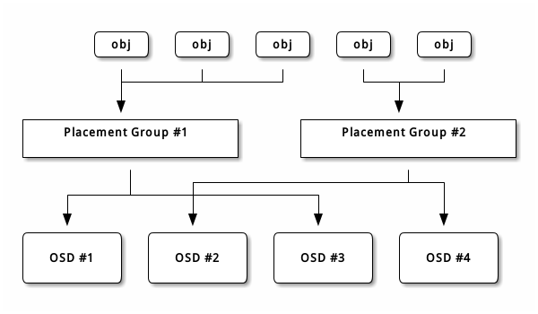

# Ceph体系结构
Ceph可提供极大的伸缩性——供成千用户访问 PB 乃至 EB 级的数据。

Ceph节点（Node）以普通硬件和智能守护进程作为支撑点，Ceph存储集群（Storage Cluster）组织起了大量节点，它们之间靠相互通讯来复制数据、并动态地重分布数据。

## Ceph存储集群
Ceph提供了一个可无限伸缩的Ceph存储集群，它基于RADOS（Reliable Autonomic Distributed Object Store）。

Ceph存储集群包含两种类型的守护进程：
- Ceph Monitor 
- Ceph OSD 

Ceph Monitor维护着集群运行图的主副本。一个Monitor集群确保了当某个Monitor失效时的高可用性。存储集群向客户端的Ceph Monitor索取集群的运行图的最新副本。

Ceph OSD（Object Storage Daemon）检查自身状态、以及其他OSD的状态，并报告给监视器。

存储集群的客户端和各个Ceph OSD Daemon使用CRUSH算法高效地计算数据位置，而不是依赖于中心化的查询表。它的高级功能包括：基于librados的原生存储接口和多种基于librados的服务接口。

### 数据的存储
Ceph存储集群从Ceph客户端接收数据——不管是来自Ceph块设备、Cephe对象存储、Ceph文件系统还是基于librados的自定义实现——并存储为对象。每个对象是文件系统的一个文件，它们存储在对象存储设备（Object Storage Device）上。由Ceph OSD守护进程处理存储设备上的读/写操作。

Ceph OSD在扁平的命名空间内把所有数据存储为对象（也就是没有目录层次）。对象包含一个标识符、二进制数据、和由名字/值对组成的元数据，元数据语义完全取决于Ceph Client。例如，CephFS用元数据存储文件属性，如文件所有者、创建日期、最后修改日期等等。

Note：一个对象ID不止本地唯一，它在整个集群内部都是唯一的。

### 伸缩性和高可用性
在传统架构里，客户端与一个中心化的组件通信（如网关、中间件、API、前段等等），它作为一个复杂子系统的唯一入口，它引入单点故障的同时，页限制了性能和伸缩性。

Ceph消除了集中网关，允许客户端直接和Ceph OSD进程通讯。Ceph OSD进程自动在其他Ceph Node上创建对象副本来确保数据安全和高可用性；为保证高可用性，Monitor页实现了集群化。为消除中心节点，Ceph使用了CRUSH算法。

- CRUSH简介
Ceph客户端和OSD进程都用CRUSH算法来计算对象的位置信息，而不是依赖于中心化的查询表。与以往方法相比，CRUSH的数据管理机制更好，它很干脆地把工作分配给集群内的所有Client和OSD来处理，因此具有极大的伸缩性。CRUSH用智能数据复制确保弹性，更能适合超大规模集群。下列几段描述了CRUSH如何工作，更详细的机制请参阅论文：《CRUSH: Controlled, Scalable, Decentralized Placement of Replicated Data》

- 集群运行图
Ceph依赖于Ceph Client和OSD，因为它们知道集群的拓扑，这个拓扑由5张图共同描述，统称为“集群运行图”：

    1.  Monitor Map：包含集群的fsid、位置、名字、地址和端口，也包括当前版本、创建时间、最近修改时间。要查看监视器图，用ceph mon dump命令。
    
    2. OSD Map：包含集群fsid、创建时间、最近修改时间、存储池列表、副本数量、归置组数量、OSD状态及其状态（如up、in）。要查看OSD运行图，用ceph osd dump命令。
    
    3. PG Map：PG全称是（placement groups）它是ceph的逻辑存储单元。包含归置组版本、其时间戳、最新的OSD运行图版本、占满率、以及归置组的详情，像归置组ID、up set、acting set、PG状态（如active+clean）和各种存储池的数据使用情况统计。
    
    4. CRUSH Map：包含存储设备列表、故障域树状结构（如设备、主机、机架、行、房间等）和存储数据时如何利用此树状结构的规则。要查看CRUSH规则，执行ceph osd getcrushmap -o {filename}命令；然后用crushtool -d {comp-crushmap-filename} -o {decomp-crushmap-file}反编译；然后使用vim编辑器查看。
    
    5. MDS Map：MSD全称是（MetaData Server）它是ceph元数据服务守护进程，包含当前MSD图的版本、创建时间、最近修改时间还包含了存储元数据的存储池、元数据服务器列表、还有哪些元数据服务器是up且in的。要查看MDS图，执行ceph msd dunp。

各运行图维护着各自运营状态的变更，Ceph Monitor维护着一份集群运行图的主拷贝，包括集群成员、状态、变更以及Ceph存储集群的整体监控情况。

- 高可用监视器

Ceph client读或写数据前必须先连接到某个Ceph Monitor、获得最新的集群运行图副本。一个Ceph存储集群只需要一个Monitor就能运行，但它就成了单一故障点（即如果此Monitor宕机， Ceph Client就不能读写数据了）。

为增强可靠性和容错能力， Ceph 支持Monitor集群；在一个监视器集群内，延时以及其它错误会导致一到多个Montor滞后于集群的当前状态，因此， Ceph的各Monitor例程必须就集群的当前状态达成一致。Ceph 总是使用大多数Monitor（如：1、2:3、3:5、4:6 等等）和Paxos算法就集群的当前状态达成一致。

- 高可用性认证

为识别用户并防止中间人攻击，Ceph用chepx认证系统来认证用户和守护进程。

Note：cephx协议不解决传输加密（如SSL/TLS）或者存储加密问题。

Cephx用共享密钥来认证，即client和monitor集群各自都有客户端密钥的副本。这样的认证协议使参与双方不用展现密钥就能相互认证，就是说集群确信用户拥有密钥、而且用户相信集群有密钥的副本。

Ceph一个主要伸缩功能就是避免了对象存储的中央接口，这就要求Ceph Client能直接和OSD交互。 Ceph通过cephx认证系统保护数据，它也认证运行Ceph Client的用户， cephx协议运行机制类似Kerberos。

用户/参与者通过调用Ceph Client来联系Monitor，不像Kerberos，每个Monitor都能认证用户、发布密钥，所以使用cephx时不会有单点故障或瓶颈。监视器返回一个类似Kerberos票据的认证数据结构，它包含一个可用于获取Ceph服务的会话密钥，会话密钥是用户的永久私钥自加密过的，只有此用户能从Ceph Monitror 请求服务。Client用会话密钥向Monitor请求需要的服务，然后Monitor给Client一个凭证用以向实际持有数据的OSD认证。 Ceph的Monitor和OSD共享相同的密钥，所以集群内任何OSD或元数据服务器都认可Client从Monitor获取的凭证，像 Kerberos一样cephx凭证也会过期，以使攻击者不能用暗中得到的过期凭证或会话密钥。只要用户的私钥过期前没有泄露，这种认证形式就可防止中间线路攻击者以别人的ID发送垃圾消息、或修改用户的正常消息。

要使用cephx，管理员必须先设置好用户。在下面的图解里，client.admin用户从命令行调用ceph auth get-or-create-key 来生成一个用户及其密钥，Ceph的认证子系统生成了用户名和密钥、副本存到Monitor然后把此用户的密钥回传给client.admin用户，也就是说Client和Monitor共享着相同的密钥。

Note：client.admin用户必须以安全方式把此用户ID和密钥交给用户。

要和Monitor认证，Client得把用户名传给Monitor，然后Monitor生成一个会话密钥、并且用此用户的密钥加密它，然后把加密的凭证回传给Client，Client用共享密钥解密载荷就可获取会话密钥。会话密钥在当前会话中标识了此用户，Client再用此会话密钥签署过的用户名请求一个凭证，Monitor生成一个凭证、用用户的密钥加密它，然后回传给Client，Client解密此凭证，然后用它签署连接集群内OSD和元数据服务器的请求。

cephx协议认证Client机器和Ceph Sever间正在进行的通讯，二者间认证完成后的每条消息都用凭证签署过，Monitor、 OSD、元数据服务器都可用此共享的密钥来校验这些消息。

认证提供的保护位于Ceph Client和Server间，没有扩展到Ceph Client之外。如果用户从远程主机访问Ceph Client， Ceph认证就不管用了，它不会影响到用户主机和Client主机间的通讯。

- 智能程序支撑超大规模

在很多集群架构中，集群成员的主要目的就是让集中式接口知道它能访问哪些节点，然后此中央接口通过一个两级调度为客户端提供服务，在PB到EB级系统中这个调度系统必将成为最大的瓶颈。

Ceph消除了此瓶颈：OSD进程和Client都能感知集群，比如Ceph客户端、各OSD守护进程都知道集群内其他的OSD进程，这样OSD就能直接和其他OSD进程和Monitor通信。另外，Ceph Client也能直接和OSD进程交互。

Ceph Client、Monitor和OSD进程可以相互直接交互，这意味着OSD可以利用本地Node的CPU和Memory执行那些有可能拖CPU的任务。这种设计均衡了计算资源，带来几个好处：
1. OSD直接服务于Client：由于任何网络设备都有最大并发连接上限，规模巨大时中央化的系统其物理局限性就暴露了。Ceph允许Client和OSD节点联系，这在消除单故障点的同时，提升了性能和系统总容量。Ceph Client可按需维护和某OSD的会话，而不是一中央服务器。
2. OSD成员和状态：Ceph OSD加入集群后会持续报告自己的状态。在低层，OSD状态为up或down，反映它是否运行、是否提供服务。如果一OSD状态为down且in，表明OSD进程可能故障了；如果一OSD进程没在运行（比如崩溃了），它就不能亲自向monitor报告自己是down的。Ceph Monitor能周期性地ping OSD进程，以确保它们在运行，然而它也授权OSD进程去确认邻居OSD是否down了，并更新集群运行图、报告给Monitor。这种机制意味监视器还是轻量级进程。
3. 数据清洗：作为维护数据一致性和清洁度的一部分，OSD能清洗归置组内的对象。就是说，Ceph OSD能比较对象元数据与存储在其他OSD上的副本元数据，以捕捉OSD缺陷或文件系统错误（每天）。OSD也能做深度清洗（每周），即安位比较对象中的数据，以找出轻度清洗时未发现的硬盘坏扇区。
4. 复制：和Ceph Client一样，OSD也用CRUSH算法，但用于计算副本存到哪里（也用于重均衡）。一个典型的写情形是，一个 Client用CRUSH算法算出对象应存到哪里，并把对象映射到存储池和归置组，然后查找CRUSH图来确定此归置组的主OSD。

Client把对象写入目标归置组的主OSD，然后这个主OSD在用它的CRUSH图副本找出用于存放对象副本的第二、第三个OSD，并把数据复制到适当的归置组所对应的第二、第三OSD（要多少副本就有多少OSD），最终，确认数据成功存储后反馈给Client。

有了做副本的能力，OSD进程就可以减轻Client的复制压力，同时保证了数据的可靠性和安全性。

### 动态集群管理

在伸缩性和高可用性一节，我们解释了Ceph如何用CRUSH、集群感知性和只能OSD进程来扩展和维护高可用性。Ceph的关键设计是自治，自修复、智能的OSD进程。让我们深入了解下CRUSH如何运作，如何动态实现现代云存储基础设施的数据存放、重均衡、错误恢复。

- 关于存储池
    
Ceph存储系统支持“池”概念，它是存储对象的逻辑分区。
Ceph Client从Monitor获取一张集群运行图，并把对象写入存储池。存储池的size或副本数、CRUSH规则集和归置组数量决定着Ceph如何放置数据。

存储池至少可设置以下参数：

    * 对象的所有权/访问权限
    * 归置组数量
    * 使用的CRUSH规则集

- PG映射到OSD

每个存储池都有很多归置组，CRUSH动态的把它们映射到OSD。Ceph Client要存对象时，CRUSH将把各对象映射到某个归置组。

把对象映射到归置组在OSD和Client间创建了一个间接层。由于Ceph集群必须能增大或减少、并动态地重均衡。如果让Client“知道”哪个OSD有哪个对象，就会导致Client和OSD紧耦合；相反，CRUSH算法把对象映射到归置组、然后再把各归置组映射到一个或多个OSD，这一间接层可以让Ceph在OSD进程和低层设备上线时动态地重均衡。下列图表描述了CRUSH如何将对象映射到归置组、再把归置组映射到OSD。

有了集群运行图副本和CRUSH算法，Client就能精准计算出哪个OSD读写某个特定对象。
 
- 计算PG ID

Ceph Client绑定到某Monitor时，会索取最新的集群运行图副本，有了此图，Client就能知道集群内的所有Monitor、OSD和元数据服务器。然而它对对象的位置一无所知（对象的位置是计算出来）。

Client值需要输入对象ID和存储池，此事简单：Ceph把数据存在某存储池（如liverpool）中。当Client向要存命名对象（如john、paul、georage、ringo等等）时，它用对象名，一个哈希值、存储池中的归置数组、存储池名计算归置组。

Ceph按下列步骤计算PG ID。
1. 客户端输入存储池ID和对象ID（如pool="liverpool"和object-id="john"）
2. CRUSH拿到对象ID并哈希它
3. CRUSH用PG数（如58）对哈希取模，这就是归置组ID
4. CRUSH根据存储池名取的存储池ID（如liverpool = 4）
5. CRUSH把存储池ID加到PG ID（如4.58）之前。

计算对象位置远快于查询定位，CRUSH算法允许Client计算对象应该存到哪里，并允许Client连接主OSD来存储或检索对象。

- 互联和子集

在前面的章节中，我们注意到OSD进程相互检查心跳并回馈给Monitor；它们的另一行为叫互联（perring），这是一种把一归置组内所有对象（及元数据）所在的OSD带到一致状态的过程。事实上，OSD进程会向Monitor报告互联失败，互联问题一般会自行恢复，然而如果问题一直持续，你也许得参照++互联失败故障++解决。

*Note：状态达成一致并不意味着PG持有最新内容。*

Ceph存储集群被设计为至少存储两份对象数据（及size=2），这是确保数据安全的最小要求。为保证高可用性，Ceph存储集群应该保存两份以上的对象副本（如size=3且min_size=2)，这样才能在degraded状态继续运行，同时维持数据安全。

回想前面*智能程序支撑超大规模*中的图表，我们没明确地OSD进程的名称（如osd.0、osd.1等），而是称之为主、次、以此类推。按惯例，主OSD是acting set中的第一个OSD，而且它负责协调以它为主OSD的各归置组的互联，也只有它会接收client端到某归置组内对象的写入请求。

当一系列OSD负责一归置组时，这一系列的OSD就成为一个acting set。一个actingset对应当前负责此归置组的一组OSD，或者说截止到某个版本为止负责某个特定归置组的那些OSD。

OSD进程作为acting set的一部分，不一定总在up状态。当一OSD在acting set中是up状态时，它就是up set的一部分。up set是个重要特征，因为某OSD失败是Ceph会吧PG映射到其他OSD。

*Note：在某PG的acting set中包含了osd.25、osd.32和osd.61，第一个osd.25是主osd，如果它失败了，第二个osd.32成为主OSD，osd25会被移出up set。*

- 重均衡

你向Ceph存储集群新增一OSD进程时，集群运行图就要用新增的OSD更新。回想计算PG ID，这个动作会更改集群运行图，因此也改变了对象位置，因为计算时的输入条件变了。下面的图描述了重均衡过程（此图很粗略，因为在大型集群变动幅度小的多），是其中的一些而不是所有PG都从已有OSD（OSD1和2）迁移到OSD(OSD3)。即使在重均衡中，CRUSH都是稳定的，很多归置组扔维持最初的配置，且各OSD都腾出了这些空间，所以重均衡完成后新OSD上不会出现负载突增。

- 数据一致性

作为维护数据一致和清洗的一部分，OSD页能清洗归置组内的对象，也就是说，OSD会比较归置组内位于不同OSD的各对象副本的元数据。清洗（通常每天执行）是为捕获OSD缺陷和文件操作，OSD页能执行深度清洗：按位比较对象内的数据；深度清洗（通常每周执行）时为了捕捉哪些在轻度清洗过程中未能发现的磁盘上的坏扇区。

### 纠删编码

纠删码存储池把各对象存储为 K+M 个数据块，其中有 K 个数据块和 M 个编码块。此存储池的尺寸为 K+M ，这样各块被存储到位于 acting set 中的 OSD ，块的位置也作为对象属性保存下来了。

比如一纠删码存储池创建时分配了五个 OSD （ K+M = 5 ）并容忍其中两个丢失（ M = 2 ）。

- 读出和写入编码块

当包含ABCDEFGHI的对象NYAN被写入存储池时，纠删编码(Erasure Code)函数把内容分割为三个数据块，只是简单地切割为三分：第一份包含ABC、第二份是DEF、最后是GHI，若内容长度不是K的倍数则需填充；此函数还会创建两个编码开：第四个是YXY、第五个是GQC，各块分别存入acting set中的OSD内。这些块存储到相同名称的对象、但是位于不同的OSD上；分块顺序也必须保留，被存储为对象的一个属性（shard_t）追加到名字后面。包含ABC的块1存储在OSD5、包含YXY的块4存储在OSD3上。

从纠删码存储池中读取NYAN对象时，解码函数会读取三个块：包含ABC的块1，包含GHI的块3和包含YXY的块4，然后重建对象的原始内容ABCDEFGHI。解码函数被告知块2和5丢失了（被称为“擦除”），块5不可读是因为OSD4出局了。只要有三块读出就可以成功调用解码函数。OSD2是最慢的，其数据未被采纳。

- 被中断的完全写
在纠删码存储池中，up set中的主OSD接收所有写操作，它负责把载荷编码为K+M个块并发送给其他OSD。它也负责维护归置组日志的一份权威版本。

在下图中，已创建了一个参数为K = 2 + M = 1的纠删编码归置组，存储在三个OSD上，两个存储K、一个存储M。此归置组的acting set由OSD 1、OSD 2、OSD 3组成。一个对象已被编码并存进了各OSD：块D1v1（即数据块号为1，版本为1）在OSD1上，D2v1在OSD2上、C1v1（即编码块号为1，版本为1）在OSD3上。在各OSD上的归置组日志都相同（即1,1表明epoch为1，版本为1）。

OSD1是主的，它从Client收到WRETE FULL请求，这意味着净载荷将会完全取代此对象，而非部分覆盖。此对象的版本2将被创建以取代版本1。OSD1把净载荷编码为三块：D1v2（即数据块1，版本2）将存储OSD1、D2v2在OSD2上、C1v2（即编码块1,版本2）在OSD3上，各块分别被发往目标OSD，包括主OSD，它处理存储块还负责处理写操作和维护归置组日志的权威版本。当某个OSD收到写入块的指令消息后，它也会穿件一条归置组日志来反映变更，比如在OSD3存储C1v2时它会把1,2（即epoch1，version2）写入它自己的日志。因为OSD间是异步操作的，当某些块还落盘（像D2v2），其它的可能已经被确认存在磁盘上了（像C1v1和D1v1）。

如果一切顺利，各块被证实已在acting set中的OSD上了，日志的last_complete指针就会从1,1改为指向1,2。

最后，用于存储对象前一版本的文件就可以删除了：OSD1上的D1v1、OSD2上的D2v1和OSD 3上的C1v1。

但是意外发生了，如果 OSD 1 挂了、同时 D2v2 仍写完成，此对象的版本 2 一部分已被写入了： OSD 3 有一块但是不足以恢复；它丢失了两块： D1v2 和 D2v2 ，并且纠删编码参数 K = 2 、 M = 1 要求至少有两块可用才能重建出第三块。 OSD 4 成为新的主 OSD ，它发现 last_complete 日志条目（即在此条目之前的所有对象在之前 acting set 中的 OSD 上都可用）是 1,1 那么它将是新权威日志的头条。

在 OSD 3 上发现的日志条目 1,2 与 OSD 4 上新的权威日志有分歧：它将被忽略、且包含 C1v2 块的文件也被删除。 D1v1 块将在清洗期间通过纠删码库的 decode 解码功能重建，并存储到新的主 OSD 4 上。

### 缓存分级

对于后端存储层上的部分热点数据，缓存层能向 Ceph 客户端提供更好的 IO 性能。缓存分层包含由相对高速、昂贵的存储设备（如固态硬盘）创建的存储池，并配置为 缓存层；以及一个后端存储池，可以用纠删码编码的或者相对低速、便宜的设备，作为经济存储层。 Ceph 对象管理器会决定往哪里放置对象，分层代理决定何时把缓存层的对象刷回后端存储层。所以缓存层和后端存储层对 Ceph 客户端来说是完全透明的。

### 扩展Ceph

你可以通过创建 ‘Ceph Classes’ 共享对象类来扩展 Ceph 功能， Ceph 会动态地载入位于 osd class dir 目录下的 .so 类文件（即默认的 $libdir/rados-classes ）。如果你实现了一个类，就可以创建新的对象方法去调用 Ceph 对象存储内的原生方法、或者公用库或自建库里的其它类方法。

写入时， Ceph 类能调用原生或类方法，对入栈数据执行任意操作、生成最终写事务，并由 Ceph 原子地应用。

读出时， Ceph 类能调用原生或类方法，对出栈数据执行任意操作、把数据返回给客户端。

Ceph 类实例:

    一个为内容管理系统写的类可能要实现如下功能，它要展示特定尺寸和长宽比的位图，所以入栈图片要裁剪为特定长宽比、缩放它、并嵌入个不可见的版权或水印用于保护知识产权；
    然后把生成的位图保存为对象。

典型的实现见 src/objclass/objclass.h 、 src/fooclass.cc 、和 src/barclass 。

### 小结

Ceph 存储集群是动态的——像个生物体。尽管很多存储设备不能完全利用一台普通服务器上的 CPU 和 RAM 资源，但是 Ceph 能。从心跳到互联、到重均衡、再到错误恢复， Ceph 都把客户端（和中央网关，但在 Ceph 架构中不存在）解放了，用 OSD 的计算资源完成此工作。参考前面的硬件推荐和网络配置参考理解前述概念，就不难理解 Ceph 如何利用计算资源了。

## Ceph协议

Ceph 客户端用原生协议和存储集群交互， Ceph 把此功能封装进了 librados(RADOS - Reliable, Autonomic Distributed Object Store) 库，这样你就能创建自己的定制客户端了，下图描述了基本架构。

### 原生协议和librados

现代程序都需要可异步通讯的简单对象存储接口。 Ceph 存储集群提供了一个有异步通讯能力的简单对象存储接口，此接口提供了直接、并行访问集群对象的功能。

- 存储池操作；
- 快照和写时复制克隆；
- 读/写对象； - 创建或删除； - 整个对象或某个字节范围； - 追加或截断；
- 创建/设置/获取/删除扩展属性；
- 创建/设置/获取/删除键/值对；
- 混合操作和双重确认；
- 对象类。

### 数据监视/通知

客户端可以注册对某个对象的持续兴趣，并使到主 OSD 的会话保持打开。客户端可以发送一通知消息和载荷给所有监视者、并可收集监视者的回馈通知。这个功能使得客户端可把任意对象用作同步/通讯通道。

### 数据条带化

存储设备都有吞吐量限制，它会影响性能和伸缩性，所以存储系统一般都支持条带化（把连续的信息分片存储于多个设备）以增加吞吐量和性能。数据条带化最常见于 RAID 中， RAID 中最接近 Ceph 条带化方式的是 RAID 0 、或者条带卷， Ceph 的条带化提供了像 RAID 0 一样的吞吐量、像 N 路 RAID 镜像一样的可靠性、和更快的恢复。

Ceph 提供了三种类型的客户端：块设备、文件系统和对象存储。 Ceph 客户端把展现给用户的数据格式（一块设备映像、 REST 风格对象、 CephFS 文件系统目录）转换为可存储于 Ceph 存储集群的对象。

Tip:

    在 Ceph 存储集群内存储的那些对象是没条带化的。 Ceph 对象存储、 Ceph 块设备、和 Ceph 文件系统把他们的数据条带化到 Ceph 存储集群内的多个对象，客户端通过 librados 直接写入 Ceph 存储集群前必须先自己条带化（和并行 I/O ）才能享受这些优势。
    
最简单的 Ceph 条带化形式就是一个对象的条带。 Ceph 客户端把条带单元写入 Ceph 存储的对象，直到对象容量达到上限，才会再创建另一个对象存储未完的数据。这种最简单的条带化对小的块设备映像、 S3 、 Swift 对象或 CephFS 文件来说也许足够了；然而这种简单的形式不能最大化 Ceph 在归置组间分布数据的能力，也就不能最大化性能。下图描述了条带化的最简形式：

如果要处理大尺寸图像、大 S3 或 Swift 对象（如视频）、或大的 CephFS 目录，你就能看到条带化到一个对象集中的多个对象能带来显著的读/写性能提升。当客户端把条带单元并行地写入相应对象时，就会有明显的写性能，因为对象映射到了不同的归置组、并进一步映射到不同 OSD ，可以并行地以最大速度写入。到单一磁盘的写入受限于磁头移动（如：6ms 寻道时间）和存储设备带宽（如：100MB/s）， Ceph把写入分布到多个对象（它们映射到了不同归置组和 OSD ），这样可减少每设备寻道次数、联合多个驱动器的吞吐量，以达到更高的写（或读）速度。

Note:

    条带化独立于对象复制。因为 CRUSH 会在 OSD 间复制对象，数据条带是自动被复制的。
    
在下图中，客户端数据条带化到一个对象集（下图中的 object set 1 ），它包含 4 个对象，其中，第一个条带单元是 object 0 的 stripe unit 0 、第四个条带是 object 3 的 stripe unit 3 ，写完第四个条带，客户端要确认对象集是否满了。如果对象集没满，客户端再从第一个对象起写入条带（下图中的 object 0 ）；如果对象集满了，客户端就得创建新对象集（下图的 object set 2 ），然后从新对象集中的第一个对象（下图中的 object 4 ）起开始写入第一个条带（ stripe unit 16 ）。

三个重要变量决定着 Ceph 如何条带化数据：

- 对象尺寸： Ceph 存储集群里的对象有最大可配置尺寸（如 2MB 、 4MB 等等），对象尺寸必须足够大以便容纳很多条带单元、而且应该是条带单元的整数倍。

- 条带宽度： 条带都有可配置的单元尺寸（如 64KB ）。 Ceph 客户端把数据等分成适合写入对象的条带单元，除了最后一个。条带宽度应该是对象尺寸的分片，这样对象才能 包含很多条带单元。

- 条带数量： Ceph 客户端把一系列条带单元写入由条带数量所确定的一系列对象，这一系列的对象称为一个对象集。客户端写到对象集内的最后一个对象时，再返回到第一个。
    
Important:

    把集群投入生产环境前要先测试条带化配置的性能，因为把数据条带化到对象中之后这些参数就不可更改了。

Ceph 客户端把数据等分为条带单元并映射到对象后，用 CRUSH 算法把对象映射到归置组、归置组映射到 OSD ，然后才能以文件形式存储到硬盘上。

Note:

    因为客户端写入单个存储池，条带化到对象的所有数据也被映射到同一存储池内的归置组，所以它们要使用相同的 CRUSH 图和相同的访问权限。

## Ceph客户端

Ceph 客户端包括数种服务接口，有：

- 块设备： Ceph 块设备（也叫 RBD - distributed block device ）服务提供了大小可调、精炼、支持快照和克隆的块设备。为提供高性能， Ceph 把块设备条带化到整个集群。 Ceph 同时支持内核对象（ KO ） 和 QEMU 管理程序直接使用``librbd`` ——避免了内核对象在虚拟系统上的开销。

- 对象存储： Ceph 对象存储（也叫 RGW - rados gateway）服务提供了 ``RESTful 风格``的 API ，它与 Amazon S3 和 OpenStack Swift 兼容。

- 文件系统： Ceph 文件系统（ CephFS ）服务提供了兼容 POSIX 的文件系统，可以直接 mount 或挂载为用户空间文件系统（ FUSE ）。

Ceph 能额外运行多个 OSD 、 MDS 、和监视器来保证伸缩性和高可靠性，下图描述了高级架构。

### Ceph对象存储

Ceph 对象存储守护进程， radosgw ，是一个 FastCGI 服务，它提供了 ``RESTful 风格`` HTTP API 用于存储对象和元数据。它位于 Ceph 存储集群之上，有自己的数据格式，并维护着自己的用户数据库、认证、和访问控制。 RADOS 网关使用统一的命名空间，也就是说，你可以用 OpenStack Swift 兼容的 API 或者 Amazon S3 兼容的 API ；例如，你可以用一个程序通过 S3 兼容 API 写入数据、然后用另一个程序通过 Swift 兼容 API 读出。

    S3/Swift 对象和存储集群对象比较
    Ceph 对象存储用对象这个术语来描述它存储的数据。 S3 和 Swift 对象不同于 Ceph 写入存储集群的对象， Ceph 对象存储系统内的对象可以映射到 Ceph 存储集群内的对象； S3 和 Swift 对象却不一定 1:1 地映射到存储集群内的对象，它有可能映射到了多个 Ceph 对象。

### Ceph块设备

Ceph 块设备把一个设备映像条带化到集群内的多个对象，其中各对象映射到一个归置组并分布出去，这些归置组会分散到整个集群的 ceph-osd 守护进程上。

    Important:条带化会使 RBD 块设备比单台服务器运行的更好！

精简的、可快照的 Ceph 块设备对虚拟化和云计算很有吸引力。在虚拟机场景中，人们一般会用 Qemu/KVM 中的 rbd 网络存储驱动部署 Ceph 块设备，其中宿主机用 librbd 向客户机提供块设备服务；很多云计算堆栈用 libvirt 和管理程序集成。你可以用精简的 Ceph 块设备搭配 Qemu 和``libvirt`` 来支持 OpenStack 和 CloudStack ，一起构成完整的方案。

现在``librbd``还不支持其它管理程序，你也可以用 Ceph 块设备内核对象向客户端提供块设备。其它虚拟化技术，像 Xen 能访问 Ceph 块设备内核对象，用命令行工具 rbd 实现。

### Ceph文件系统

Ceph 文件系统（ Ceph FS ）提供与 POSIX 兼容的文件系统服务，坐于基于对象的 Ceph 存储集群之上，其内的文件被映射到 Ceph 存储集群内的对象。客户端可以把此文件系统挂载在内核对象或用户空间文件系统（ FUSE ）上。

Ceph 文件系统服务包含随 Ceph 存储集群部署的元数据服务器（ MDS ）。 MDS 的作用是把所有文件系统元数据（目录、文件所有者、访问模式等等）永久存储在相当可靠的元数据服务器中内存中。 MDS （名为 ceph-mds 的守护进程）存在的原因是，简单的文件系统操作像列出目录（ ls ）、或进入目录（ cd ）这些操作会不必要的扰动``OSD``。所以把元数据从数据里分出来意味着 Ceph 文件系统能提供高性能服务，又能减轻存储集群负载。

Ceph FS 从数据中分离出了元数据、并存储于 MDS ，文件数据存储于存储集群中的一或多个对象。 Ceph 力争兼容 POSIX 。 ceph-mds 可以只运行一个，也可以分布于多台物理机器，以获得高可用性或伸缩性。

- 高可用性： 多余的 ceph-mds 例程可处于 standby （待命）状态，随时准备替下之前处于 active （活跃）状态的故障 ceph-mds 。这可以轻易做到，因为所有数据、包括日志都存储在 RADOS 上，这个转换过程由 ceph-mon 自动触发。

- 伸缩性： 多个 ceph-mds 例程可以同时处于 active 状态，它们会把目录树拆分为子树（和单个热点目录的分片），在所有活跃服务器间高效地均衡负载。

    Important 译者：虽然文档这么说，但实践中还不推荐这样做， MDS 稳定性尚不理想。多个活跃的 MDS 远没一个稳定，即便如此，您也应该先配置起几个 MDS 备用。

待命（ standby ）和活跃（ active ） MDS 可组合，例如，运行 3 个处于 active 状态的 ceph-mds 例程以实现扩展、和 1 个 standby 例程以实现高可用性。

精品博客：http://way4ever.com/
