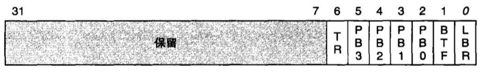
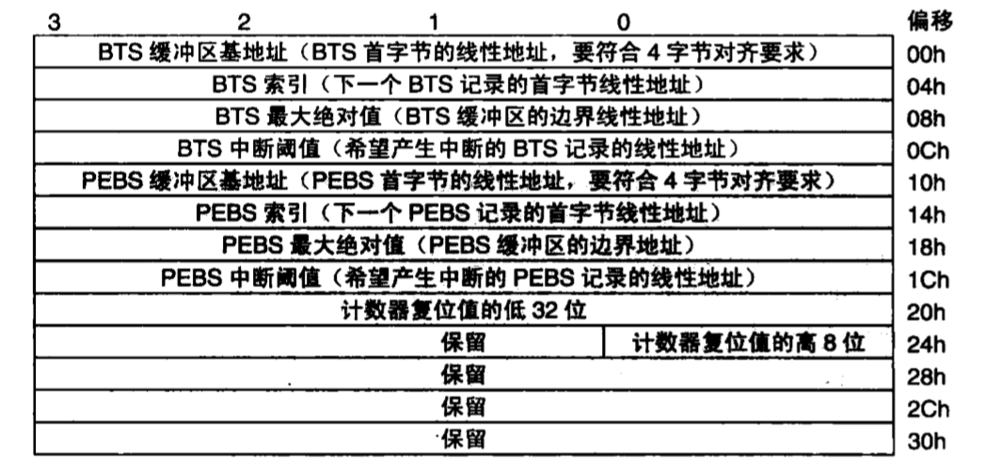
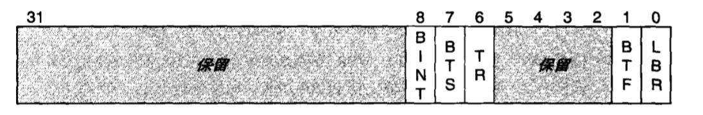

- 1 概述
    - 1.1 使用寄存器的分支记录
        - 1.1.1 LBR
        - 1.1.2 LBR Stack
    - 1.2 使用内存的分支记录
        - 1.2.1 DS存储区
        - 1.2.2 启用DS机制
        - 1.2.3 调试控制寄存器

# 1. 概述

如何记录软件的运行轨迹呢？因为CPU是软件的执行者，每一条指令不论是顺序执行还是分支和跳转，都是由它来执行的，所以让CPU来记录软件的运行轨迹是最合适的。

CPU的设计者们早已经意识到了这一点。上面我们介绍过P6处理器进入的按分支单步执行的功能，其实该功能是基于一个更基本的功能，那就是监视和记录分支（branch）、中断（Interrupt）和异常（Exception）事件，简称为分支监视和记录。奔腾4处理器对这一功能又做了很大的增强，允许将分支信息记录到内存中一块被称为BTS（Branch Trace Buffer）的缓冲区中，称为调试存储机制（Debug Store）。

## 1.1 使用寄存器的分支记录

使用MSR寄存器来记录分支的方法。P6处理器最先引入了这种方法，可以记录最近一次分支的源和目标地址，称为Last Branch Recording，简称为LBR。奔腾4处理器对其做了增强，增加了寄存器个数，以栈的方式可以保存多个分支记录，称为LBR栈（LBR Stack）。

### 1.1.1 LBR

P6处理器设计了5个MSR寄存器（Machine/Model Specific Registers）用来实现LBR机制。
这5个MSR寄存器是：

1. 用来记录分支的LastBranchToIP和LastBranchFromIP寄存器对。
2. 用来记录异常的LastExceptionToIP和LastExceptionFromIP寄存器对。
3. 一个MSR寄存器来控制新加入的调试功能，称为DebugCtl，其格式如下图所示。

当发生分支时，LastBranchFromIP用来记录分支指令的地址，LastBranchToIP用来记录着个分支要转移到达的目标地址。

当异常（调试异常除外）或中断发生时，CPU会先把LastBranchToIP和LastBranchFromIP中的内容分别复制到LastExceptionToIP和LastExceptionFromIP寄存器中，然后，再把发生异常或中断时被打断的地址更新到LastBranchFromIP，把异常和中断处理程序的地址更新到LastBranchToIP寄存器中。

虽然DebugCtl MSR是一个32位的寄存器，但是只使用了低7位，其中各个位的含义如下：
- LBR位用来启用LBR机制，如果此位被置1，那么处理器会使用上面介绍的4个寄存器来记录分支和异常/中断的位置。对于P6处理器，当CPU产生调试异常发生时，CPU会自动清除此位，以防止调试异常处理器函数的内部的分支覆盖掉原来的结果。
- BTF（Branch Trace Flag）的作用是启用按分支单步执行。如果此位被置1，那么CPU会将标志寄存器EFLAGS的TF（陷阱标志）位看作是“single-step on branches”。换句话说，当BTF位和TF位都为1时，在CPU执行完下一个分支指令后便会产生调试异常。
- PB0与CPU上的BP0#（Breakpoint and Performance Monitoring output pin 0）引脚相对应。如果此位被置为1，那么当CPU检测到DR0（调试地址寄存器0）所定义的断点条件时会设置BP0#引脚，以通知键盘调试工具。如果此位被置为0，那么性能计数器0的值增加或溢出（由PerfEvtSel0寄存器控制）时，CPU会反转（toggle）BP0#引脚上的电平。 PB1 ~ PB3与PB0类似，只是与CPU上的BP1# ~ BP3#引脚和DR1 ~ DR3寄存器相对应。 TR（Trace message enable）位用来启用（设为1）或禁止向前端总线（FBS）上发送分支踪迹消息（Branch Trace Messages，简称BTM）。当为1时，当前CPU检测到分支、中断/异常时，都会向FSB总线上发送BTM消息，以通知总线分析仪（bus analyzer）之类的调试工具。启用该相功能会影响CPU的性能。

### 1.1.2 LBR Stack

P6的LBR机制只可以记录最近一次的分支和异常，奔腾4处理器对其做了增强，进入了所谓的"最近分支记录堆栈"（Last Branch Record Stack），简称LBR栈，可以记录4次或更多次的分支和异常。

LBR栈是一个环形堆栈，由数个用来记录分支地址的MSR寄存器（称为LBR MSR）和一个表示栈顶（Top of Stack）指针的MSR寄存器（称为MSR_LASTBRANCH_TOS）构成。CPU在把心的分支记录放入这个堆栈前会先把TOS加1，当TOS达到最大值时，会自动归0。

LBR栈的容量因CPU型号的不同而不同，目前产品的可能值为4、8和16。可以通过CPUID指令获取CPU的Family和Model号码，再根据Model号码确定LSR MSR的数量。

奔腾4 CPU，Model号为0 ~ 2的处理器有4个LBR MSR寄存器，名称为MSR_LASTBRANCH_0到MSR_LASTBRANCH_3，每个的长度是64位，高32是分支的目标地址（to），低32位是分支指令的地址（from）。这样，这个堆栈可以记录最多4次的分支、中断或异常。

Core微架构的CPU通常有8个LBR寄存器，MSR_LASTBRANCH_0_FROM_IP ~ MSR_LASTBRANCH_3_FORM_IP用来记录分支的源地址，MSR_LASTBRANCH_0_TO_IP ~ MSR_LASTBRANCH_3_TO_IP用来记录分支的目标地址。这8个寄存器都是64位的，可以记录最近4此分支、中断或异常。

LBR寄存器中内容的含义可能因为CPU型号的不同而不同。在P6处理器中，4个分支记录寄存器所保存的地址都是相对于当前代码段的偏移。在奔腾4处理器中，LBR栈中记录的是线性地址。在Core微架构的CPU中，可以通过IA32_PERF_CAPABILITIES寄存器的0 ~ 5位的值来判断。

## 1.2 使用内存的分支记录

使用MSR寄存器的分支记录机制有一个很明显的局限，那就是可以记录的分支次数太少，其应用价值比较有效。因为寄存器是位于CPU内部的，所以靠增加LBR寄存器的数量来提高记录分支的次数是不经济的。于是，人们很自然地想到设置一个特定的内存区供CPU来保存分支信息。这便是分支追踪存储（Branch Trace Store）机制，简称为BTS。

BTS允许把分支记录保存在一个特定的被称为BTS缓冲区的内存区内。BTS缓冲区与用于记录性能监控信息的PEBS缓冲区是使用类似的机制来管理的，这种机制被称为调试存储区（Debug Store），简称为DS存储区。

PEBS的全称是Precise Event-Based Sampling，即精准的基于事件采样，是奔腾4处理器引入的一种性能监控机制。当某个性能计数器被设置为触发PEBS功能且这个计数器溢出时，CPU便会把当时的寄存器状态以PEBS记录的形式保存到DS存储区中的PEBS缓冲区内。

每个PEBS记录的长度是固定的，IA-32模式时为40字节，包含了10重要的寄存器（EFLAGS、EIP、EAX、EBX、ECX、EDX、ESI、EDI、EBP和ESP）的值，IA-32e模式位144字节，除了以上10寄存器外，还有R8 ~ R15这8个新增的通用寄存器。

### 1.2.1 DS存储区

首先，DS存储区由以下3个部分组成：

1. **管理信息区**：用来定义BTS和PEBS缓冲区的位置和容量。
2. **BTS缓冲区**：用来以线性表的形式存储BTS记录。
3. **PEBS缓冲区**：用来以线性表的形式存储PEBS记录。

从上图可见，DS管理信息区又分成了两部分，分别用来指定和管理BTS记录和PEBS记录。

IA32手册定义DS存储区应该符合的条件如下:

1. DS存储区（3部分）应该在非分页（non-paged）内存中。也就是说，这段内存时不可以交换到硬盘上的，已保证CPU随时可以向其写入分支信息。
2. DS存储区必须位于内核空间中。对于所有进程，包含DS缓冲区的内存页必须被映射到相同的物理地址。也就是说，CR3寄存器的变化不会影响DS缓冲区的地址。
3. DS存储区不要与代码位于同一内存页中，以防止CPU写分支记录时会触发防止保护代码页的动作。
4. 当DS存储区处于活动状态时，那么应该防止进入A20M模式，要么应该保证缓冲区边界内地址的第20位都为0。
5. DS缓存区应该仅用在启动了ACIC的系统中，APIC中用于性能计数器的LVT表必须初始化为使用中断门，而不是陷阱门。

DS存储区的大小可以超过一个内存页，但是必须映射到相邻的线性地址。BTS缓冲区和PEBS缓冲区可以共用一个内存页，其基地址不需要按4KB对齐，只需要按4字节对齐。

> IA-32手册建议BTS和PEBS缓冲区的大小应该是BTS记录（12字节）和PEBS记录（40字节）大小的整数倍。

### 1.2.2 启用DS机制

**第一步**：判断当前处理器对DS机制的支持情况。
- 先将1放入EAX寄存器，然后执行CPUID指令，EDX[32]（DS标志）应该为1。
- 检查IA32_MISC_ENABLE MSR寄存器的位11（BTS_UNAVAILABLE），如果该位为0，表示该处理器支持BTS，如果该位为1，则不支持。
- 检查IA32_MISC_ENBALE MSR寄存器的位12（PEBS_UNAVAILABLE），如果该位为0，则表示该处理器支持PEBS功能，如果该位为1，则不支持。

**第二步**：根据前面的要求分配和建立DS内存区。

**第三步**：将DS存储区的基地址写道IA32_DS_AERA MSR寄存器。这个寄存器的地址可以在IA-32手册卷的附录中查到，目前CPU对其分配的地址都是0x600。

**第四步**：如果计划使用硬件中断来定义处理BTS记录，那么设置APIC局部向量表（LVT）的性能计数器表项，使其按固定事件产生中断（fixed delivery and edge sensitive），并在IDT表中建立表项并注册用于处理中断的中断处理例程。在中断处理例程中，应该读取已经记录的分支信息和PEBS信息，将这些信息转存到文件或其他位置，然后将缓冲区索引字段复位。

**第四步**：设置调试控制寄存器，启用BTS。

### 1.2.3 调试控制寄存器

在支持分支监视和记录机制的处理器中，都有一个用来控制增强调试功能的MSR寄存器，称为调试控制寄存器（Debug Control Register）。

Core系列处理器中的IA32_DEBUGCTL寄存器，如下图所使。从名称上看来，这个名称已经带有IA-32字样，被称为架构中的标准寄存器，以后的IA-32系列处理器应该会保持这个名称。

其中LBR、BTF的含义于P6中的一样。概括来说，TR位用来启用分支机制，BTS用来控制分支信息的输出方式，如果为1，则将分支信息写到DS内存去的BTS缓冲区中，如果为0，则向前段总线发送分支跟踪消息（BTM），宫总线分析仪等设备接收。

BTI（Branch Trace INTerrupt）如果被置为1，那么当BTS缓冲区已满时，会产生中断。如果为0，CPU会把BTS缓冲区当作一个环形缓冲区，写道缓冲区的末尾后，CPU会自动回转到缓冲器的头部。

BOO（BTS_OFF_OS）和BOU（BTS_OFF_USER）用来启用BTS的过滤机制，如果BOO为1，则不再将CPL为0的BTM记录到BTS缓冲区中，也就是不再记录内核态的分支信息。如果BOU为1，则不再将CPL为0的BTM记录到BTS缓冲区中，页就是不在记录用户态的分支信息。MSR寄存器的地址使0x1D9。

启用DS机制，需要编写专门的驱动程序来建立维护DS存储区。