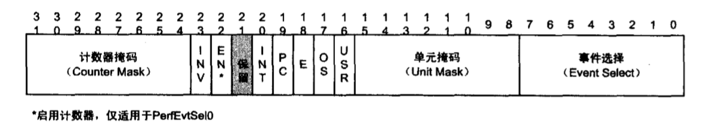

- 1 概述
    - 1.1 P6处理器的性能监视机制

# 1. 概述

很多程序员都有过这样的经历：为了评估一段代码的执行效率，分别在这段代码的前面和后面取系统时间，然后通过计算时间差得到这段代码的执行时间。这可以说使最简单的性能监视（Performance Monitoring）方法。

性能监视对软件调优（tuning）和软件调试都又着很重要的意义，为了更好地满足性能监视任务的需要，IA-32处理器从奔腾开始就提供能性能监视机制，包括专门的计数器、寄存器、CPU管脚和中断支持等。

## 1.1 P6处理器的性能监视机制

1. 实现了两个40位的性能计数器PerfCtl0和PerfCtl1。
2. 增加RDPMC指令用来读取性能计数器的值。因为性能计时器使MSR寄存器，所以可以通过RDMSR指令来读取，但是RDMSR指令只能在内核模式或实模式下执行。而RDPCM指令可以在任何特权及别下执行，因此有了RDPMC指令后就可以在用户模式下读取性能计数器了。其使用方法使将计数器号（0或1）放入ECX寄存器中，然后执行RDPCM指令，其结果会被放入EDX:EAX对（EAX中包含低32位，EDX中包含高8位）中。
3. 使用两个32位的MSR寄存器PerfEvtSel0和PerfEvtSel1，分别控制计算器PerfCtl0和PerfCtl1。使用RDMSR和WRMSR指令访问PerfEvtSel0和PerfEvtSel1寄存器（在内核模式或实模式下）。它们的地址分别使186H和187H。

其各个位域的含义如下：

- 8位的**事件选择域ES（Event Select）**：用来选择要监视的事件类型。具体类型定义被在IA-32手册卷3B的附录A中。
- 8位的**单元掩码域UMASK（Unit Mask）**：进一步定义ES域中指定的要监视事件。  可以理解位使ES域中指定的要监视事件的更详细的条件和参数。
- 1位的**用户模式域USR（User Mode）**：指定当前处理器处于特权及1、2或3（即用户模式下）时是否计数。
- 1位的**系统模式域OS（Operating System Mode）**：指定当前处理器处于特权及0（即内核模式下）时是否计数。
- 1位的**边缘检测域E（Edge Detect）**：用来数被监视事件（其他域指定）从deassered到asserted的状态过度次数。
- 1位的**管脚控制域PC（Pin Control）**：用来设置对应的PM/BP管脚行为，如果该位为1，那么当对应计数器溢出时，PM/BP管脚信号被置起（asserted）。如果该位为0，那么当对应计数器递增时，PM/BP管脚信号被置起。
- 1位的**中断使能域INT（APIC interrupt Enable）**：用于控制当相应计数器溢出时是否让本地的Local APIC（集成在CPU内部的可编程中断控制器）产生一个中断。事先应该设置好APIC的局部向量表LVT（Local Vector Table）、中断服务例程及IDT表。
- 1位的**计数器使能域EN（Enable Counters）**：当设为1时，启动两个计数器，当位0时，禁止两个计数器。该位仅在PerfEvtSel0中实现。
- 8位的**计数器掩码域CMAKE（Counter Mask）**：用作计数器的计数条件阀值，当事件数域这个阀值比较满足条件时才改变计数器的值。下面的INV位用来指定比较方法。
- 1位的**取反域INV（invert）**：该位为1时，当事件数量少于CMAKE中的值时才将事件计入到计数器中。如果该位为0，那么当事件数量大于等于CMAKE中的值时，才将事件计入到计数器中。

