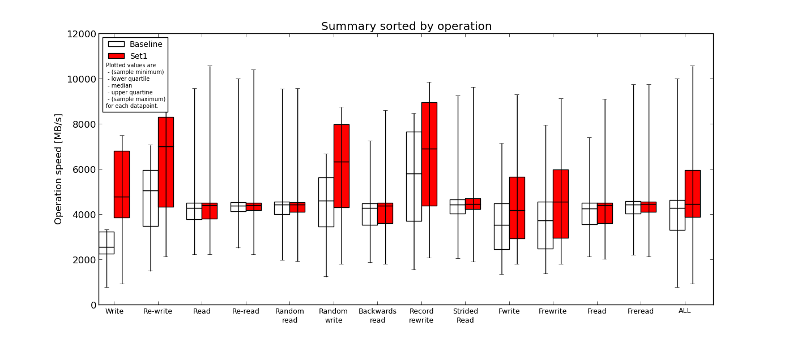

# iozone

```
[root@jerrydai nvme]# cat /proc/meminfo  | grep MemTotal | awk '{print $2}'
266420608

[root@jerrydai nvme]# python
Python 2.7.5 (default, Apr  2 2020, 01:29:16)
[GCC 4.8.5 20150623 (Red Hat 4.8.5-39)] on linux2
Type "help", "copyright", "credits" or "license" for more information.
>>> 266420608*2
532841216

[root@jerrydai ~]# iozone -a -g 532841216 -f /nvme/iozone.testfile > iozone_xfs.output
[root@jerrydai ~]# iozone -a -g 532841216 -f /nvme/iozone.testfile > iozone_ext4.output
```

## Graphic

```
yum install gnuplot
./Generate_Graphs iozone.output  
```

## iozone-results-comparator

```
git clone https://github.com/Rovanion/iozone-results-comparator.git
yum install scipy python-matplotlib
./iozone_results_comparator.py --baseline /opt/iozone_ext4.output --set1 /opt/iozone_xfs.output
firefox html_out/index.htmlW
```


