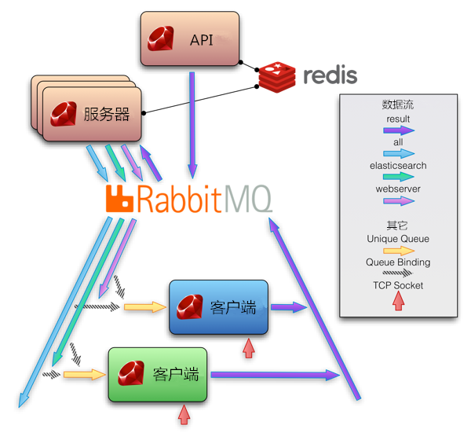
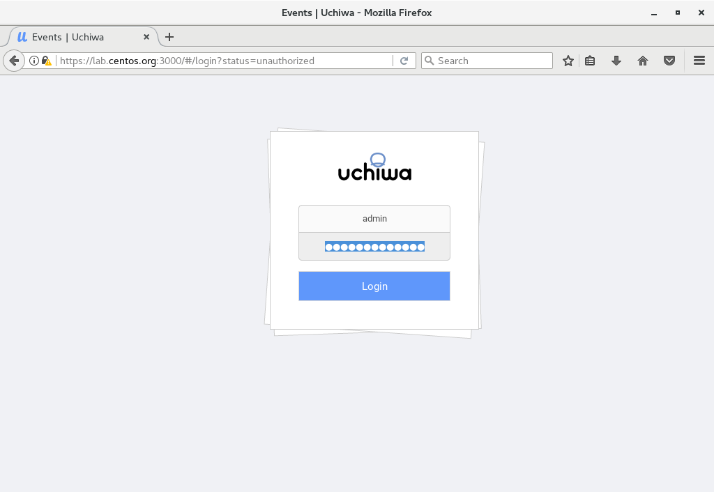
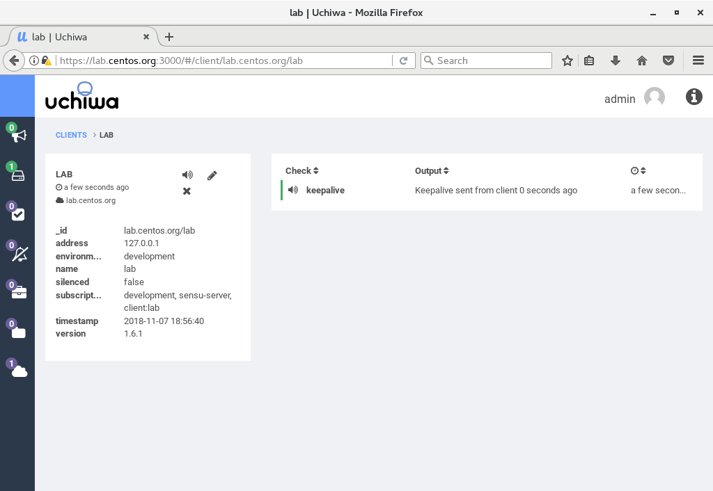

- 1 序言
- 2 简介
- 3 Sensu组件
- 4 Sensu的相关概念
    - 4.1 Check
    - 4.2 Event
    - 4.3 Handler
    - 4.4 Filter
    - 4.5 Mutators
- 5 安装Sensu
    - 5.1 安装Raids
    - 5.2 安装Sensu和Uchiwa
    - 5.3 配置SSL证书
    - 5.4 配置Sensu和Uchiwa
    - 5.5 添加防火墙策略
    - 5.6 访问Web dashboard

# 1. 序言

随着云计算的快速发展，大量的运维工具也随之产生。Sensu 是一款特地为云平台的维护而设计的监控框架。通过使用Sensu，分布式平台的运维人员可以轻易实现对大规模集群的检测、监控和维护。

Sensu 能够轻松实现大规模动态拓展，也能够与其它相关工具进行集成，如可视化工具 Graphite、日志管理工具 Logstash 等。本文将对 Sensu进行初步介绍，包括 Sensu 的组成与原理、安装和配置。并通过一个简单的实例来演示 Sensu 的使用方法。

# 2. 简介

Sensu 是由 Sonian 公司开发的一种监控框架，主要用于拥有大规模节点的云计算平台的检查与监控。目前发行的版本有企业版和开源版两种，收费的企业版本较之免费的开源版本拥有更多的功能。出于介绍的目的，本文的内容都是基于开源版本的 Sensu。

开源版本的 Sensu 遵循 MIT 许可，旨在为分布式的平台提供灵活易用、快速简单、便于拓展的监控和维护服务。

主要包含以下功能与特性：
- 检查系统、服务和程序的运行状态。
- 基于分布式的设计，能够轻松的动态伸缩规模。
- 支持通过插件的形式自定义检查的内容，拥有丰富的插件库。
- 收集信息，获取被监控节点上的各项数据指标等。
- 可视化的操作界面，提供实时的 GUI用于显示和操作相关信息。
- 内置的集成工具，可用于和其它系统集成，如 PagerDuty、Graphite、Email等。
- 提供丰富的API接口，支持通过 API 调用访问事件和客户端信息，触发检测等。
- 加密的安全通信，支持各种复杂的网络拓扑。

# 3. Sensu组件

Sensu 由服务器、客户端、RabbitMQ、Redis 和 API 这五个部分构成。下图展示了这些组件之间的关系以及通信的数据流。如图所示，RabbitMQ 用于组件之间的通信，Redis 用于持久化 Sensu 服务器和 Sensu API 的数据。因为客户端都是通过文件进行配置，并且不需要在服务器端配置客户端的信息，所以可以很轻易的增加和减少客户端的数量。由于 Sensu 的服务器和 API 原生支持多节点部署，所以不存在效率的瓶颈问题。从图中可以看到，为了解耦服务器和客户端，通信都是通过 RabbitMQ 进行的，如果只有单节点的 RabbitMQ，这可能会带来通信上的瓶颈问题。可以通过 RabbitMQ 官方提供的集群部署解决方案来解决这个问题。



# 4. Sensu的相关概念

Sensu 的设计中涵盖了一些自定义的概念，比如 Check、Event、Handler、Filter 等，为了更加清晰的介绍 Sensu，下面将对这些概念分别进行解释。

## 4.1 Check

Check 是一段在客户端运行的可执行程序，用于检测和监控客户端上的各种服务、资源和应用程序的运行状态。Check 在执行后通过返回一个值来表示所检测内容的状态，通常使用 0 表示 OK，1 表示 WARNING，2 表示 CRITICAL，3 以及更大的值表示 UNKNOWN 或用户自定义状态。

Check 有两种类型：standard 和 metric。对于 standard 类型的 check 来说，Sensu 不会在每次执行后都生成 event，而只是在 check 所返回的结果为非 0 或者是从非 0 变为 0 的时候才会生成 event。这样带来的好处是降低了负载，适用于那些只关注于非正常状态，而在正常的状态无需采取措施的监控场景。相对应的，metric 类型的 check 则会在每次执行后，无论其返回的结果是什么都生成 event。此类型的 check 一般用于获取监控的信息，除了 check 所返回的状态值，还有一些其它的输出信息可以通过 event 进行收集，然后返回给 Sensu 服务器。

Check 还有 standalone 和 subscription 两种运行模式。Standalone 模式下的 check 直接在客户端进行配置，不需要服务器端发出执行的请求，可以根据配置的时间间隔在客户端自主执行，每次执行后会将结果通过消息队列返回给服务器。Subscription 模式下的 check 则是在服务器端配置，在配置的时候需要为 check 设置订阅主题。当要执行该 check 时，服务器会根据订阅主题分发执行请求，所有订阅了相应主题的客户端会收到执行的请求，从而运行 check 程序。同样的，执行的返回结果也会通过消息队列返回给服务器。

## 4.2 Event

Sensu 使用 event 来通知所监控内容的状态变化。比如当 check 执行后返回 2，这表示所监控的内容出现了较为严重的问题，那么 Sensu 会生成 event 来报告这个问题，Event 会绑定一个或多个 handler 来对所报告的问题进行处理。Event 包含有一些上下文信息，主要包括执行 check 的客户端信息和 check 运行后的结果信息。Handler 通常会使用这些信息来执行相应的处理行为。通常 event 数据是以 JSON 格式传递的，以下是一个 event 的示例：

```json
{  
    "action": "create",  
    "occurrences": 1,  
    "client": {  
        "name": "i-424242",  
        "address": "8.8.8.8",  
        "subscriptions": [  "production",  "webserver",  "mysql"  ],  
        "timestamp": 1326390159  
        
    },  
    
    "check":{  
        "name": "frontend_http_check",  
        "issued": 1326390169,  
        "subscribers":[  "frontend"  ],  
        "interval": 60,  
        "command": "check_http -I 127.0.0.1 -u http://web.example.com/healthcheck.html -R 'pageok'",  
        "output": "HTTP CRITICAL: HTTP/1.1 503 Service Temporarily Unavailable",  
        "status": 2,  
        "handler": "slack",  
        "history": [  "0",  "2"  ]  
    } 
}
```

可以看到，event 数据包含了 Sensu 客户端的基本信息，包括名称、IP 等，同时也包含了所执行的 check 信息，客户端执行了该 check 并返回了状态值为 2，同时给出了一条输出内容“HTTP CRITICAL: HTTP/1.1 503 Service Temporarily Unavailable”，这条输出信息可以用来帮助 handler 对问题进行处理。

## 4.3 Handler

Sensu handler 用于处理 Sensu event。Handler 在 check 的配置文件中指定，可以同时指定多个 handler 对 event 进行处理。Sensu 包括以下几种类型的 handler:
- Pipe handler: 执行命令，把 event 数据通过 STDIN 传递给处理程序。
- TCP and UDP handler: 把 event 数据发送给一个远程的 socket。
- Transport handler:向 Sensu transport(默认为 RabbitMQ) 发送 event 数据。
- Set handler: 用于组成一个 event handler 集合，使得能够同时管理多个 handler。

## 4.4 Filter

Sensu Filter 用来过滤一些 Sensu event。Filter 会检查 event 中的数据和 filter 定义中的过滤规则是否匹配。符合匹配规则的 event 会根据选择的过滤方式，发送或者不发送给 event handler。

Filter 通常用于过滤一些噪音信息，以防止错报和误报事件。Sensu filter 包含两种过滤方式：包含和排除。包含方式指定的是含有相应信息的 event 才会被发送至 handler。而排除方式则相反，含有指定信息的 event 会被过滤掉，不会被发送到 handler 进行处理。值得注意的是，可以同时指定多个 filter，此时 event 需要同时匹配所有指定的 filter 规则。


## 4.5 Mutators

Sensu Mutators 用来转换 event 数据，然后将转换后的数据传递给 event handler。通过使用 Mutators 对 event 数据进行处理，就避免了在 handler 中对 event 数据进行数据处理和格式化，并且多个 handler 可以共享一个 mutator，从而减少了重复代码，简化了 handler 的实现工作。

Mutators 在 Sensu 服务器端执行，从 STDIN 接收 JSON 格式的 event 数据，并将转换后的数据写入 STDOUT。Mutators 会返回一个退出码用于标识转换是否成功。如果 Mutators 执行失败，事件将不会被 handler 处理，并且这个错误会被日志记录。

# 5. 安装Sensu

## 5.1 安装Raids

```shell
# install from EPEL
[root@lab ~]# yum --enablerepo=epel -y install redis

[root@lab ~]# vi /etc/redis.conf

# line 61: change (allow connections from other hosts)
bind 0.0.0.0

# line 80: change
protected-mode no

# line 481: add (connection password)
requirepass password

[root@lab ~]# systemctl start redis 
[root@lab ~]# systemctl enable redis
```

## 5.2 安装Sensu和Uchiwa

```shell
[root@lab ~]# cat > /etc/yum.repos.d/sensu.repo <<'EOF'
[sensu]
name=sensu
baseurl=https://sensu.global.ssl.fastly.net/yum/$releasever/$basearch/
enabled=0
gpgcheck=0
EOF

[root@lab ~]# yum --enablerepo=sensu -y install sensu uchiwa
```

## 5.3 配置SSL证书

```shell
[root@lab ~]# cd /etc/pki/tls/certs 
[root@lab certs]# make server.key 
umask 77 ; \
/usr/bin/openssl genrsa -aes128 2048 > server.key
Generating RSA private key, 2048 bit long modulus
...
...
e is 65537 (0x10001)
Enter pass phrase:# set passphrase
Verifying - Enter pass phrase:# confirm

# remove passphrase from private key
[root@lab certs]# openssl rsa -in server.key -out server.key 
Enter pass phrase for server.key:# input passphrase
writing RSA key

[root@lab certs]# make server.csr 
umask 77 ; \
/usr/bin/openssl req -utf8 -new -key server.key -out server.csr
You are about to be asked to enter information that will be incorporated
into your certificate request.
What you are about to enter is what is called a Distinguished Name or a DN.
There are quite a few fields but you can leave some blank
For some fields there will be a default value,
If you enter '.', the field will be left blank.
-----
Country Name (2 letter code) [XX]:CN# country
State or Province Name (full name) []:Beijing   # state
Locality Name (eg, city) [Default City]:Beijing # city
Organization Name (eg, company) [Default Company Ltd]: CentOS   # company
Organizational Unit Name (eg, section) []: Developer   # department
Common Name (eg, your name or your server's hostname) []: lab.centos.org   # server's FQDN
Email Address []:admin@centos.org# email address
Please enter the following 'extra' attributes
to be sent with your certificate request
A challenge password []:# Enter
An optional company name []:# Enter

[root@lab certs]# openssl x509 -in server.csr -out server.crt -req -signkey server.key -days 3650
Signature ok
subject=/C=CN/ST=Beijing/L=Beijing/O=CentOS/OU=Developer/CN=lab.centos.org/emailAddress=admin@centos.org
Getting Private key 
```

## 5.4 配置Sensu和Uchiwa

```
[root@lab ~]# cp -p /etc/pki/tls/certs/server.key /etc/sensu/uchiwa.key 
[root@lab ~]# cp -p /etc/pki/tls/certs/server.crt /etc/sensu/uchiwa.crt 
[root@lab ~]# chown uchiwa. /etc/sensu/uchiwa.* 

[root@lab ~]# vi /etc/sensu/config.json
# create new
{
  "transport": {
    "name": "redis"
  },
  
  "api": {
    "host": "127.0.0.1",
    "port": 4567
  }
}

[root@lab ~]# vi /etc/sensu/conf.d/redis.json
# create new
# for [password], specify the one set on [5.1] section
{
  "redis": {
    "host": "127.0.0.1",
    "port": 6379,
    "password": "password"
  }
}

[root@lab ~]# vi /etc/sensu/conf.d/client.json
# create new
# for [subscriptions], set any words you like (define role)
{
  "client": {
    "environment": "development",
    "name": "lab",
    "address": "127.0.0.1",
    "subscriptions": [
      "development",
      "sensu-server"
    ]
  }
}

[root@lab ~]# vi /etc/sensu/uchiwa.json
# change like follows
# for [adminpassword], set any password you like
{
  "sensu": [
    {
      "name": "lab.centos.org",
      "host": "127.0.0.1",
      "port": 4567,
      "timeout": 10
    }
  ],
  "uchiwa": {
    "host": "0.0.0.0",
    "port": 3000,
    "refresh": 10,
    "user": "admin",
    "pass": "adminpassword",
    "ssl": {
      "certfile": "/etc/sensu/uchiwa.crt",
      "keyfile": "/etc/sensu/uchiwa.key"
    }
  }
}

[root@lab ~]# chown sensu. /etc/sensu/config.json /etc/sensu/conf.d/* 

[root@lab ~]# systemctl start sensu-server sensu-api sensu-client uchiwa 
[root@lab ~]# systemctl enable sensu-server sensu-api sensu-client uchiwa
```

## 5.5 添加防火墙策略

```shell
[root@lab ~]# firewall-cmd --add-port={6379/tcp,4567/tcp,3000/tcp} --permanent 
success
[root@lab ~]# firewall-cmd --reload 
success
```
## 5.6 访问Web dashboard

```shell
使用firefox访问：https://(Uchiwa server's hostname or Ip address):3000/
```



