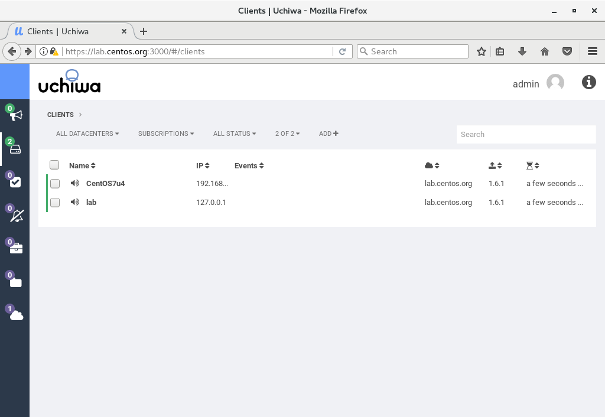
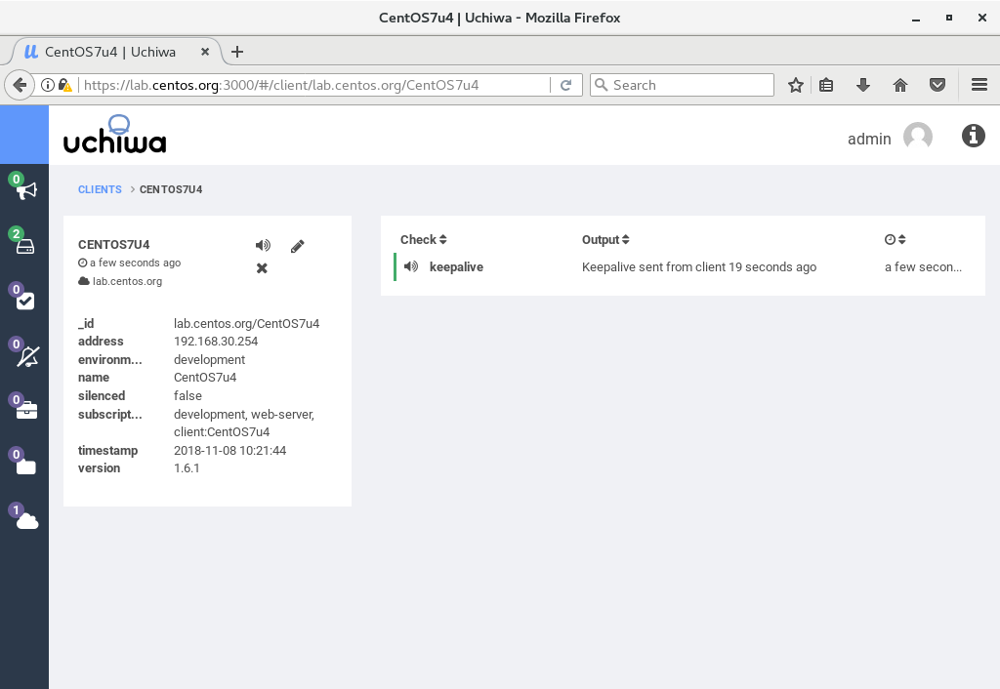
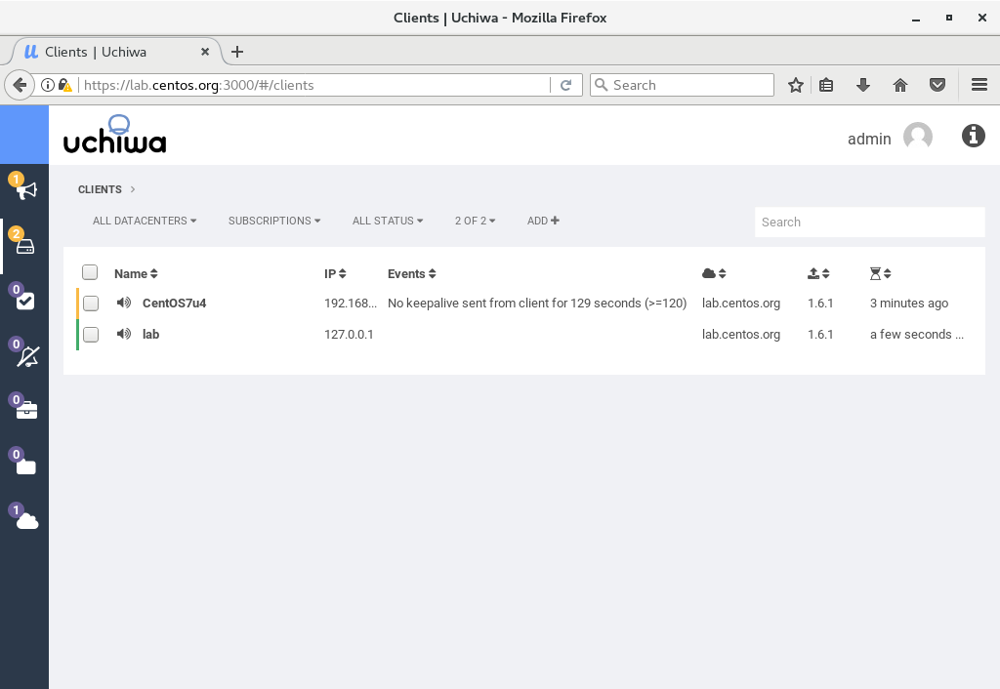

- 1 添加一个Linux主机
    - 1.1 在监控目标上安装Sensu
    - 1.2 配置Sensu客户端并启动服务
    - 1.3 访问Uchiwa Dashbord确认新主机状态
    - 1.4 如果主机下线会产生告警

# 1. 添加一个Linux主机

## 1.1 在监控目标上安装Sensu

```shell
[root@CentOS7u4 ~]# cat > /etc/yum.repos.d/sensu.repo <<'EOF'
[sensu]
name=sensu
baseurl=https://sensu.global.ssl.fastly.net/yum/$releasever/$basearch/
enabled=0
gpgcheck=0
EOF

[root@CentOS7u4 ~]# yum --enablerepo=sensu -y install sensu
```

## 1.2 配置Sensu客户端并启动服务

```shell
[root@CentOS7u4 ~]# vi /etc/sensu/conf.d/client.json
# create new
# for [subscriptions], set any words you like (define role)
{
  "client": {
    "environment": "development",
    "name": "CentOS7u4",
    "address": "192.168.30.254",
    "subscriptions": [
      "development",
      "web-server"
    ]
  }
}

[root@CentOS7u4 ~]# vi /etc/sensu/conf.d/transport.json
# create new
{
  "transport": {
    "name": "redis",
    "reconnect_on_error": true
  }
}

[root@CentOS7u4 ~]# vi /etc/sensu/conf.d/redis.json
# create new
# for [password], specify the password of Redis server
{
  "redis": {
    "host": "192.168.30.81",
    "port": 6379,
    "password": "password"
  }
}

[root@CentOS7u4 ~]# chown sensu. /etc/sensu/conf.d/* 
[root@CentOS7u4 ~]# systemctl start sensu-client 
[root@CentOS7u4 ~]# systemctl enable sensu-client
```

## 1.3 访问Uchiwa Dashbord确认新主机状态





## 1.4 如果主机下线会产生告警



