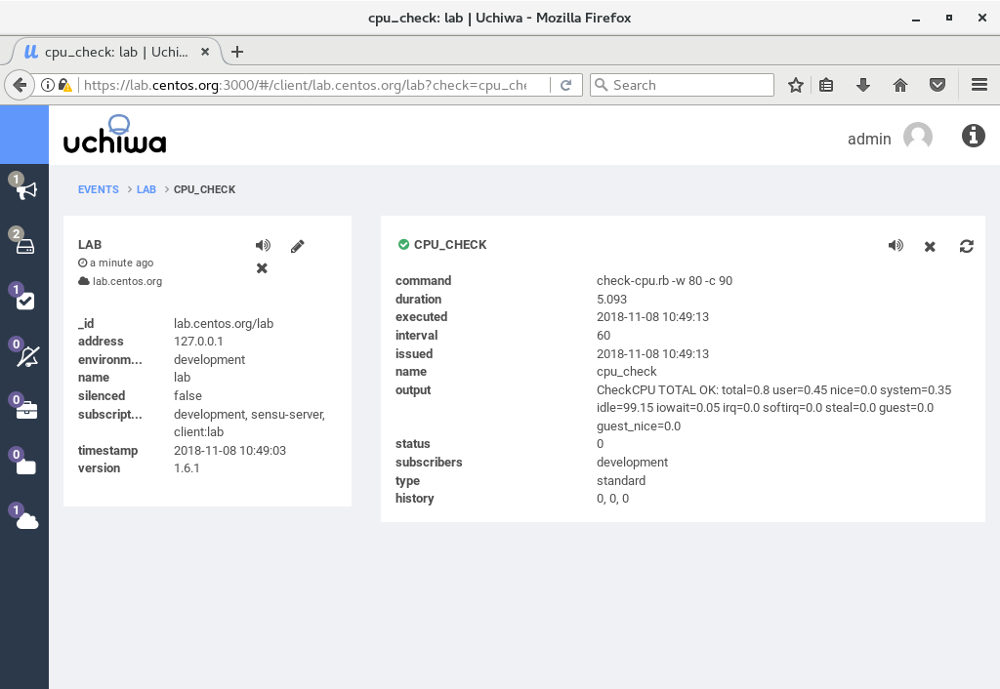
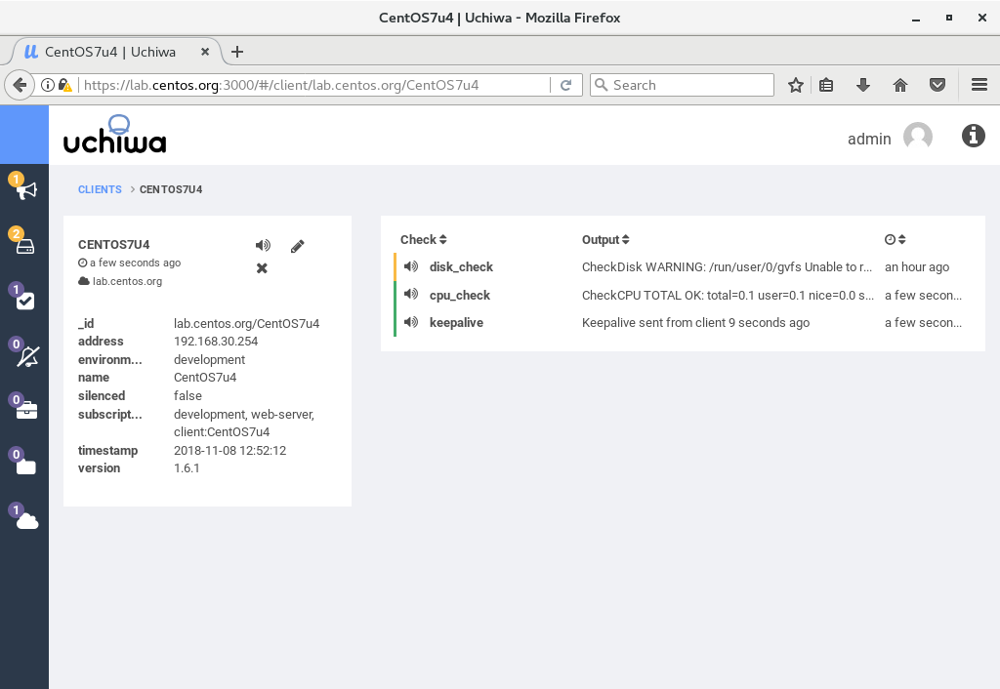

- 1 SenSu添加检测插件
    - 1.1 添加CPU检测插件
    - 1.2 在Sensu Server上配置插件
    - 1.3 访问Uchiwa Dashboard确认插件工作状态
    - 1.4 客户端独立检测

# 1. SenSu添加检测插件

Sensu默认仅提供keepalive插件，如果你想添加更多插件，你可以访问Sensu Plugins项目：
```
https://github.com/sensu-plugins/
```

# 1.1 添加CPU检测插件

```shell
[root@lab ~]# yum -y groups install "Development Tools"

# install cpu-checks
[root@lab ~]# sensu-install -p cpu-checks
[SENSU-INSTALL] installing Sensu plugins ...
[SENSU-INSTALL] determining if Sensu gem 'sensu-plugins-cpu-checks' is already installed ...
false
[SENSU-INSTALL] Sensu plugin gems to be installed: ["sensu-plugins-cpu-checks"]
[SENSU-INSTALL] installing Sensu gem 'sensu-plugins-cpu-checks'
Fetching: linux-kstat-0.1.3-universal-linux.gem (100%)
Successfully installed linux-kstat-0.1.3-universal-linux
Fetching: sensu-plugins-cpu-checks-3.0.0.gem (100%)
You can use the embedded Ruby by setting EMBEDDED_RUBY=true in /etc/default/sensu
Successfully installed sensu-plugins-cpu-checks-3.0.0
2 gems installed
[SENSU-INSTALL] successfully installed Sensu plugins: ["sensu-plugins-cpu-checks"]

# possible to make sure included tools
[root@lab ~]# ll /opt/sensu/embedded/lib/ruby/gems/2.4.0/gems/sensu-plugins-cpu-checks-3.0.0/bin/
total 44
-rwxr-xr-x 1 root root 4304 Nov  8 10:41 check-cpu.rb
-rwxr-xr-x 1 root root 1658 Nov  8 10:41 check-cpu.sh
-rwxr-xr-x 1 root root  977 Nov  8 10:41 metrics-cpu-interrupts.rb
-rwxr-xr-x 1 root root 1979 Nov  8 10:41 metrics-cpu-mpstat.rb
-rwxr-xr-x 1 root root 2177 Nov  8 10:41 metrics-cpu-pcnt-usage.rb
-rwxr-xr-x 1 root root 1717 Nov  8 10:41 metrics-cpu.rb
-rwxr-xr-x 1 root root  969 Nov  8 10:41 metrics-cpu-softirqs.rb
-rwxr-xr-x 1 root root 1212 Nov  8 10:41 metrics-numastat.rb
-rwxr-xr-x 1 root root 1289 Nov  8 10:41 metrics-softnet-stat.rb
-rwxr-xr-x 1 root root 1965 Nov  8 10:41 metrics-user-pct-usage.rb

# for running tools, specify the one under /opt/sensu/embedded/bin
[root@lab ~]# /opt/sensu/embedded/bin/check-cpu.rb -h
Usage: /opt/sensu/embedded/bin/check-cpu.rb (options)
        --cache-file CACHEFILE
    -c CRIT
        --guest                      Check cpu guest instead of total cpu usage
        --guest_nice                 Check cpu guest_nice instead of total cpu usage
        --idle                       Check cpu idle instead of total cpu usage
        --idle-metrics METRICS       Treat the specified metrics as idle. Defaults to idle,iowait,steal,guest,guest_nice
        --iowait                     Check cpu iowait instead of total cpu usage
        --irq                        Check cpu irq instead of total cpu usage
    -l, --less_than                  Change whether value is less than check
        --nice                       Check cpu nice instead of total cpu usage
        --proc-path /proc
        --sleep SLEEP                This sleep controls the interval between the initial poll for cpu utilization and the next data point, the longer the interval is the more accurate your data will be
        --softirq                    Check cpu softirq instead of total cpu usage
        --steal                      Check cpu steal instead of total cpu usage
        --system                     Check cpu system instead of total cpu usage
        --user                       Check cpu user instead of total cpu usage
    -w WARN
```

## 1.2 在Sensu Server上配置插件

```shell
[root@lab ~]# vi /etc/sensu/conf.d/check-cpu.json

# CPU Usage 80% of Warning, 90% of Critical
# for [subscribers], specify the one set for [subscriptions] on each node
# example below means all nodes which has [development] word for [subscriptions] are targeted
{
  "checks": {
    "cpu_check": {
      "command": "check-cpu.rb -w 80 -c 90",
      "subscribers": [
        "development"
      ],
      "interval": 60
    }
  }
}
[root@lab ~]# chown sensu. /etc/sensu/conf.d/check-cpu.json
[root@lab ~]# systemctl restart sensu-server sensu-api
```

## 1.3 访问Uchiwa Dashboard确认插件工作状态



> 如果CPU使用率达到阀值则会显示警告信息。

## 1.4 客户端独立检测

默认情况下，当在Sensu Server配置Check插件后，Sensu Server会主动去所有客户端节点上调用插件提供的命令，如果想仅仅在某个客户端节点上增加插件时，需要客户端在创建配置文件时候指定[standalone: true]。

```shell
# install disk-checks
[root@CentOS7u4 ~]# sensu-install -p disk-checks

[root@CentOS7u4 ~]# vi /etc/sensu/conf.d/check-disk-usage.json
# if check on client itself, specify standalone: true
{
  "checks": {
    "disk_check": {
      "command": "check-disk-usage.rb -w 70 -c 80",
      "standalone": true,
      "interval": 600
    }
  }
}

[root@CentOS7u4 ~]# chown sensu. /etc/sensu/conf.d/check-disk-usage.json

[root@CentOS7u4 ~]# systemctl restart sensu-client 
```



