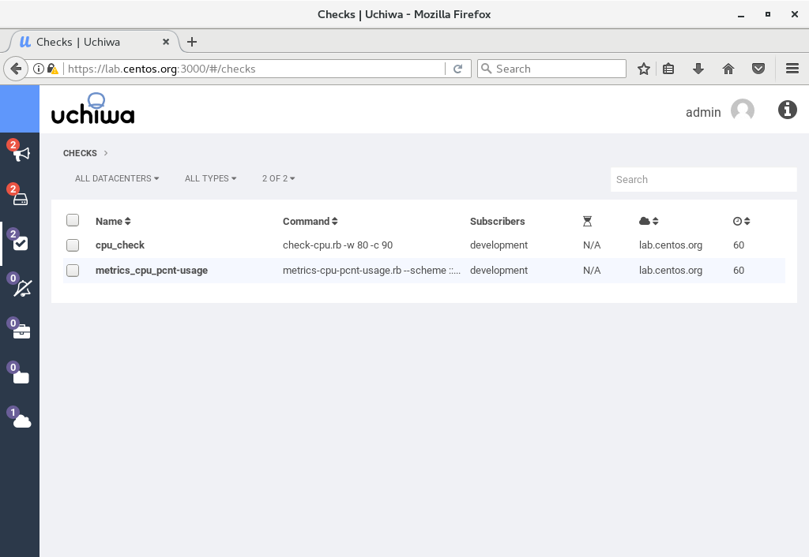
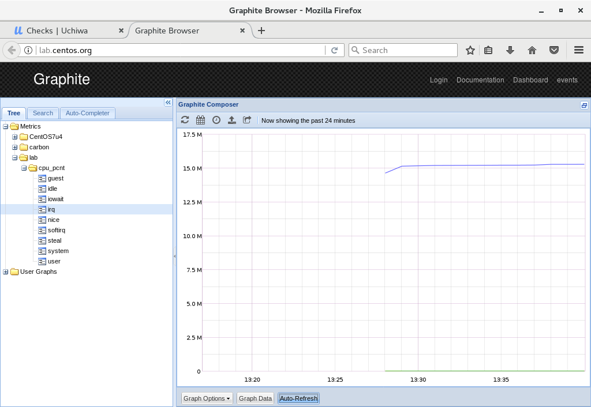

- 1 简介 Graphite
- 2 安装Graphite指标检测工具
    - 2.1 部署httpd
    - 2.2 设置sudo权限
    - 2.3 部署Graphite
- 3 设置指标检测
    - 3.1 访问Uchiwa Dashboard确认graphite状态
    - 3.2 访问Graphite图形界面查看图表

# 1. 简介 Graphite 

Graphite 是一个Python写的web应用，采用django框架，Graphite用来进行收集服务器所有的即时状态，用户请求信息，Memcached命中率，RabbitMQ消息服务器的状态，Unix操作系统的负载状态，Graphite服务器大约每分钟需要有4800次更新操作，Graphite采用简单的文本协议和绘图功能可以方便地使用在任何操作系统上。

# 2. 安装Graphite指标检测工具

## 2.1 部署httpd

1. 安装Httpd

```shell
[root@lab ~]# yum -y install httpd

# remove welcome page
[root@lab ~]# rm -f /etc/httpd/conf.d/welcome.conf
```

2. 配置httpd

```shell
[root@lab ~]# vi /etc/httpd/conf/httpd.conf

# line 86: change to admin's email address
ServerAdmin root@centos.org

# line 95: change to your server's name
ServerName lab.centos.org:80

# line 151: change
AllowOverride All

# line 164: add file name that it can access only with directory's name
DirectoryIndex index.html index.cgi index.php

# add follows to the end
# server's response header
ServerTokens Prod

# keepalive is ON
KeepAlive On
[root@lab ~]# systemctl start httpd 
[root@lab ~]# systemctl enable httpd 
```

3. 添加防火墙策略

```shell
[root@lab ~]# firewall-cmd --add-service=http --permanent 
success

[root@lab ~]# firewall-cmd --reload 
success
```

4. 创建一个测试页面

```shell
[root@lab ~]# vi /var/www/html/index.html
<html>
<body>
<div style="width: 100%; font-size: 40px; font-weight: bold; text-align: center;">
Test Page
</div>
</body>
</html>
```

## 2.2 设置sudo权限

1. 将root权限赋予jerrydai用户

```shell
[root@lab ~]# visudo
# add at the last line: user 'cent' can use all root privilege
jerrydai    ALL=(ALL)       ALL
 
# how to write ⇒ destination host=(owner) command
# make sure with the user 'jerrydai'
[jerrydai@lab ~]$ cat /etc/shadow
cat: /etc/shadow: Permission denied

[jerrydai@lab ~]$ sudo cat /etc/shadow
[sudo] password for jerrydai: # own password
root:$6$WSlxwkPL$8HspUzpgEtfLAXcNVkbF/dJat.fGWscp3xQBxSQ3P4U6iVJmGExBJxoeNcLlRREYAb9MtP6pYLiI3MN07yy5w/:17821:0:99999:7:::
bin:*:17110:0:99999:7:::
daemon:*:17110:0:99999:7:::
adm:*:17110:0:99999:7:::
...
...
# just executed
```

## 2.3 部署Graphite

1. 安装Graphite与Carbon

```shell
# install from EPEL
[root@lab ~]# yum --enablerepo=epel -y install graphite-web python-carbon
```

2. 配置Graphite

```shell
[root@lab ~]# vi /etc/graphite-web/local_settings.py

# line 13: uncomment and specify any secret-key you like
SECRET_KEY = 'my_secret_key'

# line 23: uncomment and change to your timezone
TIME_ZONE = 'Asia/Shanghai'

[root@lab ~]# vi /etc/httpd/conf.d/graphite-web.conf
# line 30: add access permission for your local network
Require local
Require ip 192.168.30.0/24

# initialize database
[root@lab ~]# /usr/lib/python2.7/site-packages/graphite/manage.py syncdb 
Creating tables ...
Creating table account_profile
Creating table account_variable
Creating table account_view
Creating table account_window
Creating table account_mygraph
Creating table dashboard_dashboard_owners
Creating table dashboard_dashboard
Creating table events_event
Creating table url_shortener_link
Creating table auth_permission
Creating table auth_group_permissions
Creating table auth_group
Creating table auth_user_groups
Creating table auth_user_user_permissions
Creating table auth_user
Creating table django_session
Creating table django_admin_log
Creating table django_content_type
Creating table tagging_tag
Creating table tagging_taggeditem

You just installed Django's auth system, which means you don't have any superusers defined.
Would you like to create one now? (yes/no): yes
# specify privileged user you set
Username (leave blank to use 'root'): jerrydai
Email address: jerrydai@localhost
Password:
Password (again):
Superuser created successfully.
Installing custom SQL ...
Installing indexes ...
Installed 0 object(s) from 0 fixture(s)

[root@lab ~]# chown -R apache. /var/lib/graphite-web 

[root@lab ~]# systemctl start carbon-cache 
[root@lab ~]# systemctl enable carbon-cache 
[root@lab ~]# systemctl restart httpd 
```

3. 变更Selinux布尔值

```shell
[root@lab ~]# setsebool -P httpd_can_network_connect on 
```

4. 访问Graphite server



# 3. 设置指标检测

```
# tools in CPU check plugin package
[root@lab ~]# ll /opt/sensu/embedded/lib/ruby/gems/2.4.0/gems/sensu-plugins-cpu-checks-3.0.0/bin/
total 44
-rwxr-xr-x 1 root root 4304 Nov  8 10:41 check-cpu.rb
-rwxr-xr-x 1 root root 1658 Nov  8 10:41 check-cpu.sh
-rwxr-xr-x 1 root root  977 Nov  8 10:41 metrics-cpu-interrupts.rb
-rwxr-xr-x 1 root root 1979 Nov  8 10:41 metrics-cpu-mpstat.rb
-rwxr-xr-x 1 root root 2177 Nov  8 10:41 metrics-cpu-pcnt-usage.rb
-rwxr-xr-x 1 root root 1717 Nov  8 10:41 metrics-cpu.rb
-rwxr-xr-x 1 root root  969 Nov  8 10:41 metrics-cpu-softirqs.rb
-rwxr-xr-x 1 root root 1212 Nov  8 10:41 metrics-numastat.rb
-rwxr-xr-x 1 root root 1289 Nov  8 10:41 metrics-softnet-stat.rb
-rwxr-xr-x 1 root root 1965 Nov  8 10:41 metrics-user-pct-usage.rb

# for example, set [metrics-cpu-pcnt-usage.rb]
[root@lab ~]# vi /etc/sensu/conf.d/metrics-cpu-pcnt-usage.json
# create new
# to specify [--scheme ***], possible to set data structure to save
# for following example, metrics are saved under [/var/lib/carbon/whisper/(hostname)/cpu_pcnt/]
{
  "checks": {
    "metrics_cpu_pcnt-usage": {
      "type": "metric",
      "command": "metrics-cpu-pcnt-usage.rb --scheme :::name:::.cpu_pcnt",
      "interval": 60,
      "output_format": "graphite_plaintext",
      "subscribers": [ "development" ],
      "handlers": [ "graphite" ]
    }
  }
}

[root@lab ~]# vi /etc/sensu/conf.d/graphite.json
{
  "handlers": {
    "graphite": {
      "type": "tcp",
      "socket": {
        "host": "127.0.0.1",
        "port": 2003
      },
      "mutator": "only_check_output"
    }
  }
}

[root@lab ~]# systemctl restart sensu-server sensu-api 
```

## 3.1 访问Uchiwa Dashboard确认graphite状态


## 3.2 访问Graphite图形界面查看图表

