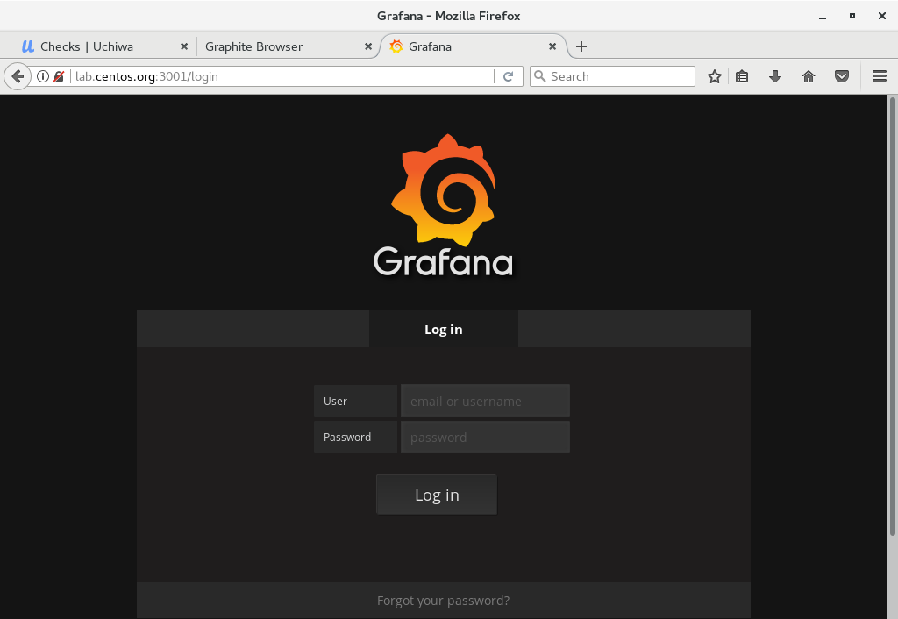
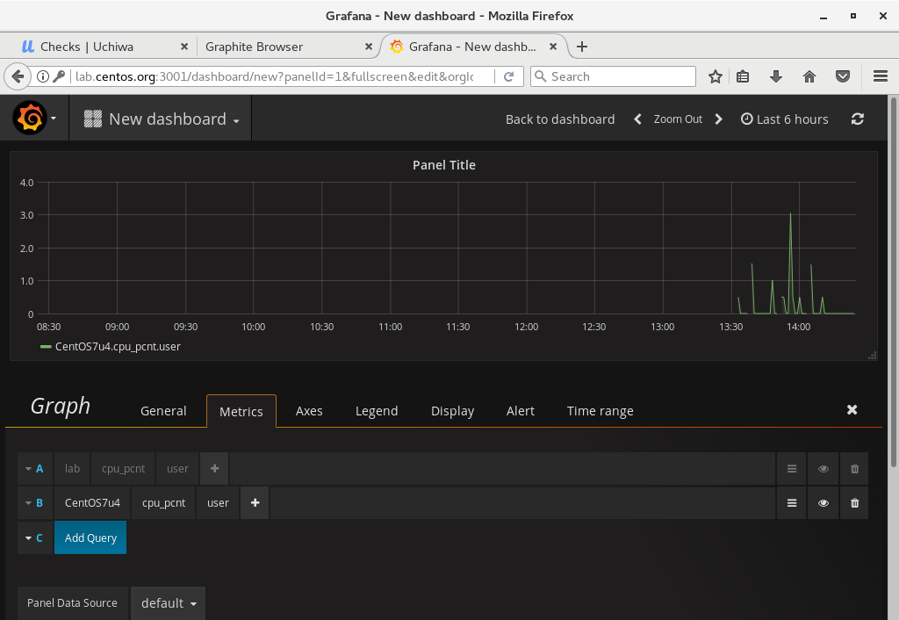

- 1 简介
- 2 部署Grafana
    - 2.1 安装配置Grafana
    - 2.2 添加防火墙策略
    - 2.3 登陆页面

# 1. 简介

Grafana是一个开源的度量分析与可视化套件。经常被用作基础设施的时间序列数据和应用程序分析的可视化，它在其他领域也被广泛的使用包括工业传感器、家庭自动化、天气和过程控制等。

Grafana支持许多不同的数据源。每个数据源都有一个特定的查询编辑器,该编辑器定制的特性和功能是公开的特定数据来源。

官方支持以下数据源：Graphite，Prometheus，Elasticsearch，InfluxDB，OpenTSDB，AWS Cloudwatch，MySQL和PostgreSQL。

# 2. 部署Grafana

Grafana默认监听端口是3000，Uchiwa也是监听在3000端口，我们在Grafana部署时将默认监听端口改为3001。

## 2.1 安装配置Grafana

```shell
[root@lab ~]# cat > /etc/yum.repos.d/grafana.repo <<'EOF'
[grafana]
name=grafana
baseurl=https://packagecloud.io/grafana/stable/el/7/$basearch
gpgkey=https://packagecloud.io/gpg.key https://grafanarel.s3.amazonaws.com/RPM-GPG-KEY-grafana
enabled=0
gpgcheck=1
EOF

[root@lab ~]# yum --enablerepo=grafana -y install grafana initscripts fontconfig

[root@lab ~]# vi /etc/grafana/grafana.ini

# line 30: uncomment (if you use SSL/TLS, change to [https])
protocol = http

# line 36: uncomment (if you'd like to use another port, change it)
http_port = 3001

# line 39: uncomment (if you'd like to change display domain name, change it)
domain = lab.centos.org

[root@lab ~]# systemctl start grafana-server 
[root@lab ~]# systemctl enable grafana-server
```

## 2.2 添加防火墙策略

```
[root@lab ~]# firewall-cmd --add-port=3001/tcp --permanent 
success

[root@lab ~]# firewall-cmd --reload 
success
```

## 2.3 登陆页面



> 使用默认用户名与密码登陆(admin)，并配置数据源，配置Dashboard等。

