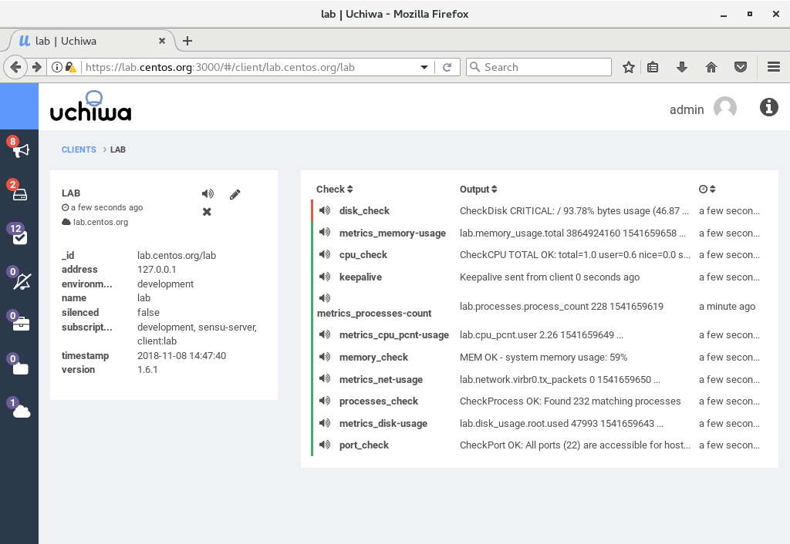
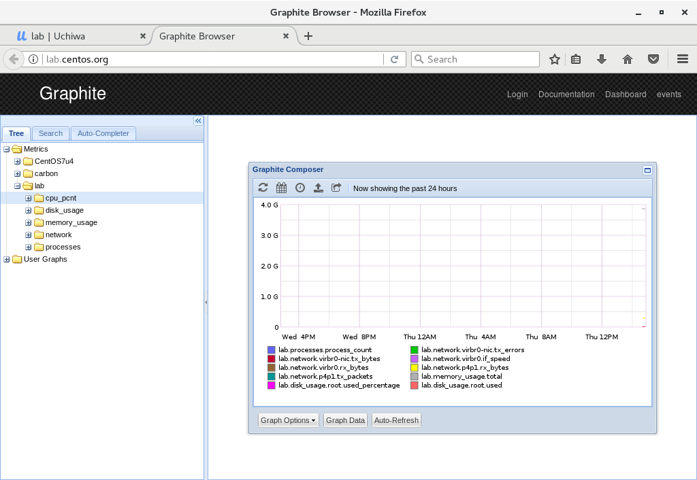
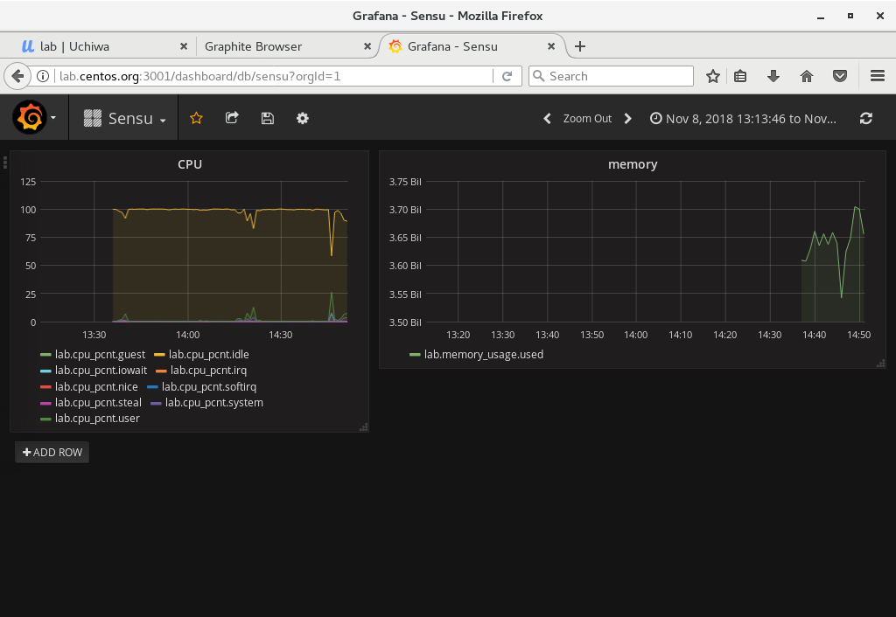

- 1 安装更多监控插件
    - 1.1 安装内存监控插件
    - 1.2 安装磁盘监控插件
    - 1.3 安装网络监控插件
    - 1.4 添加进程监控插件
    - 1.5 添加NTP监控插件
- 2 访问Uchiwa Dashboard确认指标集合插件状态
- 3 访问Graphite查看指标
- 4 访问Grafana可视化Dashboard监控性能指标

# 1. 安装更多监控插件

## 1.1 安装内存监控插件

```shell
[root@lab ~]# sensu-install -p memory-checks

[root@lab ~]# vi /etc/sensu/conf.d/check-memory-percent.json

# set Warning on 80% of Memory Usage , set Critical on 90%
{
  "checks": {
    "memory_check": {
      "command": "check-memory-percent.rb -w 80 -c 90",
      "subscribers": [ "development" ],
      "interval": 60
    }
  }
}

[root@lab ~]# vi /etc/sensu/conf.d/metrics-memory.json
# memory metrics collection
{
  "checks": {
    "metrics_memory-usage": {
      "type": "metric",
      "command": "metrics-memory.rb --scheme :::name:::.memory_usage",
      "interval": 60,
      "output_format": "graphite_plaintext",
      "subscribers": [ "development" ],
      "handlers": [ "graphite" ]
    }
  }
}
[root@lab ~]# chown sensu. /etc/sensu/conf.d/check-memory-percent.json /etc/sensu/conf.d/metrics-memory.json
[root@lab ~]# systemctl restart sensu-server sensu-api 
```

## 1.2 安装磁盘监控插件

```shell
[root@lab ~]# sensu-install -p disk-checks

[root@lab ~]# vi /etc/sensu/conf.d/check-disk-usage.json
# set Warning on 80% of Disk Usage, set Critical on 90%
{
  "checks": {
    "disk_check": {
      "command": "check-disk-usage.rb -w 80 -c 90",
      "subscribers": [ "development" ],
      "interval": 60
    }
  }
}

[root@lab ~]# vi /etc/sensu/conf.d/metrics-disk-usage.json
# disk metrics collection
{
  "checks": {
    "metrics_disk-usage": {
      "type": "metric",
      "command": "metrics-disk-usage.rb -l --scheme :::name:::.disk_usage",
      "interval": 60,
      "output_format": "graphite_plaintext",
      "subscribers": [ "development" ],
      "handlers": [ "graphite" ]
    }
  }
}

[root@lab ~]# chown sensu. /etc/sensu/conf.d/check-disk-usage.json /etc/sensu/conf.d/metrics-disk-usage.json

[root@lab ~]# systemctl restart sensu-server sensu-api 
```

## 1.3 安装网络监控插件

```shell
[root@lab ~]# sensu-install -p network-checks

[root@lab ~]# vi /etc/sensu/conf.d/check-ports.json
# check 22 port (timeout is 10 sec)
{
  "checks": {
    "port_check": {
      "command": "check-ports.rb -p 22 -t 10",
      "subscribers": [ "development" ],
      "interval": 60
    }
  }
}

[root@lab ~]# vi /etc/sensu/conf.d/metrics-net.json
# network metrics collection
{
  "checks": {
    "metrics_net-usage": {
      "type": "metric",
      "command": "metrics-net.rb --scheme :::name:::.network",
      "interval": 60,
      "output_format": "graphite_plaintext",
      "subscribers": [ "development" ],
      "handlers": [ "graphite" ]
    }
  }
}

[root@lab ~]# chown sensu. /etc/sensu/conf.d/check-ports.json /etc/sensu/conf.d/metrics-net.json

[root@lab ~]# systemctl restart sensu-server sensu-api 
```

## 1.4 添加进程监控插件

```shell
[root@lab ~]# sensu-install -p process-checks

[root@lab ~]# vi /etc/sensu/conf.d/check-process.json
# set Warning on 400 proccesses, set Critical on 500
{
  "checks": {
    "processes_check": {
      "command": "check-process.rb -w 400 -c 500",
      "subscribers": [ "development" ],
      "interval": 60
    }
  }
}

[root@lab ~]# vi /etc/sensu/conf.d/metrics-processes-threads-count.json
# process metrics collection
{
  "checks": {
    "metrics_processes-count": {
      "type": "metric",
      "command": "metrics-processes-threads-count.rb --scheme :::name:::.processes",
      "interval": 60,
      "output_format": "graphite_plaintext",
      "subscribers": [ "development" ],
      "handlers": [ "graphite" ]
    }
  }
}

[root@lab ~]# chown sensu. /etc/sensu/conf.d/check-process.json /etc/sensu/conf.d/metrics-processes-threads-count.json
[root@lab ~]# systemctl restart sensu-server sensu-api 
```

## 1.5 添加NTP监控插件

```shell
[root@lab ~]# sensu-install -p chrony

[root@lab ~]# vi /etc/sensu/conf.d/check-chrony.json
# set Warning on offset 2 sec, set Critical on 3 sec
{
  "checks": {
    "chrony_check": {
      "command": "check-chrony.rb --warn-offset 2000 --crit-offset 3000",
      "subscribers": [ "development" ],
      "interval": 600
    }
  }
}

[root@lab ~]# vi /etc/sensu/conf.d/metrics-chrony.json
# Chrony metrics collection
{
  "checks": {
    "metrics_chrony": {
      "type": "metric",
      "command": "metrics-chrony.rb --scheme :::name:::.chrony",
      "interval": 600,
      "output_format": "graphite_plaintext",
      "subscribers": [ "development" ],
      "handlers": [ "graphite" ]
    }
  }
}

[root@lab ~]# chown sensu. /etc/sensu/conf.d/check-chrony.json /etc/sensu/conf.d/metrics-chrony.json
[root@lab ~]# systemctl restart sensu-server sensu-api 
```

# 2. 访问Uchiwa Dashboard确认指标集合插件状态



# 3. 访问Graphite查看指标



# 4. 访问Grafana可视化Dashboard监控性能指标


