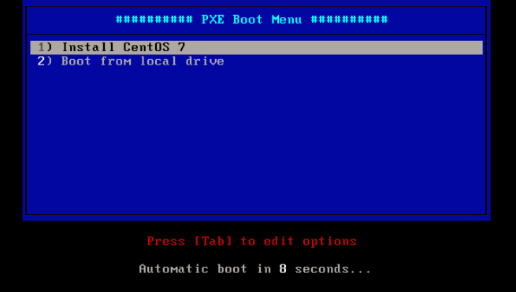

- 1 PXE
    - 1.1 配置PXE Server
- 2 网络安装
    - 2.1 准备引导文件并创建PXE引导菜单
    - 2.2 安装启动Http服务提供安装时yum源
    - 2.3 设置BIOS从网络启动
- 3 基于Kickstart实现无人看守安装
    - 3.1 创建kickstart文件
    - 3.2 修改PXE Boot引导菜单
- 4 无盘客户端
    - 4.1 部署NFS
    - 4.2 构建无盘客户端磁盘
    - 4.3 配置NFS共享

# 1. PXE 

PXE（Preboot eXecution Environment，预启动执行环境）是由Intel公司开发的最新技术，工作于Client/Server的网络模式，支持工作站通过网络从远端服务器下载映像，并由此支持通过网络启动操作系统，在启动过程中，终端要求服务器分配IP地址，再用TFTP（trivial file transfer protocol）协议下载一个启动软件包到本机内存中执行，由这个启动软件包完成终端（客户端）基本软件设置，从而引导预先安装在服务器中的终端操作系统。

## 1.1 配置PXE Server

前置条件：
    网卡必须支持PXE引导功能。
    
部署环境：
```
------------+-----------------------------+------------
            |                             |
        eth0|10.0.0.66                eth0|10.0.0.88
+-----------+-----------+     +-----------+-----------+
|    [ PXE Server ]     |     |      [ Client ]       |
|    [ftfp Server ]     |     |                       |
|    [http Server ]     |     |                       |
|    [dhcp Server ]     |     |                       |
+-----------------------+     +-----------------------+
```
    
**1. 安装依赖软件包**

```bash
[root@lab ~]# yum -y install syslinux xinetd tftp-server
[root@lab ~]# mkdir /var/lib/tftpboot/pxelinux.cfg 
[root@lab ~]# cp /usr/share/syslinux/pxelinux.0 /var/lib/tftpboot/ 
```

**2. 配置启动tftp服务**

```bash
[root@lab ~]# vi /etc/xinetd.d/tftp

# line 14: change
disable = no
[root@lab ~]# systemctl start xinetd 
[root@lab ~]# systemctl enable xinetd 
```

**3. 配置启动dhcp服务**

```bash
[root@lab ~]# yum -y install dhcp
[root@lab ~]# vi /etc/dhcp/dhcpd.conf

# create new
# specify domain name
option domain-name "centos.org";

# specify name server's hostname or IP address
option domain-name-servers lab.centos.org;

# add follows next-server
filename        "pxelinux.0";
next-server     10.0.0.66;

# default lease time
default-lease-time 600;

# max lease time
max-lease-time 7200;

# this DHCP server to be declared valid
authoritative;

# specify network address and subnet mask
subnet 10.0.0.0 netmask 255.255.255.0 {
    # specify the range of lease IP address
    range dynamic-bootp 10.0.0.200 10.0.0.254;
    
    # specify broadcast address
    option broadcast-address 10.0.0.255;
    
    # specify default gateway
    option routers 10.0.0.1;
}

[root@lab ~]# systemctl start dhcpd 
[root@lab ~]# systemctl enable dhcpd 
```

# 2. 网络安装

## 2.1 准备引导文件并创建PXE引导菜单

```bash
[root@lab ~]# mkdir -p /var/pxe/centos7 
[root@lab ~]# mkdir /var/lib/tftpboot/centos7 

[root@lab ~]# mount -t iso9660 -o loop /home/iso/CentOS-7-x86_64-DVD-1503.iso /var/pxe/centos7 

[root@lab ~]# cp /var/pxe/centos7/images/pxeboot/vmlinuz /var/lib/tftpboot/centos7/ 
[root@lab ~]# cp /var/pxe/centos7/images/pxeboot/initrd.img /var/lib/tftpboot/centos7/ 
[root@lab ~]# cp /usr/share/syslinux/menu.c32 /var/lib/tftpboot/ 

[root@lab ~]# vi /var/lib/tftpboot/pxelinux.cfg/default

# create new
timeout 120
default menu.c32

menu title ########## PXE Boot Menu ##########
label 1
   menu label ^1) Install CentOS 7
   kernel centos7/vmlinuz
   append initrd=centos7/initrd.img method=http://10.0.0.66/centos7 devfs=nomount

label 2
   menu label ^2) Boot from local drive
   localboot
```

## 2.2 安装启动Http服务提供安装时yum源

**1. 安装httpd**

```bash
[root@lab ~]# yum -y install httpd

# remove welcome page
[root@lab ~]# rm -f /etc/httpd/conf.d/welcome.conf
```

**2. 配置httpd**

```bash
[root@lab ~]# vi /etc/httpd/conf/httpd.conf

# line 86: change to admin's email address
ServerAdmin root@centos.org

# line 95: change to your server's name
ServerName www.centos.org:80

# line 151: change
AllowOverride All

# line 164: add file name that it can access only with directory's name
DirectoryIndex index.html index.cgi index.php

# add follows to the end
# server's response header
ServerTokens Prod

# keepalive is ON
KeepAlive On

# create new
Alias /centos7 /var/pxe/centos7
<Directory /var/pxe/centos7>
    Options Indexes FollowSymLinks
    # IP address you allow to access
    Require ip 127.0.0.1 10.0.0.0/24
</Directory>

[root@lab ~]# systemctl start httpd 
[root@lab ~]# systemctl enable httpd 
```

**3. 配置防火墙策略**

```bash
[root@lab ~]# firewall-cmd --add-service=http --permanent 
success

[root@lab ~]# firewall-cmd --reload 
success
```

## 2.3 设置BIOS从网络启动



# 3. 基于Kickstart实现无人看守安装

## 3.1 创建kickstart文件

```bash
# generate encrypted root password (remeber it)
[root@lab ~]# python -c 'import crypt,getpass; \ 
print(crypt.crypt(getpass.getpass(), \
crypt.mksalt(crypt.METHOD_SHA512)))' 
Password:
$6$EC1T.oKN5f3seb20$y1WlMQ7Ih424OwOn.....

[root@lab ~]# mkdir /var/www/html/ks 
[root@lab ~]# vi /var/www/html/ks/centos7-ks.cfg
# create new
install

# automatically proceed for each steps
autostep

# reboot after installing
reboot

# encrypt algorithm
auth --enableshadow --passalgo=sha512

# installation source
url --url=http://10.0.0.66/centos7/

# install disk
ignoredisk --only-use=sda

# keyboard layouts
keyboard --vckeymap=us --xlayouts='us'

# system locale
lang en_US.UTF-8

# network settings
network --bootproto=dhcp --ipv6=auto --activate --hostname=localhost

# root password you generated above
rootpw --iscrypted $6$EC1T.oKN5f3seb20$y1WlMQ7Ih424OwOn.....

# timezone
timezone Asia/Shanghai --isUtc --nontp

# bootloader's settings
bootloader --location=mbr --boot-drive=sda

# initialize all partition tables
zerombr

clearpart --all --initlabel
# partitioning
part /boot --fstype="xfs" --ondisk=sda --size=500
part pv.10 --fstype="lvmpv" --ondisk=sda --size=51200
volgroup VolGroup --pesize=4096 pv.10
logvol / --fstype="xfs" --size=20480 --name=root --vgname=VolGroup
logvol swap --fstype="swap" --size=4096 --name=swap --vgname=VolGroup

%packages
@core
%end
```

## 3.2 修改PXE Boot引导菜单

```bash
[root@lab ~]# chmod 644 /var/www/html/ks/centos7-ks.cfg 
[root@lab ~]# vi /var/lib/tftpboot/pxelinux.cfg/default

timeout 100
default menu.c32
menu title ########## PXE Boot Menu ##########
label 1
   menu label ^1) Install CentOS 7
   kernel centos7/vmlinuz
   # change: specify Kickstart file
   append initrd=centos7/initrd.img ks=http://10.0.0.66/ks/centos7-ks.cfg
label 2
   menu label ^2) Boot from local drive
   localboot 
```

# 4. 无盘客户端

## 4.1 部署NFS

```bash
[root@dlp ~]# yum -y install dracut-network nfs-utils
```
## 4.2 构建无盘客户端磁盘

```bash
[root@lab ~]# mkdir -p /var/lib/tftpboot/centos7/root 
[root@lab ~]# yum groups -y install "Server with GUI" --releasever=7 --installroot=/var/lib/tftpboot/centos7/root/

# generate encrypted root password (remeber it)
[root@lab ~]# python -c 'import crypt,getpass; \ 
print(crypt.crypt(getpass.getpass(), \
crypt.mksalt(crypt.METHOD_SHA512)))' 
Password:
$6$EC1T.oKN5f3seb20$y1WlMQ7Ih424OwOn.....

[root@lab ~]# vi /var/lib/tftpboot/centos7/root/etc/shadow
# set root password generated above
root:$6$EC1T.oKN5f3seb20$y1WlMQ7Ih424OwOn.....:16372:0:99999:7:::

[root@lab ~]# vi /var/lib/tftpboot/centos7/root/etc/fstab
none    /tmp        tmpfs   defaults   0 0
tmpfs   /dev/shm    tmpfs   defaults   0 0
sysfs   /sys        sysfs   defaults   0 0
proc    /proc       proc    defaults   0 0

[root@lab ~]# wget -P /var/lib/tftpboot/centos7/ \
http://mirror.centos.org/centos/7/os/x86_64/images/pxeboot/vmlinuz \
http://mirror.centos.org/centos/7/os/x86_64/images/pxeboot/initrd.img

[root@lab ~]# vi /var/lib/tftpboot/pxelinux.cfg/default
# create new
 default centos7

label centos7
    kernel centos7/vmlinuz
    append initrd=centos7/initrd.img root=nfs:10.0.0.66:/var/lib/tftpboot/centos7/root rw selinux=0 
```

## 4.3 配置NFS共享

```bash
[root@lab ~]# vi /etc/exports
/var/lib/tftpboot/centos7/root 10.0.0.0/24(rw,no_root_squash)

[root@lab ~]# systemctl start rpcbind nfs-server 
[root@lab ~]# systemctl enable rpcbind nfs-server 
```