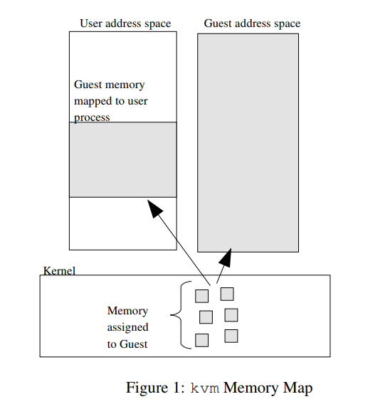
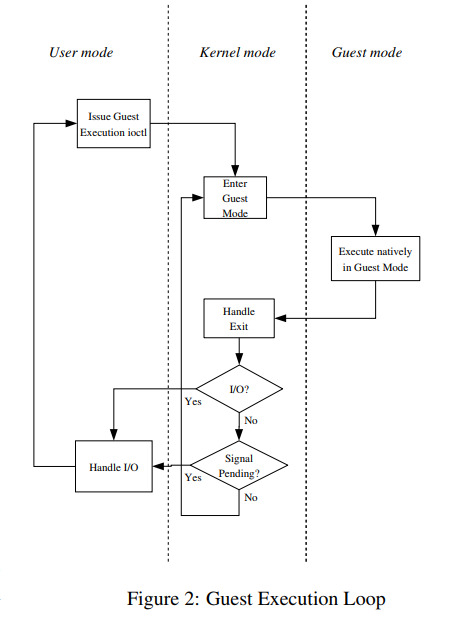

***kvm: the Linux Virtual Machine Monitor***

[TOC]

# 1. 概述

虚拟化在当今操作系统领域是一个热门的话题。在许多场景中它是有用的：服务器整合、虚拟测试环境以及对于那些没有决定使用哪种发行版最好的Linux爱好者。最近，x86处理器的硬件厂商向其指令集增加了虚拟化扩展，从而能够用来编写简单的虚拟机监控器（virtual machine monitor）。

基于内核的虚拟机，简称kvm，是一个新的Linux子系统，它利用了这些虚拟化扩展指令，将虚拟机监控器（也被称作hypervisor）的功能加入到Linux中。使用kvm，用户可以创建和运行多个虚拟机。这些虚拟机在操作系统中以Linux进程的形式出现，无缝地整合到了系统当中。

# 2. 背景

虚拟化自从计算机出现就已经出现了。使用一个计算机系统来模拟另一个相似的计算机系统的想法，在早期，被认为在测试和提高资源利用率上是有用的。正如许多的计算机技术一样，IBM利用他们的VM系统引导了虚拟化技术的发展。在最近10年，VMware的纯软件虚拟机监控器取得了很大的成就。近来，Xen开源虚拟机监控器将虚拟化带入开源的世界，第一次使用了一种不同的技术被称作半虚拟化（paravirtualiztion），而当硬件提供支持时，能够使用全虚拟化技术（full virtualiztion）。

# 3. X86硬件虚拟化扩展

众所周知，x86硬件很难实现虚拟化。一些暴露特权状态的指令在被执行在用户模式时不会陷入，比如popf。一些特权状态难以隐藏，比如当前的特权级，也被称为cpl。

硬件厂商如Intel、AMD认识到虚拟化的重要性，已经向x86架构中添加了扩展，使虚拟化更加容易。虽然这些扩展彼此不能匹配，但是它们是非常相似的，包括： 

- 一个新的客户操作模式——处理器能够转换到客户机模式，它提供了常规操作模式的特权级别，不同之处在于系统软件可以选择性地要求特定的指令或者特定的寄存器访问陷入。 
- 硬件状态转换——当转换到客户机模式以及从客户机模式返回时，硬件会更换影响处理器操作模式的控制寄存器、非常难以转换的段寄存器，以及指令指针，从而使得控制传输能够生效。 
- 退出原因报告——当从客户机模式转换到主机模式时，硬件报告转换的原因，从而使软件采取合适的动作。

# 4. 通用的KVM架构

使用kvm，虚拟机通过打开一个设备节点（/dev/kvm）被创建。一个客户机有它自己的内存，与创建它的用户空间进程隔离。然而，一个虚拟CPU不是由它自己调度的。

## 4.1 /dev/kvm设备节点

kvm的结构是一个相对典型的Linux字符设备。它暴露了一个/dev/kvm设备，这个设备能够通过一系列的ioctl()系统调用用户空间用来创建和运行虚拟机。

/dev/kvm提供的操作包括： 
- 创建一个新的虚拟机 
- 向一个虚拟机中分配内存 
- 读写虚拟cpu寄存器 
- 向一个虚拟cpu中注入中断 
- 运行一个虚拟cpu 

图1表明了客户机的内存是如何被分配的。和Linux中的用户内存相似，内核分配不连续的页面组成了客户机的地址空间。并且，用户空间能够通过对客户机内存调用mmap()，来直接访问。这在模拟DMA传输设备中是有用的。

运行一个虚拟cpu值得更多的阐述。事实上，除了现有的内核模式和用户模式，一个新的执行模式——客户模式被增加到Linux中。

客户机的运行是三重嵌套循环运行： 
- 在最外层，用户空间调用内核执行客户机代码，直到它遇到一条IO指令，或者直到一个外部事件比如一个网络包被发过来或者一个超时发生。外部事件被表示为信号。 
- 在内核层，内核引导硬件进入客户机模式。如果一个处理器由于一个事件退出客户模式，比如外部的中断或者一个影子页表缺页，内核会执行必要的处理，然后继续客户机的执行。如果退出是由于一条IO指令或者到达一个进程的信号，内核会退出到用户空间。 
- 在硬件层，处理器执行客户机代码直到它遇到一条需要协助的指令比如一个错误或者一个外部中断。 

## 4.2 协调指令集架构的不同

与大多数的x86指令集不同，这些指令集被一个厂商引入，被其他的厂商采用，硬件虚拟化扩展不是标准化的。Intel和AMD处理器有不同的指令，不同的寓意和不同的特性。

kvm使用传统的Linux的方法——引入一个函数指针向量kvm_arch_ops来处理这种不同，它能在任何一种依赖于体系架构的操作要执行时调用其中一个它定义的函数。基础的kvm的功能被存放在一个内核模块，kvm.ko，基于特定体系架构的功能被存放在两个特定的体系架构内核模块kvm-intel.ko和kvm-amd.ko。

# 5. 虚拟MMU

与所有现代处理器相同，x86提供了一个虚拟内存系统，他能将用户看到的虚拟地址转换为被用来访问总线的物理地址。这种转换由内存管理单元，被称作mmu来执行。mmu包括：

- 一个基数树，用于编码虚拟地址到物理地址转换的页表。这个树在物理内存中的系统软件提供，但是其根源是硬件寄存器（CR3寄存器）。 
- 一个通知系统软件缺页（page fault）的机制。
- 一个用于加速在页表上查找的在芯片上的缓存（translation lookaside buffer，也被称作tlb）。 
- 切换CR3寄存器的指令，从而提供独立的地址空间。 
- 管理tlb的指令。

mmu虚拟化的硬件支持提供所有这些组件的钩子（hook），但是没有全部将它们虚拟化。主要的问题是mmu提供了一层的转换（客户机虚拟地址到客户机物理地址），但是没有提供由虚拟化要求的第二层转换（客户机物理地址到主机物理地址）。

通常的解决方法是在模拟硬件与客户机提供的原本的页表交互时，使用硬件虚拟化特性提供带有独立的编码了合并的转换（客户机虚拟地址到客户机物理地址）的页表的真实的mmu。影子页表被逐步创建，它在开始时是空的，作为转换失败报告给主机，缺失项被添加进来。

使用影子页表的主要问题是保持客户机页表和影子页表的同步。无论何时客户机写入页表，在影子页表上，相应的改变也要执行。由于客户机页表驻留在普通内存中，因此访问时不是正常的陷入，因此这是困难的。

## 5.1 虚拟TLB的实现

在kvm中页表算法的最初版本使用了一个直接的方法，它减少了代码中bug，但是牺牲了性能。它依赖于客户机必须使用tlb管理指令同步tlb和它的页表的事实。 我们陷入这些指令，然后应用它们对影子页表的影响以及对tlb的正常影响。

不幸的是，大多数通常的tlb管理指令是上下文转换，该指令会使整个tlb失效。这意味着由于重新创建影子页表比重新填满tlb更加昂贵，使用多处理器时的工作负载损失严重。

## 5.2 缓存虚拟MMU

为了提升客户机的性能，虚拟mmu的实现被加强，从而允许页表在上下文切换被缓存。以增加代码复杂性的代价极大地提升了性能。

正如在前面提到的，问题是客户机写到客户机的也表达不是简单陷入到虚拟硬件。为了获得这种客户机写的通知，我们写保护被kvm映射的客户机内存页。不幸的是，这导致一系列额外的要求的反应： 

- 为了写保护一个客户机页面，我们需要知道客户机能使用哪一种切换来写到页面。这意味着我们需要对所有可写的切换保持一个反向的映射，指向每个客户机页面。 
- 当对客户机页表的一个写操作陷入时，我们需要使用一个x86指令翻译器模拟这个写访问，从而使我们明确知道对客户机内存和影子页表的影响。 
- 客户机可能使用kvm不知道的方式回收一个页表表转换为一个正常的页面。这将导致严重变慢，因为对该页面的写访问会被模拟而不是以本机的速度执行。kvm有一种探索方式确定何时这一事件已经发生，删除相关的影子页表的缓存，消除写保护该页的需要。 

以考虑的复杂性为代价，这些要求已经实现，并且kvm的上下文切换效率是合理的。

# 6. IO虚拟化

软件使用可编程I/O(pio)和内存映射I/O(mmio)来与硬件设备进行通信。此外，硬件可以发出中断请求系统软件服务。一个虚拟机监控器必须能陷入和模拟pio和mmio请求，并且仿真来自虚拟化硬件的中断。

## 6.1 虚拟化客户机发起的I/O指令

因为硬件为pio指令提供了陷入并且译码了部分操作数，所以陷入pio是非常简单的。另一方面，由于相同的内存指令可以被用来作为常规的内存访问或者mmio： 
- 当一个mmio页面被访问时，kvm的mmu不会创建一个影子页表转换。
- 相反，x86模拟器会执行缺页指令，生成方向、大小、地址和传输的值。

在kvm中，I/O虚拟化在用户空间中执行。所有的pio和mmio的访问会被转发到用户空间，用户空间为了仿真它们的行为，会给它们一个设备模型，并且可能触发真正的I/O比如在一个以太网接口上传输一个数据包。kvm也为用户空间提供了一种机制来向客户机中注入中断。

## 6.2 主机发起的虚拟中断

kvm也为用户空间提供中断注入工具。确定客户机何时准备好接受一个中断的方法是存在的，比如，中断标志必须被设置，并且当客户机准备就绪，向客户机注入中断的方法也是存在的。这允许kvm模拟基于x86的系统中的复杂的APIC/PIC/IOAPIC。

## 6.3 虚拟化帧缓存

一类非常重要的内存映射I/O设备是帧缓存，或者称作图形适配器。这些I/O设备与典型的mmio设备有非常不同的特征： 

- 带宽——通常会看到帧缓存有很高的带宽传输。这与典型的使用mmio控制、使用直接内存访问（DMA）传输散装的数据的设备相反。 
- 内存等价——帧缓存大多数就是内存：从帧缓存中读取会返回最后写的数据，而写数据不会引起动作的发生。 

为了有效支持帧缓存 ，kvm允许映射在任意地址的非mmio内存比如pci区域。对VGA窗口的支持是包含在内的，它允许物理混叠内存区域，一级报告帧缓存内容的变化从而显示窗口能够被逐步更新。

# 7. 与Linux整合

与Linux紧密整合为kvm带来了非常重要的优势： 

- 在开发者的层次上，有很多的机会重用在内核中已经存在的功能，比如，调度器，NUMA支持以及高分辨率的计时器。 
- 在使用者的层次上，用户可以重用已有的Linux进程管理工具，比如使用top(1)查看cpu的使用，使用taskset(1)将虚拟机绑定到特定的cpu上。用户可以使用kill(1)暂停或者结束他们的虚拟机。

# 8. 实时迁移

使用虚拟化最令人信服的理由之一是热迁移，或者说从一台主机向另一台主机传输一台虚拟机而不需要超过多余几十毫秒的时间中断客户机的执行的能力。这种工具允许虚拟机迁移到不同的主机以适应负载和性能的需求。

热迁移通过拷贝客户机的内存到目标主机，且并行地正常执行客户机来工作。如果一个客户机的页面在它被拷贝之后又被修改，它必须被重新拷贝。为了结束，kvm提供了一个脏页日志工具，这个工具给用户空间提供一个在上一次调用之后的被修改页面的bitmap。在内部，kvm将客户机页面映射为只读，并且只有当第一次写访问之后再映射它们去写，这为更新bitmap提供了一个挂钩点。

热迁移是一个交互的过程：在每一遍拷贝内存到远程机器的过程中，客户机都会生成新的内存来拷贝。为了保证进程结束，我们设置了下列结束的标准： 

- 两遍传输过程中（不一定是连续的），相比于前一遍，后一遍的内存拷贝增加，或者 
- 30次迭代之后。

# 9. 未来的发展方向

虽然目前已经对某些工作非常有用，kvm还有许多事情要完成。这里我们描述主要还没有的特性；它们当中的一些已经在被开发中。

## 9.1 客户机SMP支持

高工作负载要求多个处理器核，虚拟化工作负载也不例外。虽然kvm轻易地支持了SMP主机，但是它还不支持SMP客户机。 
使用与在kvm下虚拟机被映射为客户机进程的相同方法，一个在SMP客户机中虚拟的cpu被映射为一个主机的线程。这保持了kvm模型的简单，并且需要很少的重要的改变就可以实现。

## 9.2 半虚拟化

I/O在虚拟化解决方案中明显很慢。这是因为模拟一个I/O访问要求退出客户机模式，相比于真正的硬件这是相当昂贵的操作。 
一个通常的解决方法是引进半虚拟化设备，或者被显式地设计在虚拟化环境中的虚拟的“硬件”。由于它在设计过程中，注意到了虚拟化的性能特征，它能最小化慢的操作来提升性能。

## 9.3 内存管理整合

Linux提供了繁多的内存管理特性：按需分页、大页面（hugelbfs），以及内存映射文件。我们打算允许kvm客户机的地址空间直接使用这些特性；以使得客户机内存中空闲的页移动到磁盘中，或者从磁盘中按需加载客户机的内存映像。

## 9.4 调度器整合

目前，Linux调度器无法知道它正在调度一个虚拟cpu而不是一个常规的线程。我们打算使调度器知道这一点从而使它能考虑到相比于常规任务，将一个虚拟cpu从一个核迁移到另一个的高昂的代价 。

## 9.5 新的硬件虚拟化特性

虚拟化硬件如今正在通过加入新的特性得到加强，例如，全mmu虚拟化，又名嵌套页表或者扩展页表，或者允许客户机安全地访问物理设备[VT-d]。为了获得性能提升和功能的好处，我们打算整合这些特性到kvm。

## 9.6 支持更多的体系架构

kvm目前只实现了i386和x86-64架构。然而，其他的体系架构比如powerpc和ia64支持虚拟化，kvm也能够加强对这些架构的支持。

# 10. 结论

kvm为Linux提供了一种易于使用的，全功能集成的虚拟化解决方案。它的简单性使得它相对容易扩展，而它集成到Linux允许它利用大量地Linux特性以及Linux快速发展中的新特性。

> https://www.kernel.org/doc/ols/2007/ols2007v1-pages-225-230.pdf
