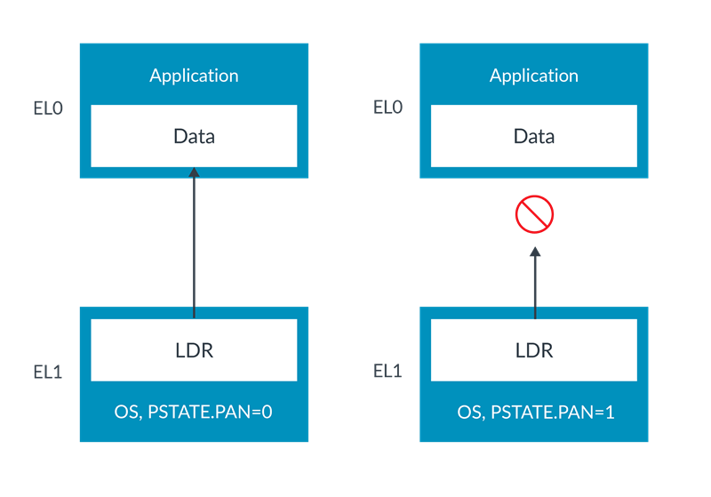
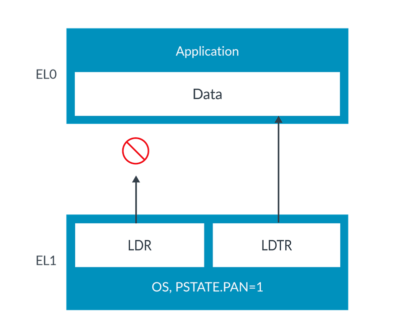
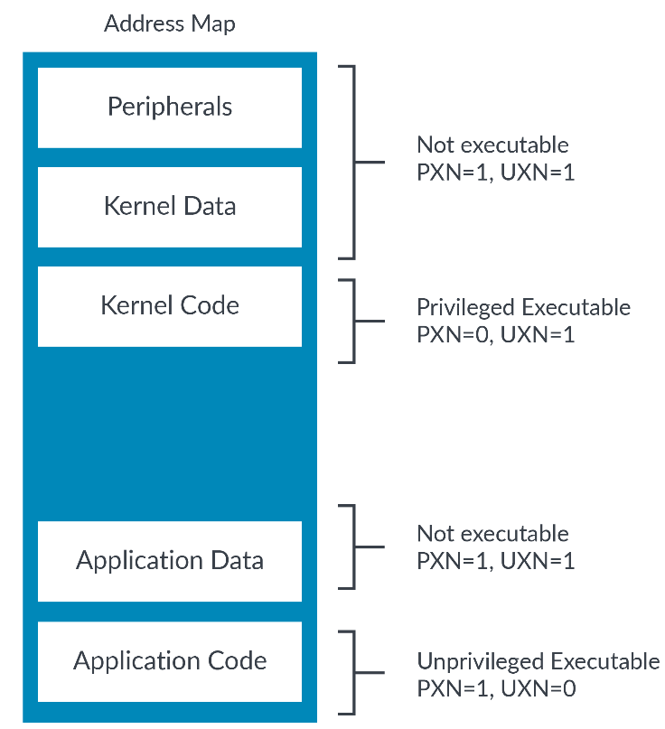
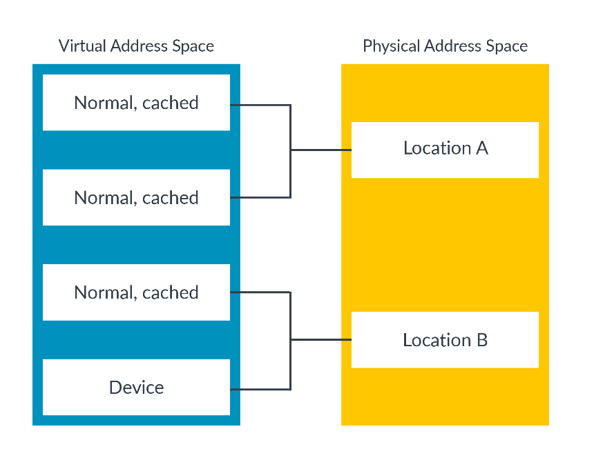
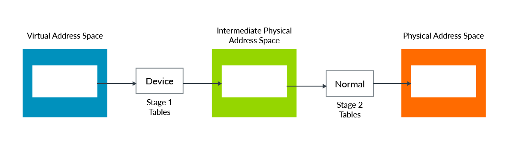
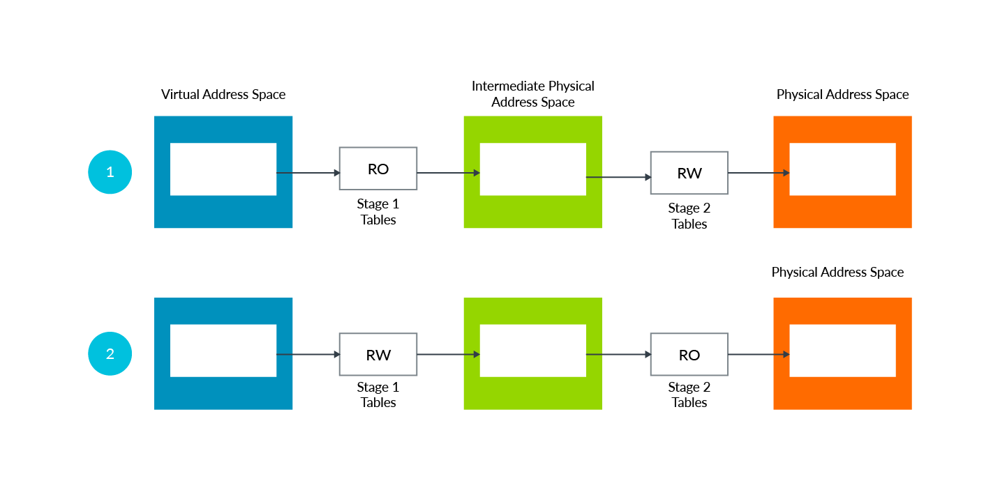
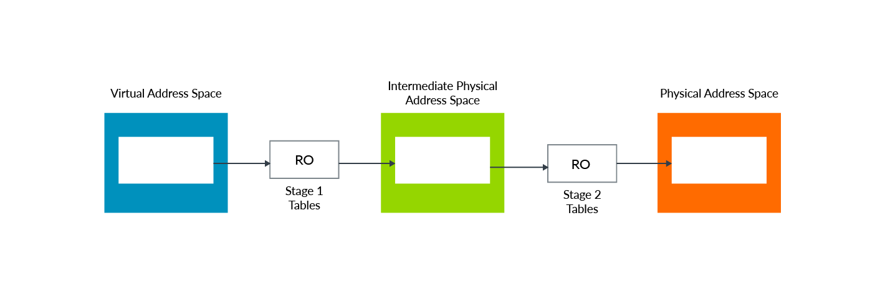

# 1. Cacheability and shareability attributes

标记为`Normal Memory`的位置也有`cacheability`与`shareability`属性。
这些属性控制该位置是否可以缓存。如果是一个可以缓存的位置，则这些属性将控制其他`agent`需要查看内存的一致性(`coherent`)副本。

# 2. Permissions attributes

访问权限`Access Permission(AP)`属性控制是否可以读取和写入位置，以及需要什么特权。此表显示`AP`位设置：

Access Permission | Unprivieged(EL0) | Privileged (EL1/2/3)
---|---|---
00 | No access | Read/Write
01 | Read/Write | Read/Write
10 | No access | Read-only
11 | Read-only | Read-only

如果访问被权限阻止，例如，对只读区域写入，则生成异常`(permission fault)`。

## 2.1 Privileged accesses to unprivileged data

标准的权限模型是一个特权的实体可以访问属于非特权实体的任何东西。
换句话说，操作系统(`OS`)可以看到分配给应用程序(`application`)的所有资源。
例如，`hypervisor`可以看到分配给虚拟机(`virtual machine`)的所有资源。
这是因为，在较高的异常级别中执行意味着特权级别也越高。

然而，这并不总是可取的。

Arm体系结构提供了多个控制，以使其更简单。
首先，有`PSTATE.PAN(Privileged Access Never)`位。
当设置此位时，从`EL1`(当`E2H==1`时，`EL2`)`load`和`store`到`unprivileged regions`将生成异常（`Permission 
Fault`），如下图所示：



> 注：`PAN`是从`Armv8.1-A`中引入。

`PAN`允许对意外访问非特权数据的访问进行捕获`trap`。
例如，操作系统执行访问的观念，认为目的地是特权的。事实上，这个目的地是没有特权的。
这意味着操作系统期望（`destination is privileged`）与现实（`destination is unprivileged`）之间存在不匹配。
这可能是由于编程错误造成的，也可能是系统受到攻击的结果。
在任何一种情况下，`PAN`都允许我们在访问发生之前捕获它，以确保安全运行。

有时，操作系统确实需要访问非特权区域，例如，要写入一个应用程序所拥有的缓冲区。为了支持这一点，该指令集提供了`LDTR`和`STTR`指令。

`LDTR`与`STTR`是非特权的`loads`与`stores`。
即使操作系统是在`EL1`或`EL2`处执行时，也会检查`EL0`的权限。
因为这些指令都是显式非特权访问(`explicitly unprivileged accesses`)，所以它们不会被`PAN`阻塞(`blocked`)，就像这个图所示：



这样，操作系统就可以区分到底是意外访问非特权数据还是预期访问非特权数据。硬件会使用该信息来检查访问权限。

> `LDTR`指令中的`T`表示`translation`。操作系统要访问应用程序数据，它需要一个特殊的`load`，一个带翻译(`translation`)的`load`。

## 2.2 Execution permissions

除了访问权限，还有执行权限。
这些属性使你可以指定指令是否可以从该地址获取(`fetch`)：
- `UXN`. User(`EL0`) Execute Never (`EL3`未使用，当`HCR_EL2.E2H==0`时，`EL2`可用)
- `PXN`. Privileged Execute Never (`EL3`称`XN`，当`HCR_EL2.E2H==0`时，`EL2`可用)

这些都是`Execute Never`位。这意味着设置该位会使该位置不可执行。

这是使用该属性分割`Privileged`与`Unprivileged`的例子，因为应用程序代码需要在用户空间(`EL0`)中可执行，但不应该使用内核权限(`EL1/EL2`)执行，就像这个图所示：



该架构通过系统控制寄存器(`SCTLR_ELx`)提供了控制位，以使所有可写的地址都是不可执行的。

注意：请记住，Arm建议`Device regions`总是标记为`Execute Never(XN)`。

# 3. Access Flag

可以使用`Access Flag(AF)`位来跟踪`translation table entry`是否被访问。可以将`AF`位设置为：
- `AF=0`：Region not accessed.
- `AF=1`：Region accessed.

`AF`位对操作系统很有用，操作系统使用它来标识当前未使用的页面以及可以被`page-out`的页面。

## 3.1 Updating the AF bit

当使用`AF`位时，将在初始`Clear AF bit`的情况下创建页表。当访问页面(`page`)时，就会将其`AF bit`置`1`。
软件就可以解析这些表，以检查`AF bit`是`1`还是`0`。没有被访问的页面(`AF bit == 0`)可能是`page-out`的候选人。

有两种方法可以在访问时设置`AF bit`：
- `Software Update`：访问该页面会导致同步异常（`Access Flag fault`）。在异常处理程序中，操作系统负责在相关`translation table entry`中设置`AF`位并返回。
- `Hardware Update`：访问该页面会导致硬件自动设置`AF`位，而无需生成异常。此特性需要`enable`，并在ARMv8.1-A中引入。

## 3.2 Dirty state

Armv8.1-A引入了处理器`block`或`page`的脏状态(`dirty state`)的功能。
`dirty state`记录`block`或`page`是否被写过，这是有用的，因为如果`block`或`page`被`page-out`，`dirty state`会告诉`OS`是否需要将`RAM`的内容`Write out to`磁盘。

例如，让我们先考虑一个文本文件。该文件最初会从磁盘（`Flash`或`Hard Drive`）加载到`RAM`中。
当它需要从内存中删除时，操作系统需要知道`RAM`中的内容与磁盘上的内容哪个是最新的。
如果`RAM`中的内容是最新的，则需要更新磁盘上的副本。如果不是，则可以删除`RAM`中的副本。

当启用`dirty state`时，软件最初创建的`translation table entry`是需要设置访问权限设置为`read-only | DBM(Dirty Bit Modifier)`位集。 如果该页面被写入，硬件将自动将访问权限更新为`Read-Write`。

将`DBM`位设置为`1`会更改访问权限位的功能(`AP`和`S2AP`)，以便不记录/检查访问权限，而是只记录脏状态。
这意味着当`DBM`位设置为`1`时，访问权限位不会导致访问故障。

> 注意：如果不使用硬件更新选项，也可以实现相同的效果。操作系统将该页面将被标记为只读页面，从而在第一次写入时会引发同步异常（`permission fault`）。异常处理程序会将页面标记为读写，然后返回。如果软件想进行`copy-on-write`操作，这种方法仍然可用。

# 4. Alignment and endianness

## 4.1 Alignment

如果地址是元素大小的倍数，则称为`Alignment Access`。

对于`LDR`和`STR`指令，元素的大小是访问的大小。
例如，`LDRH`指令加载`16-bit value`，并且必须来自一个地址，该地址是`16 bit`的倍数，才能被认为是对齐的。

`LDP`和`STP`指令是`load`和`store`一对元素。地址对齐必须是元素的大小的倍数，而不是两个元素的总和。例如：
```asm
LDP     X0, X1, [X2]
```
这个示例`load`了两个`64-bit`的值，因此总共为`128-bit`。`X2`中的地址需要是`64-bit`的倍数才能被认为是对齐的。

同样的原理也适用于`vector`的`load`和`store`。

当地址不是元素大小的倍数时，访问是不对齐的。

`Normal Memory`类型允许`Unaligned accesses`，`Device regions`则不允许。
`Normal Memory`区域`Unaligned accesses`可以通过设置`SCTLR_ELx.A`来捕获。
如果`SCTLR_ELx.A==1`，则对`Normal Memory`的未对其访问也会产生（`alignment faults`）。

## 4.2 Endianness

在Armv8-A中，指令获取(`fetch`)总是被视为小端`(little-endian)`。

对于数据访问，采用`little-endian`还是`big-endian`都是`IMPLEMENTATION DEFINED`。 

如果同时支持`big-endian`和`little-endian`的处理器，需按异常级别配置`endianness`。

> Arm Cortex-A 系列处理器同时支持`bit-endian`和`little-endian`。

# 5. Memory aliasing and mismatched memory types

当物理地址空间中的一个位置具有多个虚拟地址时，这被称为别名（`Memory aliasing`）。

属性基于虚拟地址的。这是因为这些属性来自于`translation table`。
当一个物理位置有多个别名时，重要的是所有虚拟别名必须具有兼容的属性，我们将其中的兼容性描述为：
- 有相同的内存类型(`Memory type`)，对于设备(`device`)也有相同的`sub-type`。
- 对于`Normal`的位置，它具有相同的可缓存性(`cacheability`)和可共享性(`shareability`)。

如果属性不兼容，内存访问可能不是您期望的那样，这也会影响性能。

这个图显示有两个`aliasing`的例子。
`Location A`的两个`aliasing`具有兼容的属性(`compatible attributes`)。这是一种推荐的方法。
`Location B`的两个`aliasing`具有不兼容的属性(`Normal`和`Device`)，这会对一致性和性能产生负面影响：



> Arm强烈建议软件不要将不兼容的属性分配给同一位置的不同别名。

# 6. Combining Stage 1 and Stage 2 attributes

当使用虚拟化时，虚拟地址将经历两个阶段的地址翻译。第一阶段受`OS`控制，第二阶段由`hypervisor`控制。
第一阶段和第二阶段页表都包含自己的属性。它们是如何结合`combined`的？

下图显示了一个示例，其中第一阶段将一个位置标记为设备`Device`，但相应的第二阶段转换标记为正常`Normal`。 最后的类型应该是什么？



在Arm体系结构中，默认使用最具限制性的类型。在本示例中，`Device`比`Normal`的限制性更严格。因此，最后的类型是`Device`。

对于类型(`type`)和可缓存性(`cacheability`)，`ARMv8.4-A`提供系统寄存器(`HCR_EL2.FWB`)允许覆盖默认(`combined`)行为。
当`HCR_EL2.FWB==1`时，`Stage 2`可以覆盖(`override`)`Stage 1`的类型和可缓存性设置，而不是组合(`combined`)行为。

## 6.1 Fault handling

让我们看看这个例子：



在这个例子中，两种情况的属性都是RO（`read-only`）。
如果软件要写入该位置，则会生成故障（`permission fault`）。
但是，在第一种情况下，是`Stage 1 fault`，第二种情况下，是`Stage 1 fault`。
在示例中，`Stage 1 fault`将在`EL1`转给`OS`处理，而`Stage 2 fault`在`EL2`转到`hypervisor`处理。

最后，让我们来看一个`Stage 1`和`Stage 2`的属性相同的情况：



这里，属性是`Read-only`。
但是，如果软件写入该位置，会产生了`Stage 1 fault`还是`Stage 2 fault`？

答案是：`Stage 1 fault`。

如果`Stage 1`和`Stage 2`发生不同的`fault`类型，这也是正确的。 
`Stage 1`总是优先于`Stage 2`。